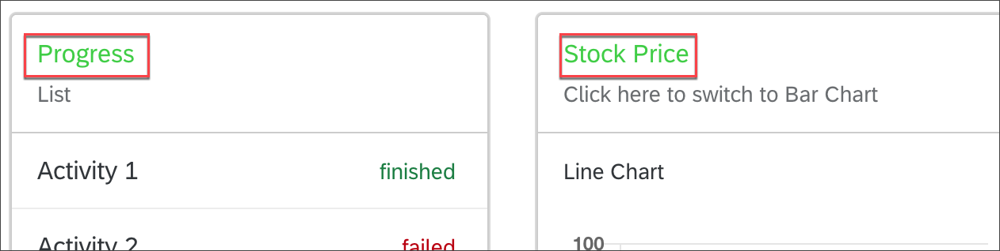
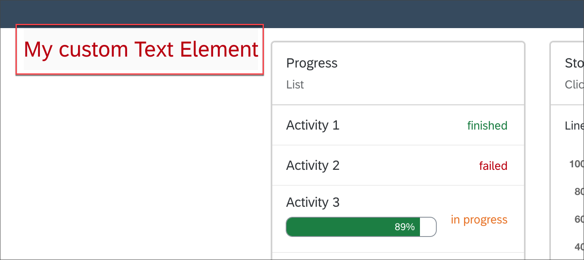

# Add Custom Styles and Components for UI5 Web Components for React
<!-- description --> Add custom styles and custom components to your application using UI5 Web Components for React.

## You will learn
-  How to change style of existing components
-  How to style own components


## Intro
In this tutorial, you will learn how to apply styling to the UI5 Web Components. You can add custom styles and even overwrite CSS Variables on any level. Also you'll learn how to style your custom components with the styling approach of SAP Fiori


---

### Change style for existing components

You can change the appearance of the UI5 Web Components by using [CSS Variables](https://www.w3schools.com/Css/css3_variables.asp).
Per default, the Fiori 3 theme parameters are injected as CSS Variables into the `<head>`.
For example, if you want to change the color of all texts that use the `--sapTile_TitleTextColor` variable, you can create an additional `style` tag in the `head` of your application:

Open the `index.html` file inside your `public` folder and add the following content inside the `<head>` element:

```HTML
  <style>
    * {
      --sapTile_TitleTextColor: limegreen;
    }
  </style>
```

The `sapTile_TitleTextColor` CSS Variable changes the style of the `Card` titles and the `*` selector appends the style to all elements.



As a consequence, all HTML Elements in the subtree where this style was applied are now displaying their texts in `limegreen` instead of `#6a6d70` which would be the default value for Fiori 3. You can change CSS Variables on any level - in the head, or on every single element by using either CSS classes or element style.

A full list of all supported CSS Variables can be found in the [`ThemingParameters`](https://github.com/SAP/ui5-webcomponents-react/blob/master/packages/base/src/styling/ThemingParameters.ts).

> **Warning:** Overriding the value of CSS variables changes it for all themes and therefore can cause inconsistencies.


### Style your own component


If you want to add a custom component to your app, but still want to use the styling approach of the UI5 Web Components, you can import the `ThemingParameters` that contain the various CSS variables used in our theming. If you want to style your components with the [`react-jss`](https://cssinjs.org/react-jss/?v=v10.1.1) syntax, you can use the custom `jss` styling hook `createUseStyles`.

1. Create a custom component `MyCustomElement.jsx` under `./src` with following content:

    ```JavaScript / JSX
    import React from "react";
    import { createUseStyles } from 'react-jss';
    import { ThemingParameters } from "@ui5/webcomponents-react-base";

    export const MyCustomElement = () => {
      return (
        <div >
          <span>My custom Text Element</span>
        </div>
      );
    };
    ```
2. Add inline-styles with the `ThemingParameters` to the `<span>`

    ```JavaScript / JSX
    <span style={{ color: ThemingParameters.sapNegativeColor, fontSize: ThemingParameters.sapFontHeader1Size }}>
      My custom Text Element
    </span>
    ```

    The `ThemingParameters` contain all available styling parameters. With this it is possible to style custom components with the standardized styles of the UI5 Web Components.

3. Add styling with `react-jss` and the `createUseStyles` hook

    ```JavaScript / JSX
    import React from "react";
    import { createUseStyles } from 'react-jss';
    import { ThemingParameters } from "@ui5/webcomponents-react-base";

    const styles = {
      container: {
        backgroundColor: ThemingParameters.sapBackgroundColor,
        fontFamily: ThemingParameters.sapFontFamily,
        height: "50px",
        display: "flex",
        justifyContent: "center",
        alignItems: "center",
      }
    };

    const useStyles = createUseStyles(styles);

    export const MyCustomElement = () => {
      const classes = useStyles();

      return (
        <div className={classes.container}>
          <span style={{ color: ThemingParameters.sapNegativeColor, fontSize: ThemingParameters.sapFontHeader1Size }}>
            My custom Text Element
          </span>
        </div>
      );
    };
    ```

4. Import the custom component and add it to your `Home` component.

    ```JavaScript / JSX
    import { MyCustomElement } from "./MyCustomElement";
    ```

    ```JavaScript / JSX
     return (
        <FlexBox
          justifyContent={FlexBoxJustifyContent.Center}
          wrap={FlexBoxWrap.Wrap}
        >
          <MyCustomElement />
       ...
    ```
    

   Now you can see, that the element has the same `fontFamily` and uses the same semantic colors as the UI5 Web Components for React.

### Conclusion

In this tutorial mission, you learned the basics of how to build a single page application using UI5 Web Components for React, with routing, styling, and general component behavior and modern React APIs.
If you have questions about UI5 Web Components for React, or found something that isn't right, then please feel free to join the [OpenUI5 Slack community](https://ui5-slack-invite.cfapps.eu10.hana.ondemand.com/) and visit us in the [`#webcomponents-react`](https://openui5.slack.com/archives/CSQEJ2J04) channel, or come directly to our [GitHub page](https://github.com/SAP/ui5-webcomponents-react), where you can file [issues](https://github.com/SAP/ui5-webcomponents-react/issues/new/choose) or participate in [discussions](https://github.com/SAP/ui5-webcomponents-react/discussions).

If you enjoyed this tutorial, you can help us out a lot by starring our repo and become one of our wonderful [stargazers](https://github.com/SAP/ui5-webcomponents-react/stargazers)!


---