## Prerequisites

- See the How-To Details

## Next Steps

 - View other [SAP Vora How-Tos](https://www.sap.com/developer/tutorial-navigator.tutorials.html?tag=products:data-management/sap-vora) or visit the [SAP Vora Developer](https://www.sap.com/developer/topics/vora.html) Page.

## How-To Details
This How-to is a step-by-step guide to setting up and administering an SAP Vora 1.3 Cluster. Prior to staring this procedure please ensure the following are complete or available:

- An SAP Vora instance running with 2/2 status checks passed in AWS console.
- The Manager instance is running under a VPC created following steps from [Create a VPC in AWS for SAP Vora AWS Marketplace Production Edition](https://www.sap.com/developer/tutorials/vora-aws-prod-create-vpc.html)
- The required ports are open. Refer to [Create a Security Group in AWS for SAP Vora AWS Marketplace Production Edition](https://www.sap.com/developer/tutorials/vora-aws-prod-security-groups.html)
- AWS Access key and secret key
- Google Chrome (version 24 or higher)

For additional information please refer the [FAQ's](https://www.sap.com/developer/tutorials/vora-aws-prod-faq.html)

### Time to Complete
**20 Min**.

 ---

[ACCORDION-BEGIN[Step 1: ](Launch the AWS Marketplace in the desired region)]

Use AWS Marketplace Link for launching Vora 1.3 instance in AWS. Select the respective region in which you want to launch the cluster. Example: (N. Virginia).

After launching, we come to a page with preselected AWS instance type as `m4.2xlarge`. Click on **Next: Configure Instance Details**

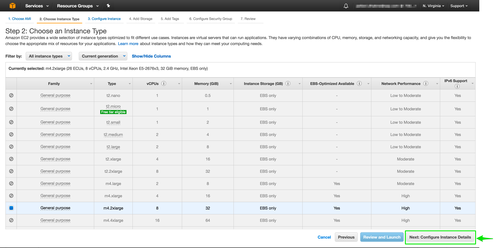

[ACCORDION-END]

[ACCORDION-BEGIN[Step 2: ](Select your VPC)]

Choose the Network as VPC created earlier and enable **Auto-assign Public IP**. Either select an existing IAM role or use the option to automatically create it. Click **Review and Launch**.

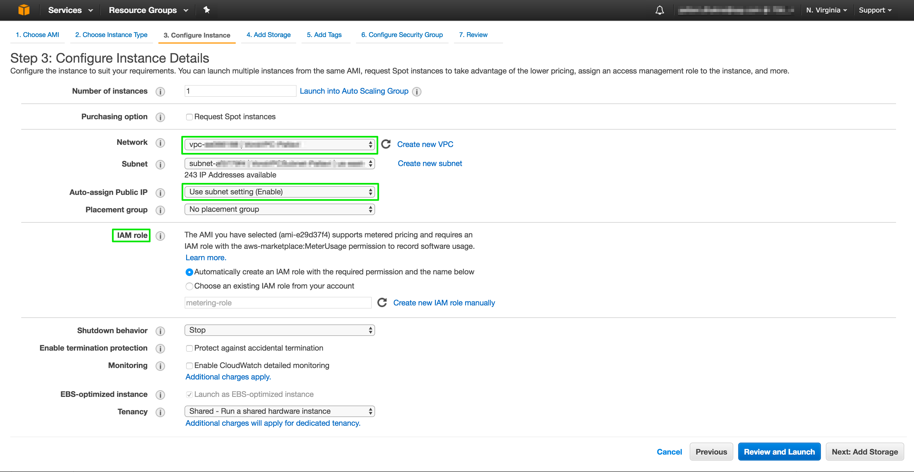

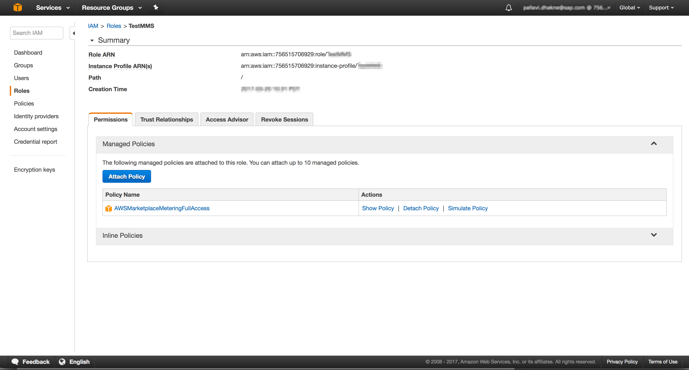

[ACCORDION-END]

[ACCORDION-BEGIN[Step 3: ](Update the Security Group)]

Edit the Security Group and choose the Security group created earlier.

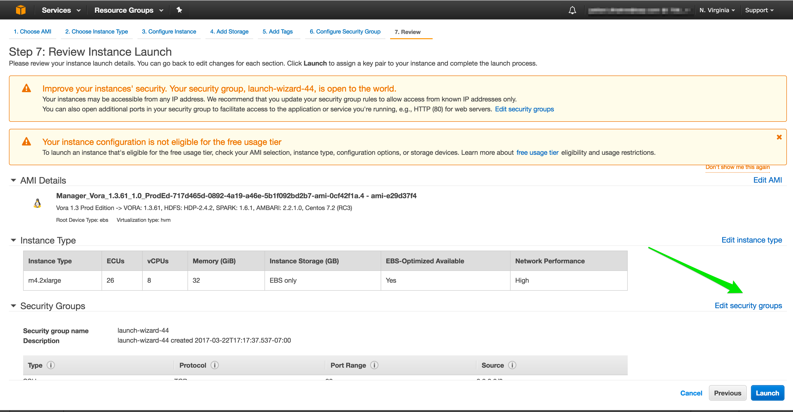

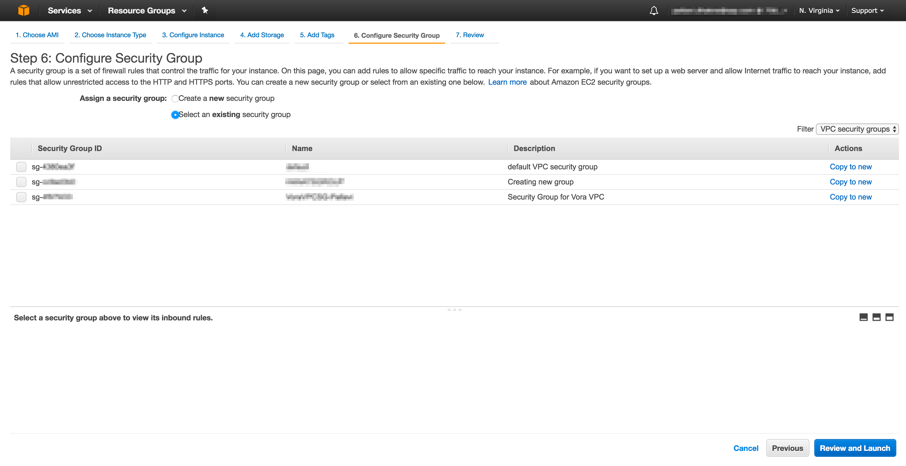

[ACCORDION-END]

[ACCORDION-BEGIN[Step 4: ](Launch your instance)]

Launch instance after verifying all the selection by clicking **Launch**.

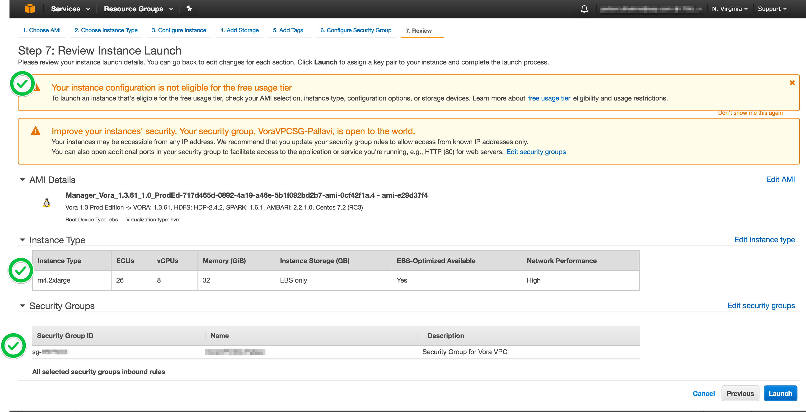

[ACCORDION-END]

[ACCORDION-BEGIN[Step 5: ](Select the `ssh` key pair)]

Choose the `ssh` key pair. If none exists, create one and store it safe for connecting to the instance using `ssh`. Click on **Launch Instances**.

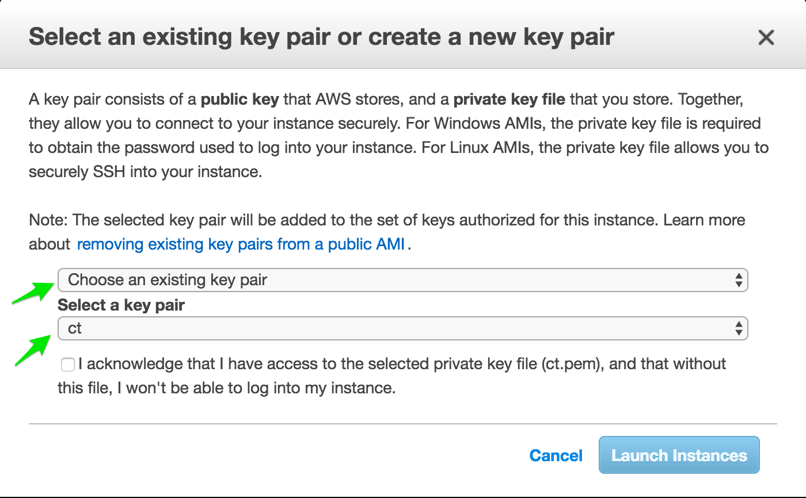

[ACCORDION-END]

[ACCORDION-BEGIN[Step 6: ](Verify instance status)]

View the Instance status in the Console. Wait till the instance **Status Check** shows **2/2 checks passed**. After status check becomes 2/2 checks you can use the public IP of the instance for SAP Vora Cluster configuration and management.

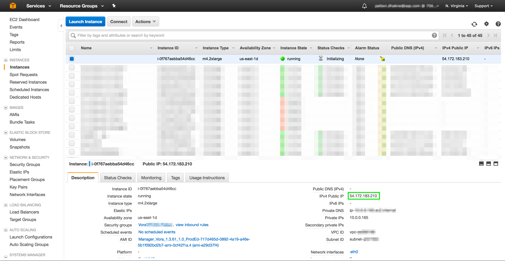

[ACCORDION-END]

[ACCORDION-BEGIN[Step 7: ](Check required ports)]

Make sure that the required ports in the edit inbound rules dialog of the instances security group are open.

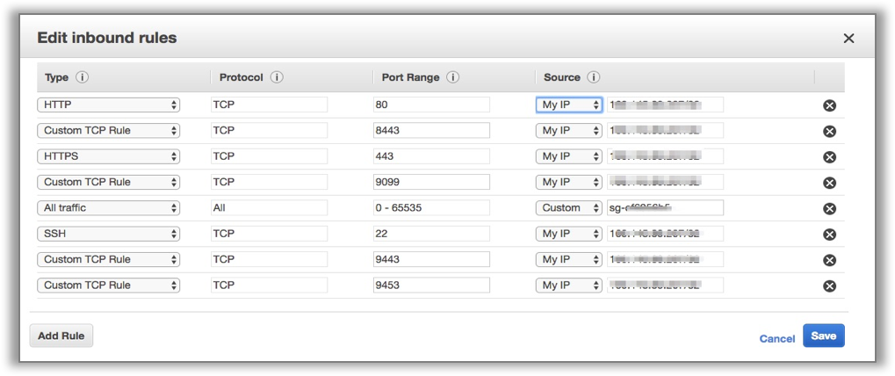

[ACCORDION-END]

[ACCORDION-BEGIN[Step 8: ](Connect to your instance)]

 Copy the public IP address of the AWS instance from the address bar in Chrome. Click on **Advanced** and accept the certificate.

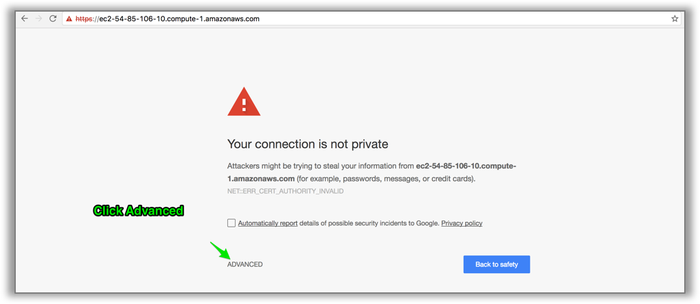

Click on **`Procede to <IP address> (unsafe)`**

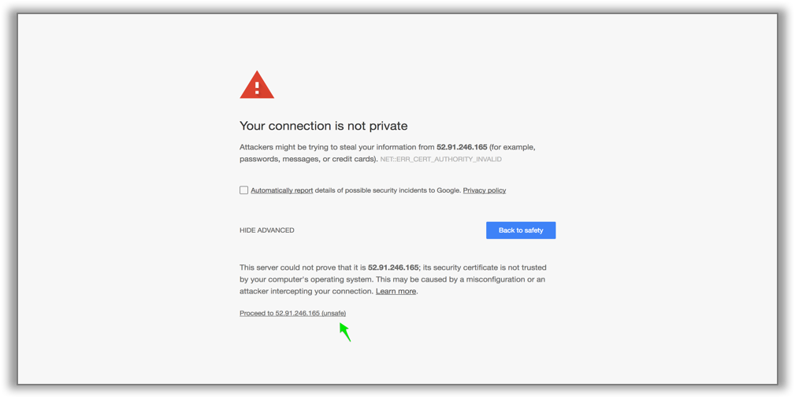

Enter the AWS access key id and the access secret key. If the keys are valid, you will be moved to the next step.

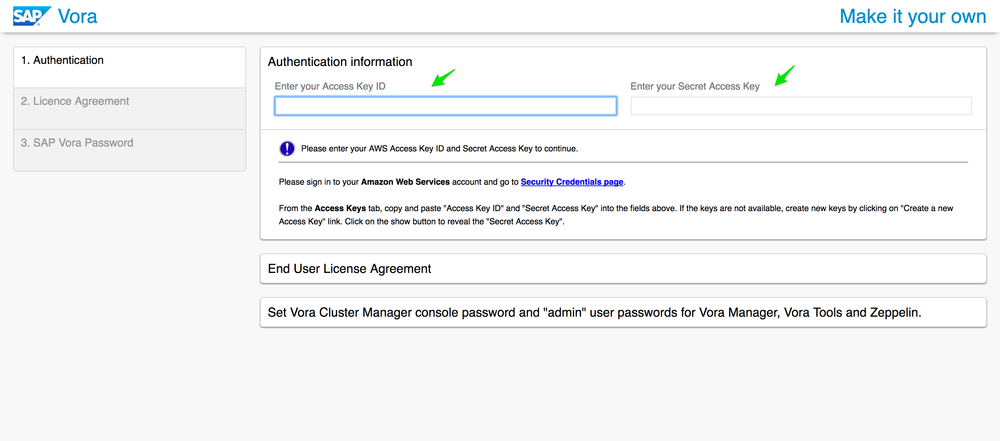

Read the End User License Agreement and accept it to proceed further

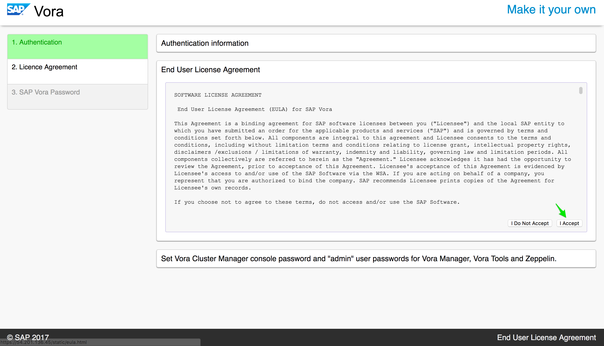

[ACCORDION-END]

[ACCORDION-BEGIN[Step 9: ](Set up SAP Vora)]

Enter the console password and click **Set up SAP Vora!**. This checks to see if the prerequisites to set up the cluster are met and shows the status if not met.

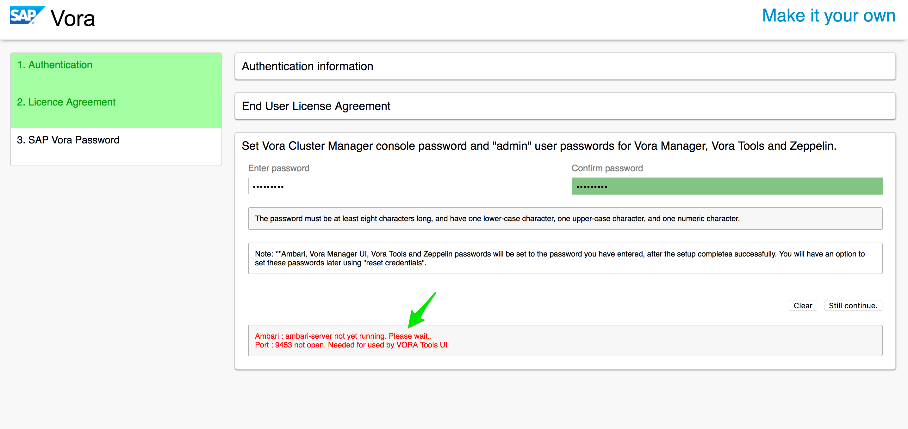

Take action on the messages shown in red and click on the button again; for example if port/s are not open, open the security group ports as needed. Refer to the "AWS Step by Step guide to create Security Group SAP Vora 1.3".  `Ambari` server takes a while to start running, so in this case it is good to wait for few minutes. `Ambari` server status can be also checked by doing SSH to the Manager instance and checking the `Ambari` server status.

The steps above are needed only for first-time setup. Later, the console password can be used to access the cluster to log in.

Data node (or nodes) can be added using the **Add Node** button.

[ACCORDION-END]

[ACCORDION-BEGIN[Step 10: ](View the cluster management console)]

Click on the **Set up SAP Vora!** button to open the cluster management console. The console shows four nodes (`Manager`, `Master`, `Worker`, `Worker2`) being launched. The **Messages** section shows the status of the configuration.

The host and services status can be viewed in the list of instance cards. For each node card, the top bar shows the status of the node in the cloud and the bottom bar shows the status of the node in terms of `Ambari` and Vora services.

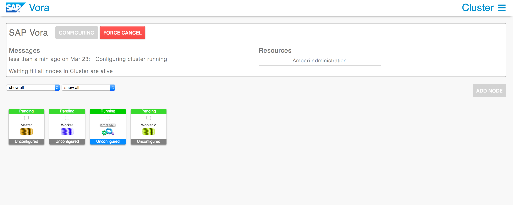

Once all four nodes are up and running your optimal cluster is ready for use.

For Vora 1.3, the cluster consists of four basic nodes, which form an optimal cluster.  The cluster can be used as-is for loading data. More data nodes can be added as needed.

The four nodes are:

1. Manager: (`Ambari`) + `Vora Thrift server` and `Vora tools`, `Vora Dlog server`
2. Master: `HDFS`, `Vora landscape`, `Vora txbroker`, `Vora txcoordinator`, `vora txlocker`, `Vora catalog server`, `Vora Dlog server`
3. Worker: `HDFS`, `Vora disk`, `Vora Dlog server`, `Vora docstore`, `Vora graph`, `Vora timeseries`,  `Vora v2server`.
4. Worker 2: `HDFS`, `Vora disk`, `Vora docstore`, `Vora graph`, `Vora timeseries`, `Vora v2series`

It is recommended that all the services on these nodes are up and running for proper functioning of the Vora cluster. Data node(s) can be added by using the **Add Node** button.

[ACCORDION-END]

[ACCORDION-BEGIN[Step 11: ](View configuration)]

The Configuration process can be cancelled by hitting **Force Cancel**, though it is not advised that you cancel configuration.

In case of configuration failure, retry using the **CONFIGURE** button.

> Note the Resources section on the right has the links to **Ambari**, **Zeppelin**, **Vora UI** (Vora Manager UI) and **Vora Tools**.

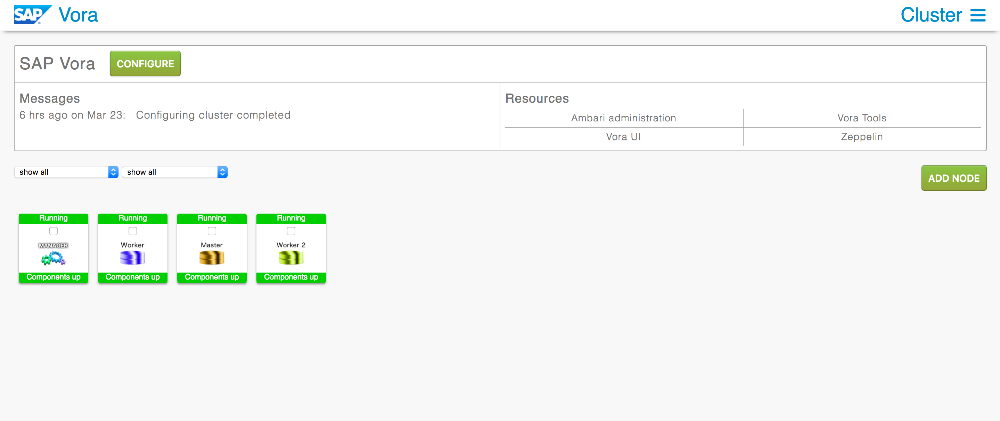

[ACCORDION-END]

[ACCORDION-BEGIN[Step 12: ](Log in to the Apache Ambari console)]  

Log in to the Apache Ambari console at `http://<public ip of Manager>:8443`. The credentials for Ambari are   `admin:<console password which was set in the setup phase>`.

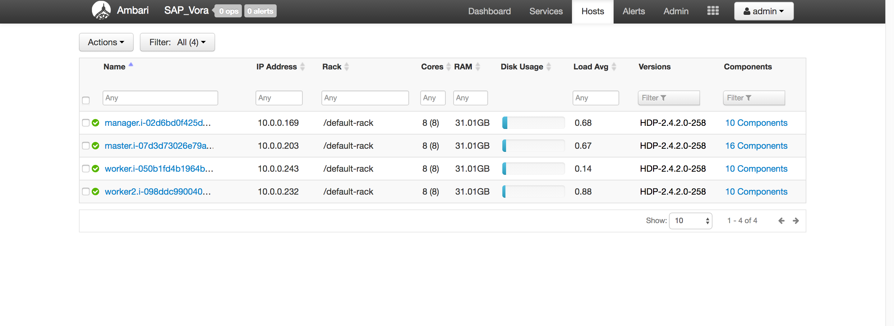

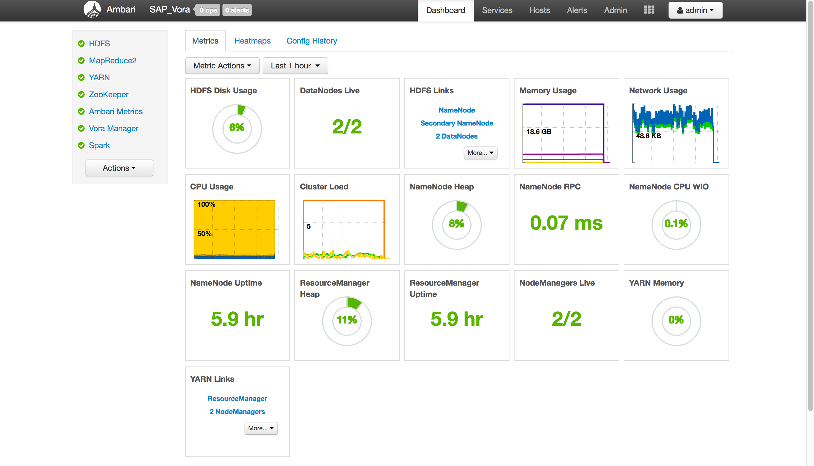

[ACCORDION-END]

[ACCORDION-BEGIN[Step 13: ](Vora Manager UI)]

Click on the Vora UI under resources or enter `http://<publicip>:9443` in the browser to open the Vora Manager UI. The nodes tab lists the set of instances in the cluster and the services running in each of them.

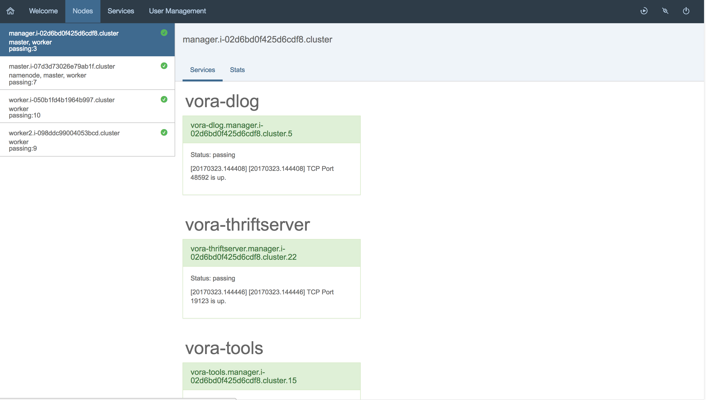

 The services tab lists each of the services with its configuration and node assignments.

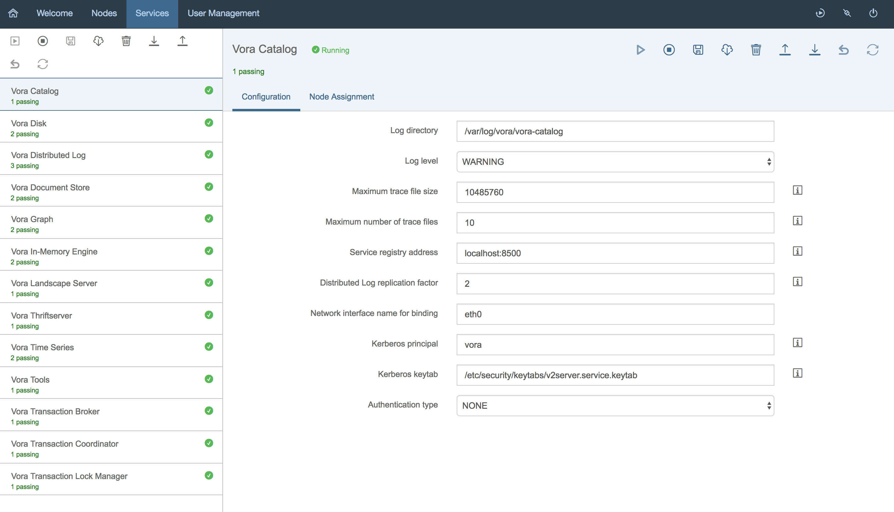

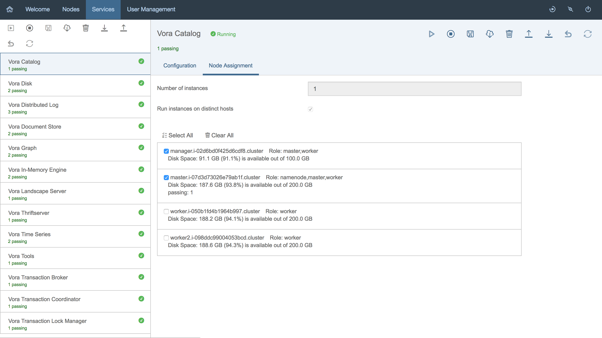

[ACCORDION-END]

[ACCORDION-BEGIN[Step 14: ](Vora Tools)]

Vora Tools can be accessed via the link on SAP Vora Console page or at `http://<public ip of manager instance>:9453`.

[ACCORDION-END]

[ACCORDION-BEGIN[Step 15: ](Zeppelin)]

Click on **Zeppelin** under resources or enter `http://<publicDNS>:9099` in the browser to open the Vora Manager UI. Click **Login** and enter the login details.

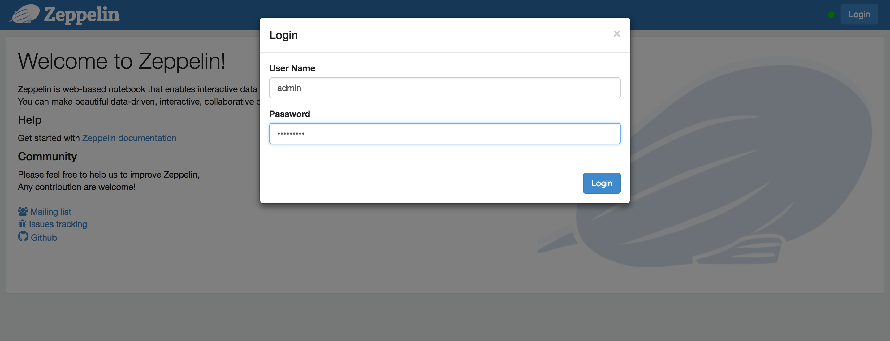

Click on **Create new note** to create a new notebook.

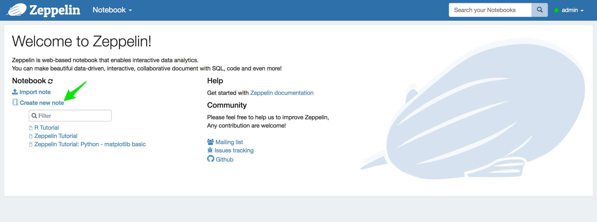

[ACCORDION-END]

[ACCORDION-BEGIN[Step 16: ](Add Data Node or nodes)]

One or more data nodes can be launched using the **ADD NODE** button. The node card appears with flashing green header. This node gets added to the cluster automatically.

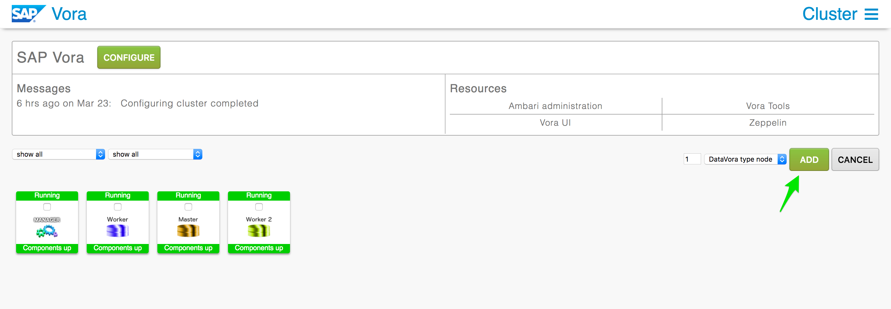

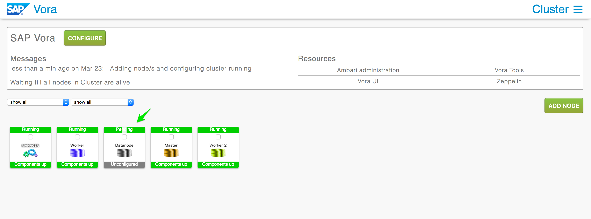

 View instance and node details by clicking the respective cards.

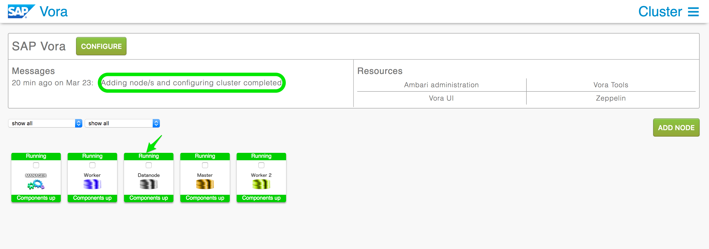

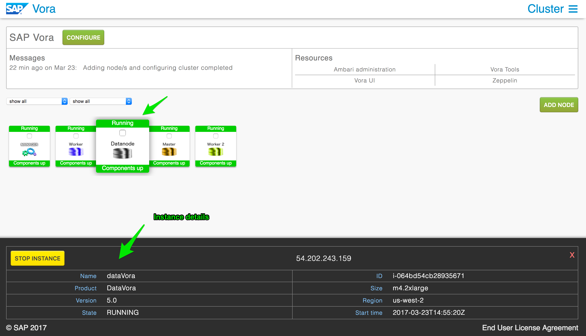

Click on **STOP INSTANCE** to stop the running instances. Once an instance is stopped, the top of the card shows the status as **STOPPED**.

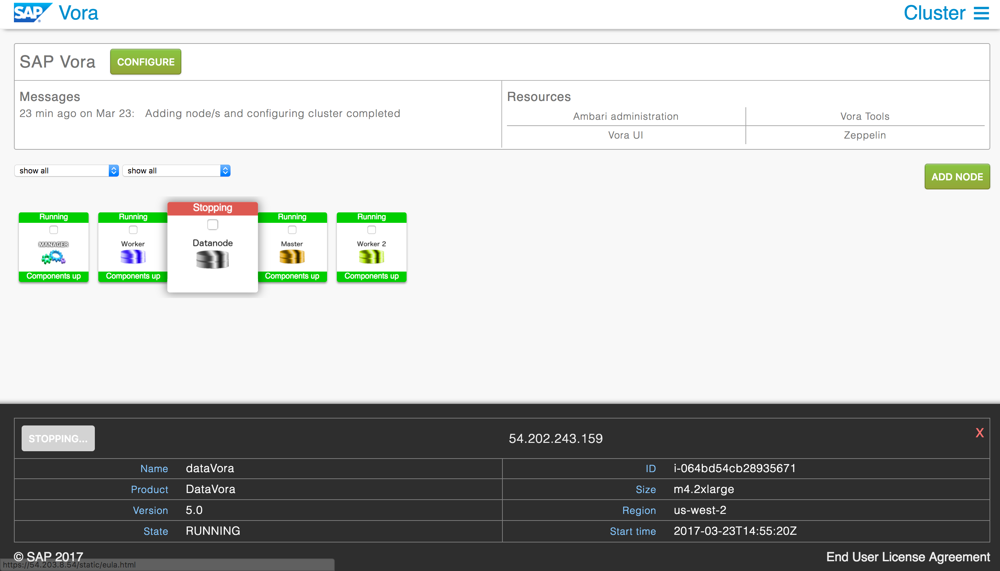

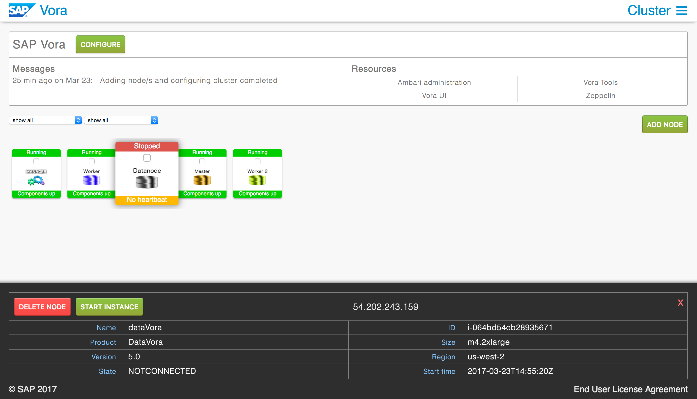

Similarly, instances or nodes can be started or deleted by clicking the **START INSTANCE** and **DELETE NODE** buttons, respectively. Delete Node is not fully supported in this version if the nodes contain data.

**Note:** Before deleting the node from the console it has to be removed from Ambari.

If the node has been removed from Ambari and if its still available in the cloud as a valid supported node type, the node can be configured by clicking on the configure instance as shown below:

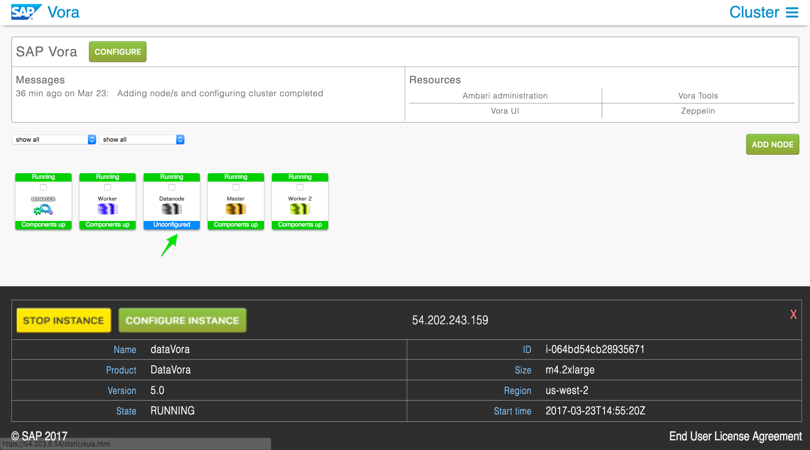

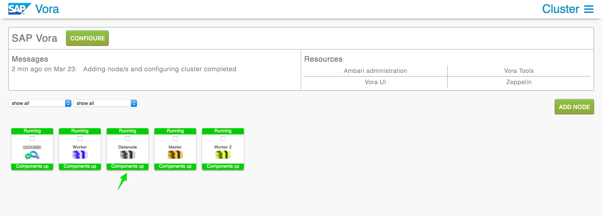

[ACCORDION-END]

[ACCORDION-BEGIN[Step 17: ](Manage unmanaged nodes)]

 If Ambari shows an additional node currently not being managed by the cluster, it is shown as Unmanaged. Click on the **MANAGE** button and start managing it.

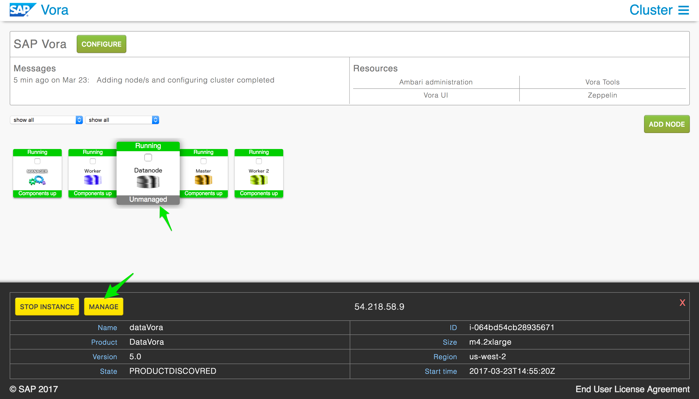

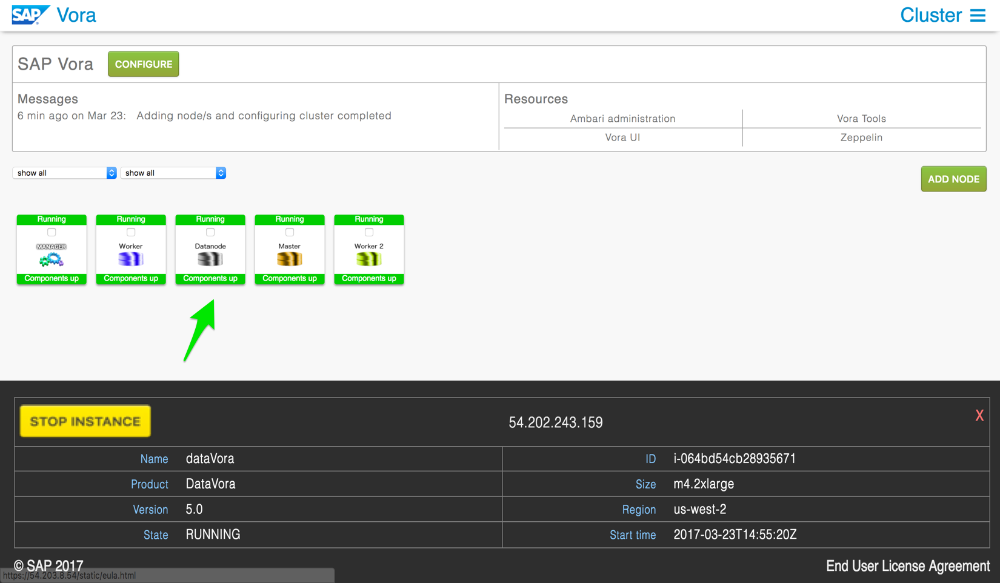

[ACCORDION-END]

[ACCORDION-BEGIN[Step 18: ](Console administration)]

To log back into SAP Vora console enter the console password as shown in the image below.

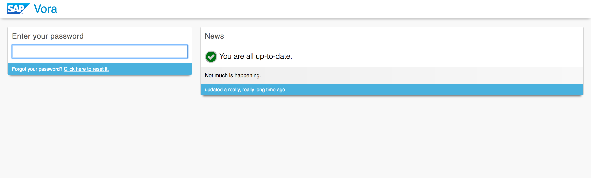

To reset console password, click **Menu > Update Credentials** in the top-right corner of the window. Enter the AWS access and secret keys. Enter the new password twice. The Ambari admin password and the Vora Manager admin password are updated with the console password.

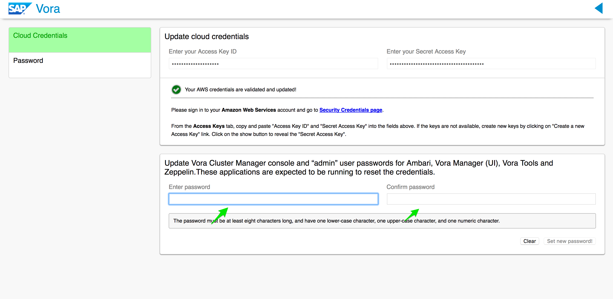

For SAP Vora console software updates, click **RESTART TO UPDATE NOW**. The update can also be ignored. It is recommended that you do not install updates while any configuration is happening.

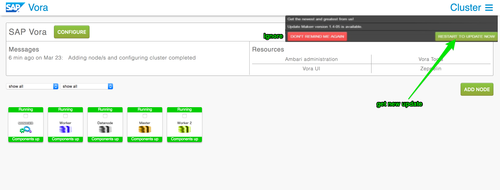

[ACCORDION-END]

## Next Steps

 - View other [SAP Vora tutorials](https://www.sap.com/developer/tutorial-navigator.tutorials.html?tag=products:data-management/sap-vora) or visit the [SAP Vora Developer](https://www.sap.com/developer/topics/vora.html) Page.
