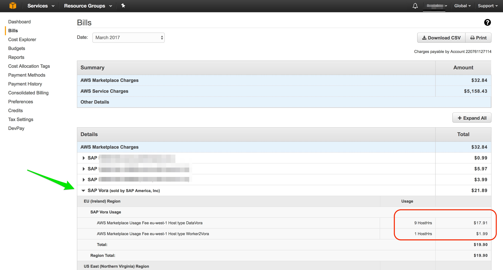
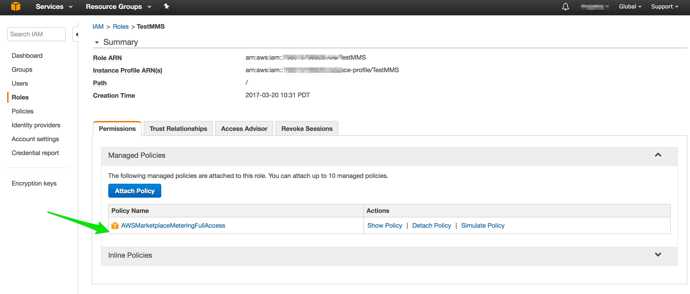

## Prerequisites  
 - None

## How-To Details
Covers all commonly asked questions about SAP Vora 1.3 running on AWS.

### Time to Complete
**5 Min**.

---

[ACCORDION-BEGIN [Question 1: ](What is SAP Vora?)]

SAP Vora is an in-memory, distributed computing solution that helps organizations uncover actionable business insights from Big Data. Use it to run enriched, interactive analytics on both enterprise and Hadoop data, quickly and easily.

[ACCORDION-END]

[ACCORDION-BEGIN [Question 2: ](What is SAP Vora Production Edition in AWS marketplace?)]

This is the Vora Production Edition cloud offering based on the latest version of Vora and Hortonworks `HDP2.4` and Spark 1.6.  This offering allows you to get the fully functional Vora for Production purposes with very easy steps.

[ACCORDION-END]

[ACCORDION-BEGIN [Question 3: ](What is the Bill of Materials of a typical Vora Cluster?)]

- Vora 1.3.61 (GA)
- Apache Ambari 2.2.1.0 as Cluster Provisioning Tool
- Spark 1.6.1
- Hadoop Distribution – HDP 2.4.2
- Zeppelin 0.6.0

[ACCORDION-END]

[ACCORDION-BEGIN [Question 4: ](What is the SAP Vora Console and what are the features available in the console?)]

SAP Vora Console is simple dashboard to monitor and manage Vora cluster and its nodes. The following operations are supported:

- **Setup /Configure Vora cluster** – This feature allows users to create a fully functional Vora cluster and configure it with few clicks.
- **Add Nodes** – This feature allows to add more data nodes as the data starts to grow. This can be done by clicking add Node button on the console and by specifying how many nodes are to be added and configured.  The console in the backend triggers an automatic job which creates a node /instance in AWS, adds it to the cluster and configures the node and the cluster.
- **Stop Instance** - This helps user to stop instance in case it is idle. This helps in cost maintenance
- **Manage Instance** - This feature allows you to manage nodes with status "Unmanaged". Unmanaged nodes are additional nodes present in Ambari. Only the nodes, which are of supported type and launched from the supported AWS image can be managed.  We do not support any unsupported type of nodes, added by user directly to Ambari and this cause serious complication to the cluster operations.
- **Delete Instance** - This feature allows you to delete a node from the console, which is no longer in use. Please refer the question on "How to delete a node using Vora Cluster Console?" to delete node successfully
- **Reset Password** - This feature allows you to reset the password for the Vora Cluster Console, Ambari, Vora Manager, Vora Tools and Zeppelin.

To get more information on how to use the above defined features please refer to the [How to set up and administer a production SAP Vora 1.3 Cluster]

[ACCORDION-END]

[ACCORDION-BEGIN [Question 5: ](What are the different types of nodes in Vora Cluster and their specification?)]

Node Type | Optional/Mandatory nodes | Billed Nodes | Maximum No of Nodes  | Vora Services | Ambari Components
:-------- | :----------------------  | :----------- | :------------------  | :-----------  | :----------------
`Manager` |  mandatory | no | 1 | `Vora Thrift server` and `Vora tools`, `Vora Dlog server`, `Vora txlocker`, `Vora txcoordinator`, `Vora txbroker`, `Vora landscape`, `Vora catalog server` | `HDFS`, `Vora Manager`, `Ambari Metrics`,
`Master` | mandatory | no | 1  | `Vora landscape`, `Vora txbroker`, `Vora txcoordinator`, `Vora txlocker`, `Vora catalog server` and `Vora Dlog server` | `HDFS`, `Zookeeper`, `YARN`, `MapReduce`, `Spark`, `Ambari Metrics`, `Vora Manager`
`Worker` | mandatory | yes | 1 | `Vora disk`, `Vora Dlog server`, `Vora docstore`, `Vora graph`, `Vora timeseries` and `Vora v2server`, `Vora-docstore`, `data services` | `HDFS - Data Node`, `Ambari Metrics`, `YARN`, `Vora Manager`
`Worker2` | mandatory | yes | 1 | `Vora disk`, `Vora docstore`, `Vora graph`, `Vora timeseries` and `Vora v2server`, `Vora-docstore` | `HDFS - Data Node`, `Ambari Metrics`, `YARN`, `Vora Manager`
`Data` | optional | yes | You can add a maximum of nine nodes in single batch using the SAP Vora console. You can add multiple such batches. | `Vora disk`, `Vora docstore`, `Vora graph`, `Vora timeseries` and `Vora v2server`, `Vora-docstore` | `HDFS - Data Node`, `Ambari Metrics`, `YARN`, `Vora Manager`

[ACCORDION-END]

[ACCORDION-BEGIN [Question 6: ](Which public clouds have the production edition of SAP Vora?)]

Currently SAP Vora is available only in Amazon Web Services as Marketplace edition and Developer edition.

[ACCORDION-END]

[ACCORDION-BEGIN [Question 7: ](How much does a SAP Vora Cluster cost?)]

The total cost is comprised of software cost and infrastructure cost.

**Software cost:**

There five types of nodes a Vora cluster can have based on their functionality and distribution of services.  Only the nodes that have `datanode` service are charged on an hourly basis aggregated from usage over an hour. The hourly rate per node is 1.99 USD. The details of the usage are included in monthly billing from Amazon marketplace.

The node types billed are of type `WorkerVora`, `Worker2Vora` and any number of `DataVora`.

**Infrastructure cost:**

The AWS resources used by the Vora Cluster including the compute, network and volumes for the instance size `m4.2xlarge` are charged hourly and are billed to customers on monthly basis by Amazon marketplace services.

[ACCORDION-END]

[ACCORDION-BEGIN [Question 8: ](How can I control cost?)]

You are responsible for operating your AWS account and paying for the hosting costs. A great way to minimize costs is to stop your instances when you are not using it. Starting your instance just takes a few minutes, so you can fire it up when you need it. To stop your instance, go to AWS EC2 console, right click the instance and choose **Stop** from the context menu. To start it again, choose **Start** from the same context menu.

Please note that even after stopping the EC2 instance, there are a few items that can still incur costs, such as volumes. If you wish to stop using your Vora Cluster instances, and do not want to pay related monthly bills, you will need to terminate your instance. To terminate your instance, choose **Terminate** from your context menu. Once the instance is terminated, by default, only the root volume is deleted; other EBS volumes attached to the instance are not deleted automatically. AWS also provides tools to monitor your usage, so there are no surprises when you get your monthly bill - from your **My Account > Console** menu on the top right corner of the screen on http://aws.amazon.com/, choose **Account Activity** and you will see your activity for the current month.

[ACCORDION-END]

[ACCORDION-BEGIN [Question 9: ](How can I set billing alerts?)]

Billing alerts enable you to monitor your AWS usage charges and recurring fees automatically, making it easier to track and manage your spending on AWS. You can set up billing alerts to receive e-mail notifications when your charges reach a specified threshold. First ten alerts are free. Please check AWS website for the latest services. Please visit <https://portal.aws.amazon.com/gp/aws/developer/account/index.html>

[ACCORDION-END]

[ACCORDION-BEGIN [Question 10: ](When data nodes are deleted from the SAP Vora console, will the instances be deleted from AWS as well?)]

No. The status of instance will change to **Stopped** in AWS.

[ACCORDION-END]

[ACCORDION-BEGIN [Question 11: ](How do you delete a node using Vora Cluster Console?)]

Before you delete any data node, make sure Hadoop takes care of data redistribution. Once successfully migrated,

- Login to Ambari Administration console and stop the components of the "to be deleted" host.
- Delete the node from Ambari Server. This will change the status of the node as **`Unconfigured`** in the Vora console
- Click on the data node then click on Stop Instance. This will change the status of the node as **`Stopped`** in the console and the AWS instance status changes to **`Stopped`**
- Click on the data node then click on Delete Instance. This will delete the node from the console

>Note: Delete the node from the Vora Cluster Console will not remove the instance from AWS. It will still be shown in the AWS instance list with instance status "Stopped". If you don't want the node, terminate the instance from AWS Console.

[ACCORDION-END]

[ACCORDION-BEGIN [Question 12: ](What are the CPU and memory requirements for each type of node?)]

To enable efficient cluster computation using the SAP Vora extension, the cluster nodes should have at least the following:

- 4 cores
- 8GB of RAM
- 20 GB of free disk space for HDFS data

[ACCORDION-END]

[ACCORDION-BEGIN [Question 13: ](Why do you require AWS instance type as `m4.2xlarge`?)]

The instance type `m4.2x` has the configuration: 26 ECUs, 8 `vCPUs`, 2.4 GHz, Intel Xeon `E5-2676v3`, 32 GiB memory, EBS only.

This instance type best matches the Cluster Sizing requirement of SAP Vora.

[ACCORDION-END]

[ACCORDION-BEGIN [Question 14: ](When configuring the AWS instance, why must we select the Auto-assign Public IP as "Enabled"?)]

Vora Console, Vora Manager, Ambari, Vora tools and Zeppelin run on the Manager instance. To access the instance from a local browser over the Internet, the instance needs to have a public IP assigned to it. Later the instance can be associated with the elastic IP.

[ACCORDION-END]

[ACCORDION-BEGIN [Question 15: ](While adding data nodes using "Add Node" functionality the Configuration fails: Message "Components Down". What causes this issue and how can we fix it?)]

There could be various reasons for this.

- Check if Ambari or Vora services are down. If Ambari services are down, then start the services manually. If Vora services are down start Vora services manually.  Vora services need to be started in sequence. If you use "start all" option then the services will start successfully. Sometimes it is necessary to "stop all " SAP Vora services and  "start all".

- Another possibility is that sometimes the limit of number of instances running/total instances has exhausted.  In this case create a Support Ticket to AWS to increase the AWS resources limit for the region you want.

[ACCORDION-END]

[ACCORDION-BEGIN [Question 16: ](How can we check or increase the resource limit for AWS?)]

Please refer to the link below:

<http://docs.aws.amazon.com/AWSEC2/latest/UserGuide/ec2-resource-limits.html>

[ACCORDION-END]

[ACCORDION-BEGIN [Question 17: ](Can I upgrade the Vora version of an existing cluster or update Vora 1.3 Patch using console?)]

This feature is not currently supported.

[ACCORDION-END]

[ACCORDION-BEGIN [Question 18: ](Does SAP Vora Console support data migration when a node is deleted?)]

This functionality is not supported by Vora Console.  Please refer to the Hadoop and SAP Vora documentation for more details.

[ACCORDION-END]

[ACCORDION-BEGIN [Question 19: ](How do I pay for my SAP One instances?)]

All the AWS resource usage is metered by amazon metering service.  The usage is gathered hourly and included as part of monthly billing. All charges are billed by AWS marketplace and can be paid by credit card. Customers pay an hourly rate for the SAP Vora Cluster instances and resources.

[ACCORDION-END]

[ACCORDION-BEGIN [Question 20: ](How is Marketplace Production edition different than AWS Dev Edition?)]

Please check table below for the difference:

License Type  |  Vora Developer Edition  |  Vora Production Edition
:-----------  |  :--------------------   |  :----------------------
Usage  | Use only for Development and can not be used for Productive usage  | Use for production Edition.
Support       |  No support              | Community Support
Cost          |  Infrastructure cost     | Infrastructure + Product cost
Availability  |  On Cloud                | On Cloud
SSL secured communication  | Vora Console | Vora Console, Vora Manager, Vora Tools, Ambari and Zeppelin
Authentication | All components except Zeppelin | Vora Console, Vora Manager, Vora Tools, Ambari and Zeppelin

[ACCORDION-END]

[ACCORDION-BEGIN [Question 21: ](Which regions are supported by SAP Vora?)]

Below is the list of regions supported:

- US- East
- US- West
- EU-Ireland
- AP-South Singapore
- SA-East-1

[ACCORDION-END]

[ACCORDION-BEGIN [Question 22: ](What should we do if a "Launch Failed" error is displayed while launching AWS instance?)]

Check the **EC2 Dashboard > Service Health > Service Status** section for any error rates. Once the service status is healthy retry launching the instance.

[ACCORDION-END]

[ACCORDION-BEGIN [Question 23: ](What is the default HDFS replication factor and how can we manage it to scale the cluster?)]

In optimal cluster `Worker` and `Worker2` have data node component hence the Replication factor by default is 2.  It is recommended to increase the Block replication factor to 3 as the cluster scales (When more nodes are added to the cluster which have "datanode" components. Login to Ambari, Go to **`HDFS > Configs Tab > Advanced Tab > Block replication`**

[ACCORDION-END]

[ACCORDION-BEGIN [Question 24: ](What steps to follow when the Cluster configuration fails due to Ambari or Vora service are down?)]

Try configuring the cluster again. If cluster configuration still fails then manually restart the respective services.

[ACCORDION-END]

[ACCORDION-BEGIN [Question 25: ](What happens the customer removes the permission for "MeterUsage" on the AWS IAM role or reconfigures their VPC to block traffic to the AWS Marketplace Metering Service?)]

If the customer removes the permission for `MeterUsage` on the role or reconfigures their VPC to block traffic to the AWS Marketplace Metering Service, their cluster usage will not be reported. AWS will keep a check of the instances that are still running and not sending metering records. AWS will then reach out to these customers and AWS also can network isolate and then terminate their instances.

[ACCORDION-END]

[ACCORDION-BEGIN [Question 26: ](How can we access Consul?)]

Please follow the steps below to access Consul:

- touch `/etc/vora/consul_ui` (enables after restarting the node for consul UI)
- touch `/etc/vora/force_output_file` (enables after restarting the node the log output of components to folder `/var/log/vora`)
- Port consul 8500 – `http://<manager ip address>:8500/ui`

[ACCORDION-END]

[ACCORDION-BEGIN [Question 27: ](How do I assign the `MeterUsage` permissions to an AWS IAM role?)]

- Login to AWS account
- Go to **`My Security Credentials > Users > <Click on the user> > Permissions tab > Click on Add Permisions`**
- Attach existing policies directly
- Search for `**AWSMarketplaceMeteringFullAccess**` and add the permissions

[ACCORDION-END]

[ACCORDION-BEGIN [Question 28: ](Which of the node types are charged for software usage and when they are charged?)]

The `WorkerVora`, `Worker2Vora` and `DataVora` node types are charged for software as they have `datanodes` service components. The software charges apply when the node's services are completely up. Infrastructure costs still apply based on the type of the instance and its resources.

`ManagerVora` and `MasterVora` type nodes are only charged for infrastructure.

[ACCORDION-END]

