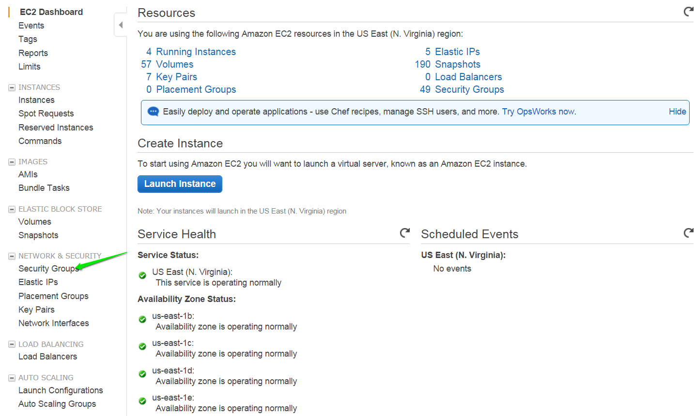
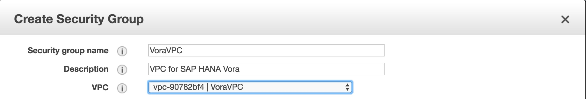
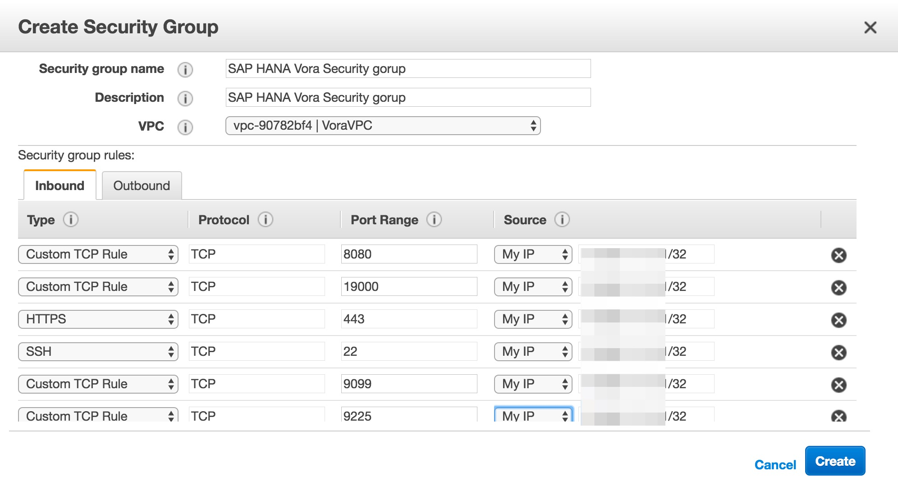
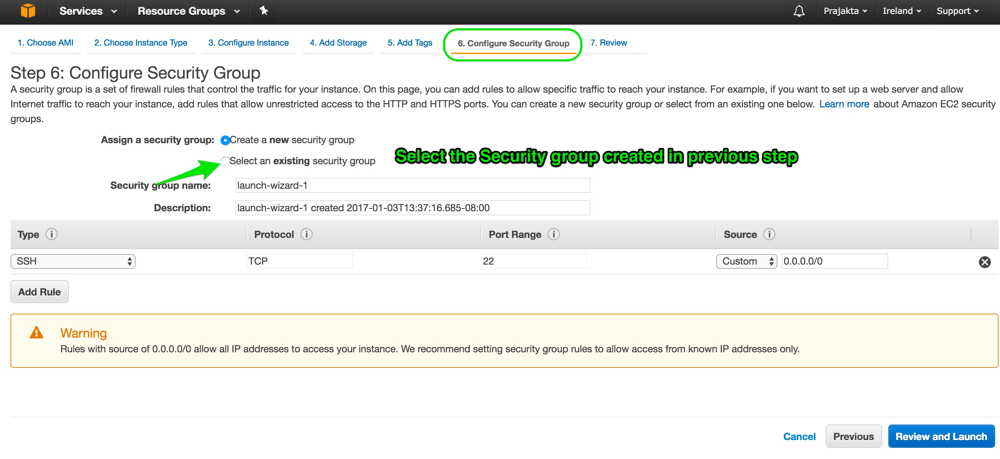
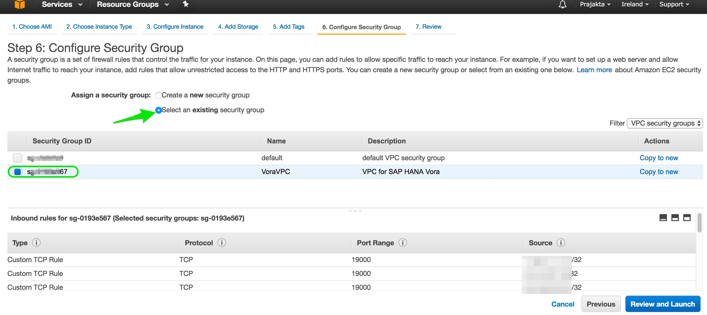

## Prerequisites  
 - [Create a VPC in AWS for SAP Vora Developer Edition in AWS](http://www.sap.com/developer/tutorials/vora-aws-create-vpc.html)

## Next Steps
 - [Launch SAP Vora on Amazon Web Services](http://www.sap.com/developer/tutorials/vora-launch-aws.html)

## How-To Details
This How-to is a step by step guide for setting up security groups in your AWS virtual private cloud for SAP Vora 1.3. This is one-time security group set-up can be used by SAP Vora Cluster instances.

### Time to Complete
**20 Min**.

---

[ACCORDION-BEGIN [Step 1: ](Create security group)]

Log in to the AWS console and select **Security Groups** from `Ec2` services.

Click on '**Create security group**'. Enter name, description; choose the VPC created for Vora.

While creating security group add the Ports as below and click **Create**.

[ACCORDION-END]

[ACCORDION-BEGIN [Step 2: ](Edit security group)]

Select the newly created security group. Click on the **Inbound** tab.

Add the same security group as the source for **All Traffic**. This allows all the traffic within the security group (all instances having this security group can communicate on all the ports)

Now the security group is all set and can be reused while creating a Vora Cluster. While launching SAP Vora Manager AMI use this security group.

As long as clusters are created in the same VPC, the same security group can be used. If you want to create another cluster or clusters in other another VPC, new security groups must be created.

[ACCORDION-END]

## Next Steps
- [Launch SAP Vora on Amazon Web Services](http://www.sap.com/developer/tutorials/vora-launch-aws.html)
