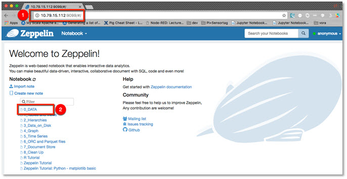
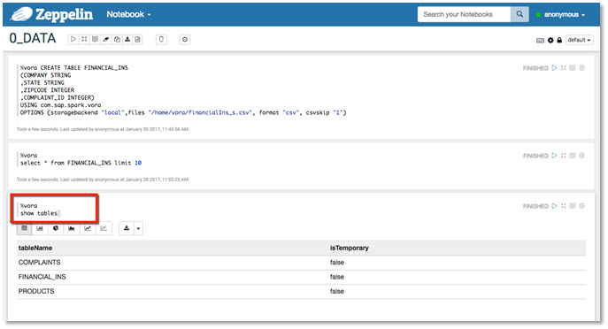
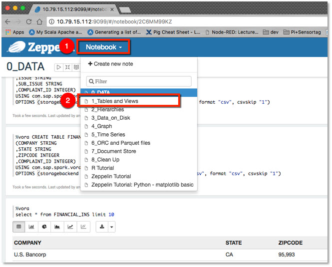
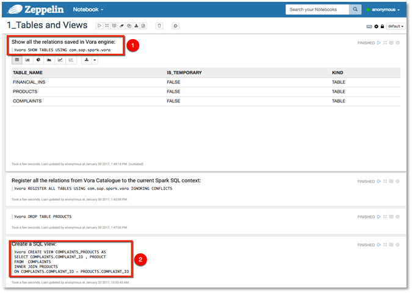
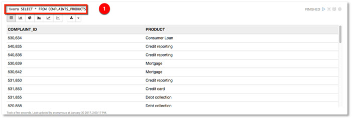
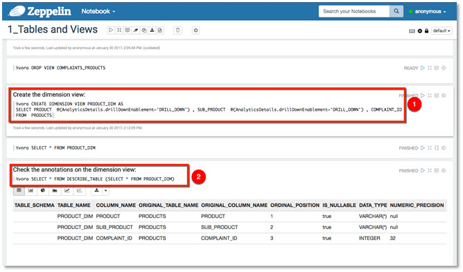

## Prerequisites  
 - You have access to SAP Vora 1.3, developer edition as a cloud appliance [in SAP CAL](http://www.sap.com/developer/how-tos/2017/02/vora-cal-setup.html)

## Next Steps
 - [Working with hierarchies using Apache Zeppelin](http://www.sap.com/developer/tutorials/vora-cal-zeppelin2.html)

## Details
### You will learn  
You will learn how to work with Apache Zeppelin, how to load sample data into SAP Vora tables and query data using views.

### Time to Complete
**15 Min**

---

[ACCORDION-BEGIN [Step 1: ](Tables in SAP Vora)]
The SAP Vora data source allows you to improve Spark performance by using SAP Vora as an in-memory database. It supports an enhanced data source API implementation that enables you to create tables (Spark DataFrames) based on files contained in a local or distributed file system.

Using the SAP Vora data source, a Spark SQL query can be executed on multiple SAP Vora engines concurrently and the execution result returned back to the Spark runtime as an RDD (resilient distributed data set).

[DONE]
[ACCORDION-END]

[ACCORDION-BEGIN [Step 2: ](Using Apache Zeppelin)]
Apache Zeppelin is a completely open web-based notebook that enables interactive data analytics. Apache Zeppelin brings data ingestion, data exploration, visualization, sharing and collaboration features to Hadoop, Spark and SAP Vora.

Interactive browser-based notebooks enable data engineers, data analysts and data scientists to be more productive by developing, organizing, executing, and sharing data code and visualizing results without referring to the command line or needing the cluster details. Notebooks allow these users not only allow to execute, but to interactively work with long workflows.

You will use Apache Zeppelin to create, load and explore data in the Vora platform using the various engine capabilities such as time series, document engine, graph engine, disk engine, but also access external data sources such as SAP HANA.

Zeppelin makes use of the SAP Vora Spark Extension library by invoking it with the `%vora` interpreter key word in each paragraph.  

To use Apache Zeppelin pre-installed on SAP Vora, developer edition, run a modern web browser of your choice and open `http://IP_ADDRESS:9099`

[DONE]
[ACCORDION-END]

[ACCORDION-BEGIN [Step 3: ](Running notebook 0_DATA)]
Once you have successfully connected, click on notebook `0_DATA`. This notebook contains SQL scripts to create in-memory tables and loading sample data.

The next page will present itself with the `0_DATA` notebook content, the content (scripts) are broken down to ___paragraphs___. These paragraphs contains the individual SQL scripts that you will execute.

A `CREATE TABLE` statement registers the table in the Spark `sqlContext` and creates a table in the SAP Vora engine.

You need to provide a table name and the fully qualified name of the SAP Vora data source package, `com.sap.spark.vora`, as well as a set of options required by the data source.

The initial SQL script execution does take some time to complete, this is due to Yarn resource initialization. Subsequent statements are executed much faster.

To run the SQL in a paragraph you can either click on **Run this Paragraph**. Or use the `SHIFT+ENTER` key combination.

Continue by running all three "create table" paragraphs.

Get list of created tables by scrolling down the notebook and run the paragraph with the `%vora show table` SQL statement.

Feel free to query the in-memory tables you have just created. You can create your own paragraphs just remember that `%vora` keyword is required in each paragraph.

[DONE]
[ACCORDION-END]

[ACCORDION-BEGIN [Step 4: ](Running notebook 1_Tables and Views)]
Continue to the next notebook `1_Tables and Views`.

Run each paragraph individually. Confirm successful completion of notebook `0_DATA` by running the `show tables` statement. Then create a view joining `COMPLAINTS` and `PRODUCTS` relations.

Select data from the newly created view `COMPLAINTS_PRODUCTS`.

Report the number of complaints by state and by product by means of simple aggregation. Run `create NUMCOMPLAINTS_PERSTATE_PERPRODUCT view` paragraph and query data from it. Zeppelin will plot the results. There are different graphs available. Settings of measures and dimensions are customizable.

Create dimension views. You can define annotations on relation columns. An ___annotation___ is a key/value pair that allows external tools, such as modelers and visual SQL editors, to store additional information about relation columns, like default aggregations or UI formatting tips. This makes integration with SAP Vora and Spark easier.

To view the annotations defined on a table, you can use the table-valued function `DESCRIBE_TABLE` as in the following Zeppelin paragraph.

Create a CUBE called `PROD_FININS_CUBE` that joins fact table and dimension view. Feel free to play with the different chart types for this visualization.

[DONE]
[ACCORDION-END]

## Next Steps
- [Working with hierarchies using Apache Zeppelin](http://www.sap.com/developer/tutorials/vora-cal-zeppelin2.html)
