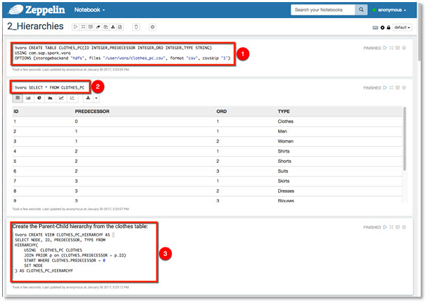
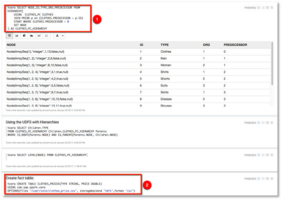

## Prerequisites  
 - [Working with Tables and Views using Apache Zeppelin](http://www.sap.com/developer/tutorials/vora-cal-zeppelin0.html)

## Next Steps
 - [Working with Disk Engine using Apache Zeppelin](http://www.sap.com/developer/tutorials/vora-cal-zeppelin3.html)

## Details
### You will learn  
You will learn how to load tables with parent-child relationship between data items, and then create and query hierarchies.

### Time to Complete
**10 Min**

---

[ACCORDION-BEGIN [Step 1: ](Hierarchies)]
Hierarchical data structures define a ___parent-child___ or ___level___ relationship between different data items, providing an abstraction that makes it possible to perform complex computations on different ___levels of data___.

An organization, for example, is basically a hierarchy where the connections between nodes (for example, manager and developer) are determined by the reporting lines that are defined by that organization.

Since it is very difficult to use standard SQL to work with and perform analysis on hierarchical data, Spark SQL has been enhanced to provide missing hierarchy functionality. Extensions to Spark SQL support hierarchical queries that make it possible to define a ___hierarchical DataFrame___ and perform custom hierarchical UDFs on it. This allows you, for example, to define an organization's hierarchy and perform complex aggregations, such as calculating the average age of all second-level managers or the aggregate salaries of different departments.

Since the SAP Vora execution engine supports hierarchies, support has been added for pushing down hierarchical queries to SAP Vora using the data source implementation.

[DONE]
[ACCORDION-END]

[ACCORDION-BEGIN [Step 2: ](Running notebook 2_Hierarchies)]
Start by selecting the `2_Hierarchies` notebook.

Run the following paragraphs.

Take a look at the hierarchy structure. Then create a new fact table.

Use the fact table to join with a hierarchy.

[DONE]
[ACCORDION-END]

[ACCORDION-BEGIN [Step 3: ](Level Hierarchies)]
Scroll down the note book until you reach "Create Level Hierarchy" paragraph.

An alternative way of creating a hierarchy is by mapping hierarchy levels to source table columns. This type of hierarchy creation is particularly useful when the source table is actually a flattened hierarchy where all hierarchy paths are encoded as rows.

You can work with the resulting hierarchy as with adjacency-list hierarchies.

Select data by hierarchy level (`4` in this example).

[DONE]
[ACCORDION-END]

## Next Steps
- [Working with Disk Engine using Apache Zeppelin](http://www.sap.com/developer/tutorials/vora-cal-zeppelin3.html)
