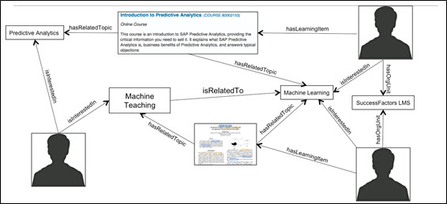
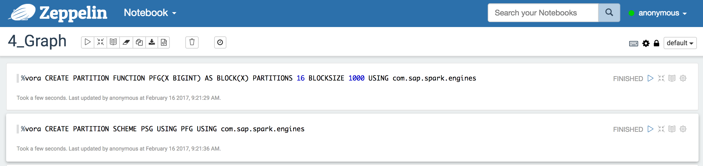
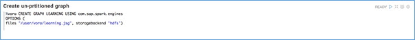
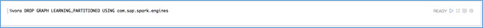
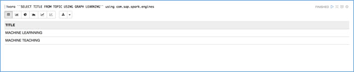
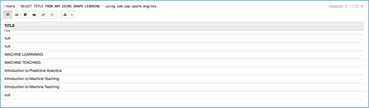
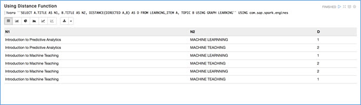
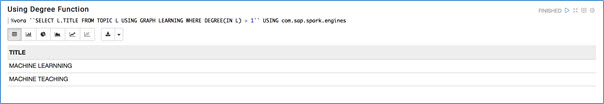

## Prerequisites  
 - [Working with Disk Engine using Apache Zeppelin](vora-cal-zeppelin3.html)

## Next Steps
 - [Working with Time Series using Apache Zeppelin] (coming soon), or
 - Select a tutorial from the [Tutorial Navigator](http://www.sap.com/developer/tutorial-navigator.html) or the [Tutorial Catalog](http://www.sap.com/developer/tutorials.html)

## Details
### You will learn  
You will learn how to process data using SAP HANA Vora graph engine.

### Time to Complete
**15 Min**

---

[ACCORDION-BEGIN [Step 1: ](Graph Engine)]
The SAP HANA Vora Graph engine is a distributed in-memory engine that supports graph processing and allows execution of typical graph operations on data stored in SAP HANA Vora.

The graph engine uses a native, node-centric graph store for high performance analytical query processing. It supports directed and undirected graphs and has an underlying property graph model. Properties can currently be specified on nodes only, not on edges.
A graph consists of a set of nodes and accompanying metadata. A node has a type, a set of primitive-typed properties, and a set of outgoing edges. In undirected graphs, outgoing and incoming edges are equivalent. Like nodes, edges and properties are also typed. A distinction is made between the sets of node types, edge types, and property types. Therefore it is possible, but not recommended, to use the same names for node, property, and edge types. Edge properties are not supported.

[DONE]
[ACCORDION-END]

[ACCORDION-BEGIN [Step 2: ](Degree Function)]
The degree of a node is its number of incoming and outgoing edges. The in-degree of a node is its number of incoming edges, while the out-degree of a node is its number of outgoing edges. The `DEGREE` function can be used to calculate these measures.

The `DEGREE` function has an optional flag, which can be any one of the keywords `IN`, `OUT`, or `INOUT`, indicating whether the in-degree, out-degree, or degree should be computed. The default value of this flag is `INOUT`. In addition, the function expects the variable of the query for which the degree should be calculated to be passed as an argument.

For any node `x` in a directed graph, it holds that `DEGREE(INOUT X) = DEGREE(IN X) + DEGREE(OUT X)`. For undirected graphs, in contrast, the function variants are equivalent and therefore the equality `DEGREE(INOUT X) = DEGREE(IN X) = DEGREE(OUT X)` holds.

The degree function can be used in both the `SELECT` and `WHERE` clauses of queries. When using the degree function in the `WHERE` clause, only comparisons with integer literals (constants) are allowed.

[DONE]
[ACCORDION-END]

[ACCORDION-BEGIN [Step 3: ](Distance Function)]
The `DISTANCE` function calculates the distance of the shortest directed or undirected path between two nodes. A path is a non-empty sequence of edges connecting a source node with a target node.

In a directed path, all edges point in the direction of the path. In an undirected path, edges can point in arbitrary directions.

The `DISTANCE` function expects two arguments that must be variables of the query. These variables are the source and the target nodes, respectively.

The optional flag `DIRECTED` or `UNDIRECTED` can be specified for the distance function to indicate whether directed or undirected paths should be considered. In addition, the flag `EDGETYPE` followed by the name of an edge type or `ANY` can be specified to restrict the edge types to be considered for evaluating the paths.

If there is no (undirected) path between the two nodes, the `DISTANCE` function returns `NULL`. Note that `DISTANCE(DIRECTED a,b)` calculates the distance of the shortest path from `a` to `b`, but not from `b` to `a`.

The `DISTANCE` function can be used in the `SELECT` and `WHERE` clauses of a query. In the `WHERE` clause of a query, the `DISTANCE` function can be used only in comparisons with integer literals (constants).

[DONE]
[ACCORDION-END]

[ACCORDION-BEGIN [Step 4: ](Connected Components)]
___Connected components___ and ___strongly connected components___ can be computed using the `CONNECTED_COMPONENT` function. This function returns an `ID` for the (strongly) connected component of a particular node.

The `CONNECTED_COMPONENT` function expects one argument that must be a variable of the query and represents the matched nodes for which the connected component should be calculated. In the result set, a column of type integer is generated containing the IDs of the calculated (strongly) connected components of the matched nodes.

An optional flag can be specified with either the keyword `STRONG` or `WEAK`. If set to `STRONG`, strongly connected components are computed (taking into account the direction of edges). If set to `WEAK`, connected components are computed (ignoring the direction of edges). Additionally, the optional flag `EDGETYPE` followed by the name of an edge type or the keyword `ANY` can be specified to restrict the connections allowed within a (strongly) connected component to a specific edge type. If the `ANY` keyword is used, there is no restriction on the edge types used.

The connected component IDs are derived from the node IDs. The ID of a connected component is determined by the smallest node ID that occurs in it. The function for calculating connected components is available only in the `SELECT` clause of a query.

A sample data set explains the relationship between the learning contents, the topics and learners in an organization.

[DONE]
[ACCORDION-END]

[ACCORDION-BEGIN [Step 5: ](Running notebook 4_Graph)]
Proceed by selecting the `4_Graph` notebook.

Run the first four paragraphs, creating partition function, partition scheme and graph.

You can create both partitioned and unpartitioned graphs with Vora 1.3. above you see how to use the partition schema to create a partitioned function and below you can see how to create an unpartitioned graph out of your learning data.

You can also drop a graph as below.

You can see what varieties of any type you have in your graph. For instance, in this example you can see what varieties of learning topics you have in the graph. As you can see below the result shows the topics as Machine Learning and Machine Teaching.

There are also wildcards available to you with graph. In below example you return the `name` value on any node that includes that information. For the nodes that don't have any property called `name` the returned value is `null`.

This query is using the wildcards to return the `Title` value from any nodes that have that information.

You can call the graph specific functions on the graph data. In the example below you will see the `Topics` that are related to the `Contents` and see how far apart are they from each other by calling the `DISTANCE(DIRECTED A,B)` function.

Find out what is the smallest ID associated with the strong or weak component connecting to your Learning Contents by calling the `CONNECTED_COMPONENT(STRONG A)` and `CONNECTED_COMPONENT(WEAK a)` functions within your select statement.

Find out the Learning Topics that have connections to more that one incoming connected node.

You can also use aggregations in your `SELECT` statement and in combination of any graph function. In the example below the statement returns the average value of the incoming degree for the `Topics`.

[DONE]
[ACCORDION-END]

## Next Steps
 - [Working with Time Series using Apache Zeppelin] (coming soon), or
 - Select a tutorial from the [Tutorial Navigator](http://www.sap.com/developer/tutorial-navigator.html) or the [Tutorial Catalog](http://www.sap.com/developer/tutorials.html)
