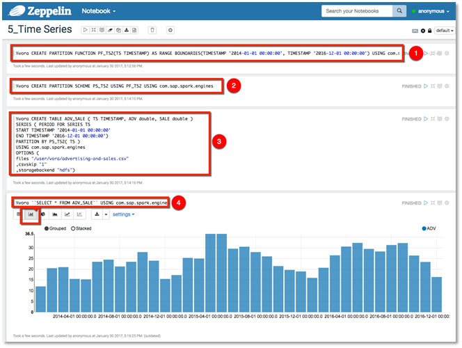
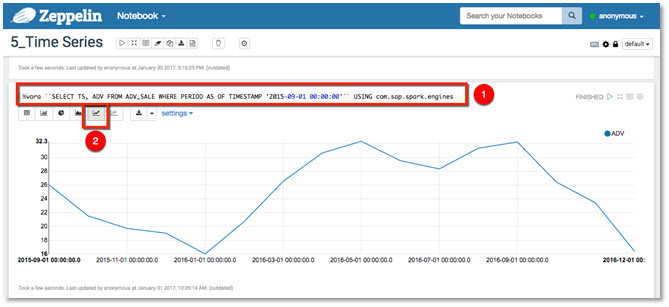
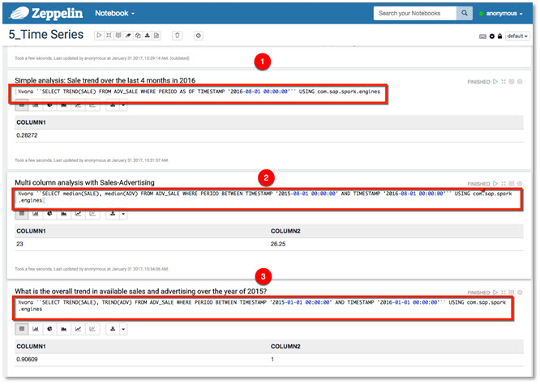

## Prerequisites  
 - [Working with Graph Engine using Apache Zeppelin](vora-cal-zeppelin4.html)

## Next Steps
 - [Working with ORC and Parquet Files using Apache Zeppelin] (coming soon), or
 - Select a tutorial from the [Tutorial Navigator](http://www.sap.com/developer/tutorial-navigator.html) or the [Tutorial Catalog](http://www.sap.com/developer/tutorials.html)

## Details
### You will learn  
You will learn how to process time series data using SAP HANA Vora engine.

### Time to Complete
**15 Min**

---

[ACCORDION-BEGIN [Step 1: ](Time Series processing)]
The SAP HANA Vora time series engine enhances the in-memory engine by enabling time series data to be efficiently analyzed in distributed environments. It supports highly compressed time series storage and time series analysis algorithms that work directly on top of the compressed data.

[DONE]
[ACCORDION-END]

[ACCORDION-BEGIN [Step 2: ](Running notebook 5_Time_Series)]
Select the `5_Time_Series` notebook.

Start off by creating the required partition function and scheme, then follow by creating a table and loading time-series data.

Continue with the paragraphs as below, doing simple time-series analysis, calculate the advance from a specific point in time.

Next we determine the trend of sales over a time period, multi column analysis of Sales-Advertising and overall trend in sales and advertising.

[DONE]
[ACCORDION-END]

## Next Steps
 - [Working with ORC and Parquet Files using Apache Zeppelin] (coming soon), or
 - Select a tutorial from the [Tutorial Navigator](http://www.sap.com/developer/tutorial-navigator.html) or the [Tutorial Catalog](http://www.sap.com/developer/tutorials.html)
