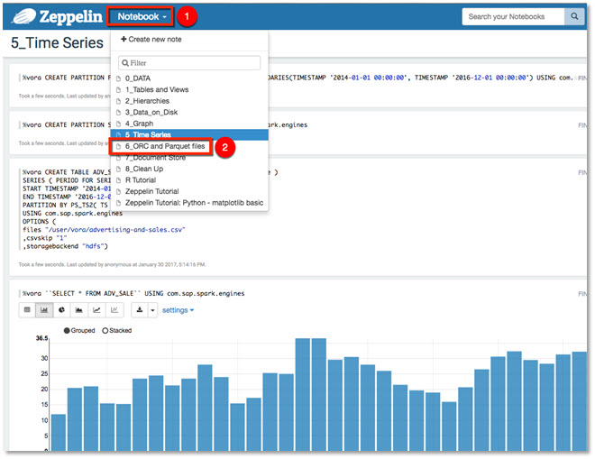
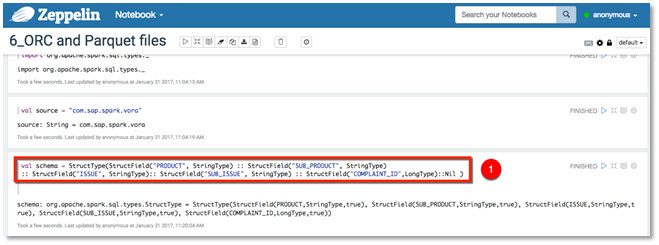
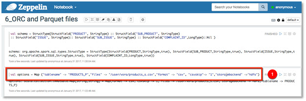
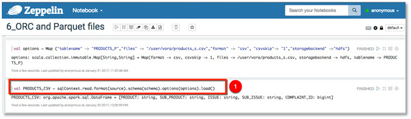
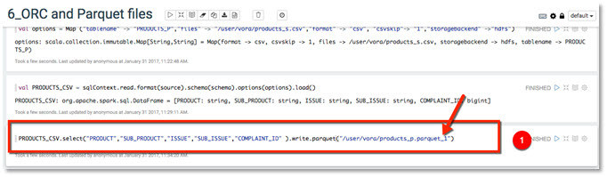
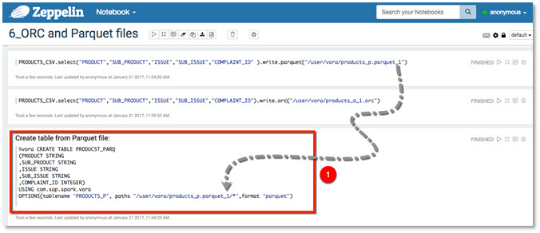
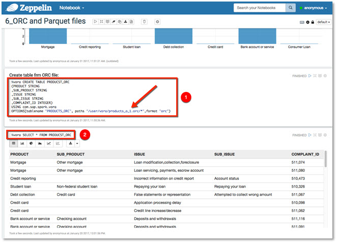

## Prerequisites  
 - [Working with Time Series using Apache Zeppelin](http://www.sap.com/developer/tutorials/vora-cal-zeppelin5.html)

## Next Steps
 - [Working with Document Store Engine in SAP Vora](http://www.sap.com/developer/tutorials/vora-cal-zeppelin7.html)

## Details
### You will learn  
You will learn how to load data from ORC and Parquet files into SAP Vora engine.

### Time to Complete
**5 Min**

---

[ACCORDION-BEGIN [Step 1: ](ORD and Parquet file types)]
Next up you will look into working with popular file types in data management namely ORC and Parquet files, the smallest, fastest columnar storage for Hadoop workloads. SAP Vora supports both file types.

**Apache ORC** is a self-describing type-aware columnar file format designed for Hadoop workloads. It is optimized for large streaming reads, but with integrated support for finding required rows quickly.

**Apache Parquet** is a columnar storage format available to any project in the Hadoop ecosystem, regardless of the choice of data processing framework, data model or programming language.

[DONE]
[ACCORDION-END]

[ACCORDION-BEGIN [Step 2: ](Running notebook 6_ORC and Parquet files)]
Start this tutorial by launching the Zeppelin notebook `6_ORC and Parquet files`.

In order to create ORC and Parquet files you must switch to Spark context. More information about Spark SQL methods and function can be found here:
https://spark.apache.org/docs/1.5.2/api/java/org/apache/spark/sql/types/package-summary.html

Run the highlighted paragraphs in the notebook.

In the next step use `StructType` to create a structured data frame of the data set. `StructType` is a built-in data type in Spark SQL to represent a collection of fields.

Then create a value called `options` that stores required option as strings. This will be passed in as Vora options.

Create a data frame with the defined schema and options. This also includes the source file being loaded.

Select the desired columns from the `PRODUCT_CSV` data frame and write them to HDFS in Parquet format. **Note:** If you receive an error that the file already exists please change the output file to `/user/vora/products_p.parquet_2` to ensure its uniqueness.

Move to the next paragraph and create an ORC output file. **Note:** If you receive an error that the file already exists, then please update the statement and change to `/user/vora/products_o_2.orc`.

Now you can create an in-memory Vora resident table, using ORC and Parquet files for loading data. **Note:** Ensure `paths` option is updated with previous step changes

Run the next paragraph and select data from the newly created table containing data loaded from your Parquet file.

Final step of this tutorial is to create a table from your ORC based file and select data from the table. **Note:** Ensure `paths` option is updated with previous step changes.

[DONE]
[ACCORDION-END]

## Next Steps
 - [Working with Document Store Engine in SAP Vora](http://www.sap.com/developer/tutorials/vora-cal-zeppelin7.html)
