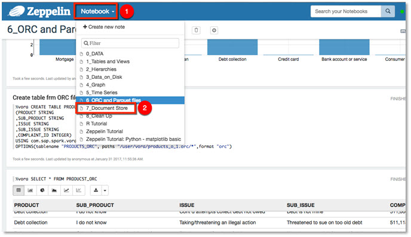
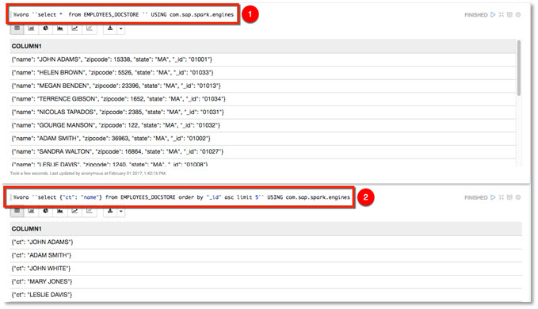

## Prerequisites  
 - [Working with ORC and Parquet Files using Apache Zeppelin](https://www.sap.com/developer/tutorials/vora-cal-zeppelin6.html)

## Next Steps
- [Working with the SAP Vora Tools ](https://www.sap.com/developer/tutorials/vora-cal-toolsintro.html)

## Details
### You will learn  
You will learn how to process JSON data using SAP Vora document store engine.

### Time to Complete
**10 Min**

---

[ACCORDION-BEGIN [Step 1: ](Document Store Engine)]
Document Store is a distributed in-memory JSON document store that supports rich query processing over JSON data.

The Document Store uses a special binary JSON format and a highly optimized, parallel, and `NUMA` (Non-Unified Memory Access architecture) aware execution engine to provide high performance on analytical workloads. It also combines JSON with most of the regular SQL features. You do not have to learn a new query language, but can use SQL for JSON as well.

[ACCORDION-END]

[ACCORDION-BEGIN [Step 2: ](Running notebook 7_Document Store)]
Continue by select ting the `7_Document Store` notebook.

You will be looking at employee data, the raw data is stored in a single JSON document. Start by creating the required partition function and partition scheme.

Run some basic queries against Document Store Engine.

Run and complete the remainder of the paragraphs in this notebook.

[ACCORDION-END]

## Next Steps
- [Working with the SAP Vora Tools ](https://www.sap.com/developer/tutorials/vora-cal-toolsintro.html)
