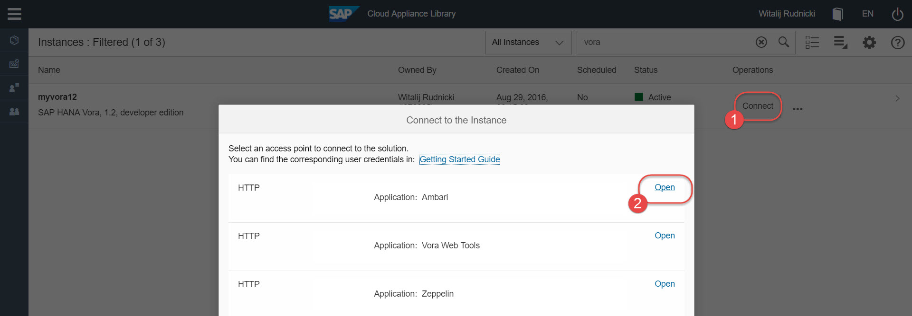
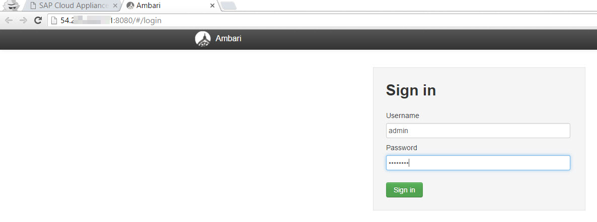
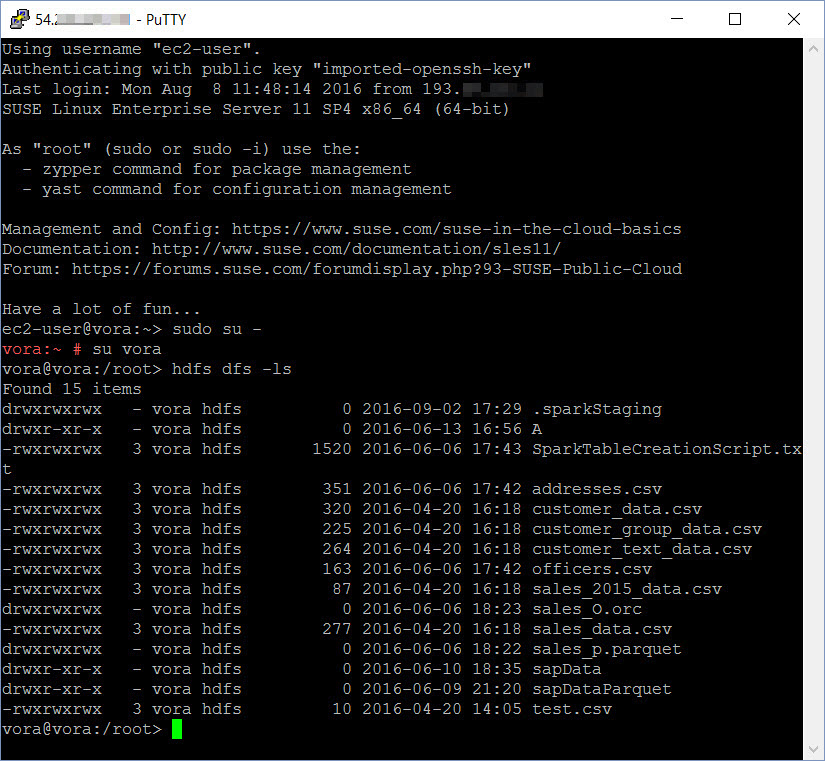

## Prerequisites  
 - **Proficiency:** Beginner | Intermediate | Advanced
 - **Tutorials:** [Create SAP HANA Vora, developer edition, in the cloud](http://go.sap.com/developer/tutorials/vora-setup-cloud.html)
 - Basic understanding of Apache Hadoop ecosystem and terminology
 - Basic understanding of Linux OS, commands and the use of terminal

## Next Steps
 - [Loading sample data using Apache Zeppelin](http://go.sap.com/developer/tutorials/vora-zeppelin-load-sample-data.html), or
 - Select a tutorial from the [Tutorial Navigator](http://go.sap.com/developer/tutorial-navigator.html) or the [Tutorial Catalog](http://go.sap.com/developer/tutorials.html)

## Details
### You will learn  
You will learn how to connect to your SAP HANA Vora instance to manage it. There are two main ways you will perform administration tasks:
 - using Apache Ambari, which provides an easy-to-use web UI to manage and monitor Apache Hadoop clusters and components, including SAP HANA Vora software,
 - logging to OS of the instance's host using `ssh` secure protocol and running commands there.

### Time to Complete
**15 Min**.

---

1. If your instance is in the `Suspended` status, then use SAP Cloud Appliance Library (CAL) to **Activate** it.

    >You can use as well Amazon Web Services console to start the instance. But using the CAL interface allows you to define how long the instance should run, before the CAL suspends it. This way the CAL helps you to prevent cloud provider's charges for the running instance, when you finished using it, but had forgotten to suspend it manually.

    

2. To open Apache Ambari web UI click on **Connect** in your SAP HANA Vora instance in CAL, and then pick **Open** a link for `Application: Ambari`.

    >The port of Ambari web UI has been preconfigured for you in the SAP HANA Vora, developer edition, in CAL. As well its port has been opened as one of the default **Access Points**. As you might remember it translates into the appropriate _inbound rule_ in the corresponding AWS's security group.

    

3. Log into Ambari web UI using the user `admin` and the master password you defined during process of the creation of the instance in CAL.

    

4. In the example below you can see that (1) all services, including SAP HANA Vora components, are running, that (2) there are no issues with resources, and that (3) there are no alerts generated by the the system.

    You use this interface to start/stop cluster components if needed during operations or troubleshooting.

    >Please refer to Apache Ambari official documentation if you need additional information and training how to use it.

    >For detailed review of all SAP HANA Vora components and their purpose please review [SAP HANA Vora help](http://help.sap.com/hana_vora_re)

    

5. To connect to the instance's OS using `ssh` client you need the secure key-pair `.pem` file, which you downloaded when creating the SAP HANA Vora instance in CAL.

    In Unix-like systems (including Mac OS) you run this command in a terminal window:
    ```shell
    ssh -i [vorakeyfile].pem [IPaddress] -l ec2-user
    ```
    where `[vorakeyfile].pem` is the name of your key-pair file, and `[IPaddress]` is the external IP address of your instance.

    In Windows you can use the ssh client, like PuTTY. When using PuTTY you need to convert `.pem` file to PuTTY's own format `.ppk`. Use **PuTTY Key Generator** application to import the `[vorakeyfile].pem` file and to save private key as `.ppk` file.

    Next open a new session in PuTTY and provide:
    - IP Address of the instance in **Host name** under `Session`
    - Select newly generated `.ppk` file in **Private key file for authentication** under `Connection -> SSH -> Auth`
    - Provide user `ec2-user` as **Auto-login username** under `Connection -> Data`

     Click `Open` to login to the host's OS.

6. Once you are logged as `ec2-user` you can switch to `root` user if needed, using a command
    ```shell
    sudo su -
    ```

    Another predefined OS user is `vora`, which is an owner of sample files, preloaded into HDFS (the Hadoop file system). You will use these files later in data analysis exercises.

    You can switch to `vora` user either from `root` user, or from other users using master password.

    

## Next Steps
 - [Loading sample data using Apache Zeppelin](http://go.sap.com/developer/tutorials/vora-zeppelin-load-sample-data.html), or
 - Select a tutorial from the [Tutorial Navigator](http://go.sap.com/developer/tutorial-navigator.html) or the [Tutorial Catalog](http://go.sap.com/developer/tutorials.html)
