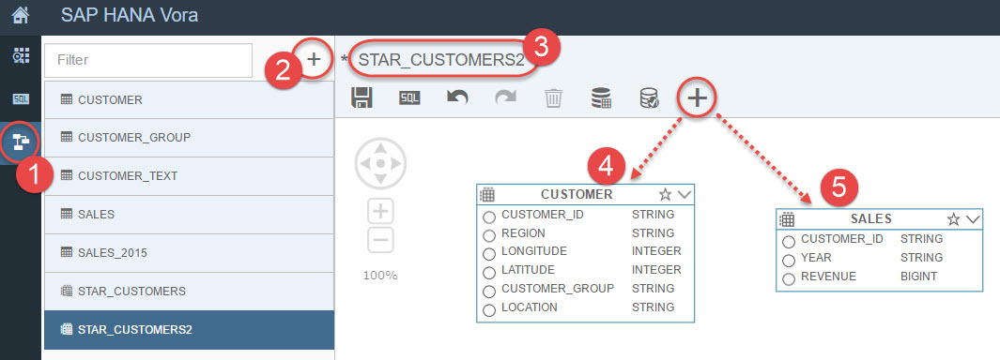
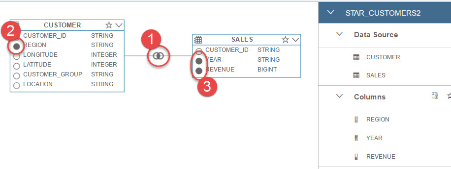
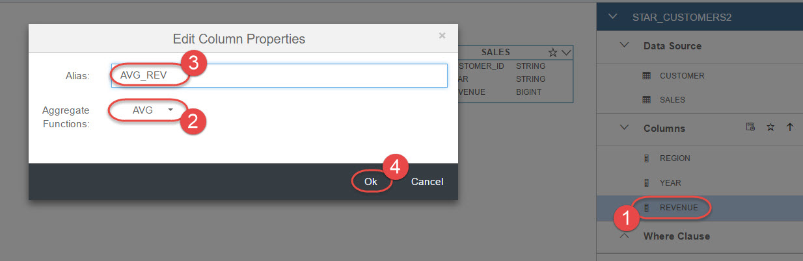
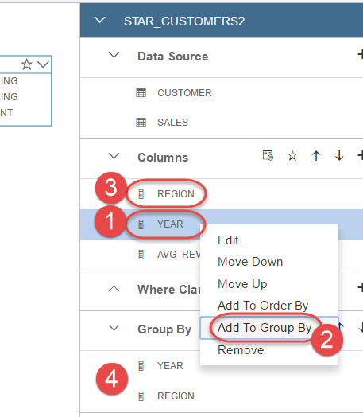
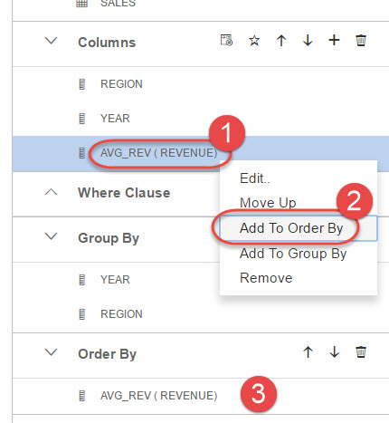
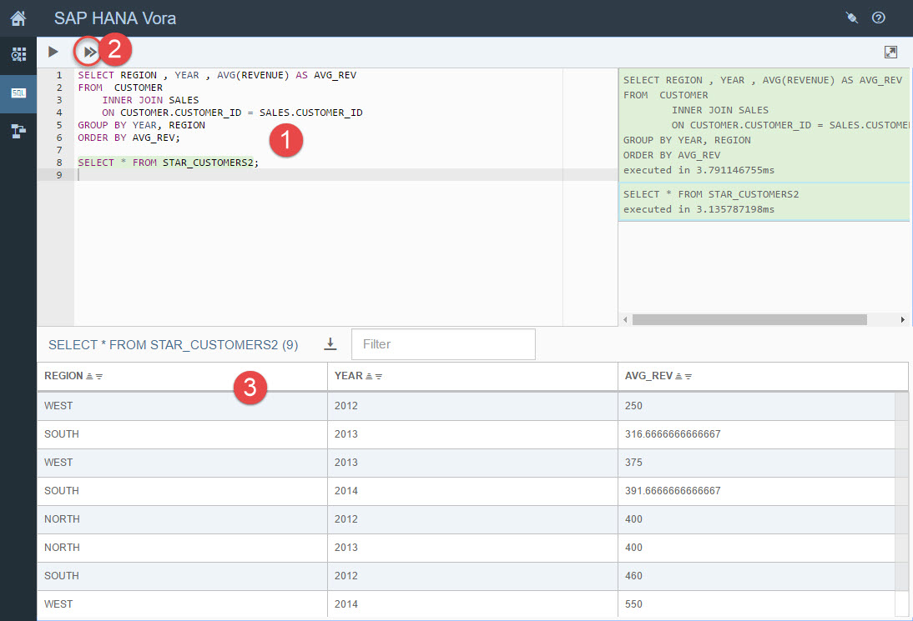

## Prerequisites  
 - **Proficiency:** Beginner
 - **Tutorials:** [SAP HANA Vora Modeler: Unions in SQL View](http://www.sap.com/developer/tutorials/vora-modeler-view-union.html)

## Next Steps
 - [Loading sample data from different file formats](http://www.sap.com/developer/tutorials/vora-zeppelin-load-file-formats.html)

## Details
### You will learn  
You will learn how to use Modeler artifacts to create Group By, Aggregations, Order By, etc. You want to figure out the average revenue per region per year.

### Time to Complete
**5 Min**.

---

1. Go back to SAP HANA Tools' Modeler. Create a new SQL view and name it `STAR_CUSTOMERS2`. Add `CUSTOMER` and `SALE` as data sources.

    

2. Create an inner join between `CUSTOMER` and `SALE` accepting proposed condition.

    Select `REGION`, `YEAR`, `REVENUE` as output columns.

    

3. In the right pane right-click on the `REVENUE` and choose the **Edit...** from the drop down menu.

    Then choose the `AVG` as aggregation function in the popped up window and type `AVG_REV` as Alias. Click **OK**.

    

4. Add `YEAR` and `REVENUE` as **GROUP BY** columns.

    

5. Right click on `AVG_REV` and add to **Order By**.

    

6. Save the view and copy the generated SQL

    

7. Execute the generated SQL and compare the result to data from the view.

    ```sql
    SELECT REGION , YEAR , AVG(REVENUE) AS AVG_REV  
    FROM  CUSTOMER
    	INNER JOIN SALES
    	ON CUSTOMER.CUSTOMER_ID = SALES.CUSTOMER_ID
    GROUP BY YEAR, REGION
    ORDER BY AVG_REV;

    SELECT * FROM STAR_CUSTOMERS2;    
    ```

    

## Next Steps
- [Loading sample data from different file formats](http://www.sap.com/developer/tutorials/vora-zeppelin-load-file-formats.html)
