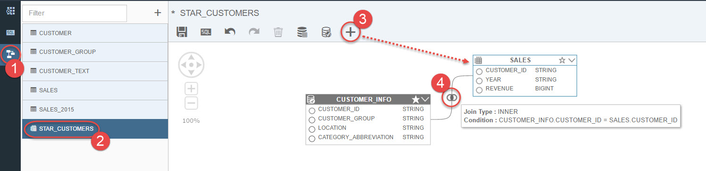
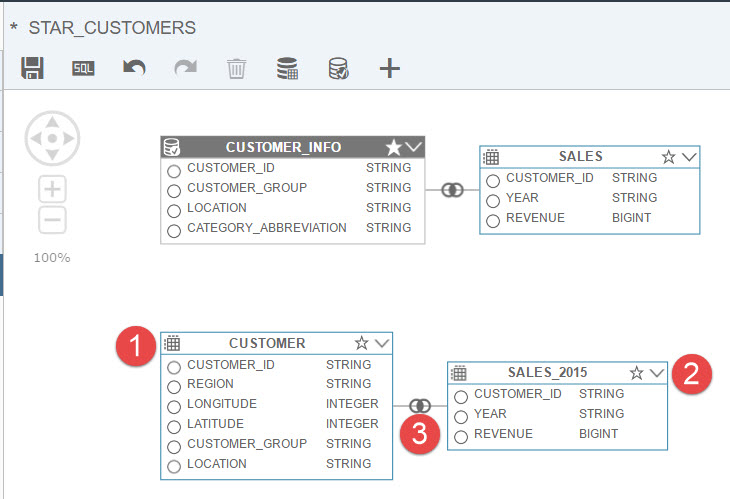
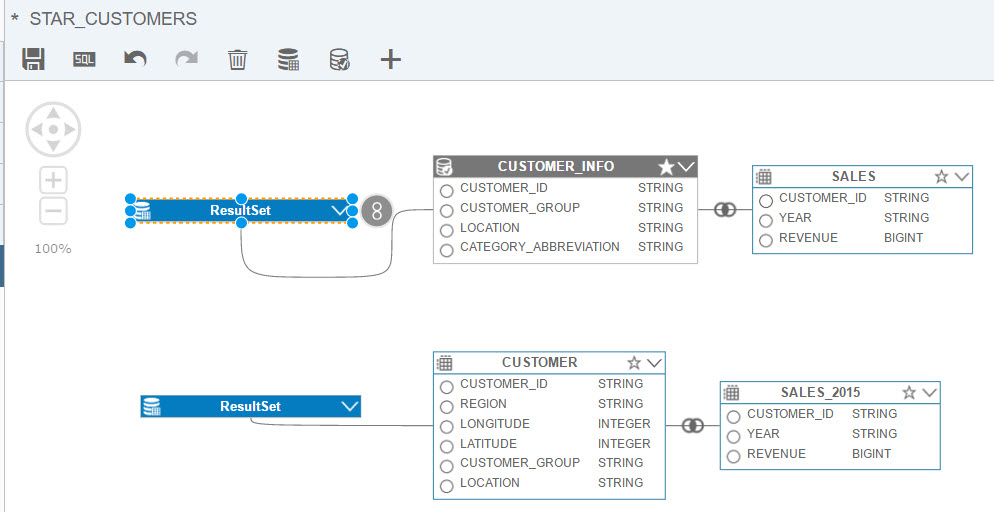
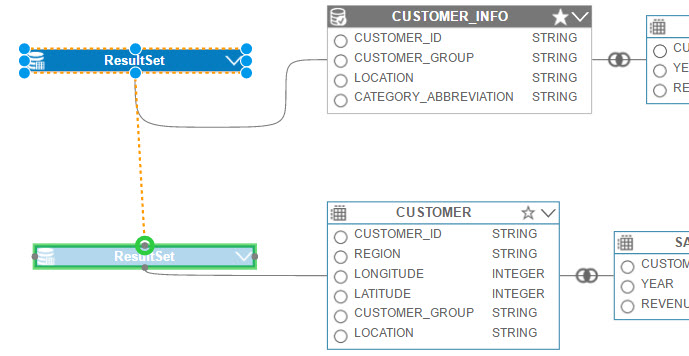
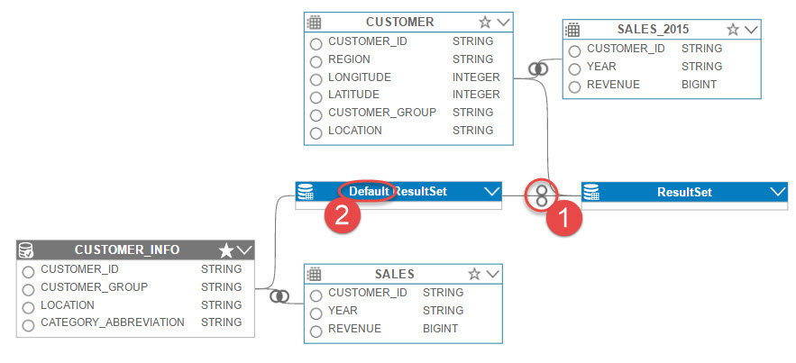
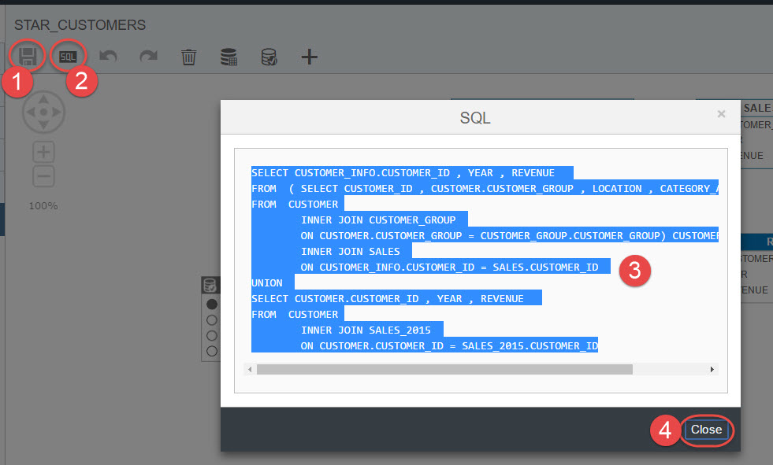
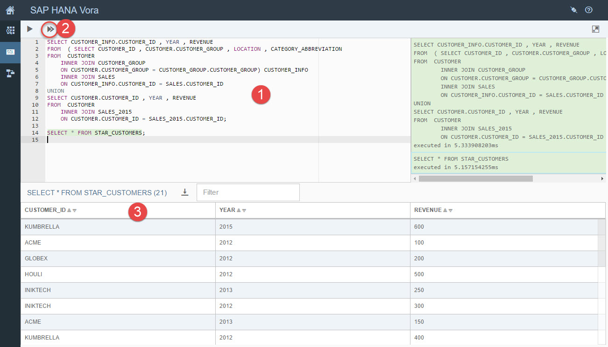

## Prerequisites  
 - **Proficiency:** Beginner
 - **Tutorials:** [Getting started with SAP HANA Vora Modeler: Creating SQL views](http://www.sap.com/developer/tutorials/vora-modeler-getting-started.html)

## Next Steps
 - [SAP HANA Vora Modeler: Aggregation in SQL View](http://www.sap.com/developer/tutorials/vora-modeler-view-aggregate.html)

## Details
### You will learn  
You will learn how to use Modeler artifacts to add union to previously created SQL view. It will be the second step to build a view to find the average revenue per region per year. You will create a union of the `SALES` and `SALES_2015` tables in order to have the sales data from 2013-2015.

### Time to Complete
**5 Min**.

---

1. Go back to the Modeler in SAP HANA Tools. Click on `STAR_CUSTOMERS` SQL view to reopen it for editing.

    Add `SALES` a from datasources same way you added tables to the view in the previous tutorial. And similarly join `SALES` and `STAR_CUSTOMERS`.

    

2. Next add `CUSTOMER` and `SALES_2015` to the canvas and join these two tables as well.

    

3. You perform the union operation on result sets. This means that, for each data source, you include a result set node, and add the output of the data sources to the result sets.

    Drag and drop the `ResultSet` node to the view editor and use its arrow to drag the cursor to `CUSTOMER_INFO` or `SALES`. The connection line is created in the view.

    

    Repeat the same to create the result set for a join of `CUSTOMER` and `SALES_2015`.

    

4. Use the **8** icon on one of the result sets to drag a cursor and to create a union between them.

    

    As a result the union connection is created. The first `ResultSet` that you select becomes the default result set.

    

5. Add the columns in the following order:

    ```sql
    CUSTOMER_ID from the CUSTOMER_INFO table and YEAR, REVENUE from SALES_P table
    CUSTOMER_ID from CUSTOMER and YEAR, REVENUE from SALES_2015 table
    ```

    The selected columns will be shown in the **Default `ResultSet`** as below. The columns in the **Default `ResultSet`** will be part of the output.

    

6. Save your result and press on the **SQL** button to see the generated SQL. Copy the statement and click **Close**.

    

    Open SQL Editor and paste the code there. Add the statement to select from the view directly.

    ```sql
    SELECT CUSTOMER_INFO.CUSTOMER_ID , YEAR , REVENUE  
    FROM  ( SELECT CUSTOMER_ID , CUSTOMER.CUSTOMER_GROUP , LOCATION , CATEGORY_ABBREVIATION  
    FROM  CUSTOMER
    	INNER JOIN CUSTOMER_GROUP
    	ON CUSTOMER.CUSTOMER_GROUP = CUSTOMER_GROUP.CUSTOMER_GROUP) CUSTOMER_INFO
    	INNER JOIN SALES
    	ON CUSTOMER_INFO.CUSTOMER_ID = SALES.CUSTOMER_ID
    UNION
    SELECT CUSTOMER.CUSTOMER_ID , YEAR , REVENUE  
    FROM  CUSTOMER
    	INNER JOIN SALES_2015
    	ON CUSTOMER.CUSTOMER_ID = SALES_2015.CUSTOMER_ID;

    SELECT * FROM STAR_CUSTOMERS;

    ```

    Execute both statements and compare results.

    

## Next Steps
 - [SAP HANA Vora Modeler: Aggregation in SQL View](http://www.sap.com/developer/tutorials/vora-modeler-view-aggregate.html)
