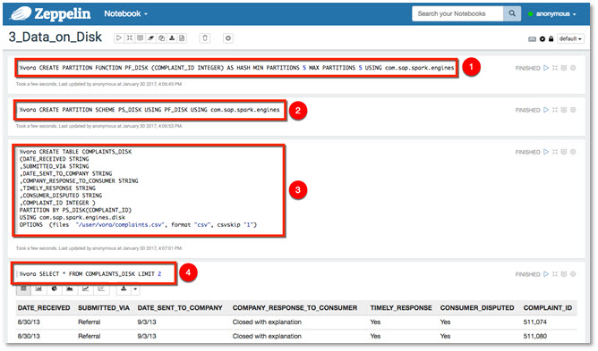

## Prerequisites  
 - [Working with Hierarchies using Apache Zeppelin ](http://www.sap.com/developer/tutorials/vora-ova-zeppelin2.html)


## Next Steps
 - [Working with Graph Engine using Apache Zeppelin](http://www.sap.com/developer/tutorials/vora-ova-zeppelin4.html)

## Details
### You will learn  
You will learn how to process data using SAP Vora 1.4 disk engine.

### Time to Complete
**15 Min**

---

[ACCORDION-BEGIN [Step 1: ](Disk Engine)]
Besides the SAP Vora relational in-memory engine, SAP Vora 1.4 also provides the following execution engines: document store, graph engine, time series engine, and disk engine.

These engines are integrated into Spark as either a Spark SQL data source (full integration) or raw data source (partial integration).

The data source `com.sap.spark.engines.disk` is used by the disk engine. SQL statements issued on the disk engine are fully integrated into Spark SQL. Disk engine tables therefore behave in exactly the same way as Spark SQL tables.


[DONE]
[ACCORDION-END]

[ACCORDION-BEGIN [Step 2: ](Running 3_Data_on_Disk)]
The first engine to look at is the Disk Engine. Switch to Zeppelin notebook `3_Data_on_Disk`.

First create a disk engine table. Disk engine tables need a partition function and a derived partition scheme. This is what you do in the first two paragraphs.


Create a second disk engine table and verify tables created.


Continue by adding a new paragraph to run a simple cross-engine query.

```sql
%jdbc
SELECT COMPLAINTS_DISK.COMPLAINT_ID,PRODUCT  
FROM  COMPLAINTS_DISK
INNER JOIN PRODUCTS
ON COMPLAINTS_DISK.COMPLAINT_ID = PRODUCTS.COMPLAINT_ID
```


[DONE]
[ACCORDION-END]


## Next Steps
- [Working with Graph Engine using Apache Zeppelin](http://www.sap.com/developer/tutorials/vora-ova-zeppelin4.html)
