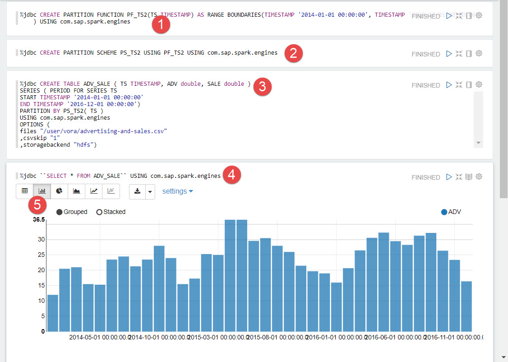
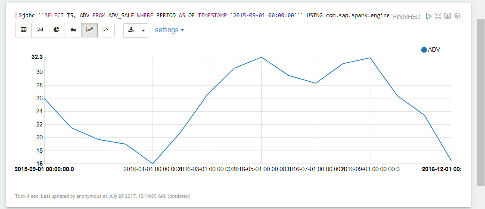
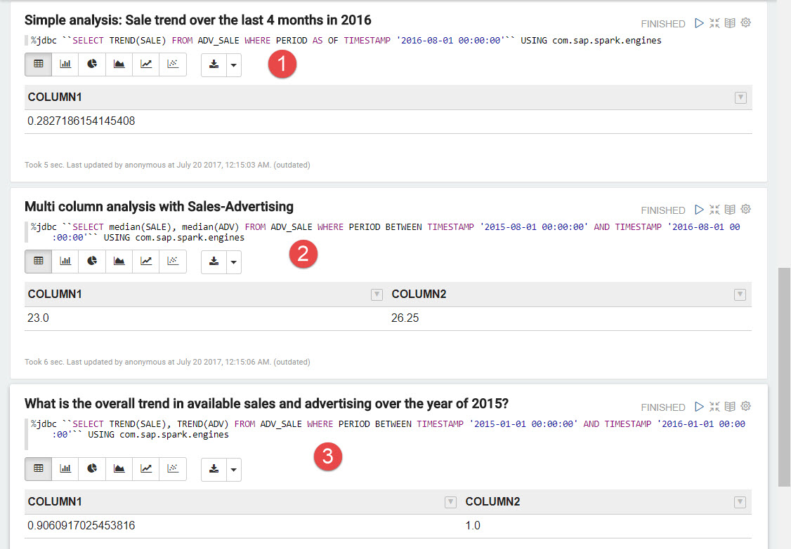

## Prerequisites  
 - [Working with Hierarchies using Apache Zeppelin](http://www.sap.com/developer/tutorials/vora-ova-zeppelin2.html)

## Next Steps
 - [Working with Document Store Engine in SAP HANA Vora](http://www.sap.com/developer/tutorials/vora-ova-zeppelin7.html)

## Details
### You will learn  
You will learn how to process time series data using SAP Vora 1.4 engine.

### Time to Complete
**15 Min**

---

[ACCORDION-BEGIN [Step 1: ](Time Series processing)]
The time series engine in SAP Vora 1.4 enhances the in-memory engine by enabling time series data to be efficiently analyzed in distributed environments. It supports highly compressed time series storage and time series analysis algorithms that work directly on top of the compressed data.

[DONE]
[ACCORDION-END]

[ACCORDION-BEGIN [Step 2: ](Running notebook 5_Time_Series)]
Select the `5_Time_Series` notebook.

Start off by creating the required partition function and scheme, then follow by creating a table and loading time-series data.

Continue with the paragraphs as below, doing simple time-series analysis, calculate the advance from a specific point in time.

Next determine the trend of sales over a time period, multi column analysis of Sales-Advertising and overall trend in sales and advertising.

[DONE]
[ACCORDION-END]

## Next Steps
- [Working with Document Store Engine in SAP HANA Vora](http://www.sap.com/developer/tutorials/vora-ova-zeppelin7.html)
