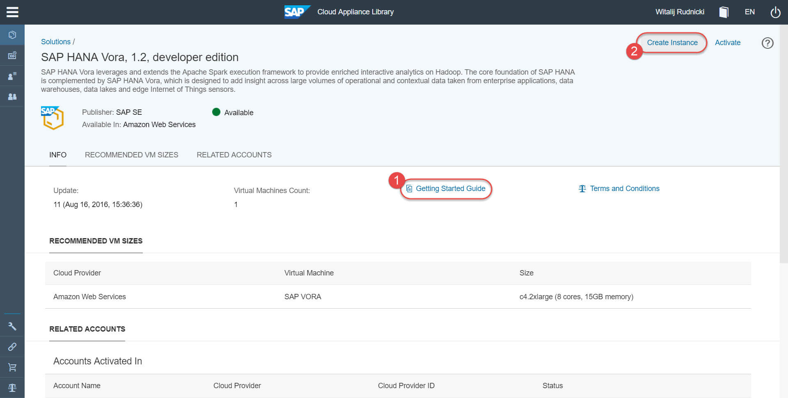
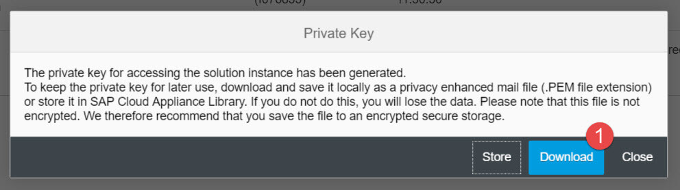

## Prerequisites  
 - **Proficiency:** Beginner
 - You will need to have an account on Amazon Web Services (AWS)
 - You have understanding of cloud infrastructure

## Next Steps
 - [Connect to SAP HANA Vora instance to manage it] (http://go.sap.com/developer/tutorials/vora-connect.html)

## Details
### You will learn  
How to create a SAP HANA Vora instance, developer edition, in your cloud provider, using the SAP Cloud Appliance Library (CAL) system. SAP HANA Vora, developer edition, is covered by the Developer License Agreement, which you will need to accept in order to be able to get access to it.
This tutorial provides step by step instructions to walk you through the initial setup process.

### Time to Complete
**30 Min**.

---

SAP HANA Vora leverages and extends the Apache Spark execution framework to provide enriched interactive analytics on Hadoop. SAP HANA Vora is designed to add insight across large volumes of operational and contextual data taken from enterprise applications, data warehouses, data lakes and edge Internet of Things sensors.

>SAP HANA Vora is a software working in the **distributed environment**, i.e. the one that usually consists of at least several computing nodes. But in case of the **developer edition** the SAP HANA Vora software has been modified to allow you to practice with a single node instance.

1. Currently the instance of SAP HANA Vora developer edition can be created only in [Amazon Web Services](http://aws.amazon.com/account/). Make sure you have an account there.

    >While SAP does not charge you for [developer editions of products](http://go.sap.com/developer/trials-downloads.html), Amazon will charge you for the usage of their infrastructure resources in the cloud, like computing, storage, network etc.

2. The instance creation and management is done via [SAP Cloud Appliance Library](https://cal.sap.com/) - the free service to manage your SAP solutions in the public cloud. Make sure you have an account there before proceeding with this tutorial.

    >Your AWS account is properly configured and connected to your account in CAL.

3. In the CAL cockpit select **Solutions** to list all solutions available for your account. Reduce the list to **Free Solutions** and type `vora` in the search box.

    Open the details of the `SAP HANA Vora, developer edition` solution. CAL's "solution" is the definition, and not yet the physical instance.

    

4. Review information about the `SAP HANA Vora, developer edition` solution, like descriptions, Terms and Conditions, template configuration etc.

    Download and keep locally the **Getting Started Guide**. In this guide you will find important details, including software components and versions pre-installed, network configuration, default users and passwords etc. Make sure you review this document.

    Click **Create Instance**.

    

5. On **Create Instance** screen choose the CAL account, where the instance to be created. In the example below the CAL account is `Default` and it is linked with the AWS account in Amazon Web Services.

    Review the cost forecast related to the instance. This is the cost charged by the cloud provider, which is AWS in this example.

    Define:
    - the instance name (here `myvora12`),
    - the AWS region (here `us-east-1`, which is the only AWS region, where the instance can be created),
    - the master password (make sure you remember it ;-).

    

    Click **Create**.

6. It is important that you click **Download** and store a file with a private key. You will use it to connect to the instance's host using ssh client of your choice, like [PuTTY](http://www.putty.org/).

    

    The instance build will start. It should take about 30 minutes.

    

7. Once your instance of SAP HANA Vora is fully activated you can see it among your CAL's **Instances** with `Active` status.

    

    You can see this instance as well in your AWS account in `N. Virginia` region. That's the same as `us-east-1` used during the instance definition in CAL.

    

8. Review details of the created `myvora12` instance.

    Note the IP address of your host. It is the one used to connect to the instance services using e.g. `http(s)` and `ssh` protocols. The IP address will change every time you suspend (stop) and activate (start) the instance. To avoid that you can select `Public Static IP Address`, but remember that AWS is charging extra for using it.

    By default `Public Static IP Address` is not selected. This and other settings can be modified by clicking on the `Edit` in CAL cockpit. Or could be set already at the stage of the instance creation by choosing `Advanced Mode` instead of the `Basic Mode` you used in CAL.

    

    `Access Points` define what host's ports are open. They influence the configuration of AWS's `Security Group` created for the instance. Changing instance's access points in CAL cockpit will automatically change the configuration of the corresponding security group in AWS.

    

    Important thing is CAL's **Schedule** configuration. Using it will help you to save costs. The initial default schedule is configured during the instance creation in the CAL's Basic Mode. It can be edited.

    Ideally you should remember to manually **Suspend** the instance every time you take a break in using the instance. This will stop the instance in AWS, so the cloud provider will not charge you for using resources when you do not work with SAP HANA Vora.

### Optional
 - Review the [SAP HANA Vora documentation](http://help.sap.com/hana_vora_re)
 - Review the [SAP Cloud Appliance Library (CAL) documentation](https://calstatic.hana.ondemand.com/res/~1472020269624~/docEN/index.html)

## Next Steps
 - [Connect to SAP HANA Vora instance to manage it] (http://go.sap.com/developer/tutorials/vora-connect.html)
