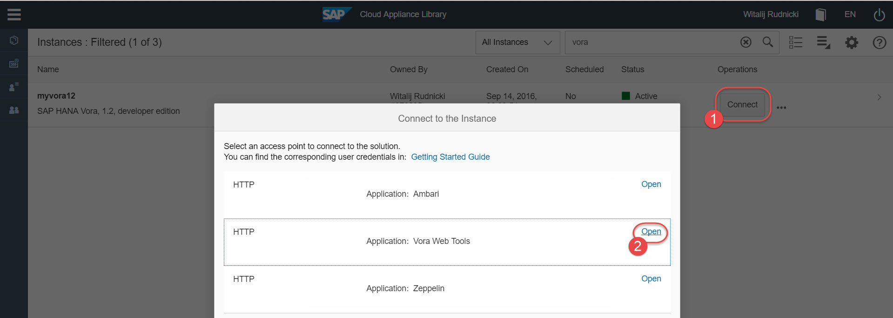
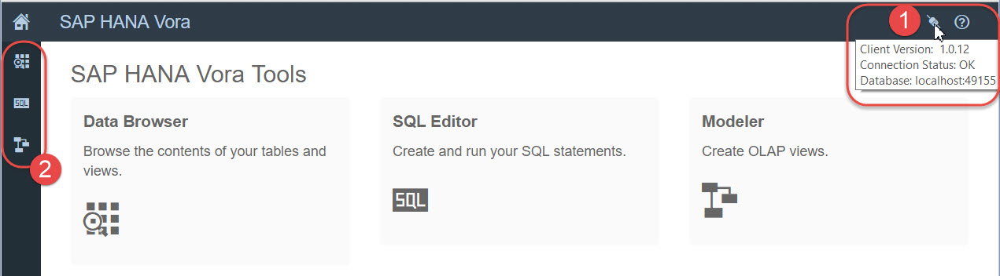
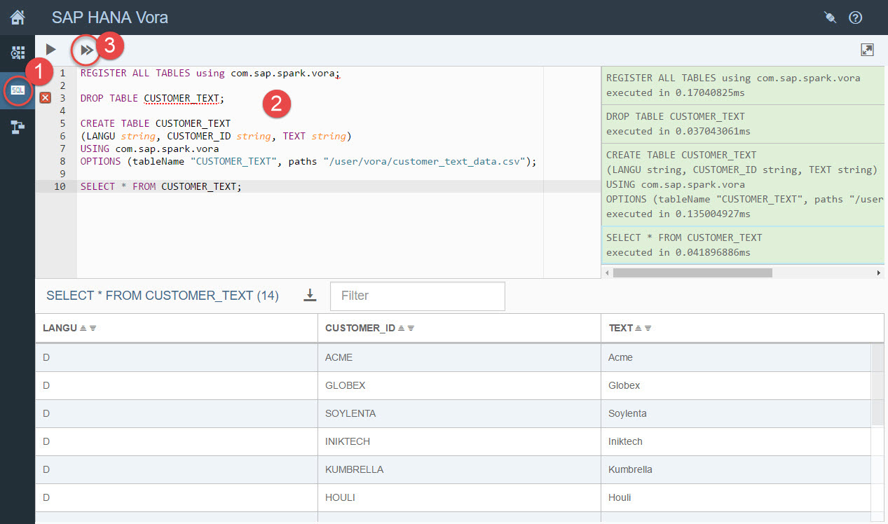
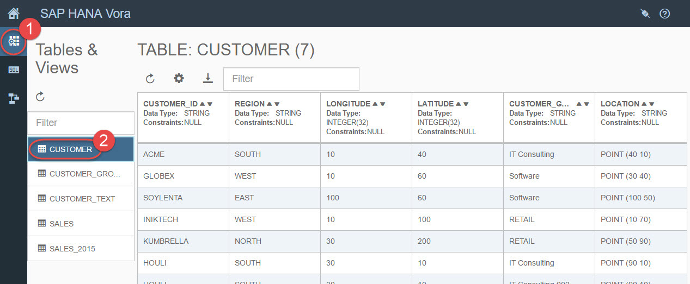

## Prerequisites  
 - **Proficiency:** Beginner
 - **Tutorials:** [Loading sample data using Apache Zeppelin](http://www.sap.com/developer/tutorials/vora-zeppelin-load-sample-data.html)
 - Understanding basics of Apache Spark

## Next Steps
 - [Getting started with SAP Vora Modeler: Creating SQL views](http://www.sap.com/developer/tutorials/vora-modeler-getting-started.html)

## Details
### You will learn  
You will learn how to start SAP Vora Tools and using two of them: SQL Editor and Data Browser.

### Time to Complete
**10 Min**.

---

1. The **SAP Vora Tools** provide a web UI for viewing and exporting data in tables and views, an SQL editor for creating and running SQL scripts, and a modeler for creating data models.

2. SAP Vora, developer edition, on CAL comes with SAP Vora Tools pre-installed. To open the Tools web UI click on **Connect** in your SAP Vora instance in CAL, and then **Open** a link for `Application: Vora Web Tools`.

    >The port of Vora Tools web UI has been preconfigured for you in the SAP Vora, developer edition, in CAL. As well its port has been opened as one of the default **Access Points**. As you might remember it translates into the appropriate _inbound rule_ in the corresponding AWS's security group.

    

3. Once Vora Tools opens up in a new browser window, check its **Connection Status** is OK before working with any of its tools.

    Each tool can be opened from the Home screen, or - alternatively - from shortcut icons on the left.

    

4. First you will work with SQL Editor, so open it by clicking either on a tile `SQL Editor` or on a shortcut.

    In order to work with your Vora tables, created using Zeppelin in the previous tutorial, you have to register those tables first:
    ```sql
    REGISTER ALL TABLES using com.sap.spark.vora;
    ```
    > Spark SQL supports operating on a variety of data sources. Registering a table allows you to run SQL queries over its data.

5. Run the following command to make sure you don't have the `CUSTOMER_TEXT` table already created on your Vora engine.
    ```sql
    DROP TABLE CUSTOMER_TEXT;
    ```

    Then create the table and check its content.
    ```sql
    CREATE TABLE CUSTOMER_TEXT
    (LANGU string, CUSTOMER_ID string, TEXT string)
    USING com.sap.spark.vora
    OPTIONS (tableName "CUSTOMER_TEXT", paths "/user/vora/customer_text_data.csv");

    SELECT * FROM CUSTOMER_TEXT;
    ```

    

6. Now open **Data Browser** tool. You should see all available tables and clicking on `CUSTOMER` table will open its content. You can explore the data now.

    

## Next Steps
 - [Getting started with SAP Vora Modeler: Creating SQL views](http://www.sap.com/developer/tutorials/vora-modeler-getting-started.html)
