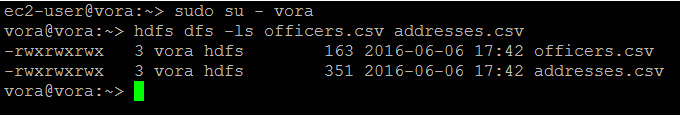
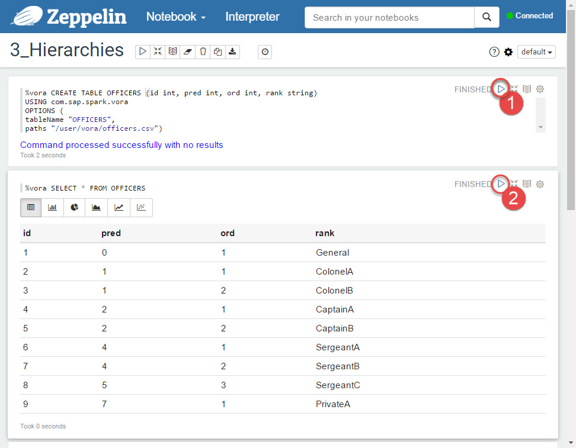
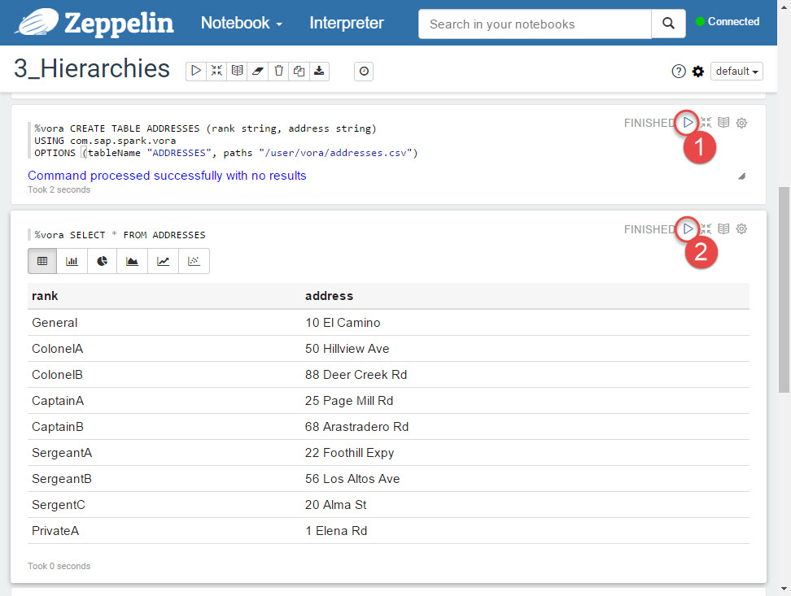
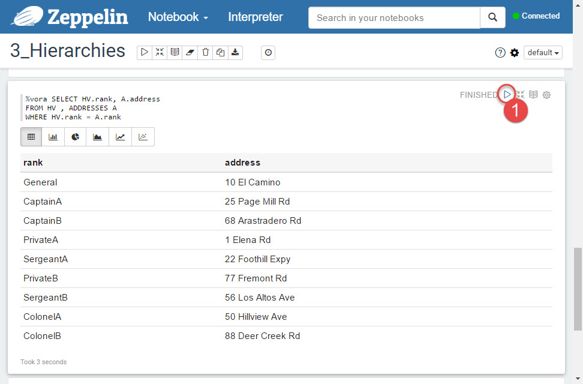

## Prerequisites  
 - **Proficiency:** Beginner
 - **Tutorials:** [Loading sample data from different file formats](https://www.sap.com/developer/tutorials/vora-zeppelin-load-file-formats.html)

## Next Steps
 - Select a tutorial from the [Tutorial Navigator](https://www.sap.com/developer/tutorial-navigator.html) or the [Tutorial Catalog](https://www.sap.com/developer/tutorials.html)

## Details
### You will learn  
You will learn how to load tables with parent-child relationship between data items, and then create and query hierarchies.

### Time to Complete
**5 Min**.

---

1. SAP Vora introduces support for hierarchies by enhancing Spark SQL to provide missing functionality. Extensions to Spark SQL support hierarchical queries that make it possible to define a hierarchical DataFrame and perform custom hierarchical UDFs on it.

    For this tutorial the SAP Vora, developer edition, has already sample files preloaded into HDFS. You can see them by executing following statements in the host's operating system as user `vora`.

    ```shell
    hdfs dfs -ls officers.csv addresses.csv
    ```

    

2. Similarly to loading sample CSV files you will use Zeppelin with predefined notebook here as well.

    Once Zeppelin opens up in a new browser window, check it is **Connected** and if yes, then click on `3_Hierarchies` notebook.

3. Firstly load a table `OFFICERS` with parent-child relationship between data items.

    

    You can execute them as well from SQL Editor.

    ```sql
    CREATE TABLE OFFICERS (id int, pred int, ord int, rank string)
    USING com.sap.spark.vora
    OPTIONS (
    tableName "OFFICERS", paths "/user/vora/officers.csv");

    SELECT * FROM OFFICERS
    ```

    Secondly load a master data table `ADDRESSES` that you will use later to join with the hierarchy.

    

    You can do it as well from SQL Editor.

    ```sql
    CREATE TABLE ADDRESSES (rank string, address string)
    USING com.sap.spark.vora
    OPTIONS (tableName "ADDRESSES", paths "/user/vora/addresses.csv");

    SELECT * FROM ADDRESSES    
    ```

4. Create a hierarchy view using an SQL statement. To create a hierarchy `HV`, you use a table `OFFICERS` that specifies the relations between the predecessors and successors of the hierarchy.

    

    You can do it as well from SQL Editor.

    ```sql
    CREATE VIEW HV AS SELECT * FROM HIERARCHY (
    USING OFFICERS AS child
    JOIN PARENT par ON child.pred = par.id
    SEARCH BY ord ASC
    START WHERE pred=0
    SET node) AS H;

    SELECT * FROM HV
    ```

5. Join the `ADDRESSES` tables and `HV` hierarchy view.

    

6. SAP Vora provides user-defined functions (UDFs) to be used with hierarchies.

    Run the query that returns the rank of the descendants of the root. It uses `is_parent(u,v)` and `is_root(u)` hierarchy functions.

    

7. Return the address and the rank for the officers from level 2.

    

## Next Steps
 - Select a tutorial from the [Tutorial Navigator](https://www.sap.com/developer/tutorial-navigator.html) or the [Tutorial Catalog](https://www.sap.com/developer/tutorials.html)
