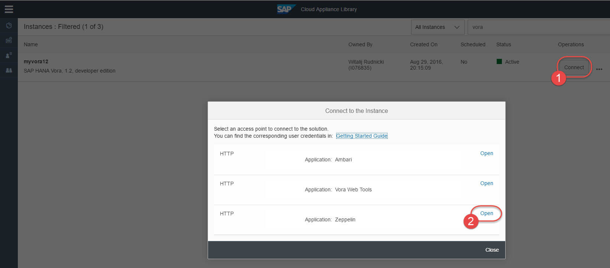
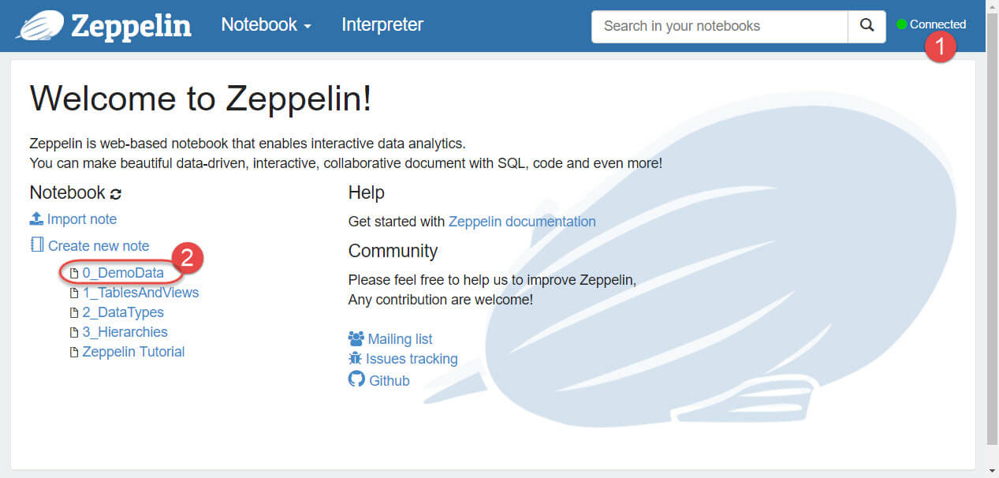

## Prerequisites  
 - **Proficiency:** Beginner
 - **Tutorials:** [Connect to SAP HANA Vora, developer edition](http://www.sap.com/developer/tutorials/vora-connect.html)

## Next Steps
 - [Getting started with SAP HANA Vora Tools](http://www.sap.com/developer/tutorials/vora-tools-getting-started.html)

## Details
### You will learn  
You will learn how to open Apache Zeppelin and how to load sample data.

### Time to Complete
**10 Min**.

---

1. Apache Zeppelin is a web-based notebook that enables interactive data analytics. It is Apache Licensed open-source software.

    You can make beautiful data-driven, interactive and collaborative documents using variety of languages. Its interpreter concept allows any language/data-processing-backend to be plugged into Zeppelin.

    SAP HANA Vora provides its own `%vora` interpreter, which allows Spark/Vora features to be used from Zeppelin. Zeppelin allows queries to be written directly in Spark SQL (that is, without the need for any Scala, Python, or R glue code).

2. SAP HANA Vora, developer edition, on CAL comes with Apache Zeppelin pre-installed. Similar to opening Apache Ambari to open Zeppelin web UI click on **Connect** in your SAP HANA Vora instance in CAL, and then pick **Open** a link for `Application: Zeppelin`.

    >The port of Zeppelin web UI has been preconfigured for you in the SAP HANA Vora, developer edition, in CAL. As well its port has been opened as one of the default **Access Points**. As you might remember it translates into the appropriate _inbound rule_ in the corresponding AWS's security group.

    

3. Once Zeppelin opens up in a new browser window, check it is **Connected** and if yes, then click on `0_DemoData` notebook.

    >Status "Disconnected" may be caused by network firewalls, i.e. when you connect to public host on the port not allowed by your corporate network. Try to connect to Zeppelin from public network then.

    

4. The `0_DemoData` notebook will open up. Now you can click on **Run all paragraphs** button on top of the page to create tables in SAP HANA Vora using data from the existing HDFS files preloaded on the instance in CAL. These are the tables you will need as well later in exercises.

    A dialog window will pop up asking you to confirm to **Run all paragraphs?** Click **OK**

    

5. After all statements are finished you should see the interpreter’s comment as "Command processed successfully with no results" for all paragraphs.

        

    The last statement should show you all tables created.

    

## Next Steps
 - [Getting started with SAP HANA Vora Tools](http://www.sap.com/developer/tutorials/vora-tools-getting-started.html)
