## Prerequisites  
 - **Proficiency:** Beginner
 - **How-Tos:** Enable the SAP Web IDE Full-Stack Service
 - **Tutorials:** [Add API Business Hub API to a UI5 Application](https://www.sap.com/developer/tutorials/hcp-abh-api-ui5-app.html)

## Next Steps
 - Select a tutorial group from the [Tutorial Navigator](https://www.sap.com/developer/tutorial-navigator.html) or the [Tutorial Catalog](https://www.sap.com/developer/tutorial-navigator.tutorials.html)

## Details
### You will learn  
In this tutorial, you will explore some of the new features that are part of SAP Web IDE Full-Stack. Learn how to use the SAP API Business Hub services catalog that is available out of the box in this version of SAP Web IDE. Create and run an SAPUI5/Fiori Application. 

### Time to Complete
**15 Min**

---

[ACCORDION-BEGIN [Step 1: ](Open SAP Web IDE Full-Stack)]
Make sure you have SAP Web IDE Full-Stack open.

Steps on how to find and enable SAP Web IDE Full-Stack are available under the how-to guides.

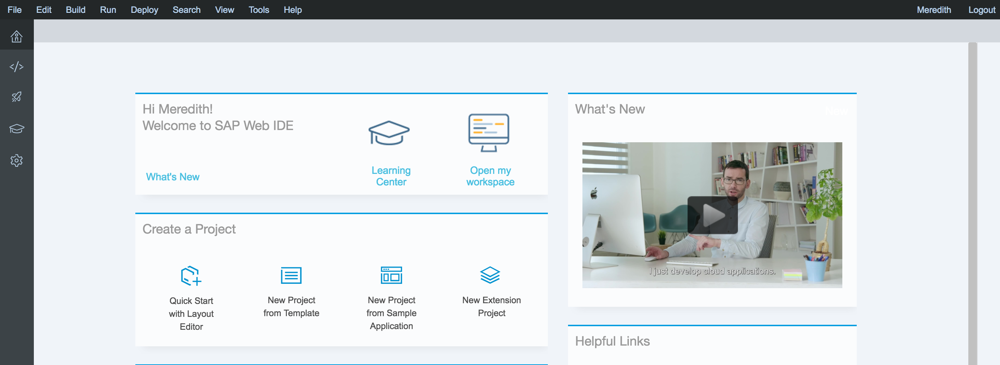

[ACCORDION-END]

[ACCORDION-BEGIN [Step 2: ](Create a new project)]
In the SAP Web IDE, select **New Project from Template** by either selecting the icon on the home screen or by going to `File > New > Project from Template`.

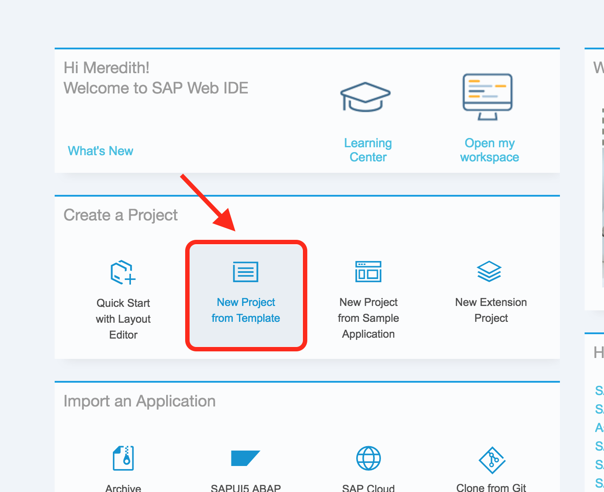

On the Template Selection page, choose the **SAP Fiori Worklist Application** Template.

Click **Next**.

[ACCORDION-END]

[ACCORDION-BEGIN [Step 3: ](Name the project)]
On the **Basic Information** page of the template wizard, provide a name for the project in the **Project Name** field.

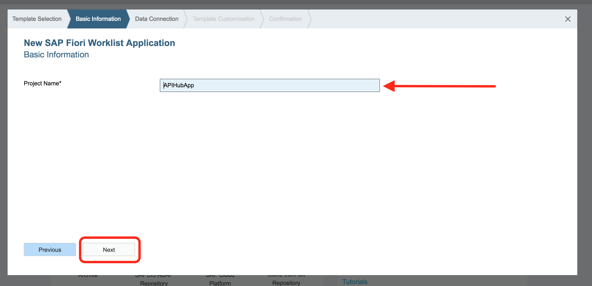

Click **Next**.

[ACCORDION-END]

[ACCORDION-BEGIN [Step 4: ](Select the data connection)]
On the **Data Connection** page of the template wizard, select **SAP API Business Hub** from under the _Sources_ options.

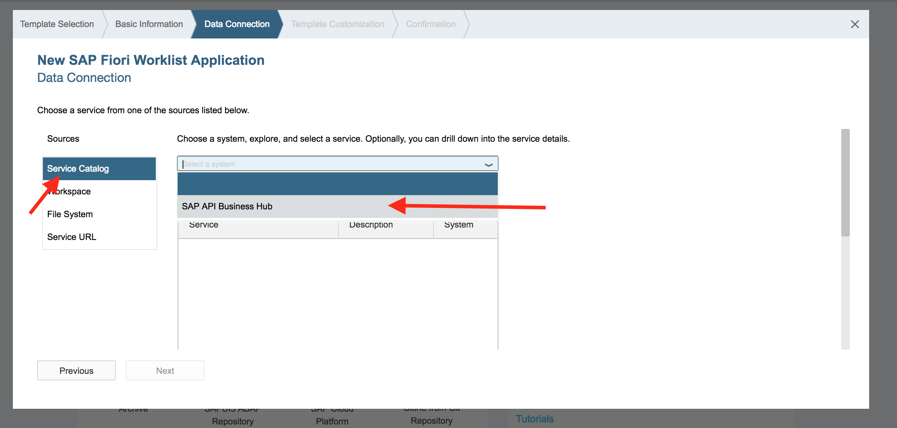

A list of APIs will populate in the table. You can filter down the APIs by either selecting an API Package from the drop-down or by entering a search term in the search box. **In the search box, type _employee_** to find the services available for employee information. Select the **Employee Entity Type** service from the list.

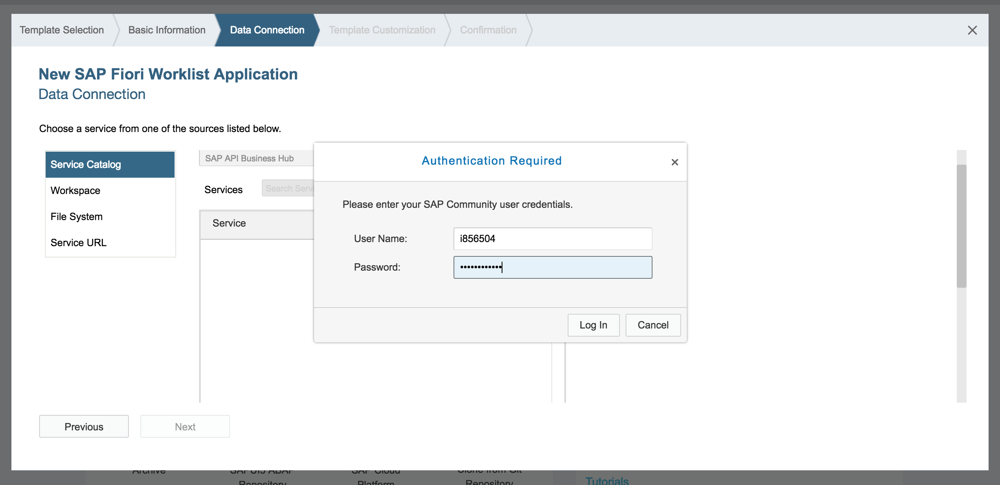

You may be prompted for a username and password. This is in order for SAP API Business Hub to generate an API key for you. Enter your credentials for the SAP Cloud Platform, which should be the same credentials you use to log in to the SAP API Business Hub. **Enter your credentials and click Login**.

Once you are successfully logged in, you should see a blue message on the top of the screen saying that _Service: Employee Entity Type selected_. Once the proper data service is selected, click **Next**.

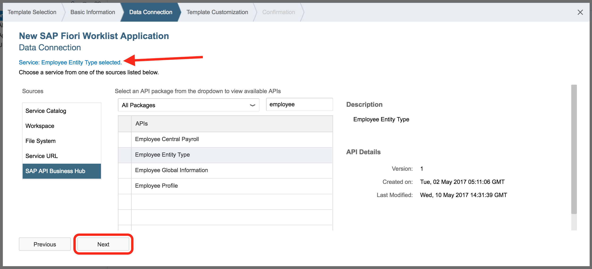

[ACCORDION-END]

[ACCORDION-BEGIN [Step 5: ](Customize the template)]
On the **Template Customization** page of the template wizard, you will define the properties of the application as well as bind some of the data.

In the **Application Settings** section, provide the following information for the application.

Field Name | Value
--- | ---
Type | Standalone App
Title | Employee Information
Namespace | `api.employee.app`
Description | _(optional)_

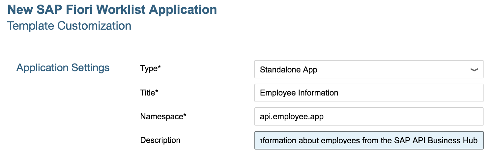

In the **Data Binding** section, you will define what collection and attributes to bind to the view.

Provide the following values for the specified fields in this section.

Field Name | Value
--- | ---
Object Collection | `EmployeeCollection`
Object Collection ID | `ObjectID`
Object Title | `Name`
Object Numeric Attribute | _(blank)_
Object Unit of Measure | `Email`

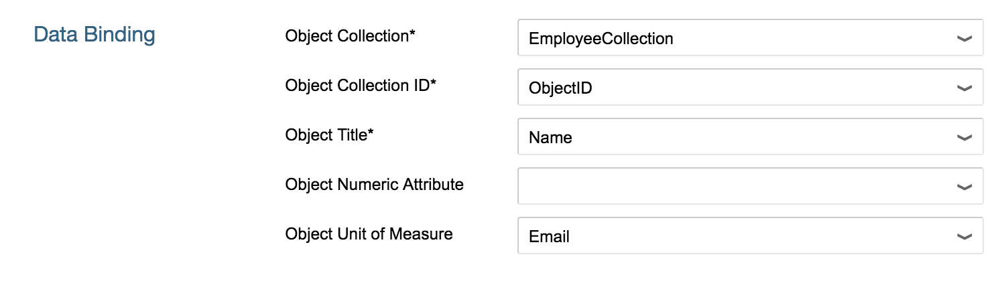

Once the data binding and application settings are complete, click **Next**.

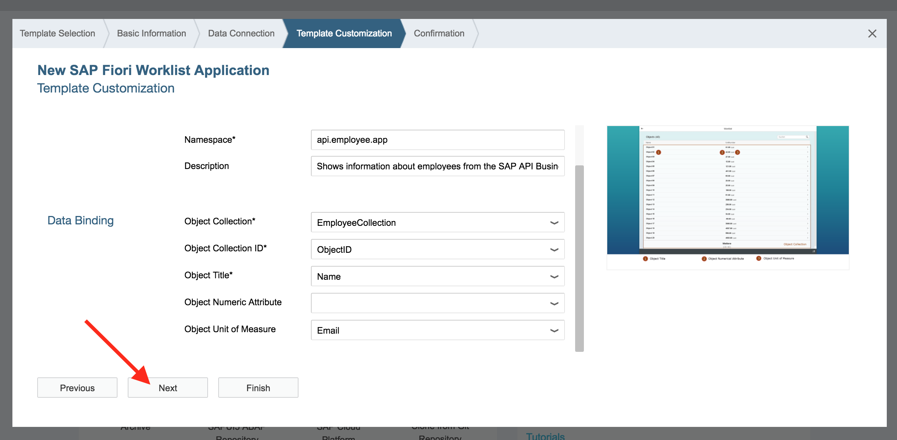

[ACCORDION-END]

[ACCORDION-BEGIN [Step 6: ](Finish the app)]
On the **Confirmation** page of the template wizard, click **Finish**  to create your application.

[ACCORDION-END]

[ACCORDION-BEGIN [Step 7: ](Run the application)]
Once the application is finished being created, you will see a new project in your workspace.

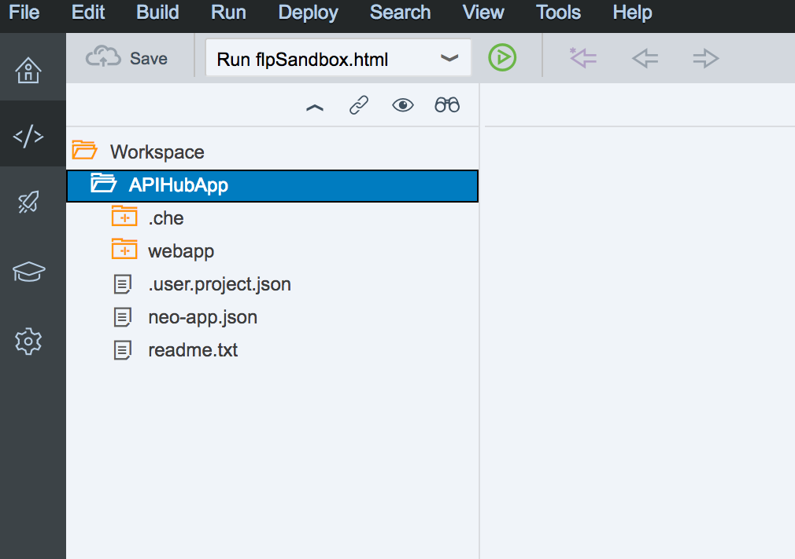

**Right Click** on the application. Select `Run > Run as > Web Application` to bring up the run configuration menu.

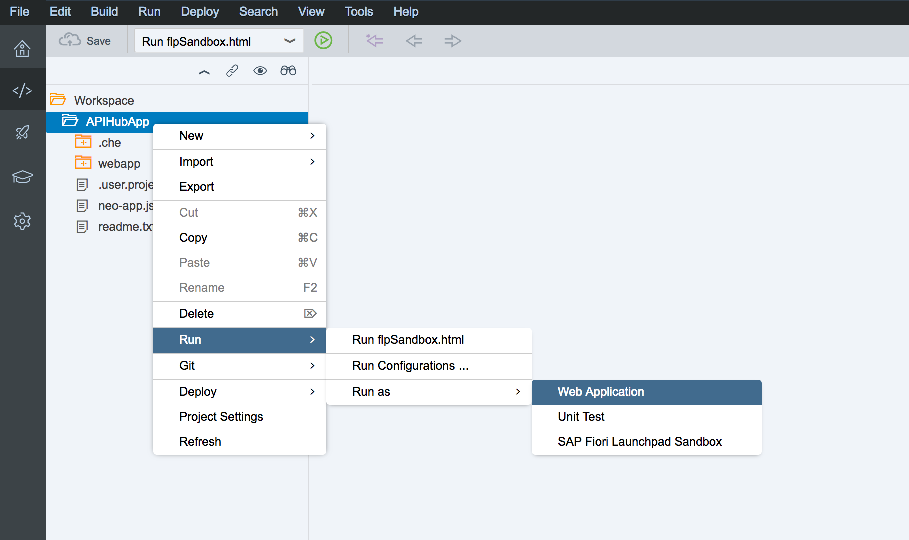

When prompted to **Choose the File to Run**, select the `index.html` file from the File Name list.

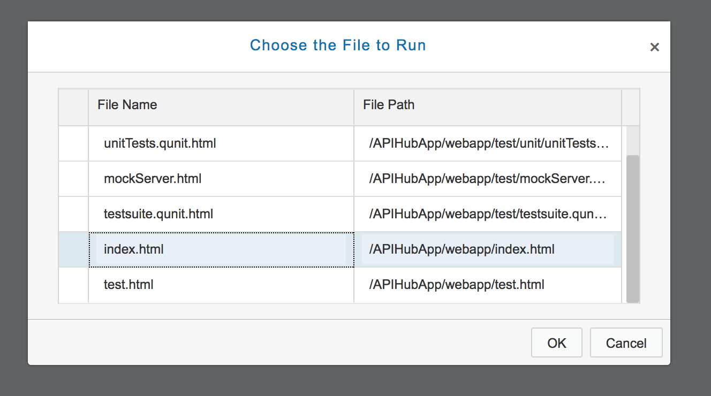

Click **OK**.

When your application loads, you will see a list of employee names and emails pulled from the SAP API Business Hub.

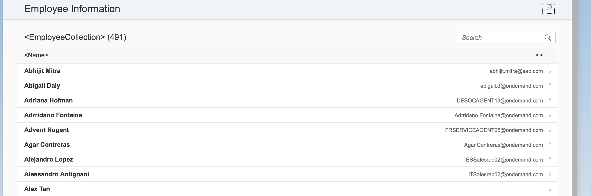

[ACCORDION-END]

## Next Steps
- Select a tutorial from the [Tutorial Navigator](https://www.sap.com/developer/tutorial-navigator.html) or the [Tutorial Catalog](https://www.sap.com/developer/tutorial-navigator.tutorials.html)
