## Prerequisites  
 - SAP Web IDE Full-Stack is enabled

## Details
### You will learn  
  - How to change your settings
  - How to enable new extensions
  - How to create a new workspace

 In this tutorial, you'll set your theme preferences, connect to your trial Cloud Foundry endpoint on SAP Cloud Platform, and enable some extensions.

---

[ACCORDION-BEGIN [Step 1: ](Get to know SAP Web IDE)]
When you open your SAP Web IDE Full-Stack, you will land on your home page.

Your SAP Web IDE Full-Stack Home is a great place to get started with some of the key features from SAP Web IDE. You can easily create new projects, import existing applications, or access learning from this page.

While you are busy coding your applications, you may not spend a lot of time here, but it's good to remember that it is available for you if you want to see what is new or what else SAP Web IDE supports.

[DONE]
[ACCORDION-END]

[ACCORDION-BEGIN [Step 2: ](Code with SAP Web IDE)]
You will probably be spending most of your time in the SAP Web IDE on the 2nd tab in the left menu. This icon (`</>`) will take you to the **Development** pane of SAP Web IDE.

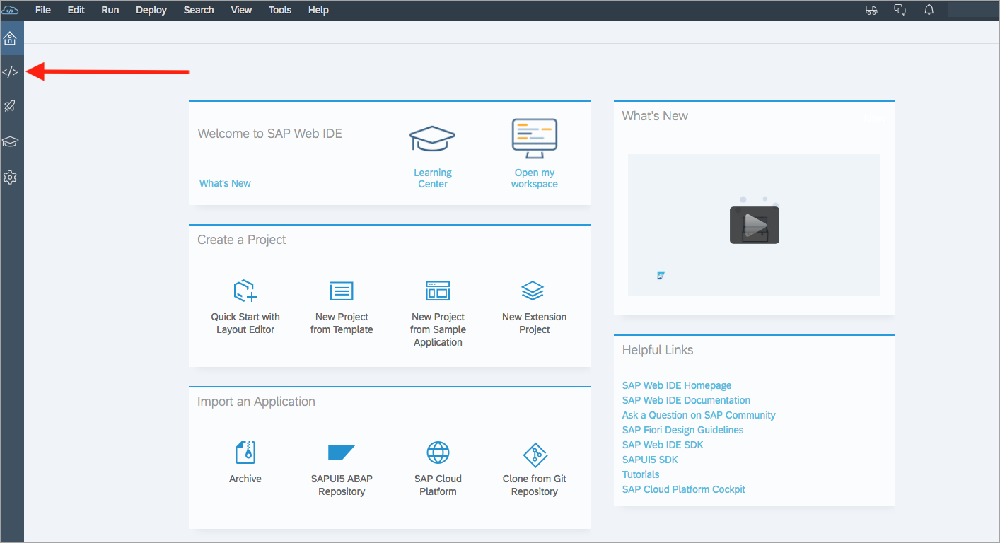

This is where you can find the code base for any and all projects you create or import into SAP Web IDE. If you are ever wondering where your code went, make sure you are on the **Development** tab.

The SAP Web IDE **Development** pane also has a right navigation menu that exposes some additional features and integrations available in the SAP Web IDE. You will find a file explorer, Git integration, unit testing, logging console, and more. More of these features will be explored in future tutorials.

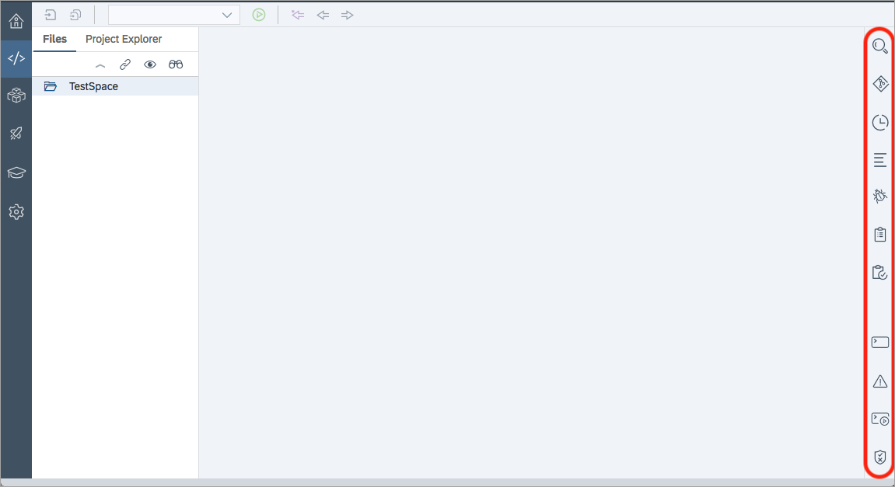

[DONE]
[ACCORDION-END]

[ACCORDION-BEGIN [Step 3: ](Visualize your applications)]
The third tab (rocket ship icon) will take you to the Project Explorer and Storyboard view. This tab is the **Storyboard** tab.

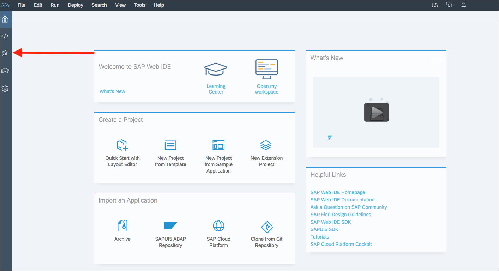

You can use the **Storyboard** tab when you are working on your user interfaces, or UIs. This will give you a visual representation of your application and how the navigation in your application works. If you already have projects in your SAP Web IDE, you will also find the **Layout Editor** here under the Design view.

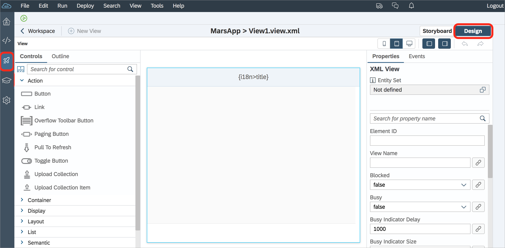

[DONE]
[ACCORDION-END]

[ACCORDION-BEGIN [Step 4: ](Update your settings)]
Any changes you need to make to the configuration of your SAP Web IDE will be done in the 5th tab (gear icon), which takes you to your **Preferences** pane.

If you want to enable new extensions, change themes, or update other settings, the **Preferences** pane will host most of these configuration options.

Let's start on this tab, so click the gear icon to move to your **Preferences** pane.

[DONE]
[ACCORDION-END]

[ACCORDION-BEGIN [Step 5: ](Change your theme)]
You can make your SAP Web IDE your own by updating the theme used in the code editor. To do so, on the **Preferences** pane, click on **Code Editor** under the **Global Preferences** list.

On the **Code Editor** screen, you will find the **Code Editor Theme** drop-down list. Feel free to update that as well as **Font**, **Font Size**, and other code settings you prefer.

When you have made all the changes you wish, don't forget to click **Save** to save your changes.

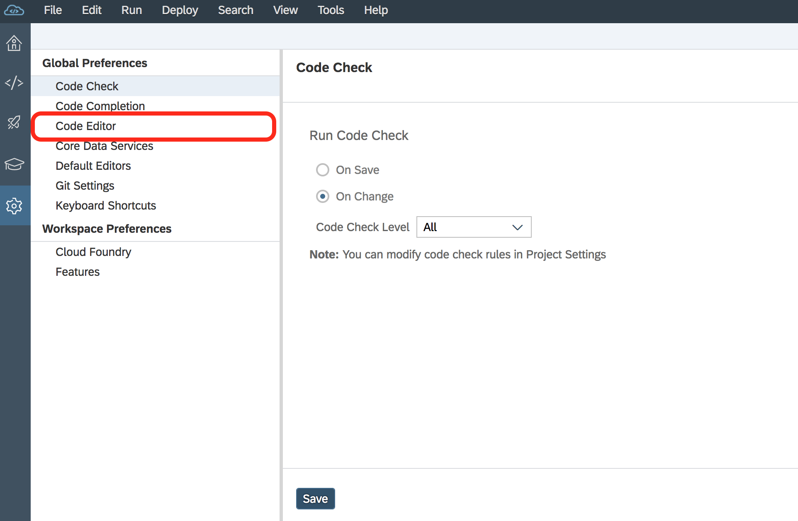

[VALIDATE_5]
[ACCORDION-END]

[ACCORDION-BEGIN [Step 6: ](Enable a Cloud Foundry workspace)]
To utilize the full-stack part of SAP Web IDE Full-Stack, you need to configure a Cloud Foundry space to run your projects. This can also be configured in the **Preferences** pane.

> In the trial version of SAP Web IDE Full-Stack, Cloud Foundry is already configured. If you are using the trial version, you can skip this step.

Click on the **Cloud Foundry** option under **Workspace Preferences**.

Start by selecting the API Endpoint of the Cloud Foundry space you configured in a previous tutorial.

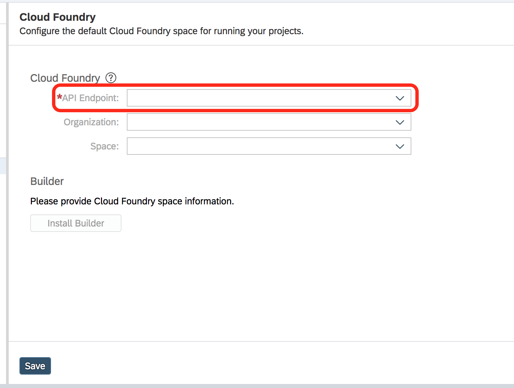

>When you select an endpoint, you may be prompted with a login box. If so, enter your email address and password for your SAP Cloud Platform account. Click **Log On**.
>
>

Once you successfully log in, if you have a space configured, it will automatically populate the **Organization** and **Space** fields. If you wish to use a different space, you can update it now.

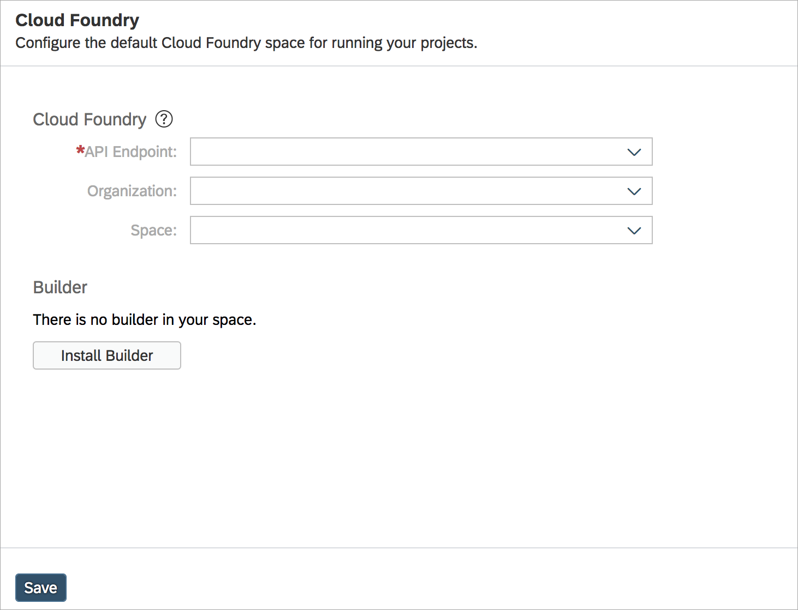

Make sure to save to keep your Cloud Foundry space preferences.

[DONE]
[ACCORDION-END]

[ACCORDION-BEGIN [Step 7: ](Install new extensions)]
The SAP Web IDE you are exploring is the out-of-the-box version. To add extensions to your SAP Web IDE, click **Extensions** under **Workspace Preferences**.

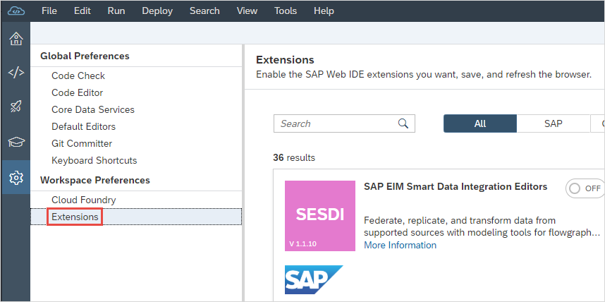

You can always create and add new extensions if you need additional capabilities. Extensions can be custom created in your SAP Web IDE, which is covered in a later tutorial, or prebuilt by SAP or partners.

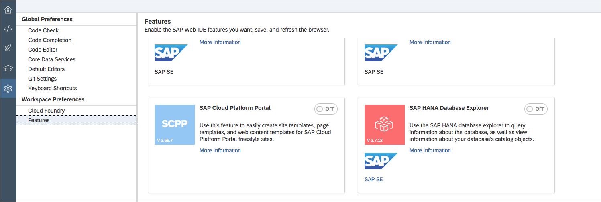

To enable or disable an extension, simply toggle the **On/Off** switch on the tile, and then click **Save**.

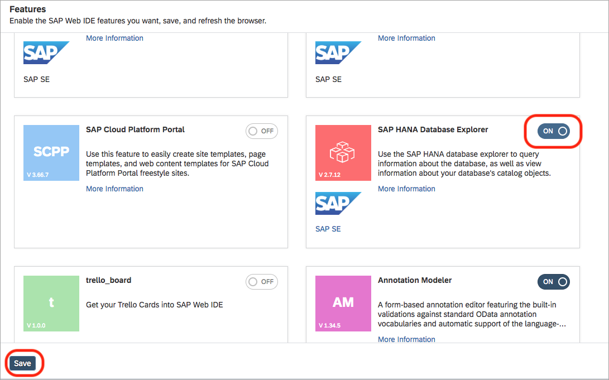

The save triggers a pop-up to refresh SAP Web IDE to propagate the new extensions. Click **Refresh**.

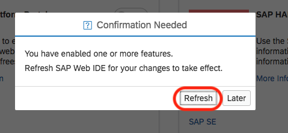

Enabling new extensions may cause new navigation items to pop up on your SAP Web IDE. For example, enabling the SAP HANA Database Explorer creates a new left navigation tab, and adds an additional global preference option.

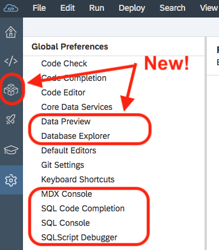

[VALIDATE_7]
[ACCORDION-END]

[ACCORDION-BEGIN [Step 8: ](Create a new workspace)]
If you need to compartmentalize your code and extension set, SAP Web IDE enables you to create new workspaces with different extensions installed. Keep your environments clean and organized!

To create a new workspace, choose **Tools** > **Workspace Manager** or click **`<Name>@Workspace`** in the upper-right corner.

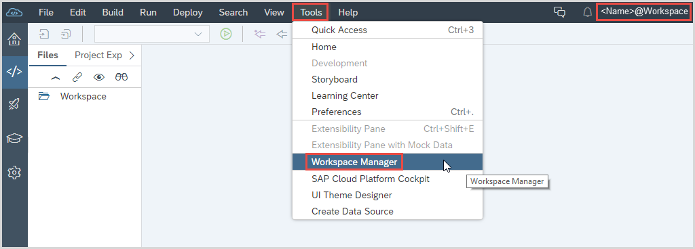

In the **Workspace Manager**, you can see a list of all your current workspaces as well as how many projects each has and what extensions are enabled. You can also delete old workspaces here.

To create a new workspace, click **Create Workspace**.

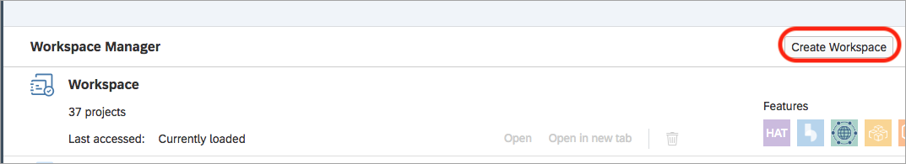

Give the space a name and click **Create**.

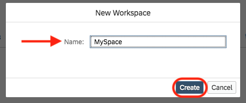

You now have a new workspace. To go to that workspace, click **Open** or **Open in new tab**. This will be a clean space for you to work on projects.

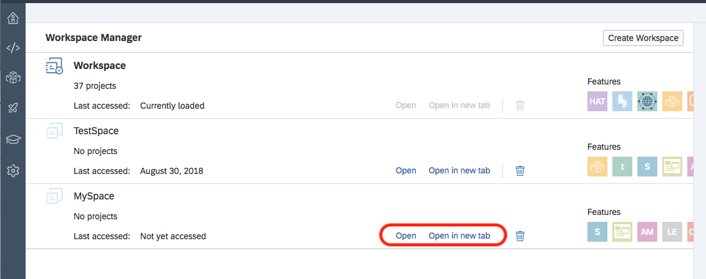

[DONE]
[ACCORDION-END]

---
