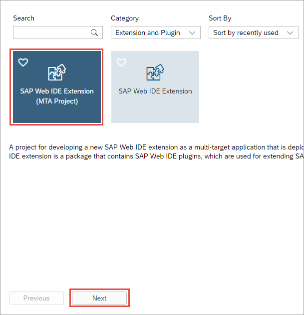
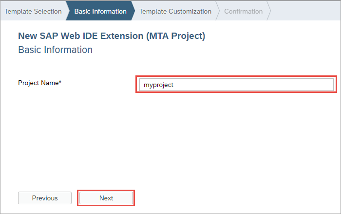
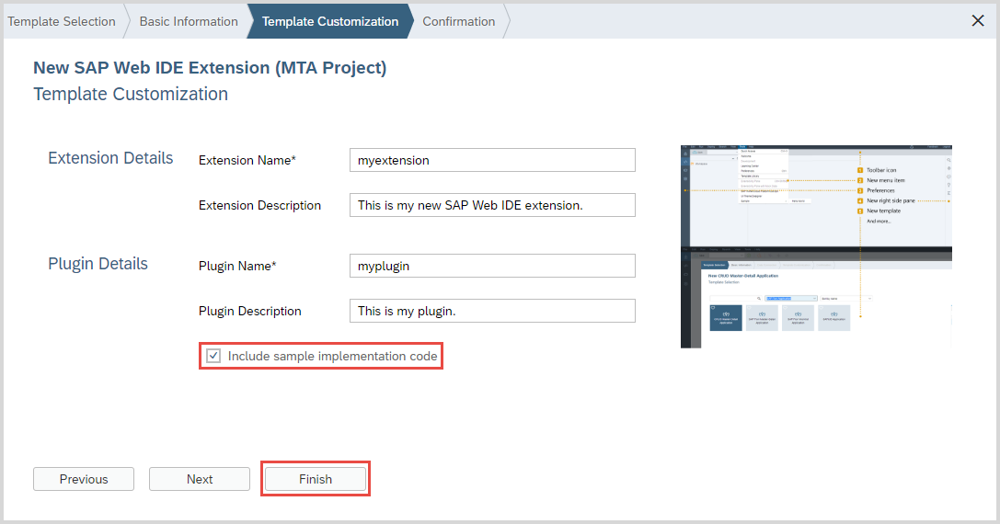
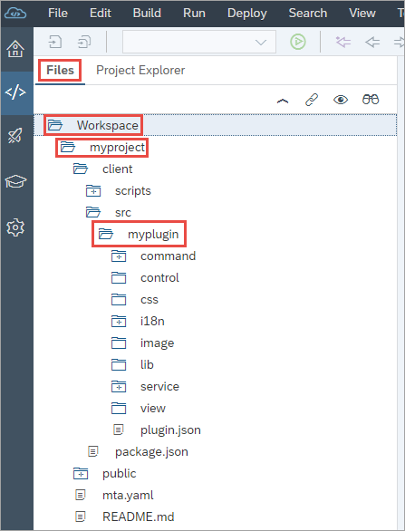
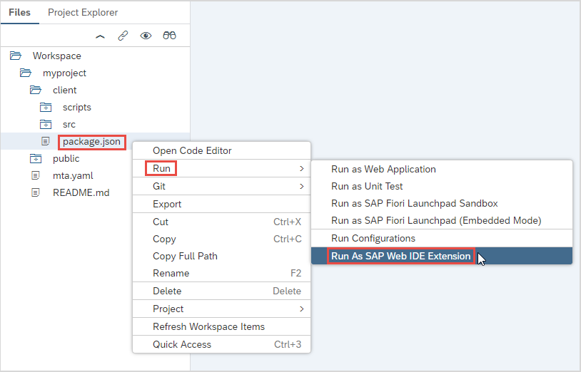
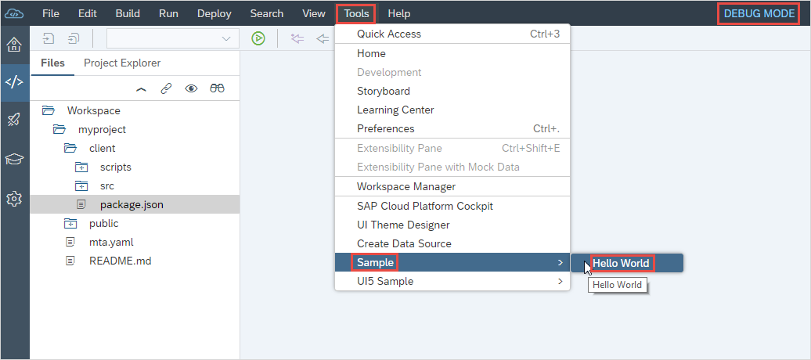

## Prerequisites  
  - If you don't have a Cloud Foundry account on SAP Cloud Platform, use the tutorial: [Sign up for a free trial account on SAP Cloud Platform](hcp-create-trial-account).
 - If you want to follow a tutorial that requires a new SAP Web IDE extension, check if certain project, extension, and plugin names are required.

## Details
### You will learn  
  - How to create a basic SAP Web IDE extension project for adding functionality to SAP Web IDE or for use in a tutorial.

You use an extension to bundle and deliver plugins, since one extension may be composed of several plugins in order to provide a certain functionality. An extension to be deployed to SAP Cloud Platform is an application created with a multi-target application (MTA) project.

You'll start by creating an extension project that contains a single plugin. You'll use the **SAP Web IDE Extension (MTA Project)** template, which generates basic extension and plugin structures in your SAP Web IDE Workspace.

---

[ACCORDION-BEGIN [Step 1: ](Open a new project)]
1. On the Welcome page of SAP Web IDE, click the **New Project from Template** tile.

      

2. On the **Template Selection** wizard screen, in the **Category** dropdown list, select **Extension and Plugin Development**.

    

3. Choose the **SAP Web IDE Extension (MTA Project)** tile and then choose **Next**.

    

[VALIDATE_1]

[ACCORDION-END]

[ACCORDION-BEGIN [Step 2: ](Enter basic information)]

1. In the wizard, on the **Basic Information** screen, enter a relevant project name and then choose **Next**.

    > Check whether a certain project name must be used in the tutorial you are planning on following.

    

2. In the wizard, on the **Template Customization** screen, enter the following:

    - **Extension Name** - Enter a relevant name for your extension.

        > Check whether a certain extension name must be used in the tutorial you are planning on following.

    - **Description** (Optional)
    - **Plugin Name** - Enter a relevant name for your plugin.

        > Check whether a certain plugin name must be used in the tutorial you are planning on following.

    - **Plugin Description** (Optional)

3. Select the **Include sample implementation code** checkbox.

    

4. Choose **Finish**.

A new SAP Web IDE extension project folder now appears in your workspace.

> If you make any changes in the `resources` folder, you need to make sure to archive it. To do that, right-click the `resources` folder, and then choose **Archive**.

[DONE]

[ACCORDION-END]

[ACCORDION-BEGIN [Step 3: ](Test the plugin)]
In the Workspace, right-click the **`plugin.json`** file and choose **Run > Run As SAP Web IDE Extension**. SAP Web IDE opens in a new browser tab called **Debug Mode**.

In the new browser tab, use the plugin by going to the **Tools** menu and selecting **Sample > Hello World**. A dialog opens with a message.

You can now proceed to the tutorial for building and deploying your new SAP Web IDE extension.

[DONE]
[ACCORDION-END]
