## Prerequisites  
 - You have created an SAP Web IDE extension (MTA project) as described in [Create a Basic SAP Web IDE Extension (MTA Project)](webide-extension-basic).


## Details
### You will learn
- How to build and test your SAP Web IDE extension
- How to deploy an MTA extension to Cloud Foundry
- How to create a destination that points to your extension
- How to activate an extension

You use an extension to bundle and deliver plugins, since one extension may be composed of several plugins in order to provide a certain functionality. Each extension contains a `package.json` file with all the extension information and included plugins.

You need to deploy your extension to the Cloud Foundry environment on SAP Cloud Platform in order to display it in the list of all the available external extensions. This operation also automatically activates your new extension on SAP Cloud Platform.

---

[ACCORDION-BEGIN [Step 1: ](Build your extension)]
> This step shows you how to deploy your extension to Cloud Foundry. If you want to deploy your extension to Neo, go to [How to Build and Deploy an MTA Extension to Neo](https://sdk-sapwebide.dispatcher.hana.ondemand.com/index.html#/topic/f3dba320a676410a91eec673531bde2c) in the SAP Web IDE SDK.

1. In the Workspace, right-click your project folder and choose **Project > Project Settings**.

    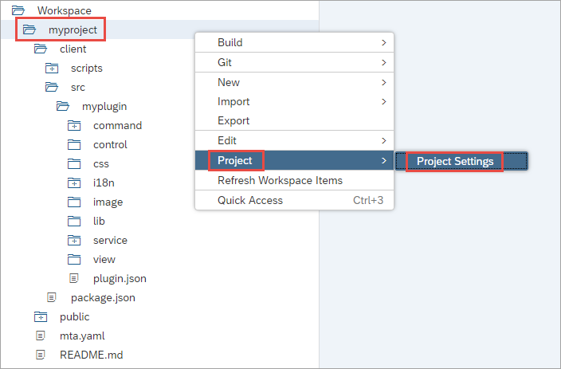

    > If prompted, log in to your account.

2. Click **Cloud Foundry** and select your defined Cloud Foundry configuration or create one with a Cloud Foundry API endpoint, organization, and space in the provided dropdown lists. You need to provide your Cloud Foundry credentials.

    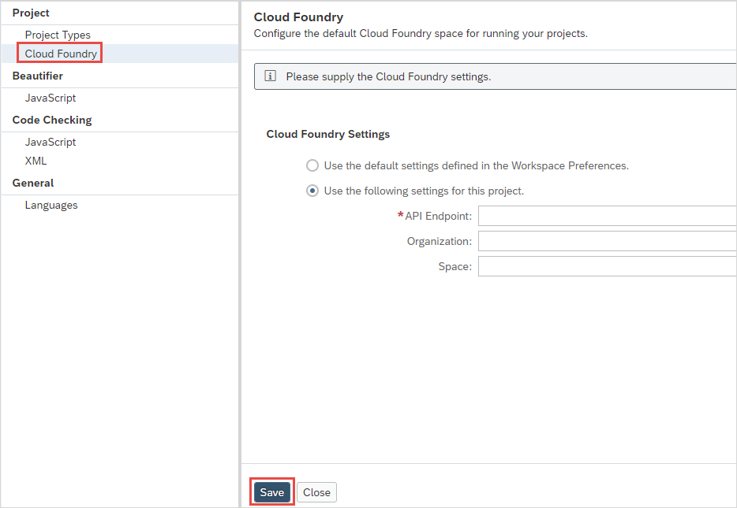

3. Choose **Install Builder** or **Reinstall Builder** if you already have a builder installed. It may take a few minutes for the builder to be installed.

    > Perform these steps for each of your spaces. This needs to be done only once for each space.

4. Choose **Save**, right-click your project folder and then choose **Build > Build**.

    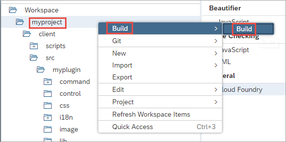

    > It is possible to deliver an SAP Web IDE extension that requires no authentication. In the application descriptor file, you can configure the behavior of your extension just like any other application. You open the `xs-app.json` file and set the `authenticationMethod` property to `none` in three locations, as in the following example:

    ```
    {
         "authenticationMethod": "none",
         "routes": [{
              "source": "^/client/package.json",
              "localDir": ".",
              "authenticationType": "none",
              "cacheControl": "no-cache,must-revalidate"
         }, {
              "source": "^/client/(.*)",
              "localDir": ".",
              "authenticationType": "none",
              "cacheControl": "public,max-age=31536000"
         }]
    }
    ```

    For more information, see [Application Router Configuration Syntax](https://help.sap.com/viewer/65de2977205c403bbc107264b8eccf4b/Cloud/en-US/c103fb414988447ead2023f768096dcc.html).

After a few moments, the `mta_archives` folder is created.

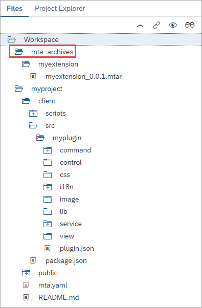

[DONE]
[ACCORDION-END]

[ACCORDION-BEGIN [Step 2: ](Deploy your extension to SAP Cloud Platform)]

1. In the newly created `mta_archives > myextension` folder, right-click the `myextension_0.0.1.mtar` file and choose **Deploy > Deploy to SAP Cloud Platform**.

    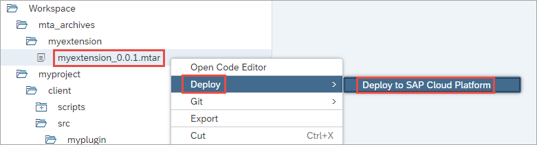

2. In the dialog box, select your Cloud Foundry API endpoint, organization, and space, and choose **Deploy**. You can see the progress of the deployment in the console at the bottom of the screen. In the **Deploy to Cloud Foundry** dialog box, choose **Deploy**.

    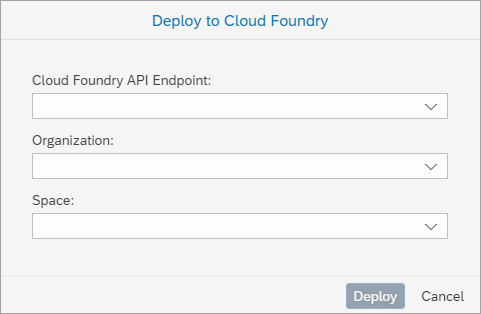

3. In the Tools menu, choose SAP Cloud Platform Cockpit, then go to your space, and in the **Applications** section, you can see that the `myproject` application is started.

    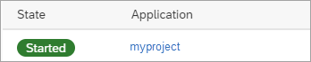

4. Select `myproject` to view the application details, and under **Application Routes**, copy the URL.

    Save this URL for step 3, where you will use it to create a destination.

      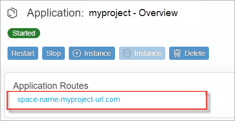

You have successfully deployed your project to the Cloud Foundry environment on SAP Cloud Platform. You can now create a destination for your extension.

[DONE]
[ACCORDION-END]

[ACCORDION-BEGIN [Step 3: ](Create a new destination)]
In order for SAP Web IDE to recognize and consume your new extension, you need to create a new destination in SAP Cloud Platform cockpit. This destination will point to the application URL of your extension application on SAP Cloud Platform.

1. In the SAP Cloud Platform cockpit, choose **Connectivity** > **Destination** > **New Destination**.

    > You can access the SAP Cloud Platform cockpit from the **Tools** menu in SAP Web IDE.

      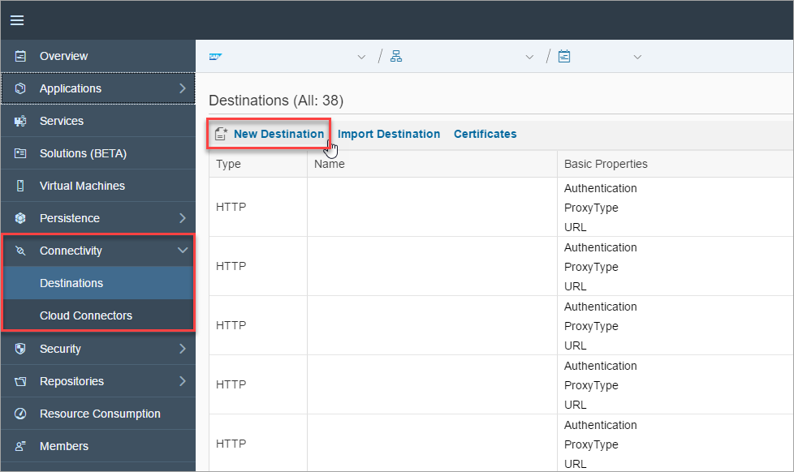

2. Go to the SAP Cloud Platform cockpit.

3. Choose **Connectivity > Destinations > New Destination**.

4. Enter the following parameters for your destination.

    |Parameter          | Value                                     |
    |--------------------|----------------------------------------|
    |`Name`  | `myextension`                              |
    |`Type` | `HTTP`                           |
    |`Description`  | `This is my extension.`                              |
    |`URL` | The application URL for your extension (which we copied to the clipboard in step 2)                            |
    |`Proxy Type`  | `Internet`                              |
    |`Authentication` | `NoAuthentication`                           |

    The parameters for the destination look like this:

    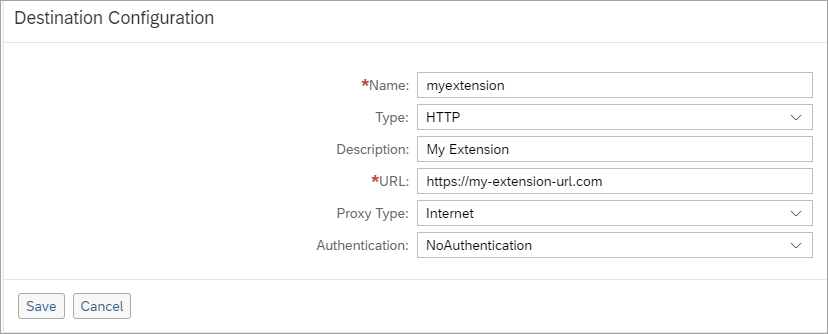

5. Before you save, add the following two SAP Web IDE properties by choosing **New Property** and entering the values shown below.

    |Parameter         | Value                               |
    |------------------|-------------------------------------|
    |`WebIDEEnabled`   | `true`                              |
    |`WebIDEUsage`     | `feature`                           |

    > If the **New Property** button is not enabled, choose **Edit** to enable the **New Property** button, in case you may have inadvertently already saved your work.

    The SAP Web IDE properties for the destination look like this:

    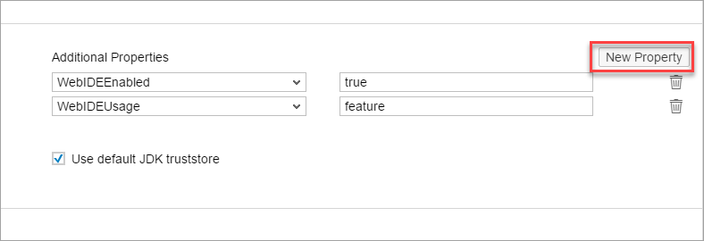

6. Choose **Save**.

    It may take a few minutes for the destination configuration to take effect. Choose **Check Connection** to check if the destination has been finalized.

    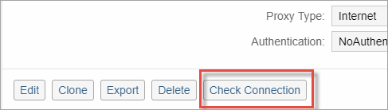

> **CAUTION!** An SAP Web IDE extension extends the functionality of SAP Web IDE and provides new capabilities to your IDE. Such extensions and plugins have full privileges to access your browser, your computer, and any data stored in your SAP Web IDE Workspace or on SAP Cloud Platform, including the ability to read and modify your private and organizational data.
Extensions and plugins that are not provided by SAP are under the responsibility of the extension author and may have different privacy policies, terms of use, or quality levels. You can enable extensions and plugins that are not provided by SAP and use them at your own risk. It is strongly recommended that you enable only extensions and extensions that you trust. At any time and without warning, SAP reserves the right to remove, disable, or uninstall extensions or plugins that are not provided by SAP from your environment.

[DONE]
[ACCORDION-END]

[ACCORDION-BEGIN [Step 4: ](Enable the extension)]
In this step, you enable your new extension on the SAP Web IDE **Features (Extensions)** page.

1. In the left sidebar, choose **Preferences**.

    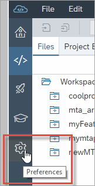

2. Then, under **Workspace Preferences**, choose **Features**.

    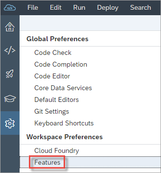

3. On the **Features (Extensions)** page, navigate to the `myextension` tile, click the button to enable it, and then choose **Save**.

    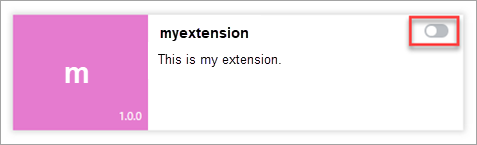

[VALIDATE_4]
[ACCORDION-END]

---
