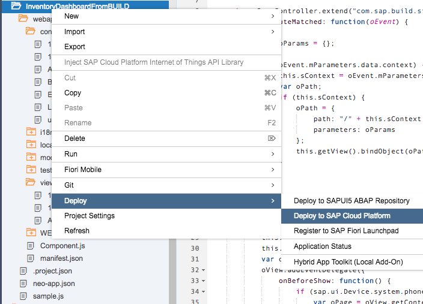
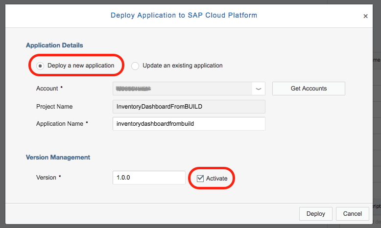
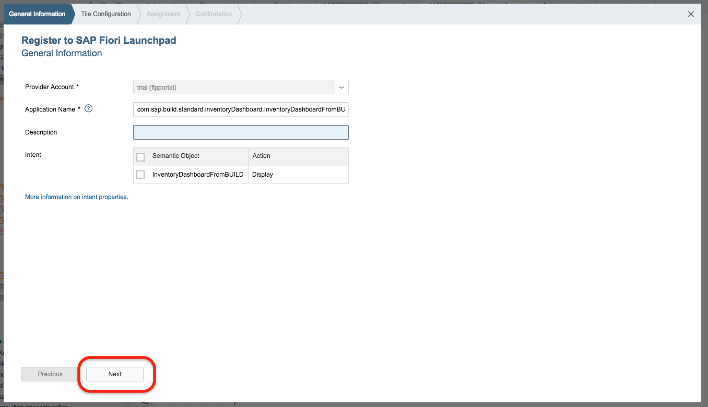
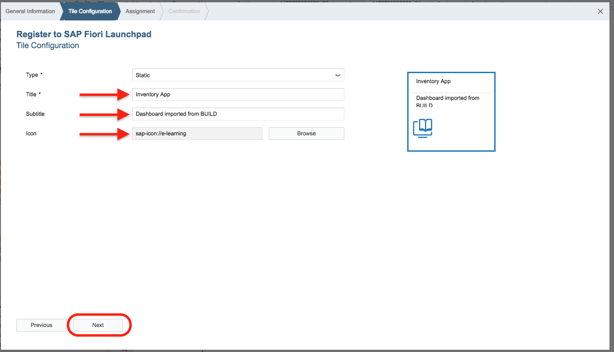
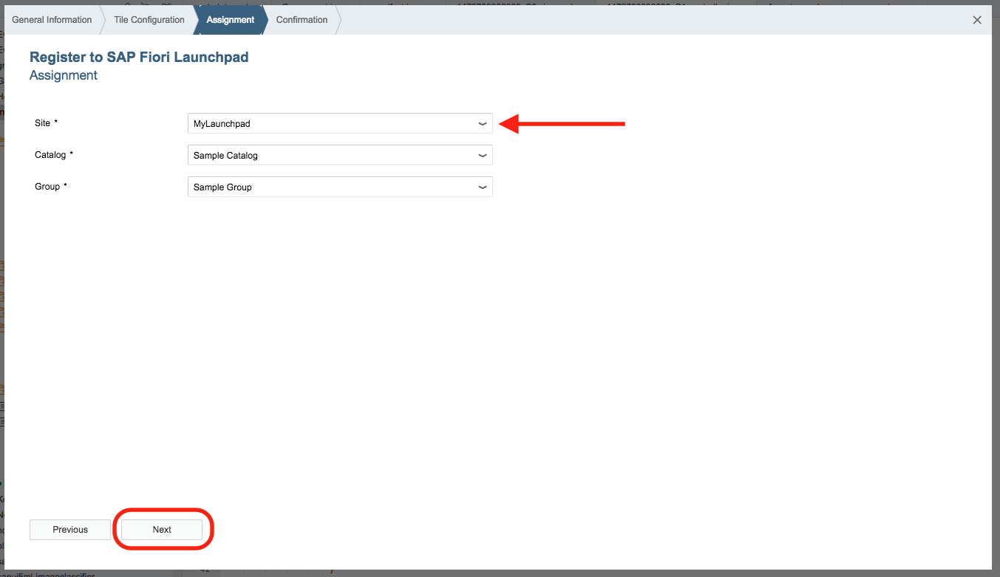
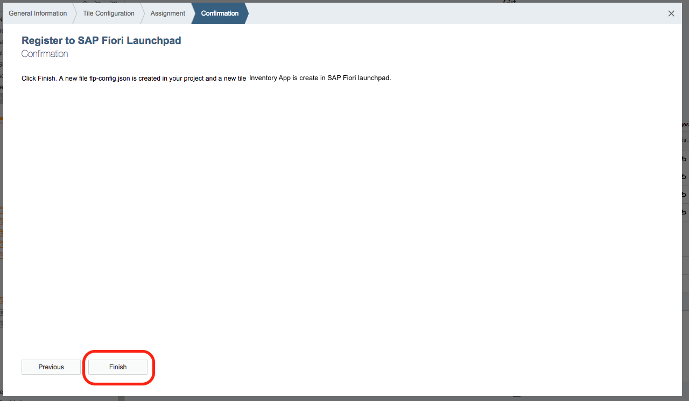
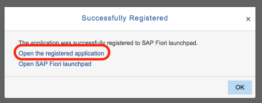

## Prerequisites  
 - **Proficiency:** Beginner

## Details
### You will learn  
Deploy your application to the SAP Cloud Platform so it can be available to be added to the Fiori Launchpad. SAP BUILD applications are designed for the Fiori Launchpad.

### Time to Complete
**15 Min**

---

[ACCORDION-BEGIN [Step 1: ](Deploy app on SAP Cloud Platform)]

Deploying your app is simple.

Right-click on your **`InventoryDashboardFromBUILD`** project folder, and select **Deploy > Deploy to SAP Cloud Platform**.

[DONE]
[ACCORDION-END]

[ACCORDION-BEGIN [Step 2: ](Deployment dialog box)]

In the **Deploy Application to SAP Cloud Platform** dialog box, confirm that **Deploy a new application**, and the **Activate** checkbox are both selected. Click **Deploy**.

[DONE]
[ACCORDION-END]

[ACCORDION-BEGIN [Step 3: ](Open the active version of your app)]

In the **Successfully Deployed** confirmation dialog, click the **Register to SAP Fiori launchpad** to register your app. Applications imported from BUILD are *generally* Fiori apps, meaning they don't use an `index.html` so they can't be run as a standalone web app.

Answer the true or false question below.

[VALIDATE_3]
[ACCORDION-END]

[ACCORDION-BEGIN [Step 4: ](Setup the launchpad app)]

A new wizard will pop-up to create the Fiori Launchpad app.

On the first screen, **General Information**, leave the settings as is and click **Next**.

[DONE]
[ACCORDION-END]

[ACCORDION-BEGIN [Step 5: ](Configure the launchpad tile)]

Provide a title and description for the tile. If you want, change the Icon associated with the tile. There is a live preview of the tile.

Field Name     | Value
:------------- | :-------------
Title           | Inventory App
Subtitle    | Dashboard imported from BUILD
Icon            | `e-learning`

Click **Next**.

[DONE]
[ACCORDION-END]

[ACCORDION-BEGIN [Step 6: ](Assign the tile)]

Select the **`MyLaunchpad`** you created earlier in this tutorial series as the **Site**. Leave the preset **Catalog** and **Group** as is.

Click **Next**.

[DONE]
[ACCORDION-END]

[ACCORDION-BEGIN [Step 7: ](Complete setup)]

Click **Finish** to register your app to Fiori launchpad.

[DONE]
[ACCORDION-END]

[ACCORDION-BEGIN [Step 8: ](View your launchpad app)]

If you successfully set up your app, Fiori Launchpad, and tile, you will see a **Successfully Registered** dialog box.

Click **Open the registered app** to see your live BUILD app and personal Fiori Launchpad!

[DONE]
[ACCORDION-END]

[ACCORDION-BEGIN [Step 9: ](Copy the Fiori Launchpad URL)]

In your running Fiori Launchpad, copy the **Launchpad URL** and paste it into the field below and click **Validate**.

[VALIDATE_9]

[ACCORDION-END]
