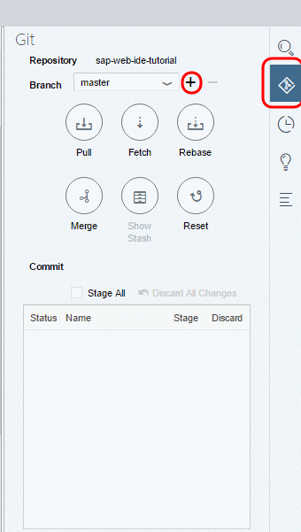
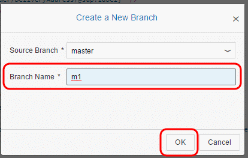
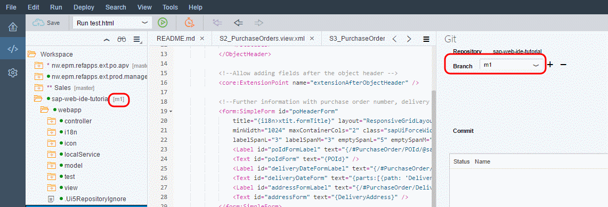
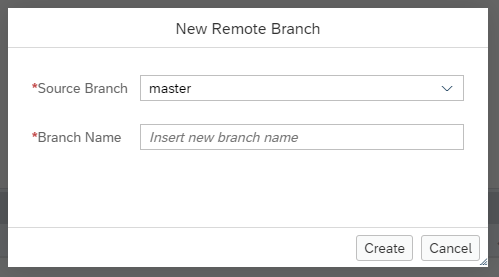
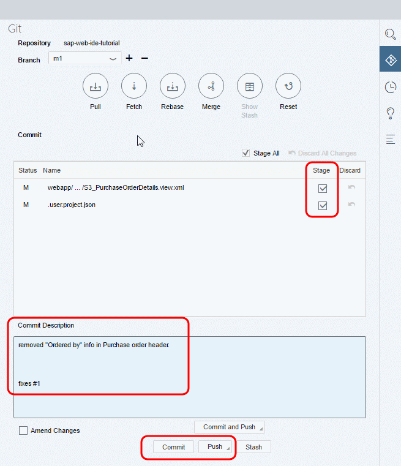
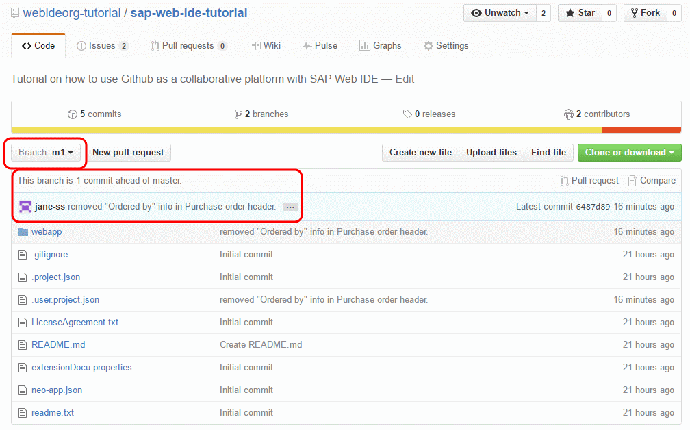

## Prerequisites
- **IMPORTANT**: This tutorial cannot be completed on a trial account

## Details
### You will learn  
  - How your collaborators can create branches in GitHub
  - How to switch to the other branch in SAP Web IDE
  - How to make changes and commit the changes to the other branch

>This tutorial is written from a **collaborator's** point of view.

---

[ACCORDION-BEGIN [Step 1: ](Log into your SAP Cloud Platform cockpit)]

Go to [https://account.hanatrial.ondemand.com](https://account.hanatrial.ondemand.com) and log into your SAP Cloud Platform cockpit.

[DONE]
[ACCORDION-END]

[ACCORDION-BEGIN [Step 2: ](Open SAP Web IDE)]

To open SAP Web IDE, click the **Services** tab in the navigation bar, scroll down and click the **SAP Web IDE** tile to open the SAP Web IDE service page.

Click **Go to Service**.

[DONE]
[ACCORDION-END]

[ACCORDION-BEGIN [Step 4: ](Create a local branch)]

Create a branch to which you will make the changes, as follows.

1. Select your project in the workspace.

2. Open the Git pane on the right-hand side.

3. Click the **+** icon next to the branch label to create a branch.

    

4. Give the branch a suitable name, and then click **OK**.

    

The branch is created and the branch that you are working with is displayed in the Git pane.

>This creates a local branch, in SAP Web ID#E, but does not change the repository on GitHub.

[DONE]
[ACCORDION-END]

[ACCORDION-BEGIN [Step 4: ](Create a remote branch)]

Right-click your project in the workspace, then select **Git > Create Remote Branch**.

Enter a name for the branch, like `m1`, and click **Create**.

[DONE]
[ACCORDION-END]

[ACCORDION-BEGIN [Step 5: ](Commit and push changes)]

Since this branch is dedicated to milestone `m1,` which has 2 issues to be targeted, you will implement the changes for each of these in separate commits.

For `issue#1` you will do changes in `S3_PurchaseOrderDetails.view.xml` to remove the `OrderedByName` entry.

Notice that when you save the changes, the Git pane shows the file that was changed. To commit the changes to the repository, select the **Stage** checkbox, enter a change description, and then click **Commit**.

> GitHub will automatically close an issue if your commit message includes [certain keywords](https://help.github.com/articles/closing-issues-via-commit-messages/) once this change is merged into the master branch. You will see this in the next tutorial.

Click **Commit**  to commit changes to the local repository.

Click **Push** and select **Remote branch**, then select the `m1` branch to push the changes to GitHub.

[DONE]
[ACCORDION-END]

[ACCORDION-BEGIN [Step 6: ](Check branch on GitHub)]

Now if you check the `m1` branch on the GitHub organization repository, you will see that the push has been completed and the changes are seen on GitHub.

[DONE]
[ACCORDION-END]

[ACCORDION-BEGIN [Step 7: ](Commit and push additional changes)]

Similarly you can address other remaining issues targeted for `m1` milestone and commit and push the changes.

[DONE]
[ACCORDION-END]
