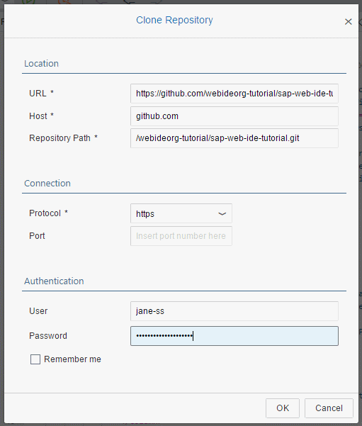

## Prerequisites  
 - **Proficiency:** Intermediate
 - **Tutorials:** 
    - [Creating issues, setting milestones and assigning issues to collaborators](http://go.sap.com/developer/tutorials/webide-github-issues-milestones.html)

## Next Steps
- [Merging branches back into master branch in Github using Pull Requests](http://go.sap.com/developer/tutorials/webide-github-merge-pull-request.html)

## Details
### You will learn  
In this tutorial, you'll learn how your collaborators can create branches in Github, switch to the other branch in SAP Web IDE and perform changes and commit the changes to the other branch. 

> This tutorial is written from a **collaborator's** point of view.

### Time to Complete
**15 Min**.

---

1. Go to [https://account.hanatrial.ondemand.com](https://account.hanatrial.ondemand.com) and log in to your SAP HANA Cloud Platform cockpit.

2. To open SAP Web IDE, click on the **Services** tab in the navigation bar, scroll down and then click the **SAP Web IDE** tile to open the SAP Web IDE service page.

    

3. You'll have to clone the Github organization repository in SAP Web IDE. To do this
 
    a. From the File menu in SAP Web IDE, click on **Git** &rarr; **Clone repository**.
    
    

    b. Enter your Github account credentials and post the repository URL.

    

    c. The repository is now cloned.

4. Create a branch to which you will make the changes. To do this

    a. Click on Git pane on the right hand side and then click on the **+** icon next to the branch label to create a branch.

    

    b. Give a suitable name for the branch and then click on **OK** button to create the branch.

    

    c. The branch will be created and the branch against the Git pane will show what branch you will be working against.

    

5. Since this branch is dedicated to milestone `m1` changes which have 2 issues to be targeted, you will implement the changes for each of these in separate commits. 

    a. For `issue#1` you will do changes in `S3_PurchaseOrderDetails.view.xml` to remove the `OrderedByName` entry.

    b. Notice that when you save the changes, the Git pane on the right hand side shows the file that was changed. To commit the changes to the repository, click on the **Stage** checkbox, enter a change description and then click on commit. 
    
    > Github will automatically close an issue if your commit message includes [certain keywords](https://help.github.com/articles/closing-issues-via-commit-messages/) once this change is merged into the master branch. You will see this in the next tutorial.

    

    c. Click on the **Commit** button to commit changes to the repository and then **Push** and select **Remote branch** to push the changes to Github. 

    
 
6. Now if you check the `m1` branch on Github organization repository, you will see that the push has been completed and the changes are seen on Github.

    

7. Similarly you can address other remaining issues targeted for `m1` milestone and commit and push the changes.

## Next Steps
 - [Merging branches back into master branch in Github using Pull Requests](http://go.sap.com/developer/tutorials/webide-github-merge-pull-request.html)