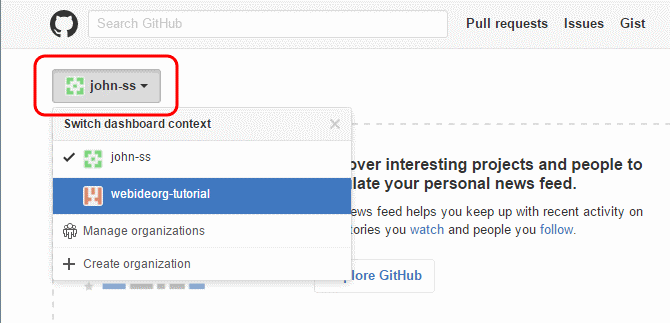
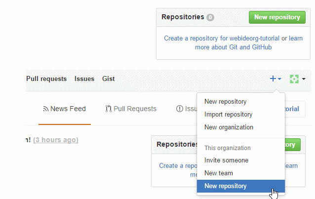
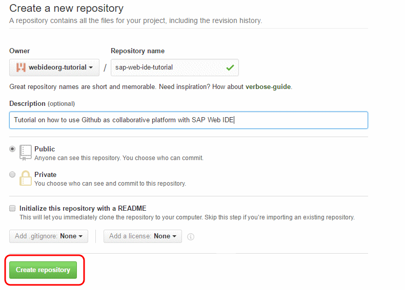
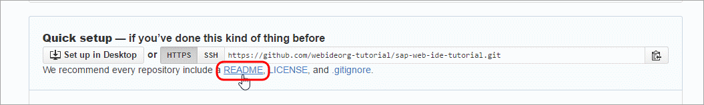
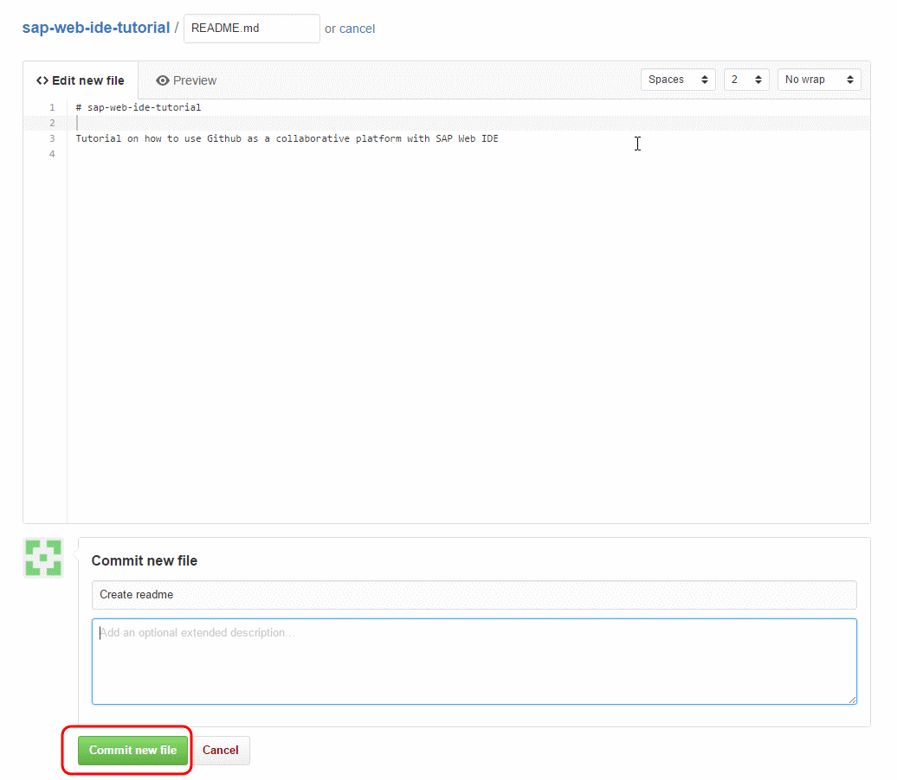

## Details
### You will learn  
  - How to create a Git repository within a GitHub organization

---

[ACCORDION-BEGIN [Step 1: ](Log into GitHub)]

Go to [GitHub](https://github.com) and login with your account credentials.

[DONE]
[ACCORDION-END]

[ACCORDION-BEGIN [Step 2: ](Switch dashboard context)]

Switch to the organization context by clicking on the **Switch dashboard context** drop-down, and click the organization.

[DONE]
[ACCORDION-END]

[ACCORDION-BEGIN [Step 3: ](Create new repository)]

Click **New** next to **Repositories**.

>Alternatively, click the **+** icon on the top-right corner and click on **New Repository**. Remember to change the owner to your organization.

[DONE]
[ACCORDION-END]

[ACCORDION-BEGIN [Step 4: ](Name the repository)]

Enter the repository name and description, and click the **Initialize this repository with a README** checkbox.

You can add a `.gitignore` and license later on.

>If you did not select the option to **Initialize this repository with a README**, create an initial commit by adding a README file. You can keep this README file simple for now and add in details later.

>

>At the commit screen, enter a commit message and click **Commit new file**.

>

> &nbsp;

Your GitHub repository is ready!

[DONE]
[ACCORDION-END]
