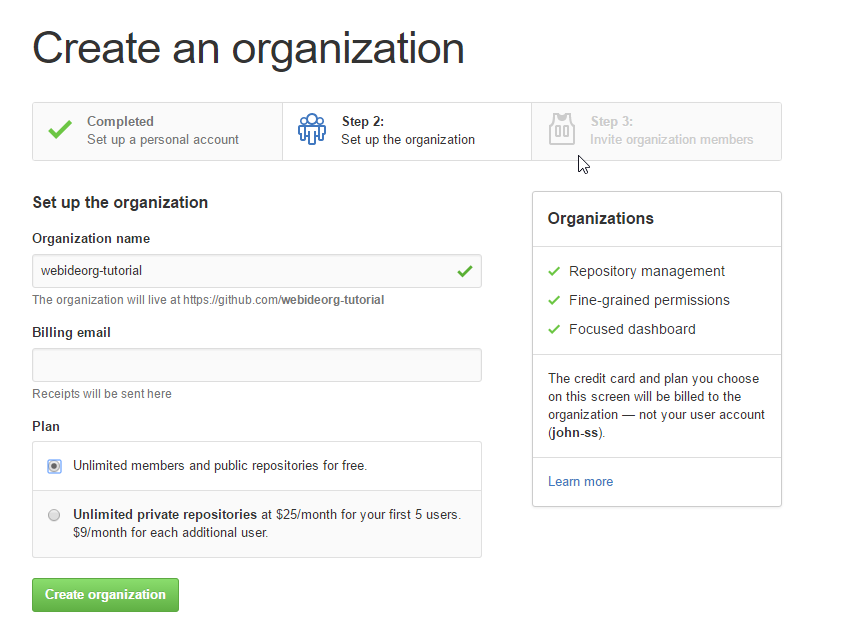
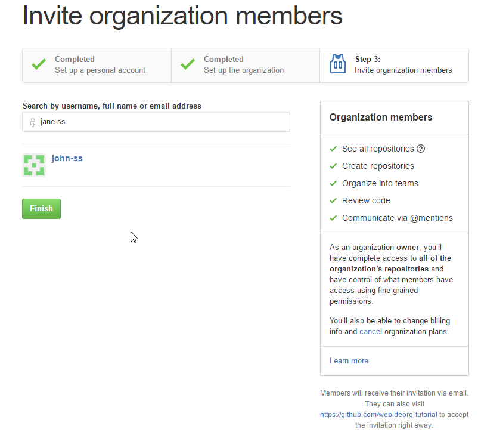
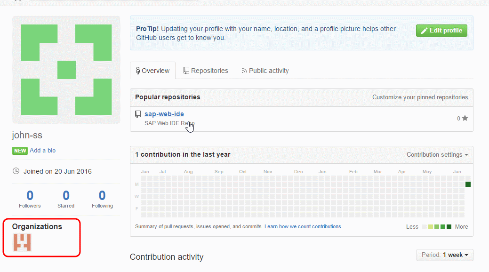
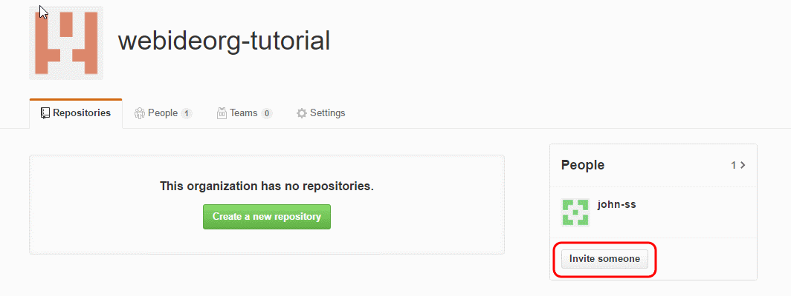

## Details
### You will learn  
  - How to create an organization in GitHub and add collaborators

---

[ACCORDION-BEGIN [Step 1: ](Sign into GitHub)]

Go to [GitHub](https://github.com)

Click **Sign In**, enter your account credentials, and click **Sign in**.

[DONE]
[ACCORDION-END]

[ACCORDION-BEGIN [Step 2: ](Create organization)]

Click the **+** icon on the top-right corner and click **New organization**.

Enter the organization name, billing email, and click  **Create an Organization**.

[DONE]
[ACCORDION-END]

[ACCORDION-BEGIN [Step 4: ](Invite collaborators)]

Invite collaborators to the organization by entering their email/GitHub username. Ensure the collaborator has a GitHub account, otherwise the person will not be added as a collaborator.

Click **Finish**.

If you already have an organization, click the organization name under the profile.

Click **Invite someone**.

Enter their GitHub username or email.

[DONE]
[ACCORDION-END]

[ACCORDION-BEGIN [Step 5: ](Assign role to collaborator)]

Click the appropriate role for the collaborator and then click **Send Invitation**.

[DONE]
[ACCORDION-END]

[ACCORDION-BEGIN [Step 6: ](Collaborator joins organization)]

The collaborator receives an email.

The collaborator clicks **Join**, and now the collaborator is part of the organization!

[DONE]
[ACCORDION-END]
