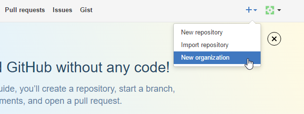

## Prerequisites  
 - **Proficiency:** Beginner

## Next Steps
 - [Create a Git repository within the GitHub Organization](http://www.sap.com/developer/tutorials/webide-github-create-git-repo.html)

## Details
### You will learn  
In this tutorial, you'll learn how to create an organization in GitHub and add collaborators. 

### Time to Complete
**5 Min**.

---

1. Go to [GitHub](https://github.com)

2. Click on **Sign In**, enter your account credentials and click on **Sign in**.

3. Click on the **+** icon on the top-right corner and click on **New Repository**.

    

4. Enter the organization name, billing email and click on **Create an Organization**. 

    
  
5. 
    a. Invite collaborators to the organization by entering their email id/GitHub username. Do ensure the collaborator has a GitHub account else the person will not be added as a collaborator. Click on **Finish** once done.
    
    

    b. If you already have an organization click on the Organization name under the profile.

    

    c. Click on **Invite someone**.
 
    

    d. And enter their GitHub username or email.

    

   
6. Click on the appropriate role for the collaborator being added and then click on **Send Invitation**.

    

7. The collaborator will receive an email, follow the link on the email to accept invite.

    

8. Click on **Join** and now the organization will have the collaborator added!

## Next Steps
 - [Create a Git repository within the Organization](http://www.sap.com/developer/tutorials/webide-github-create-git-repo.html)
