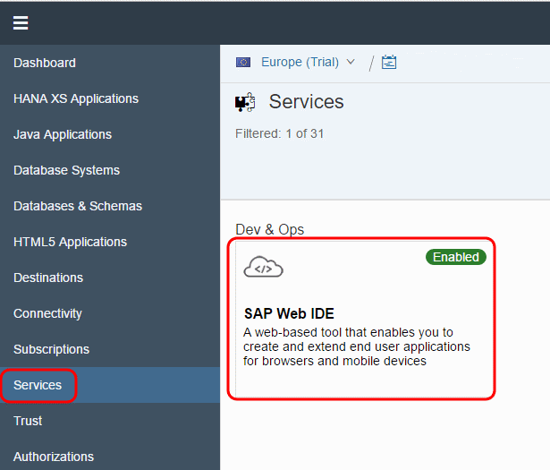
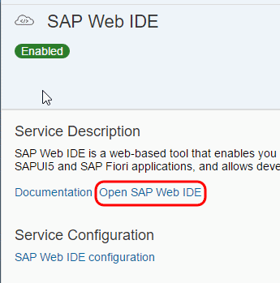
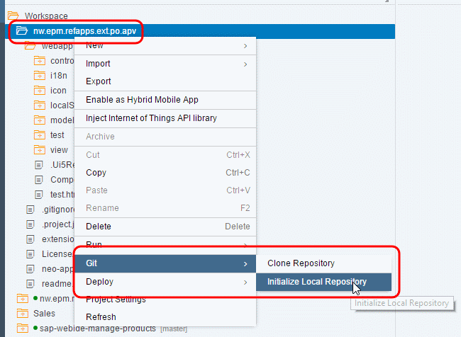
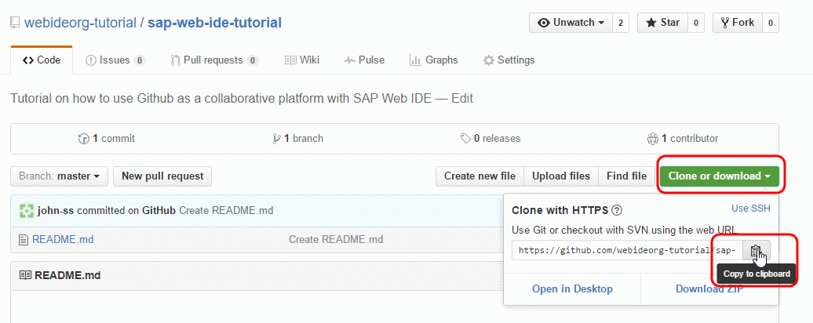
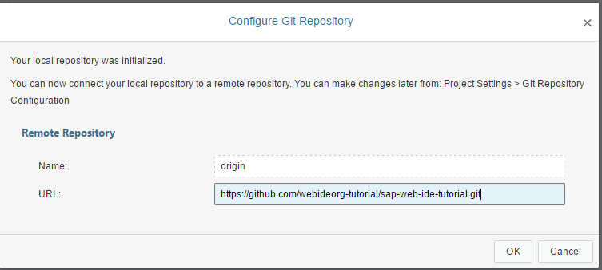
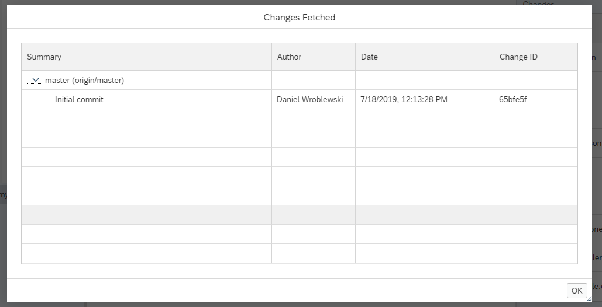
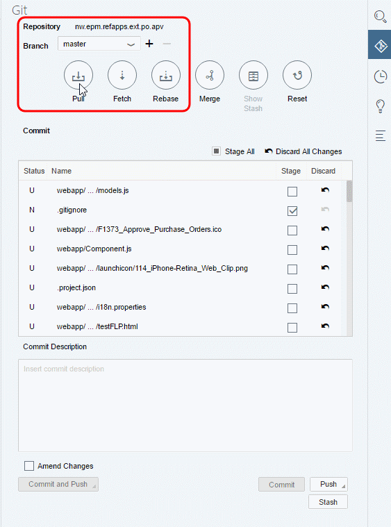
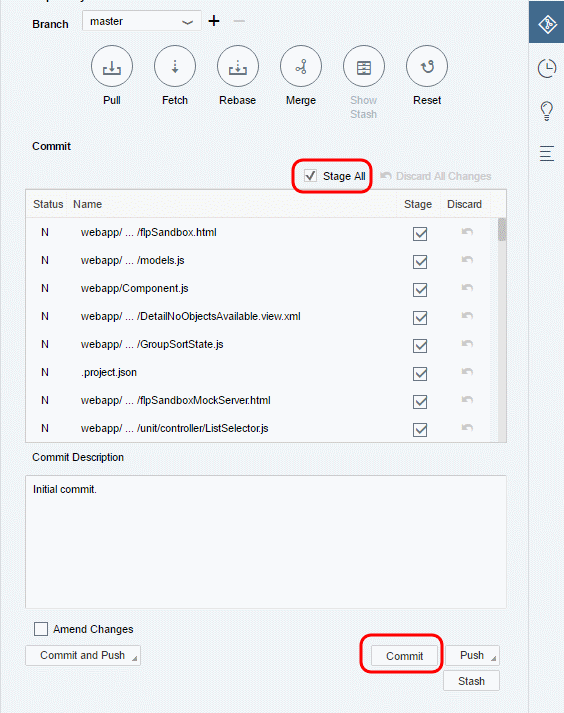
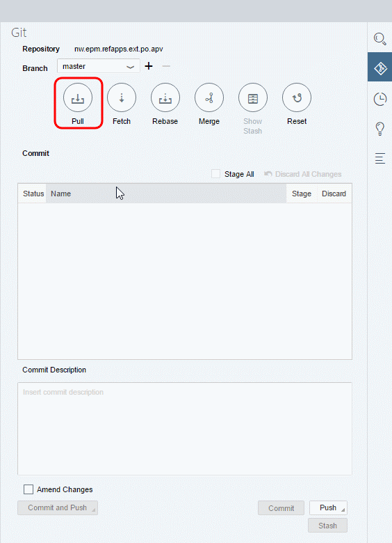
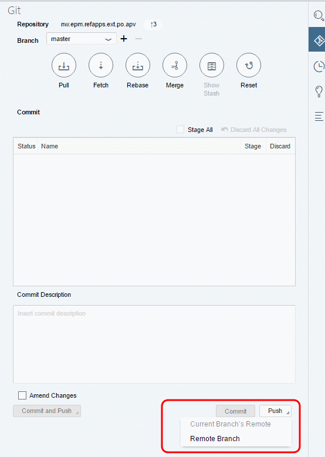

## Prerequisites
- **IMPORTANT**: This tutorial cannot be completed on a trial account

## Details
### You will learn  
  - How to import an existing SAP Web IDE project into your previously created GitHub repository

---

[ACCORDION-BEGIN [Step 1: ](Log into your SAP Cloud Platform cockpit)]

Go to [https://account.hanatrial.ondemand.com](https://account.hanatrial.ondemand.com) and log into your SAP Cloud Platform cockpit.

[DONE]
[ACCORDION-END]

[ACCORDION-BEGIN [Step 2: ](Open SAP Web IDE)]

1. Click **Neo Trial**, and then open the **Services** tab.

2. Scroll down and click the **SAP Web IDE** tile to open the SAP Web IDE service page.

    

3. Click **Go to Service** to launch SAP Web IDE.

    

[DONE]
[ACCORDION-END]

[ACCORDION-BEGIN [Step 3: ](Open your project)]

Open a project in SAP Web IDE. Either:

  - Use an existing project.
  - Import an existing project (`.zip` file).
  - Create a new one by going to **File > New > Project from Template**, and then use, for example, the **SAPUI Application** template.

[DONE]
[ACCORDION-END]

[ACCORDION-BEGIN [Step 4: ](Initialize local repository)]

Right-click on your project folder and click **Git > Initialize Local Repository**.

[DONE]
[ACCORDION-END]

[ACCORDION-BEGIN [Step 5: ](Set the remote repository)]

You need to connect the local Git repository in SAP Web IDE with your repository on GitHub.

1. Right-click on your project folder and click **Git > Set Remote**.

2. In the **Configure Git Repository** dialog box, enter your GitHub organization repository's URL.

    Get the remote repository URL by heading over to GitHub organization, and open your repository. Click the **Clone or Download** button and then select the icon to copy the URL to the clipboard.

    

    Paste this URL into the remote repository textbox.

    

3. Click **OK**.

This automatically executes a fetch from the remote repository, and you can view the branches/commits that will be fetched. Click **OK**.

[DONE]
[ACCORDION-END]

[ACCORDION-BEGIN [Step 6: ](Verify Git repository)]

Your project is now initialized with a Git repository and linked to the GitHub platform. You can open the Git pane on the right sidebar to verify this.

[DONE]
[ACCORDION-END]

[ACCORDION-BEGIN [Step 7: ](Stage and commit files)]

Commit the project files to the local Git repository by doing the following:

1. Make sure the files are staged (the **Stage** checkbox is checked).

2. Enter a commit message.

3. Click **Commit**.

[DONE]
[ACCORDION-END]

[ACCORDION-BEGIN [Step 9: ](Pull from GitHub)]

To synchronize the GitHub repository and local repository changes, click **Pull**. Enter your GitHub credentials.

[DONE]
[ACCORDION-END]

[ACCORDION-BEGIN [Step 10: ](View downloaded README)]

Once the pull is complete, you'll notice the `README.md` file that was created on GitHub is now available in the SAP Web IDE project workspace.

[DONE]
[ACCORDION-END]

[ACCORDION-BEGIN [Step 11: ](Push your local changes to GitHub)]

Click **Push** and select **Remote Branch**

Select **origin/master** as the remote branch and click **OK**.

Enter your GitHub credentials and click **OK**.

Once the push is complete, you will see a notification message on the top-right corner.

[DONE]
[ACCORDION-END]

[ACCORDION-BEGIN [Step 12: ](Check published changes)]

Go to your organization on GitHub and you will notice that the changes are now published.

[DONE]
[ACCORDION-END]
