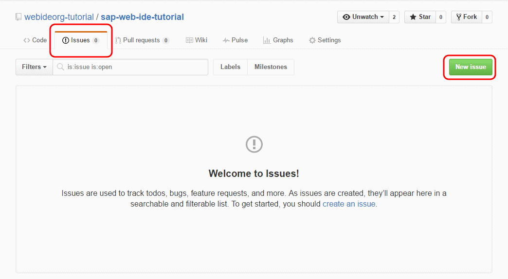
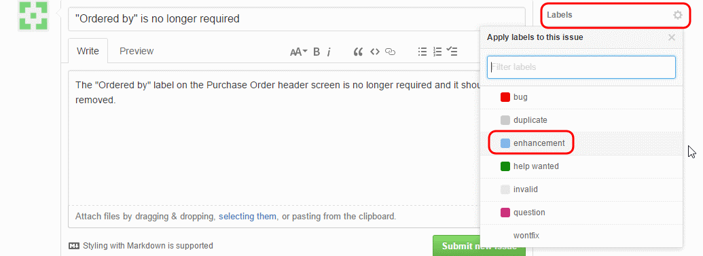
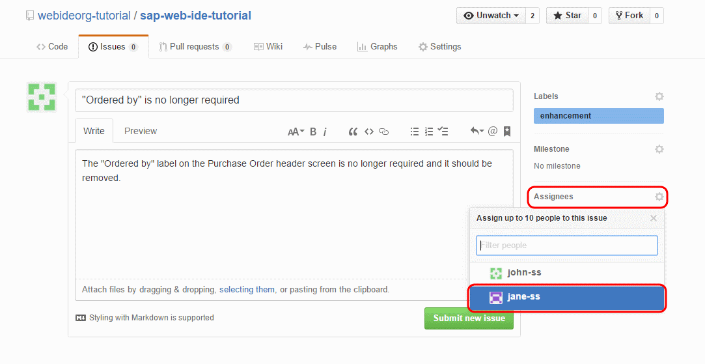
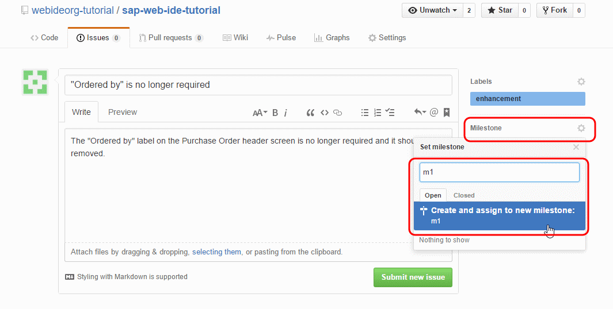
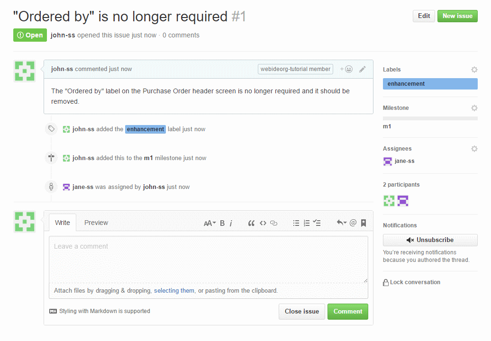
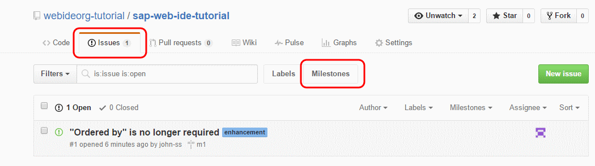
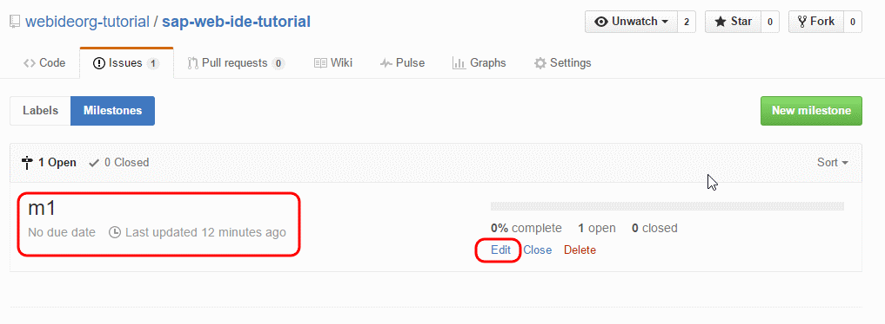
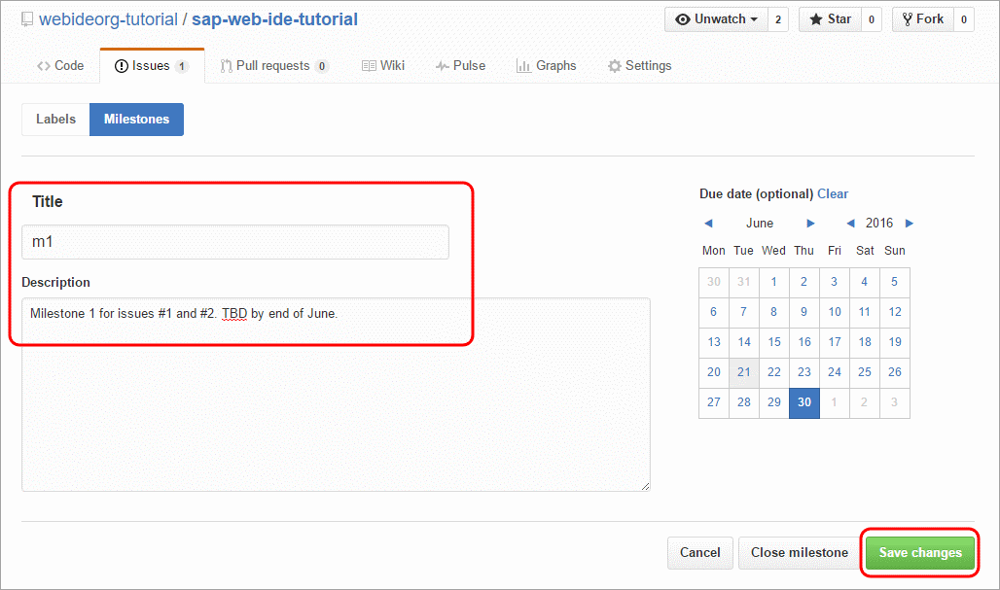
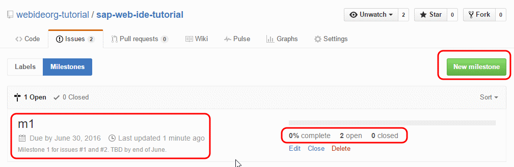

## Details
### You will learn  
  - How to create issues
  - How to assign issues and tasks to collaborators
  - How to set milestones for delivery

---

[ACCORDION-BEGIN [Step 1: ](Create new issue in GitHub)]

Go to your GitHub organization repository.

Click on the **Issues** tab, and then click on **New Issue** to create a new issue.

[DONE]
[ACCORDION-END]

[ACCORDION-BEGIN [Step 2: ](Fill in issue details)]

Enter the details about the change required.

In this instance, you will create 2 issues, one issue to remove **Ordered by** label from the Purchase Order header and the other issue to add a **Product ID** column to the Order Details table.

Click **Labels** and set it as **Enhancement**. Labels can be used to categorize issues into bug/enhancements. You can make your own custom labels.

You can assign a specific collaborator to work on an issue. To do this, click **Assignees** and select the collaborator who will work on this.

You can set milestones for specific issues. Milestones are how similar issues and deadlines can be set and categorized. To create a milestone, click **Milestone** and enter a name for the milestone. If it doesn't exist, you will be prompted to create it.

Click **Submit new issue**.

[DONE]
[ACCORDION-END]

[ACCORDION-BEGIN [Step 3: ](Add comments to issue)]

Once the issue is created, you can add comments, discuss it, and even add an emoji to express your interest in the issue.

[DONE]
[ACCORDION-END]

[ACCORDION-BEGIN [Step 4: ](Assign deadlines for milestones)]

You can assign deadlines for milestones.

To do this, click the **Issues** tab of your GitHub organization repository, then click the **Milestones** tab.

Click **Edit** and assign a due date.

Click **Save changes**.

Similarly, you can create new milestones, update existing ones, and check for status of current milestones from this page.

[DONE]
[ACCORDION-END]
