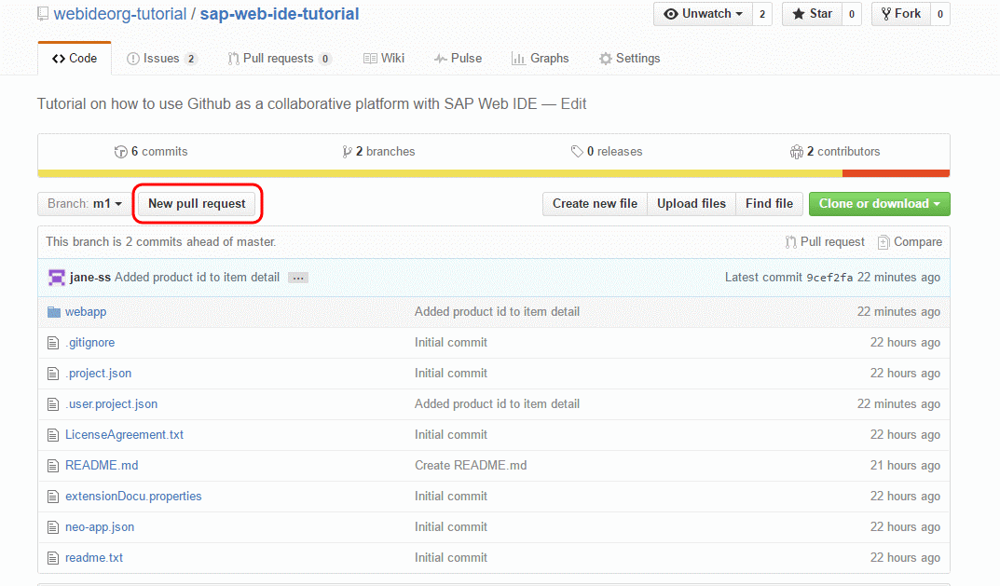
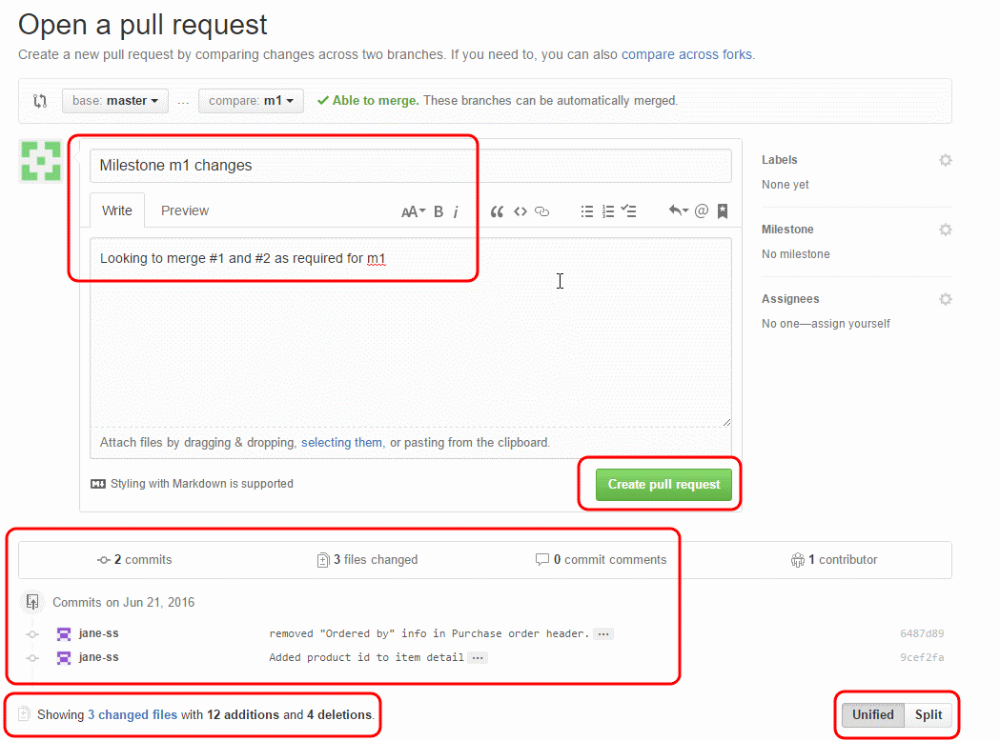
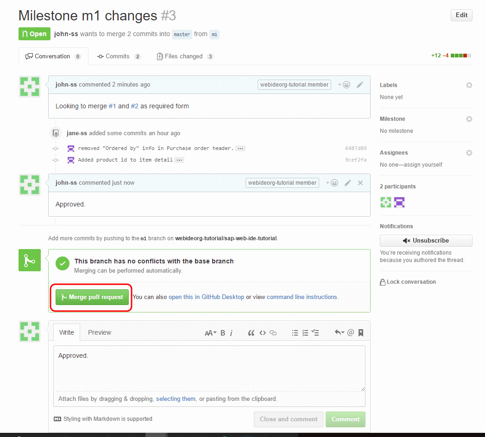
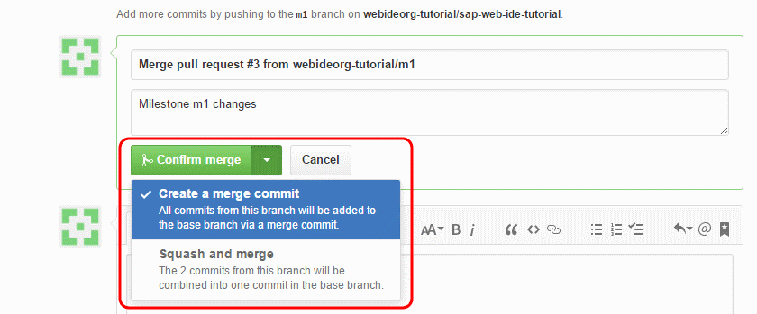
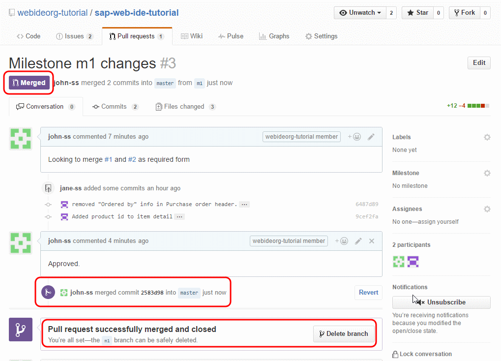
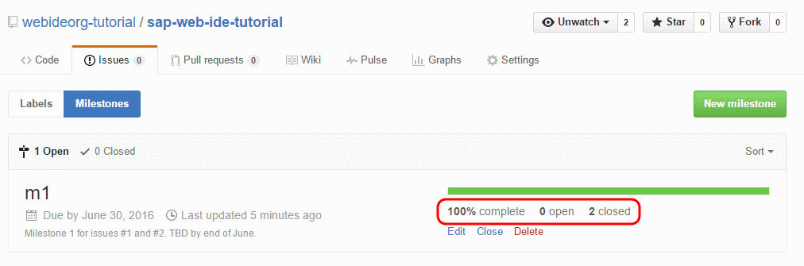
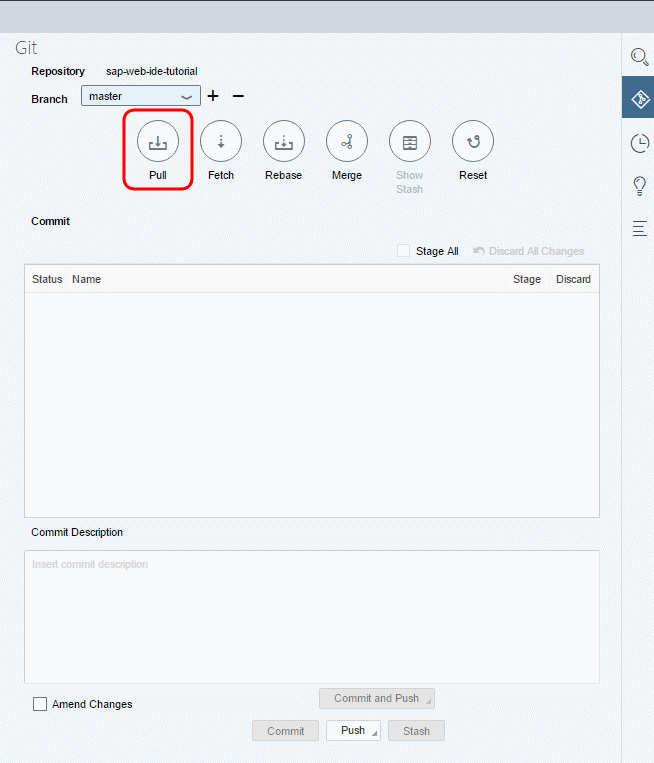
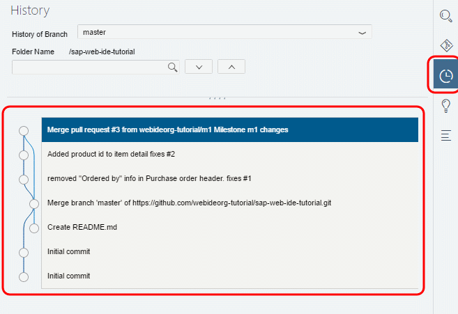

## Prerequisites
- **IMPORTANT**: This tutorial cannot be completed on a trial account

## Details
### You will learn  
  - How to create and send pull requests so that the changes in branches will be merged into the master branch

---

[ACCORDION-BEGIN [Step 1: ](Open branch on GitHub)]
Open the Organization repository on GitHub and switch to the branch that you want to merge into master.

[DONE]
[ACCORDION-END]

[ACCORDION-BEGIN [Step 2: ](Create pull request)]
Click **New Pull Request** to create a pull request.

  

Enter brief details about the pull request and click **Create pull request**. You can scroll down and see a diff of the files that were changed as well as the commits.

  

[DONE]
[ACCORDION-END]

[ACCORDION-BEGIN [Step 1: ](Merge pull request)]
To accept the pull request, click the **Pull Requests** tab to see a summary of pending pull requests. If you are happy with the changes, click **Merge Pull request** to accept the pull request and perform the merge. You can add in a comment if you want.

  

Once you click **Merge Pull request**, you will see a button **Confirm merge**. Click the drop-down next to the button so you can select a merge option: **Squash merge** creates a single commit from all changes, and  **Merge commit** leaves all the commits as is.

If the merge was successful, you'll see a note about it and you can proceed with deleting the branch if required.

Issues are automatically closed as well and the milestone is complete.

> GitHub will automatically close an issue if your commit message includes [certain keywords](https://help.github.com/articles/closing-issues-via-commit-messages/) once this change is merged into the master branch.

[DONE]
[ACCORDION-END]

[ACCORDION-BEGIN [Step 4: ](Fetch changes in SAP Web IDE)]

Ensure your workspace in SAP Web IDE has fetched these latest changes.

1. Open the Git pane and switch to the master branch.

    

2. Click **Pull** to pull in the changes. Enter your GitHub account credentials and press **OK**.

    

3. Open the **Git History** pane to see that the branching, changes and pull request were successful.

    

[DONE]
[ACCORDION-END]
