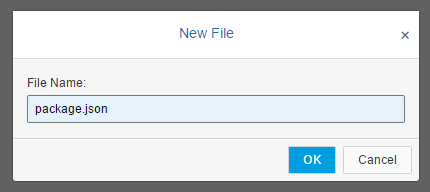
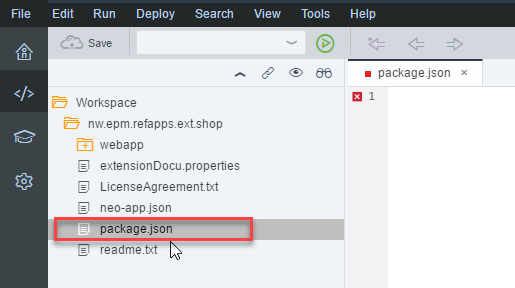
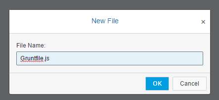
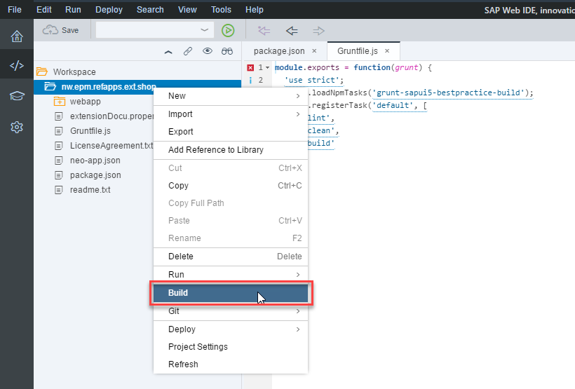
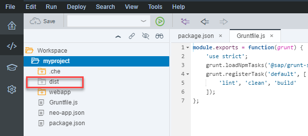
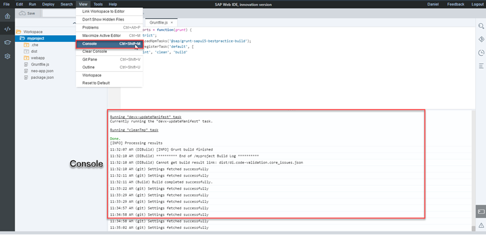

## Prerequisites  
- **Proficiency:** Beginner


## Details
### You will learn  
- How to configure your project for running a Grunt build
- How to run a Grunt build

SAP Web IDE Full-Stack comes with the Grunt task runner already part of the IDE, so you can run tasks by:

- Specifying dependencies in the `package.json` file.
- Specifying/defining tasks in the `Gruntfile.js` file.  

Once you've created these files, you get a new menu option called **Build** to start the grunt tasks. You don't specify a task; SAP Web IDE Full-Stack always runs the `default` task that you have defined in the `Gruntfile.js`.

### Before you begin
For this tutorial, make sure:

- You are using **SAP Web IDE Full-Stack**
- You have created an SAPUI5 project. You can simply create a blank or sample project from a template.
- Your project uses the Basic JavaScript validator. To change it, right-click your project and go to **Project Settings** | **Code Checking** | **JavaScript**, change the validator to **Basic JavaScript**, and click **Save**.

The `grunt-sapui5-bestpractice-build` Grunt plugin is published on the SAP npm registry. To run the Grunt build using this plugin outside of SAP Web IDE for Full-Stack development, such as from a CLI as part of the CI process, use npm version 5.7.1 or later and add the following configuration option to the npm configuration file:

`@sap:registry=https://npm.sap.com/`

For more information, see <https://docs.npmjs.com/files/npmrc>.

> Please note the following:
<ul>
<li>The Grunt build currently supports the ES6 edition of the ECMAScript standard. The ES6 edition is only supported from the 1.3.65 version of the Grunt best-practice build.</li>
<li>Newer ECMAScript standards, such as ES6, work with SAPUI5 only in browsers with HTML5 capabilities. For more information, see [Browser and Platform Support](https://sapui5.hana.ondemand.com/#/topic/74b59efa0eef48988d3b716bd0ecc933) in the SAPUI5 documentation.</li></ul>


### Time to Complete
**10 Min**

---

[ACCORDION-BEGIN [Step 1: ](Create a package.json file)]
Right-click your project and choose **New** | **File**, enter `package.json`.



In the file enter the following code:
```
{
  "name": "grunt-build",
  "version": "0.0.1",
  "description": "Grunt build",
  "private": true,
  "devDependencies": {
      "@sap/grunt-sapui5-bestpractice-build": "1.3.65"
   }
}
```



Later, when you select **Build** in the context menu, these settings instruct npm to install Grunt and the `gruntsapui5-bestpractice-build` Grunt plugin that contains tasks for building your SAPUI5 project.


[ACCORDION-END]

[ACCORDION-BEGIN [Step 2: ](Create a Gruntfile.js file)]
Right-click your project and choose **New** | **File**, enter `Gruntfile.js`.



To include the build tasks listed below, you need add the content below to the  `Gruntfile.js` file, according to the compatible version you want to define.

This first code content defines the `compatVersion` property for a specific SAPUI5 version using the two-digit format: **`"x.xx"`**.

```
module.exports = function (grunt) {
            "use strict";
            grunt.loadNpmTasks("@sap/grunt-sapui5-bestpractice-build");
            grunt.config.merge({ compatVersion: "1.38" });
            grunt.registerTask("default", [
                        "clean",
                        "lint",
                        "build"
            ]);
            grunt.loadNpmTasks("@sap/grunt-sapui5-bestpractice-test");
            grunt.registerTask("unit_and_integration_tests", ["test"]);
            grunt.config.merge({
                        coverage_threshold: {
                                    statements: 0,
                                    branches: 100,
                                    functions: 0,
                                    lines: 0
                        }
            });
};

```

For modules created using the HTML5 Application Repository service, enter this content below. Here the `compatVersion` property is defined as **`"edge"`**, which is based on the SAP Innovation SAPUI5 version.
```
module.exports = function (grunt) {
                "use strict";
                grunt.loadNpmTasks("@sap/grunt-sapui5-bestpractice-build");
                grunt.config.merge({
                                compatVersion: "edge",
                                deploy_mode: "html_repo"
                });
                grunt.registerTask("default", [
                                "clean",
                                "lint",
                                "build"
                ]);
                grunt.loadNpmTasks("@sap/grunt-sapui5-bestpractice-test");
                grunt.registerTask("unit_and_integration_tests", ["test"]);
                grunt.config.merge({
                                coverage_threshold: {
                                                statements: 0,
                                                branches: 100,
                                                functions: 0,
                                                lines: 0
                                }
                });
};

```

The code does the following:

- Loads the tasks from the SAPUI5 best practices Grunt plugin.
- Sets the default task to execute the following tasks defined in the SAPUI5 plugin:

|Task&nbsp;&nbsp;            |Description       |
|---------------|-------|
| `lint`        | Validates the project code using ESLint according to the rules defined in the `.eslintrc` configuration file located in the root of your project.      |
| `clean`       | Cleans the `dist` target folder from the previous build results.      |
| `build`       | Produces a new build output in the `dist` folder of your project that is ready and optimized for better performance in the productive environment. The following tasks are executed during the build:<ul>
<li>Minification of `.css` files.</li>
<li>Minification of JavaScript files (minified files).</li>
<li>Copying of the original files to the `dist` folder with `-dbg` suffix added for debugging purposes.</li>
<li>Generation of the `Component-preload.js` and `Component-preload-dbg.js` preload files for the debug and minified files.</li>
<li>Minification of the preload file.</li>
<li>Generation of the `CachebusterInfo.json` file.</li>
<li>Generation of the `changes-bundle.json` file. The file contains a collection of all the changes that are made to an SAP Fiori element application and are located in the `changes` folder.</li>
<li>Generation of the `manifest-bundle.zip` file, which contains the `manifest.json` and `i18n` files.</li></ul> |


[ACCORDION-END]


[ACCORDION-BEGIN [Step 3: ](Build your project)]
Right-click your project and choose **Build**.


When the build finishes, a new `dist` folder is created in your project and is automatically added to `.gitignore`, ensuring that the folder is not checked into the project's Git repository.


You can see any build errors in the console, which you can display by going to **View** | **Console**.


>A new `package-lock.json` file is added to your project (unless it already existed). It is a special file that `npm` uses for locking the version of each package in the dependency tree, including the final resolved versions of ranges such as ~1.7.0 or ^1.0.9. If your project is connected to Git, commit and push the file to your Git repository.
>
>You may want to check out the blog [How `npm` `v5` Affects Your Projects in SAP Web IDE Full-Stack](https://blogs.sap.com/2018/03/11/how-npm-v5-affects-your-projects-in-sap-web-ide-full-stack/).


<br>

>**Tip**
>If the build fails, do one of the following according to the failure reported in the console:
>
>  - **ERROR**: `Unable to locate local Grunt`
>Right-click the project folder in the workspace, select **Clean npm Folder**, and build again.
This option removes the node-modules folder that is automatically created by npm. For more information, see <https://docs.npmjs.com/files/folders>. After the build finishes, this folder is not displayed in your project, but is stored by the SAP Web IDE Full-Stack build infrastructure.
  - **ERROR**: `npm ERR! code EINTEGRITY`
  Delete your `package-lock.json` file from the project and run the build again.


[ACCORDION-END]
