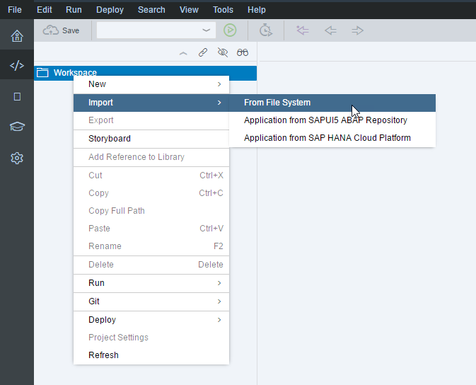
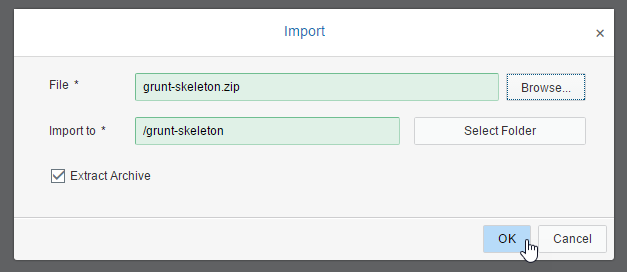
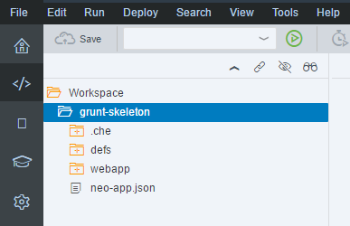
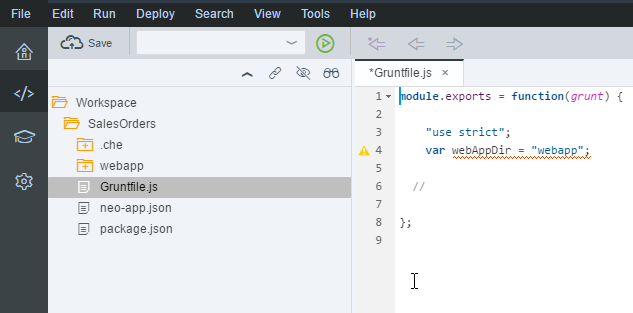
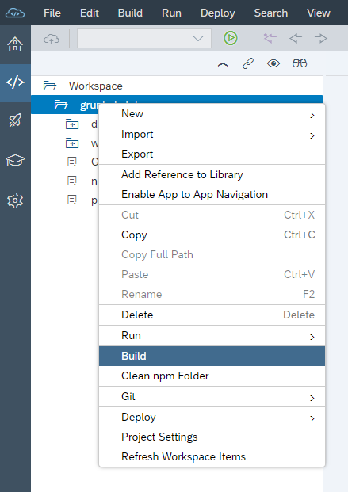
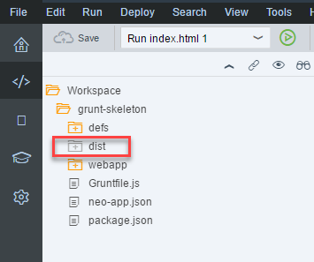
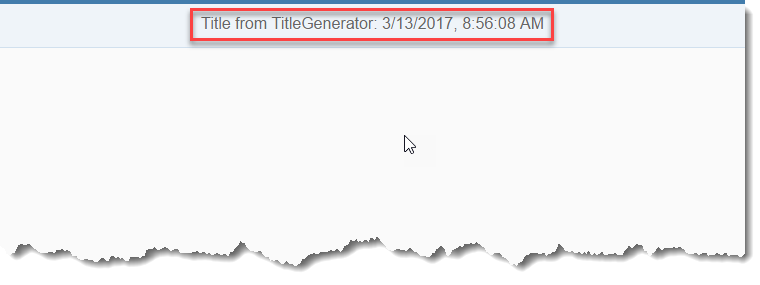

## Prerequisites  
- **Proficiency:** Beginner
- **Tutorials:** [Grunt Build in SAP Web IDE]

## Details  
SAP Web IDE provides a Grunt plugin for checking your JavaScript code (`lint`), removing previous builds (`clean`), and building your application (`build`). Of course, you may want to use your own Grunt plugin or one of hundreds publicly available. In SAP Web IDE, you can reference them, configure them, and run their tasks.

In this tutorial, we will take a skeleton SAPUI5 project that displays a view with a title, and create a TypeScript class (`TitleGenerator`) to supply the title.


### You will learn  
- How to set up your project for running a Grunt build with multiple plugins
- How to reference non-SAP Grunt plugins
- How to configure your Grunt plugins
- How to run a Grunt build

### Time to Complete
**15 Min**


---

[ACCORDION-BEGIN [Step 1: ](Download skeleton project)]

Download the [skeleton project for this tutorial](https://wiki.scn.sap.com/wiki/x/02GKGw) (`grunt-skeleton.zip`).

The project is an empty SAPUI5 project, with only a view that displays a title. The title comes from a TypeScript class.

>The project will not run until we build the project (including converting the TypeScript file into JavaScript) and run the project from the generated `dist` folder.

[DONE]
[ACCORDION-END]


[ACCORDION-BEGIN [Step 2: ](Import skeleton project)]
In the SAP Web IDE **Development** perspective, right-click **Workspace** and select **Import** | **From File System**.



Browse to the file you downloaded, and click **OK**.



You should now have a new project called `grunt-skeleton`.



[DONE]
[ACCORDION-END]

[ACCORDION-BEGIN [Step 3: ](Create a package.json file)]
Right-click the project and choose **New** | **File**, enter `package.json`.


In the file enter the following code:
```
{
	"name": "grunt-skeleton",
	"version": "0.0.1",
	"description": "Grunt build",
	"private": true,
	"dependencies": {
		"grunt-ts": "X.X.X",
		"@sap/grunt-sapui5-bestpractice-build": "1.3.8"
	}
}
```
Here we not only used the SAPUI5 Grunt plugin, but also a publicly available plugin, `grunt-ts`, for compiling TypeScript into JavaScript.

[DONE]
[ACCORDION-END]

[ACCORDION-BEGIN [Step 4: ](Create basic Gruntfile.js file)]
Right-click your project and choose **New** | **File**, enter `Gruntfile.js`.


In the file enter the following skeleton:
```
module.exports = function(grunt) {
	"use strict";
	var webAppDir = "webapp";

  //

};
```


[DONE]
[ACCORDION-END]


[ACCORDION-BEGIN [Step 5: ](Gruntfile.js: Add configuration for new plugins)]
Add the following code to your `Gruntfile.js`. The code configures the `ts` and `copy` tasks.

```
var config = {
  ts: {
    default: {
      src: ["**/*.ts", "!node_modules/**"]
    }
  },

  copy: {
    copyToTmp: {
      files: [{
          expand: true,
          src: '**/*.js',
          dest: '<%= dir.tmpDir %>',
          cwd: '<%= dir.webapp %>',
          filter: function(filepath) {
            // prevent js from localService to be copied
            return !filepath.match(new RegExp('<%= dir.webapp %>' + '(\\/|\\\\)localService', 'gi'));
          }
        }, {
          expand: true,
          src: '**/*.css',
          dest: '<%= dir.tmpDir %>',
          cwd: '<%= dir.webapp %>'
        },

        {
          expand: true,
          src: 'localService/metadata.xml',
          dest: '<%= dir.tmpDir %>',
          cwd: '<%= dir.webapp %>'
        }, {
          expand: true,
          src: '**/*',
          dest: '<%= dir.tmpDir %>',
          cwd: '<%= dir.webapp %>',
          filter: function(filepath) {
            // prevent js and css files and contents of webapp/test from being copied
            return !filepath.match(new RegExp("(" + webAppDir +
              "(\\/|\\\\)test|${webAppDir}(\\/|\\\\)localService|\\.js$|\\.css$|\\.ts$|\\test.html$)", "gi"));
          }
        }
      ]
    }
  }
};
```
You put the configuration into a variable (`config`) so that we can later merge it with the existing configuration already initialized behind the scenes for the SAPUI5 plugin. This is why we did not use `grunt.config.init` or `grunt.initConfig` to do the configuration.

>You may get a JavaScript error for using the keyword `default`. Ignore the error.

[DONE]
[ACCORDION-END]


[ACCORDION-BEGIN [Step 6: ](Gruntfile.js: Load plugins and merge configuration)]
Add the following code to your `Gruntfile.js`.

```
grunt.loadNpmTasks("@sap/grunt-sapui5-bestpractice-build");
grunt.config.merge(config);
grunt.loadNpmTasks("grunt-ts");
```
The code loads the plugins, and merges the configuration you created for the `grunt-ts` plugin with the configuration created behind the scenes for the SAPUI5 plugin.

[DONE]
[ACCORDION-END]


[ACCORDION-BEGIN [Step 7: ](Gruntfile.js: Register cleanTs task)]
Add the following code to your `Gruntfile.js`.


```
grunt.registerTask('cleanTs', 'Clean type script build result', function() {
  grunt.file.expand({
    cwd: grunt.config.data.dir.webapp
  }, '**/*.ts').forEach(function(file) {
    var jsFile = grunt.config.data.dir.webapp + '/' + file.replace(/[^\\/:*?"<>|\r\n]ts$/, ".js");
    if (grunt.file.exists(jsFile)) {
      grunt.file.delete(jsFile, {
        force: true
      });
    }
    var mapFile = grunt.config.data.dir.webapp + '/' + file.replace(/[^\\/:*?"<>|\r\n]ts$/, ".js.map");
    if (grunt.file.exists(mapFile)) {
      grunt.file.delete(mapFile, {
        force: true
      });
    }
  });
});
```
The code creates the `cleanTs` task, which checks if a JavaScript file already exists for each TypeScript file that will be converted. if so, it is deleted.


[DONE]
[ACCORDION-END]


[ACCORDION-BEGIN [Step 8: ](Gruntfile.js: Register default task)]
Add the following code to your `Gruntfile.js`.

```
grunt.registerTask('default', [		
  'clean',		
  'ts',
  'build',		
  'cleanTs',
  'lint'
]);

```
The code creates the default task, which runs when you choose **Build**.

Here is the entire `Gruntfile.js` code:
```
module.exports = function(grunt) {
	"use strict";
	var webAppDir = "webapp";

	var config = {
		ts: {
			default: {
				src: ["**/*.ts", "!node_modules/**"]
			}
		},

		copy: {
			copyToTmp: {
				files: [{
						expand: true,
						src: '**/*.js',
						dest: '<%= dir.tmpDir %>',
						cwd: '<%= dir.webapp %>',
						filter: function(filepath) {
							// prevent js from localService to be copied
							return !filepath.match(new RegExp('<%= dir.webapp %>' + '(\\/|\\\\)localService', 'gi'));
						}
					}, {
						expand: true,
						src: '**/*.css',
						dest: '<%= dir.tmpDir %>',
						cwd: '<%= dir.webapp %>'
					},

					{
						expand: true,
						src: 'localService/metadata.xml',
						dest: '<%= dir.tmpDir %>',
						cwd: '<%= dir.webapp %>'
					}, {
						expand: true,
						src: '**/*',
						dest: '<%= dir.tmpDir %>',
						cwd: '<%= dir.webapp %>',
						filter: function(filepath) {
							// prevent js and css files and contents of webapp/test from being copied
							return !filepath.match(new RegExp("(" + webAppDir +
								"(\\/|\\\\)test|${webAppDir}(\\/|\\\\)localService|\\.js$|\\.css$|\\.ts$|\\test.html$)", "gi"));
						}
					}
				]
			}
		}
	};
	grunt.loadNpmTasks("@sap/grunt-sapui5-bestpractice-build");

	grunt.config.merge(config);

	grunt.loadNpmTasks("grunt-ts");


	grunt.registerTask('cleanTs', 'Clean type script build result', function() {
		grunt.file.expand({
			cwd: grunt.config.data.dir.webapp
		}, '**/*.ts').forEach(function(file) {
			var jsFile = grunt.config.data.dir.webapp + '/' + file.replace(/[^\\/:*?"<>|\r\n]ts$/, ".js");
			if (grunt.file.exists(jsFile)) {
				grunt.file.delete(jsFile, {
					force: true
				});
			}
			var mapFile = grunt.config.data.dir.webapp + '/' + file.replace(/[^\\/:*?"<>|\r\n]ts$/, ".js.map");
			if (grunt.file.exists(mapFile)) {
				grunt.file.delete(mapFile, {
					force: true
				});
			}
		});
	});

	grunt.registerTask('default', [		
		'clean',		
		'ts',
		'build',		
		'cleanTs',
		'lint'
	]);

};
```

[DONE]
[ACCORDION-END]


[ACCORDION-BEGIN [Step 9: ](Save files file)]
Save both files by selecting **File** | **Save All** (or by pressing `Ctrl-Shift-S`).

[DONE]
[ACCORDION-END]

[ACCORDION-BEGIN [Step 10: ](Build your project)]
Right-click your project and choose **Build**.



When the build finishes, a new `dist` folder is created in your project and is automatically added to `.gitignore`, ensuring that the folder is not checked in the project's Git repository.



>Notice that the file `webapp\controller\TitleHandler.ts` has been compiled into the JavaScript files `dist\controller\TitleHandler-dbg.js` and `dist\controller\TitleHandler.js,map`.

You can see any build errors in the console, which you can display by going to **View** | **Console**.


[DONE]
[ACCORDION-END]

[ACCORDION-BEGIN [Step 11: ](Run your project)]
Right-click on the file `dist\index.html` and select **Run** | **Run as** | **Web Application**.



The application will run and you will see the title of the view, which is derived from the TypeScript class `TitleGenerator` and returned by the `getTitle()` method in `TitleHandler.ts`.

```
sap.ui.define(function() {
	"use strict";
	class TitleGenerator {
		constructor(public title: string) { }
		getTitle() {
			var d = new Date(Date.now());
    		return this.title + ": " + d.toLocaleString();
		}
	}

	return {
		getTitle: function() {
			var a : TitleGenerator = new TitleGenerator("Title from TitleGenerator")
			return a.getTitle();
		}
	};
}, "", []);
```

The method `getTitle()` is called from within the `View1` controller.

[DONE]
[ACCORDION-END]

## Next Steps
