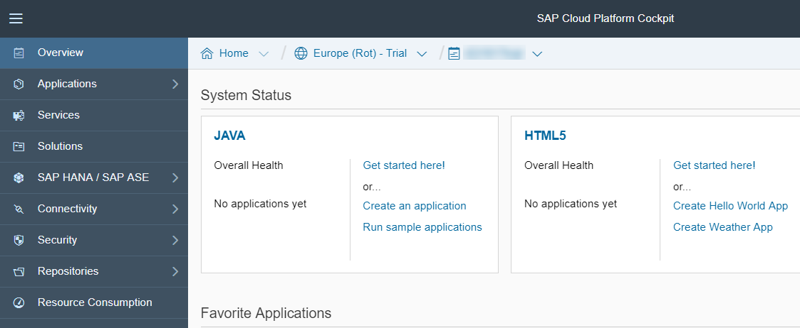
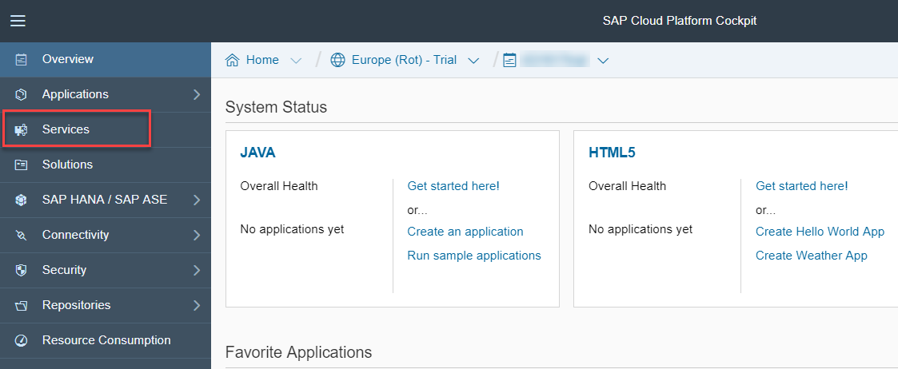
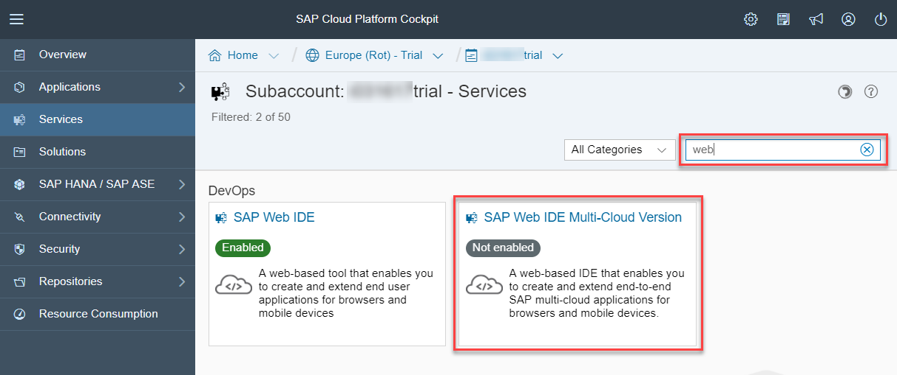
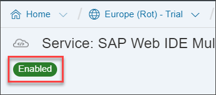
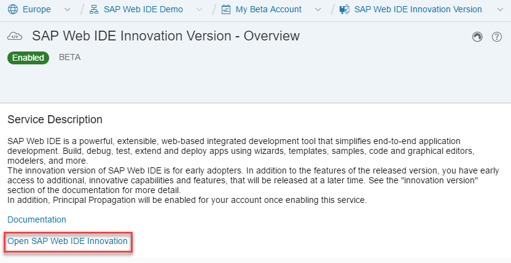

## Prerequisites  
You have access to an SAP Cloud Platform trial account. If you don't have an account, you can open one. See the [tutorial](https://developers.sap.com/tutorials/hcp-create-trial-account.html) or [documentation](https://help.sap.com/viewer/65de2977205c403bbc107264b8eccf4b/Cloud/en-US/65d74d39cb3a4bf8910cd36ec54d2b99.html).

## Details
The new SAP Web IDE multi-cloud version supports additional scenarios, and includes additional features for improving the build process and creating full-stack applications.

### You will learn  
- How to enable and start using the SAP Web IDE Full-Stack version

---

[ACCORDION-BEGIN [Step 1: ](Log onto SAP Cloud Platform)]
Log onto your SAP Cloud Platform account.

Make sure you are in the Neo environment, not the Cloud Foundry environment. Neo is the classic, proprietary SAP Cloud Platform, and you can return to it by going **Home** | **Go to Neo Trial**. 

[ACCORDION-END]

[ACCORDION-BEGIN [Step 2: ](Enable SAP Web IDE Full-Stack version service)]
Click **Services**.

In the search box, search for `Web`, and then click the **SAP Web IDE Full-Stack Version** tile.

Click **Enable**. This may take a few minutes.

Wait for the status to change to the green, **Enabled** status.

<!--change screen capture-->

[ACCORDION-END]

[ACCORDION-BEGIN [Step 3: ](Open the SAP Web IDE Full-Stack version)]
In the **SAP Web IDE Full-Stack Version** service screen, click the **Go to Service** link to open SAP Web IDE. Save it in your favorites.

[ACCORDION-END]

[ACCORDION-BEGIN [Step 4: ](Set up Cloud Foundry environment - OPTIONAL)]
If your scenario includes deploying apps to the Cloud Foundry environment, then you need to also set up this environment. These will generally be for full-stack applications that include database and Java modules.

Create a Cloud Foundry subaccount, organization, and space. See [Try It Out: 3 Easy Steps to Get You Started With the Cloud Foundry Environment](https://help.sap.com/viewer/65de2977205c403bbc107264b8eccf4b/Cloud/en-US/e3d82674bd68448eb85198619aa99b6d.html?q=Get%20a%20Trial%20Space%20on%20the%20Cloud%20Foundry%20Instance).

[ACCORDION-END]

---

