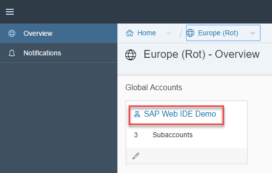
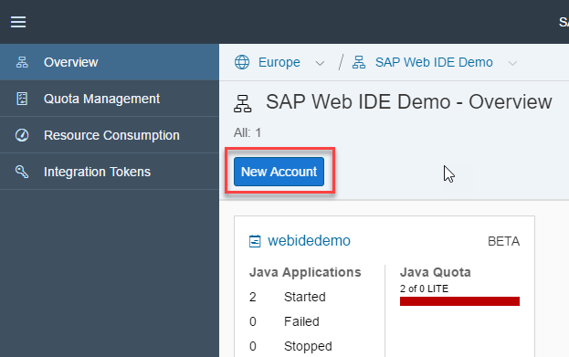
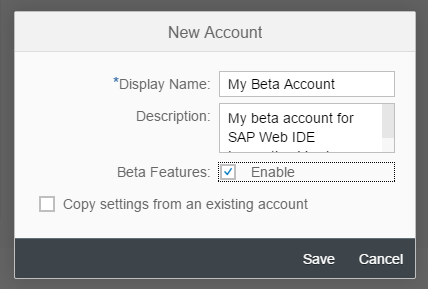
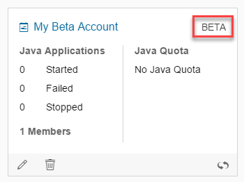
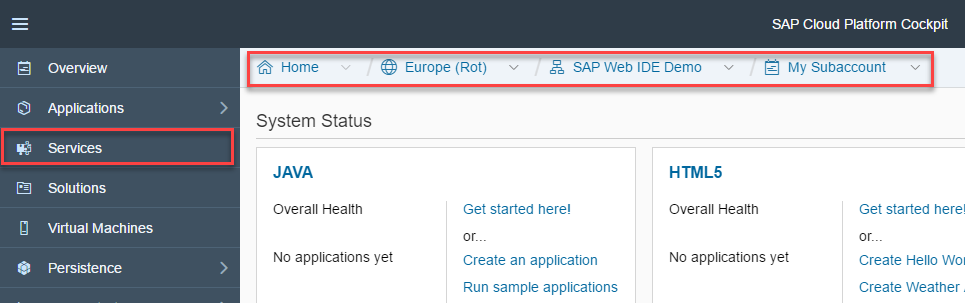

## Prerequisites  
- **Proficiency:** Beginner
You should have access to an SAP Cloud Platform global account.

## Next Steps
- Select a tutorial from the [Tutorial Navigator](http://www.sap.com/developer/tutorial-navigator.html) or the [Tutorial Catalog](http://www.sap.com/developer/tutorials.html)

## Details
### You will learn  
- How to get access to the beta version of the SAP Web IDE Innovation Version

### Time to Complete
**5 Min**

---

[ACCORDION-BEGIN [Step 1: ](Log onto SAP Cloud Platform)]
Open the cockpit of the SAP Cloud Platform.

Your landscape might be different. Here it is the **Europe** landscape.

[DONE]
[ACCORDION-END]

[ACCORDION-BEGIN [Step 2: ](Enter global account)]
Enter your global account by clicking it. Here my global account is **SAP Web IDE Demo**.

[DONE]
[ACCORDION-END]

[ACCORDION-BEGIN [Step 3: ](Create new sub-account)]
Click the **New Account** button.

[DONE]
[ACCORDION-END]

[ACCORDION-BEGIN [Step 4: ](Enter details about new account)]
In the new **Account** dialog, enter the following

| Field         | Description |
|---------------|-------------|
| Display Name  | `My Beta Account` |
| Description   | `My beta account for SAP Web IDE Innovation Version` |
| Beta Features | Select the **Enable** checkbox |  

Click **Save**.

You will have a new sub-account, marked as **BETA**.

[DONE]
[ACCORDION-END]

[ACCORDION-BEGIN [Step 5: ](Enter beta sub-account)]
Enter your new beta sub-account by clicking it.

[DONE]
[ACCORDION-END]

[ACCORDION-BEGIN [Step 6: ](Go to services)]
Once we've clicked into the beta account, we can see across the top the breadcrumb that shows we are in the **Europe** landscape, the **SAP Web IDE Demo** global account, and the new **My Beta Account** sub-account. Your landscape and accounts, of course, may differ.

Now let's open the SAP Web IDE Innovation Version.

Click **Services**.

[DONE]
[ACCORDION-END]

[ACCORDION-BEGIN [Step 7: ](Find the innovation version)]
In the search box, search for `Web`.

Click the **SAP Web IDE Innovation Version Beta** tile.

[DONE]
[ACCORDION-END]

[ACCORDION-BEGIN [Step 8: ](Enable the innovation version)]
Click **Enable**.

[DONE]
[ACCORDION-END]

[ACCORDION-BEGIN [Step 9: ](Open the innovation version)]
Open the **SAP Web IDE Innovation Version**.

[DONE]
[ACCORDION-END]

---

## Next Steps
- Select a tutorial from the [Tutorial Navigator](http://www.sap.com/developer/tutorial-navigator.html) or the [Tutorial Catalog](http://www.sap.com/developer/tutorials.html)
