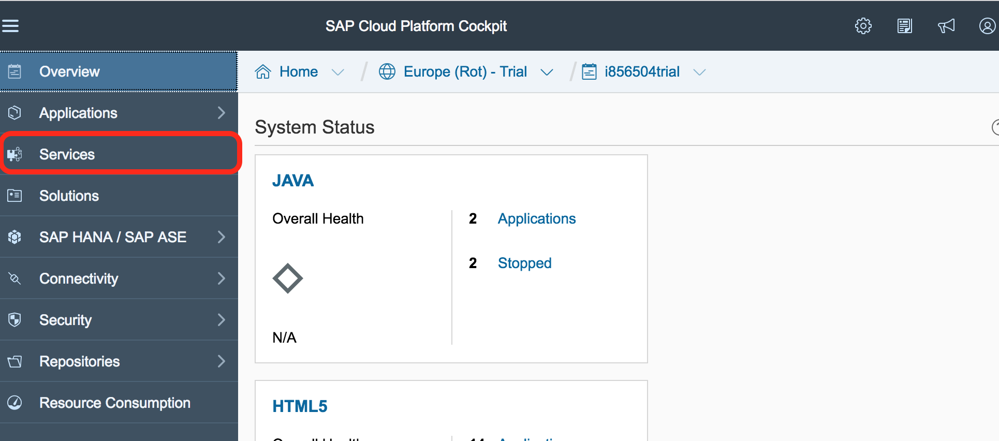
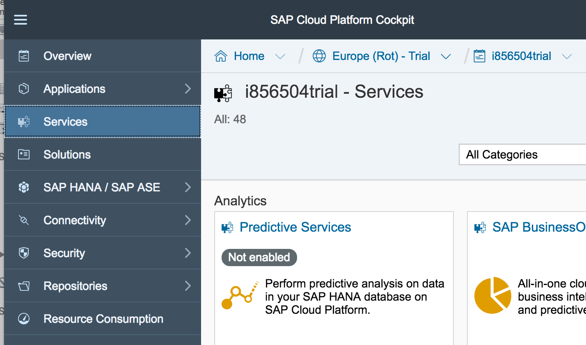
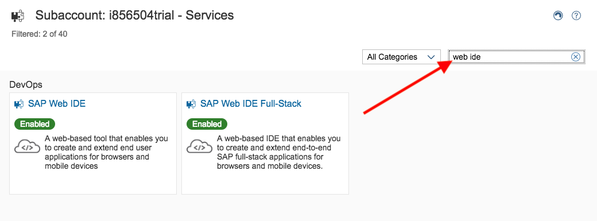
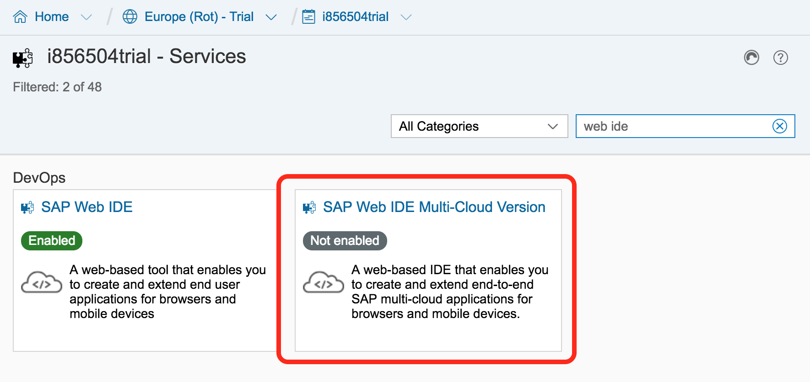
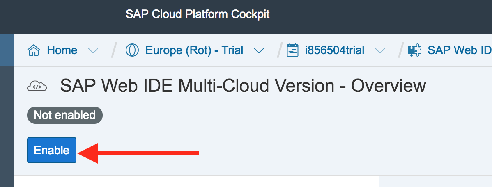
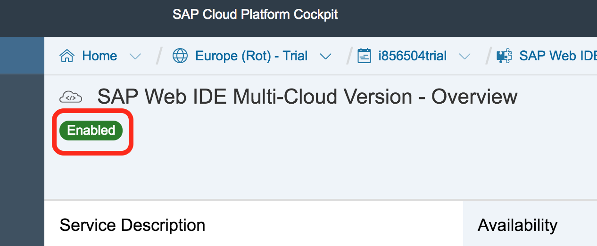
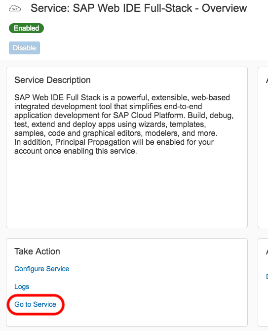
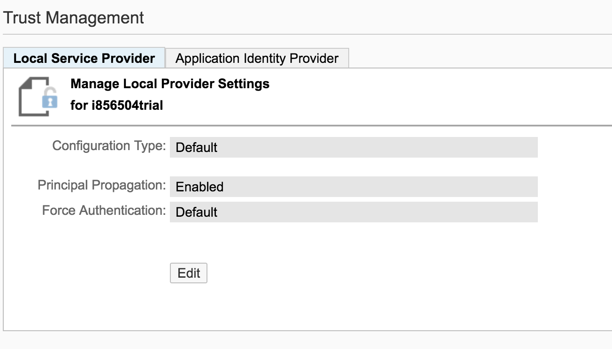

## Prerequisites  
 - **Proficiency:** Beginner
 - **Tutorials:** [Add API Business Hub API to a UI5 Application](https://www.sap.com/developer/tutorials/hcp-abh-api-ui5-app.html)

## Next Steps
 - [Using SAP API Business Hub with Web IDE](https://www.sap.com/developer/tutorials/webide-api-hub.html)
 
## Details
### You will learn  
Find all the latest features available from SAP Web IDE in the latest, full-stack enabled version.

### Time to Complete
**5 Min**

---

[ACCORDION-BEGIN [Step 1: ](Open SAP Cloud Platform services)]
Open your SAP Cloud Platform account. Make sure you are in a `Neo` Environment, not one of the new Cloud Foundry environments. `Neo` is the classic, proprietary SAP Cloud Platform.

Go to **Services**

[ACCORDION-END]

[ACCORDION-BEGIN [Step 2: ](Find SAP Web IDE Full-Stack)]
On the Service catalog, search for **Web IDE**.

Select the **SAP Web IDE Full-Stack** service.

[ACCORDION-END]

[ACCORDION-BEGIN [Step 3: ](Enable the service)]
Once the service page loads, **Enable** the service. This may take a few minutes.

Wait for the status to change to the green, _Enabled_ status.

[ACCORDION-END]

[ACCORDION-BEGIN [Step 4: ](Open the SAP Web IDE)]
Once the service is enabled, click the **Go to Service** link. This will open the new, full-stack version of SAP Web IDE.

SAP Web IDE Full-Stack includes some new features. You will explore them in the following tutorials.

[ACCORDION-END]

### Optional

[ACCORDION-BEGIN [Step 5: ](Troubleshooting the SAP Web IDE)]
Are you having trouble opening SAP Web IDE Full-Stack? If you are seeing a 501/503 error, it may be that your principal propagation flag is not set properly.

To enable your principal propagation flag, in your SAP Cloud Platform Cockpit, click **Security** then **Trust**.

If the **Principal Propagation** flag is set to _Default_ or _Disabled_, you will need to update it. Click **Edit**.

Change the value of **Principal Propagation** to _Enabled_ and **Save**.

Now, go back to step 4 and try to open SAP Web IDE Full-Stack again.

[ACCORDION-END]

## Next Steps
- [Using SAP API Business Hub with SAP Web IDE](https://www.sap.com/developer/tutorials/webide-api-hub.html)
