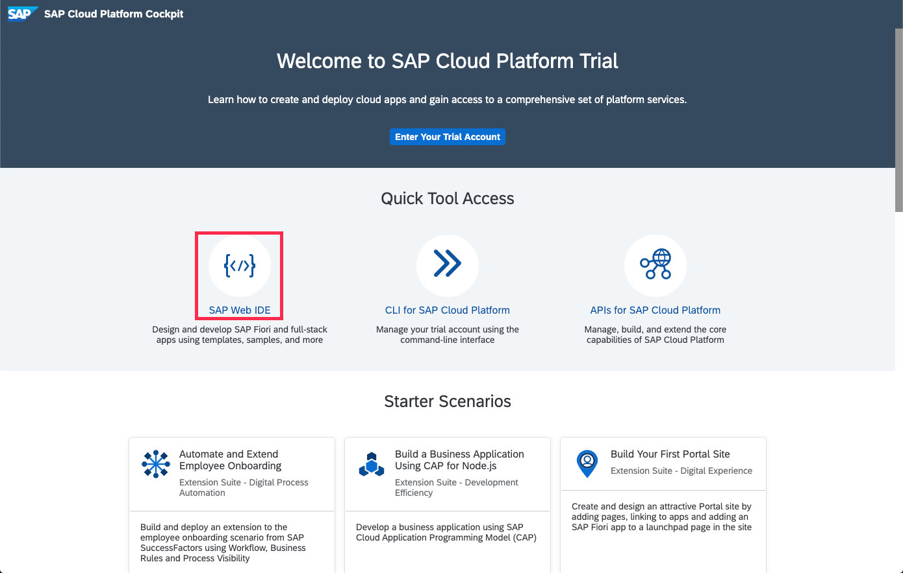

## Details
### You will learn  
  - How to open SAP Web IDE Full-Stack

You can use many different tools to build and deploy apps on the SAP Cloud Platform, but we recommend SAP Web IDE, a service of SAP Cloud Platform. In this tutorial, you'll locate it and access it, all from your browser, without needing to install anything.

---

[ACCORDION-BEGIN [Step : ](Open SAP Web IDE Full-Stack)]

Open your SAP Cloud Platform account (if you have a free developer account, click [here](https://account.hanatrial.ondemand.com/) to open the home page).

 Click on **Launch SAP Web IDE** to see navigate further.

You might be asked to accept a disclaimer if you come here for the first time. **Check** the box and click **accept** to do so.

[DONE]
[ACCORDION-END]

[ACCORDION-BEGIN [Step : ](Bookmark the page)]

A new tab opens, and SAP Web IDE Full-Stack loads.

>**Bookmark this page!**  If you create a bookmark to this page, it is easy to get back to SAP Web IDE Full-Stack later.

Copy and paste the URL from your SAP Web IDE Full-Stack into the text box below.

[VALIDATE_4]
[ACCORDION-END]
