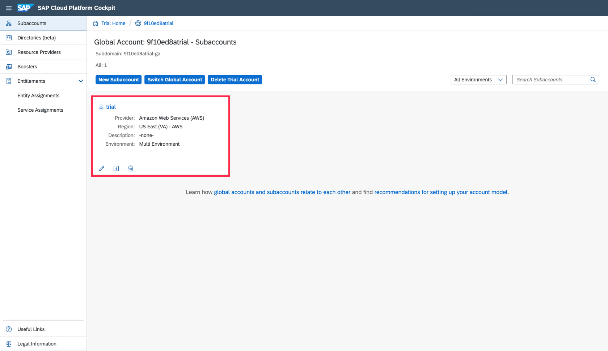
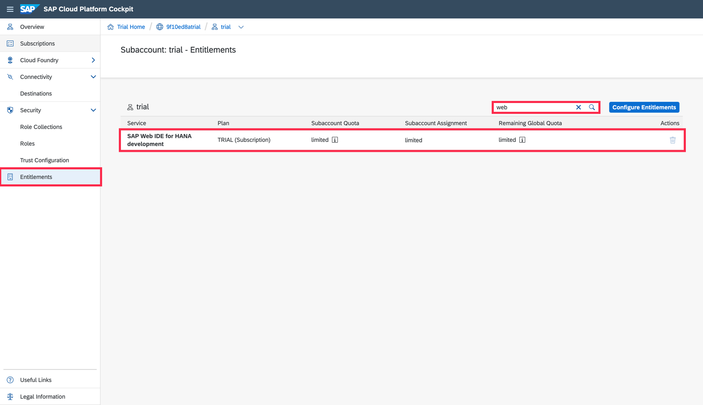
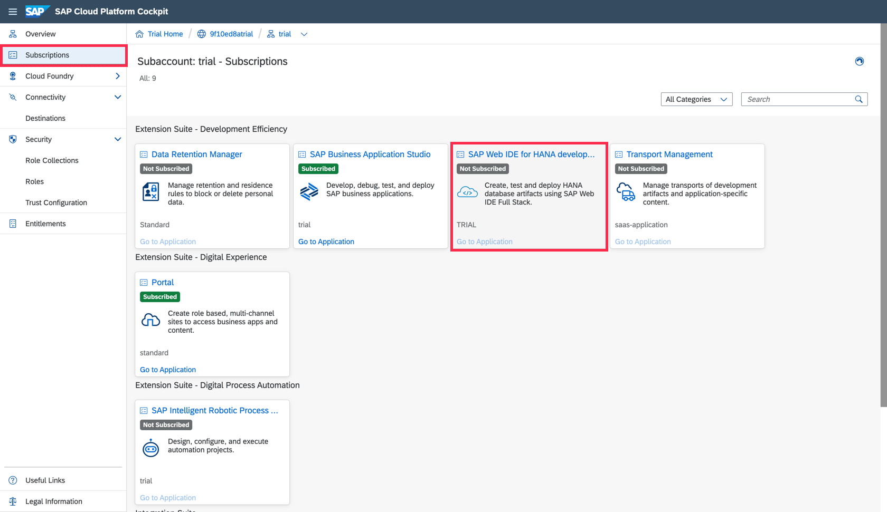
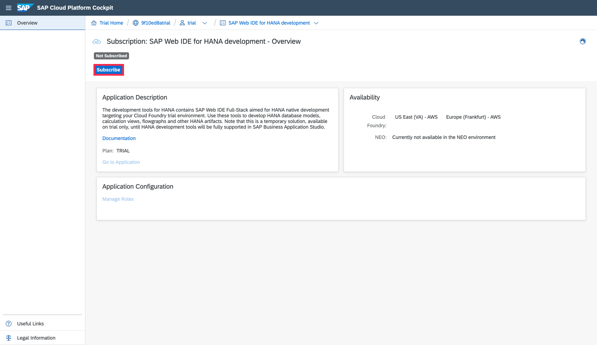
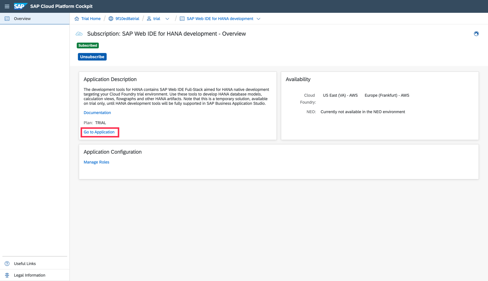

## Prerequisites
 - You have a productive account with entitlement to the SAP HANA service for SAP Business Technology Platform in SAP Business Technology Platform, Cloud Foundry environment

## Details
### You will learn  
  - How to open SAP Web IDE Full-Stack

>**This tutorial cannot currently be completed with a trial account.**

In this tutorial, you'll locate the SAP Web IDE and access it, all from your browser, without needing to install anything.

---

[ACCORDION-BEGIN [Step: ](Log into SAP Cloud Platform)]

1. Go to <https://account.hana.ondemand.com/#/home/welcome> and log in to your SAP BTP cockpit.

2. Navigate to your **global account** and then **subaccount**.

    !

[DONE]
[ACCORDION-END]
[ACCORDION-BEGIN [Step : ](Verify that the SAP Web IDE entitlement is in place)]

Select **Entitlements** on the left-hand menu to see all entitlements that are assigned to this subaccount. Locate the **`SAP Web IDE`** entitlement from this list.

!

> In case you are missing the entitlement, please follow this tutorial to [Add a New Entitlement to Your Subaccount](cp-cf-entitlements-add).

[DONE]
[ACCORDION-END]
[ACCORDION-BEGIN [Step : ](Subscribe to SAP Web IDE for HANA Development)]

1. Select **Subscriptions** on the left-hand menu in the SAP BTP cockpit to see all available subscriptions.

    !

2. This detail page will show you a service description and provide you with a link to the service documentation. Click the blue button to **Subscribe** to this service.

    !
3.  Click on **Go to Application** to open  SAP Web IDE.

    !

    You might be asked to accept a disclaimer if you come here for the first time. **Check** the box and click **accept** to do so.

    

[DONE]
[ACCORDION-END]
[ACCORDION-BEGIN [Step : ](Bookmark the page)]

A new tab opens, and SAP Web IDE Full-Stack loads.

>**Bookmark this page!**  If you create a bookmark to this page, it is easy to get back to SAP Web IDE Full-Stack later.

Copy and paste the URL from your SAP Web IDE Full-Stack into the text box below.

[VALIDATE_4]
[ACCORDION-END]
