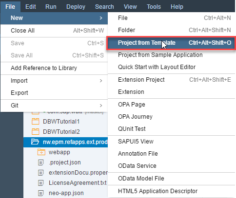
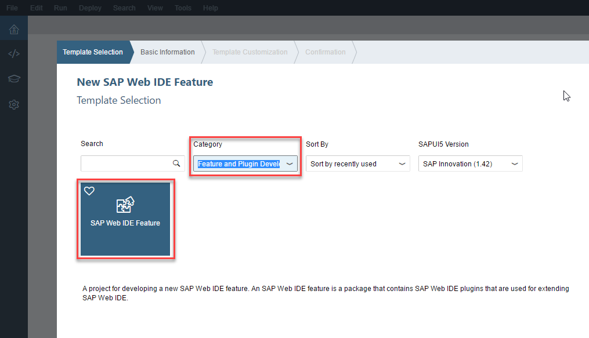
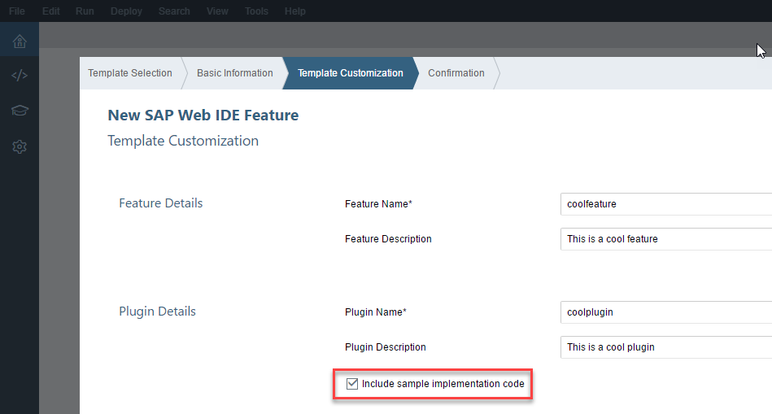
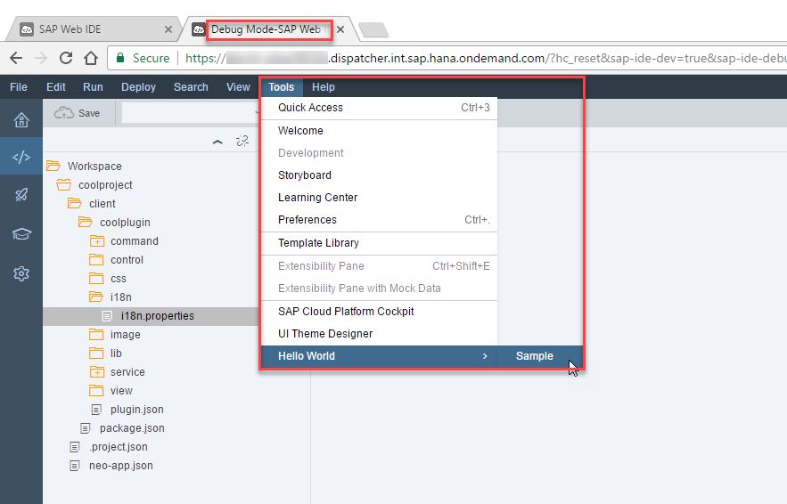

## Prerequisites  
 - None

## Next Steps
 - [Change Code in a Plugin](https://developers.sap.com/tutorials/webide-sdk-helloworld2.html)

## Details
### You will learn  
- How to create a feature project (which will contain a plugin module)
- How to add sample code to the plugin
- How to test the plugin

### Time to Complete
**10 Min**

---

[ACCORDION-BEGIN [Step 1: ](Create a new plugin project)]
After opening SAP Web IDE, choose **File > New > Project from Template**.

Alternatively, you can click the **New Project from Template** icon on the SAP Web IDE Welcome screen.

[ACCORDION-END]

[ACCORDION-BEGIN [Step 2: ](Select the feature template)]
A wizard opens and on the **Template Selection** screen, choose **SAP Web IDE Feature**, and then click **Next**.

> If you don't see the feature template, make sure the **Category** selector is on **Feature and Plugin Development** or **All categories**.  

On the **Basic Information** screen, enter `coolproject` for the project name, and then choose **Next**.

[ACCORDION-END]

[ACCORDION-BEGIN [Step 3: ](Customize the plugin)]

On the **Template Customization** screen, enter the following information, select the **Include sample implementation code** checkbox and click **Finish**.

Field Name             | Value
:--------------------- | :-------------
Feature Name           | `coolfeature`
Feature Description    | `This is a cool feature`
Plugin Name            | `coolplugin`
Plugin Description     | `This is a cool plugin`

[ACCORDION-END]

[ACCORDION-BEGIN [Step 4: ](Test the plugin)]
In the Workspace, right-click the **`plugin.json`** file and choose **Run > Run As Plugin**. SAP Web IDE opens in a new browser tab called **Debug Mode**.

In the new browser tab, use the plugin by going to the **Tools** menu and selecting **Sample > Hello World**. A dialog opens with a message.

[ACCORDION-END]

