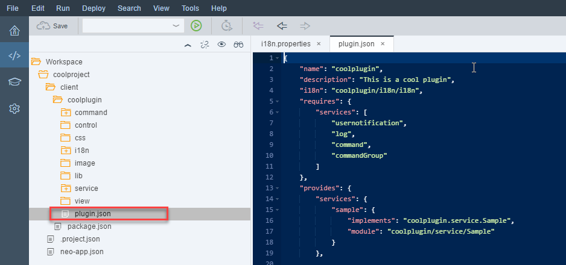

## Prerequisites  
 - [Create a New Plugin Project](http://www.sap.com/developer/tutorials/webide-sdk-helloworld1.html)

## Next Steps
- [Deploying a Feature to SAP Cloud Platform](http://www.sap.com/developer/tutorials/webide-sdk-helloworld3.html)

## Details
### You will learn  
  - How to modify i18n strings
  - How to configure an API service
  - How to test a plugin  

### Time to Complete
**5 Min**

---

[ACCORDION-BEGIN [Step 1: ](Modify i18n strings)]

In the workspace, go to **`coolproject` > client > `coolplugin` > i18n** and double-click the `i18n.properties` file, change the following strings and click **Save**.

Old Value              | New Value
:--------------------- | :-------------
`command_helloworld`   | `Welcome`
`commandgroup_sample`  | `Greetings`

  

[DONE]
[ACCORDION-END]

[ACCORDION-BEGIN [Step 2: ](Change menu by configuring an API service)]

In the workspace, go to **`coolproject` > client > `coolplugin`** and double-click the `plugin.json` file, Change all occurrences of `tools` to `edit` then click **Save**.

[DONE]
[ACCORDION-END]

[ACCORDION-BEGIN [Step 3: ](Test the plugin)]

In the Workspace, right-click the **`plugin.json`** file and choose **Run* > Run As Plugin**. SAP Web IDE opens in a new browser tab called **Debug Mode**.

You can open the same dialog as in the previous tutorial, but now the menu item is located in the **Edit** menu and is called **Greetings > Welcome**.

[DONE]
[ACCORDION-END]

## Next Steps
- [Deploying a Feature to SAP Cloud Platform](http://www.sap.com/developer/tutorials/webide-sdk-helloworld3.html)
