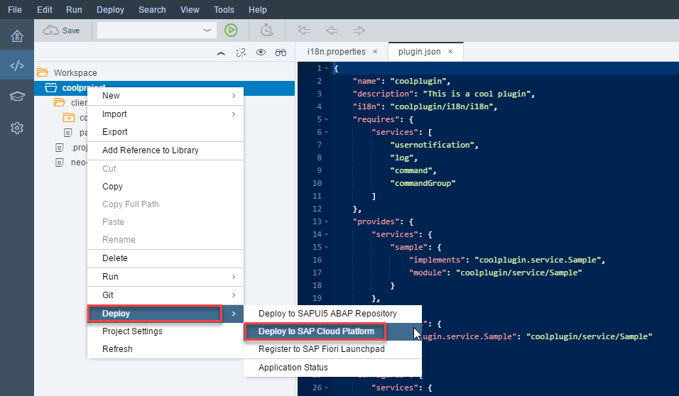
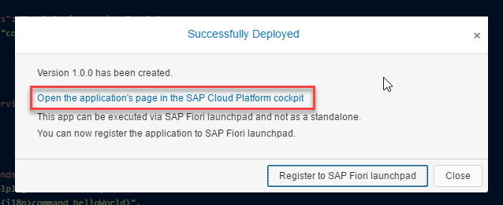
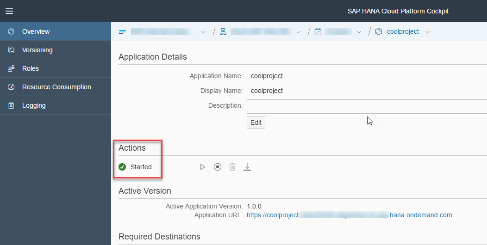
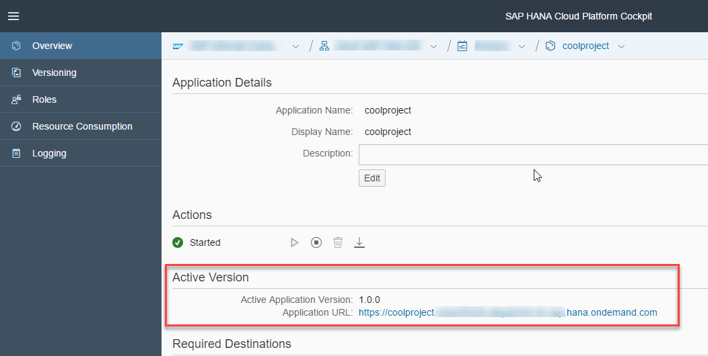

## Prerequisites  
 - [Create a New Plugin Project](http://www.sap.com/developer/tutorials/webide-sdk-helloworld1.html)
 or
 - [Change Code in a Plugin](http://www.sap.com/developer/tutorials/webide-sdk-helloworld2.html)
 or
 - Create a working plugin.

## Next Steps
 - [Creating a Destination for Consuming a Plugin]

## Details
### You will learn  
  - How to deploy a feature (and its plugins) to SAP Cloud Platform

### Time to Complete
**5 Min**

---

[ACCORDION-BEGIN [Step 1: ](Deploy the application)]
In the workspace, right-click the plugin folder and choose **Deploy** | **Deploy to SAP Cloud Platform**.
> If prompted, log in to your account.

In the **Deploy Application to SAP Cloud Platform** dialog, choose **Deploy**.

[DONE]
[ACCORDION-END]

[ACCORDION-BEGIN [Step 2: ](Check the deployment)]
In the **Successfully Deployed** dialog box, choose **Open the application's page in the SAP Cloud Platform cockpit**. The SAP Cloud Platform cockpit opens in a new tab.

Check the status of the application to make sure it is started.

The application URL is shown under **Active Version**. Save this link for later use.

[DONE]
[ACCORDION-END]

## Next Steps
- [Creating a Destination for Consuming a Plugin](http://www.sap.com/developer/tutorials/webide-sdk-helloworld4.html)
