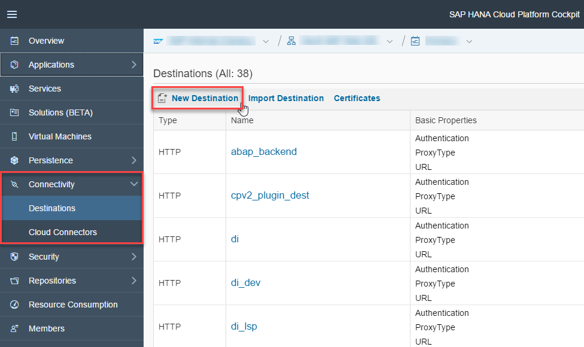
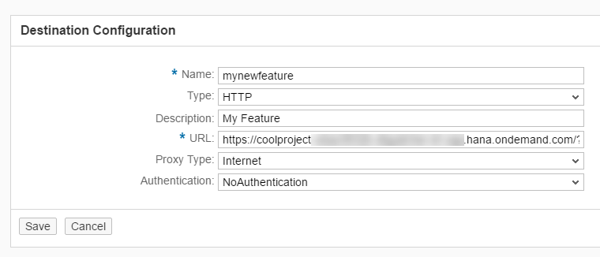

## Prerequisites  
 - [Deploying a Feature to SAP Cloud Platform](http://www.sap.com/developer/tutorials/webide-sdk-helloworld3.html)

## Next Steps
 - [Activating a Plugin](http://www.sap.com/developer/tutorials/webide-sdk-helloworld5.html)

## Details
### You will learn  
  - How to create a destination that points to your plugin

### Time to Complete
**5 Min**

---

[ACCORDION-BEGIN [Step 1: ](Create new destination)]
In the SAP Cloud Platform cockpit, choose **Destination** | **New Destination**.

[DONE]
[ACCORDION-END]

[ACCORDION-BEGIN [Step 2: ](Add destination parameters)]
Enter the following parameters for your destination.

|Parameter          | Value                                     |
|--------------------|----------------------------------------|
|`Name`  | `mynewfeature`                              |
|`Type` | `HTTP`                           |
|`Description`  | `My Feature`                              |
|`URL` | The application URL for your feature (which we saved previously from the SAP Cloud Platform cockpit)                            |
|`Proxy Type`  | `Internet`                              |
|`Authentication` | `NoAuthentication`                           |
The parameters for the destination look like this:

[DONE]
[ACCORDION-END]

[ACCORDION-BEGIN [Step 3: ](Add SAP Web IDE parameters)]
Add the following SAP Web IDE properties by choosing **New Property**.

|Parameter         | Value                               |
|------------------|-------------------------------------|
|`WebIDEEnabled`   | `true`                              |
|`WebIDEUsage`     | `feature`                           |

The SAP Web IDE properties for the destination look like this:

Choose **Save**.

[DONE]
[ACCORDION-END]

## Next Steps
- [Activating a Plugin](http://www.sap.com/developer/tutorials/webide-sdk-helloworld5.html)
