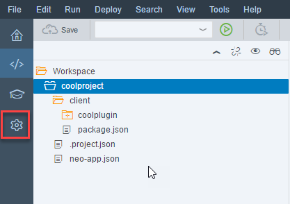
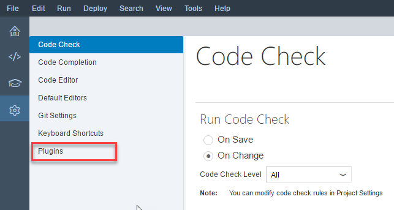
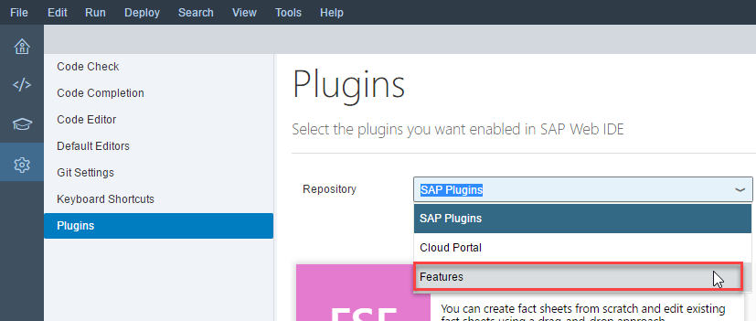
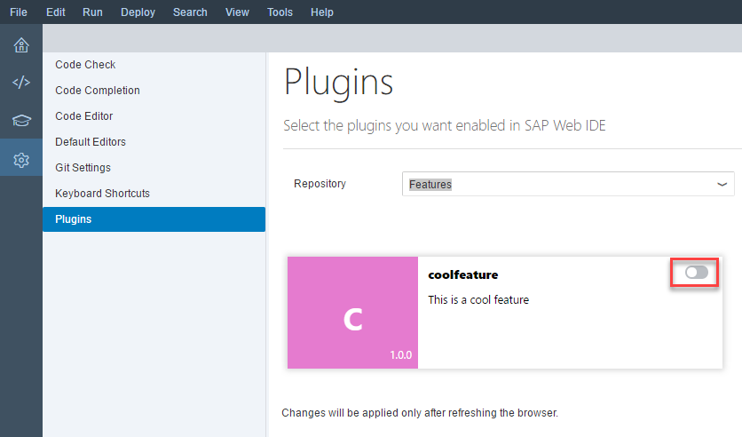
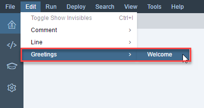

## Prerequisites  
 - [Creating a Destination for Consuming a Plugin](https://developers.sap.com/tutorials/webide-sdk-helloworld4.html)

## Details
### You will learn  
  - How to activate a plugin

---

[ACCORDION-BEGIN [Step 1: ](Open plugins page)]
In the left sidebar, choose Settings.

Then, in the pane that opens, choose **Features**.

[ACCORDION-END]

[ACCORDION-BEGIN [Step 2: ](Show available plugins)]
In the Repository drop-down menu, choose **Features**.

[ACCORDION-END]

[ACCORDION-BEGIN [Step 3: ](Enable plugin)]
In the `coolfeature` box, click the button to enable it, then choose **Save**.

[ACCORDION-END]

[ACCORDION-BEGIN [Step 4: ](Refresh SAP Web IDE)]
Refresh the SAP Web IDE. Now you should see the new **Greetings** menu in the **Edit** menu.

[ACCORDION-END]
