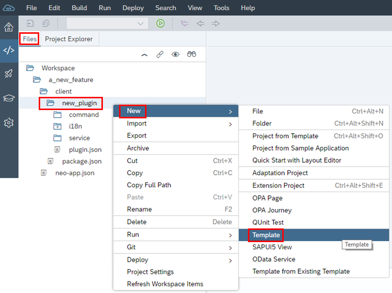
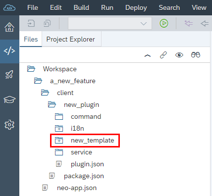

## Details
### You will learn
- How to create your own reusable wizard template from scratch.

### Before you begin
For this tutorial, you must have a feature project in your workspace. If you do not have one, create one as described in [Creating Our First Feature \(MTA\)] (https://sdk-sapwebide.dispatcher.hana.ondemand.com/index.html#/topic/1cba01c3a1c4412bbe48593562726a09).

---

[ACCORDION-BEGIN [Step 1: ](Open template wizard)]
In the development perspective of SAP Web IDE, on the **Files** tab, in the workspace, right-click your plugin folder and then choose **New** > **Template**.

[DONE]

[ACCORDION-END]

[ACCORDION-BEGIN [Step 2: ](Enter template information)]
In the wizard, in the **Template Information** screen, enter the following:

  - **Name**
  - **Description** (Optional)
  - **Type** - From the dropdown list, select one of the following:
    - **project** - A template of the **project** type generates a complete standalone project.
    - **component** - A template of the **component** type generates an artifact that can be added to an existing project.
  - **Category** - The category under which your new template will be displayed in the **New Project from Template** wizard. You can select one of the existing categories, or create your own custom category for your template.

> If you are creating a template that will replace an existing one within this plugin, select the **Overwrite existing template checkbox**.

Choose **Next**.

[DONE]
[ACCORDION-END]

[ACCORDION-BEGIN [Step 3: ](Set up wizard steps)]
Now you decide on the steps that will appear in the wizard when a developer uses your new template. In the **Wizard Step Selection** screen, steps 1 and 2 are provided and predefined:

  - **Select a Template**
  - **Project Basic Information**

To add more wizard steps, you can choose **Add Step** and then for each step, in the dropdown list, select one of the following step types, which are provided out-of-the-box:

Step Type Technical Name | Step Description
-------------------------|--------------------------------------------------------
`catalogstep`  | **Data Connection** step, where the user connects to an OData service.
`odataAnnotationSelectionStep` | **Annotations Selection** step, where the user selects the UI annotation files that were selected in the `catalogstep` step, and then ranks the order in which they will be loaded in the generated project.
`templateCustomizationStep` | **Template Customization** step, where the user provides data that the template needs for generation. If this step is selected, the `modelRoot` and `modelFileName` configuration properties must be provided for the template.
`componentConfirmStep` | A customized finish step that appears as the content of the **Confirm** step in the wizard. It is intended for component-type templates only. The step displays the target location for generating the component and allows the user to select whether to overwrite an already existing component. For including this step in your component template, provide it as the last step in the wizard steps array.

> The order in which you select the steps determines the order in which they appear in the wizard template. You can add each step only once.

 

> You can create your own custom step. For more information, see [Developing Custom Wizard Steps](https://sdk-sapwebide.dispatcher.hana.ondemand.com/index.html#/topic/3077337abe2c42b885af557d3ddbedba).

Choose **Next**.

[DONE]
[ACCORDION-END]

[ACCORDION-BEGIN [Step 4: ](Confirm template)]
In the **Confirmation** screen, choose **Finish** to confirm and create your new wizard template in your plugin project.

### Step Result
The generated template folder includes all the template files, including the template class, an empty `model.json` file, and a resources folder with a sample template resource. You can modify these files based on your needs, and provide this new template to your SAP Web IDE users.

> If you make any changes in the `resources` folder, you need to make sure to archive it. To do that, right-click the `resources` folder, and then choose **Archive**.

You can change the configurations that were defined when creating the wizard template in the generated code.
For more information, see [Template Configuration](https://sdk-sapwebide.dispatcher.hana.ondemand.com/index.html#/topic/0fb5b41502d749c6b169fb84eeb3f348) and [Template Categories](https://sdk-sapwebide.dispatcher.hana.ondemand.com/index.html#/topic/0aee14dfc2b2416282ea1ac4decdbac7).

> To build, deploy, and activate your new wizard template, you can follow the instructions in the links above under **Next Steps**.

[VALIDATE_1]
[ACCORDION-END]

---
