## Prerequisites
 - Enable the Storyboard feature should be enabled in the **Preferences** perspective, on the **Features** tab.
 - [Create a destination pointing to SAP Gateway Demo System](https://developers.sap.com/tutorials/teched-2016-3.html) \(ES5\)

## Details
### You will learn
  - How to create a new SAP Web IDE project from a template.
  - Why using the Storyboard helps you add a new view and configure it with no need to write code.

  The Storyboard perspective is one of the most powerful features of SAP Web IDE Full-Stack.

  The Storyboard provides a visual representation of your application's UI, including its pages (views), navigations, and the services and entities that it uses. And it can be used to build some parts of your app without coding.

  You will create an application based on the SAP Fiori Worklist template, where in its first view you'll present a list of sales orders, and from each row in the list you will navigate to a view presenting the sales order items.

---

[ACCORDION-BEGIN [Step 1: ](Create a sales orders app based on the SAP Fiori Worklist Application template)]

In SAP Web IDE Full-Stack:

1. From the menu, select: **File** > **New** > **Project from Template**.
2. Select the **SAP Fiori Worklist Application** template.
3. Give the project a name, title, and namespace and click **Next**.
4. Select the ES5 Gateway Demo System and the `GWSAMPLE_BASIC` service. For more information, see the prerequisites.
5. Select App Type to be **Standalone App**.
6. Select:
    - Object Collection: `SalesOrderSet`
    - Object Title: `CustomerName`
    - Object Numeric Attribute: `NetAmount`
    - Object Unit of Measure: `CurrencyCode`
7. Click **Finish**.

>Optional: You can run the app at this point to see what it looks like (when prompted to select the file to run, select the `index.html` file).

[DONE]
[ACCORDION-END]

[ACCORDION-BEGIN [Step 2: ](Launch the Storyboard)]
In your workspace, select your Sales Orders project and then open the **Storyboard** perspective from the left sidebar.

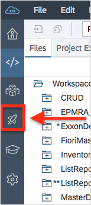

You can immediately see the visual representation of your app. You can expand the Entity Sets and see the `SalesOrdersSet`.

[DONE]
[ACCORDION-END]

[ACCORDION-BEGIN [Step 3: ](Add a new view)]
Start by adding a new view to your app. At the top left corner, click **New View**.

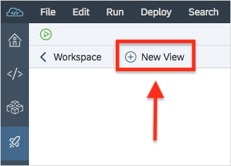

Enter a name for the new view, such as `SalesOrderItems`, click **Next** and then **Finish**.

You can see the new view was added in the Storyboard.

[DONE]
[ACCORDION-END]

[ACCORDION-BEGIN [Step 4: ](Build the new view)]
In this step, you want to present a list of sales orders where each row in the list has a link that lets you navigate to a view that displays the sales order items.

1. You need to build your new view to present the sales order items. While in the Storyboard, hover over the new view and click on the Pencil icon. This opens the view in the layout editor.

     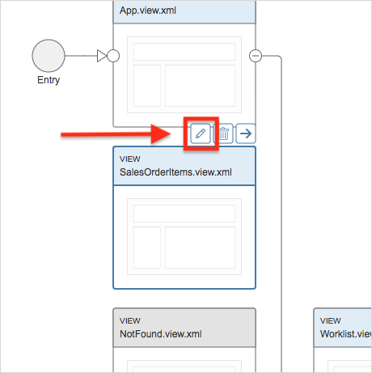

2. On the left, search for a list, then drag and drop it onto the canvas.

3. Click the list in the canvas in order to select the `Standard List Item` property.

4. On the right, in the Properties pane, click to select the entity set to which you want to bind the `Standard List Item` property.

    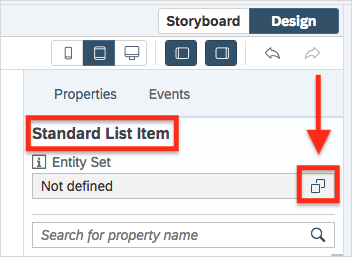

5. In the **Select Entity Set** dialog box, select the third radio button and the `/SalesOrderLineItemSet` entity.

    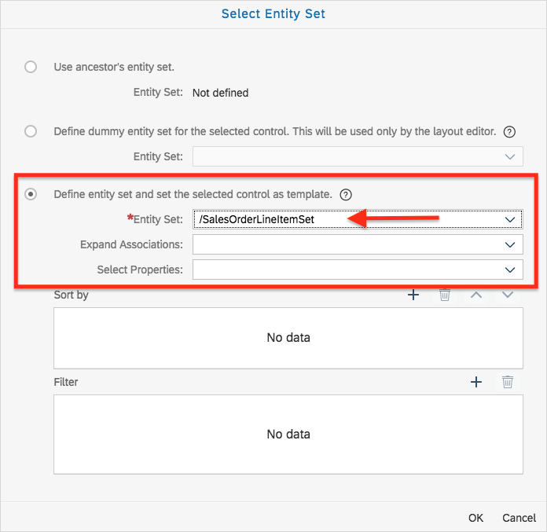

Click **OK** to close the dialog box.

[DONE]
[ACCORDION-END]

[ACCORDION-BEGIN [Step 5: ](Bind the title and description)]
1. In the Properties pane, click on the **Binding** button of the **Title** property.

     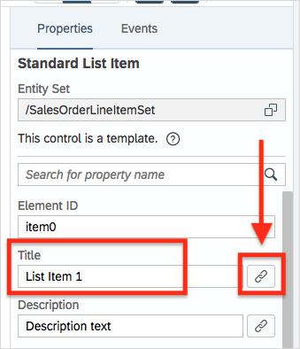

2. Delete **List Item 1** and double-click the **`ProductID`** property, then
click **OK**.

     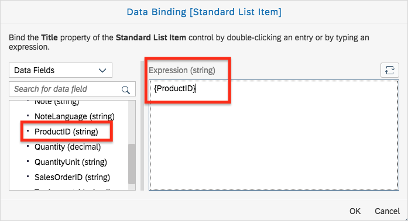

3. In the same manner, bind the **Description** property to two properties: **Quantity** and **`QuantityUnit`**, then click **OK**.

     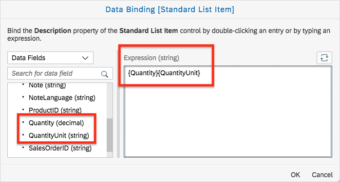

The current type of the `StandardListItem` property is configured as a navigation, but it's better not to navigate using this list, so change it to **Inactive** in the Properties pane (you may need to scroll down a bit).

[DONE]
[ACCORDION-END]

[ACCORDION-BEGIN [Step 6: ](Optional: Bind the page title to the i18n.properties file)]

>Optional: You can bind the page's title to a string from the `i18n.properties` file as explained below.

1. Select the **Page** control.
This can be done on the canvas or in the **Outline** tab on the left (select the `sap.m.Page` control). Verify that the **Page** control is actually selected by making sure that **Page** is displayed in the Properties pane.

      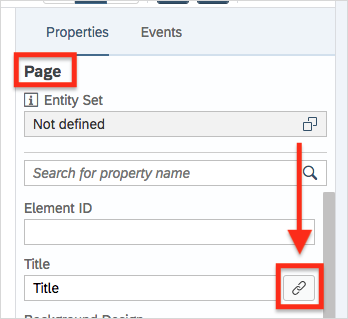

2. Click the **Binding** button of the **Title** property.

     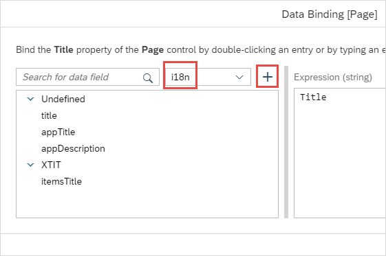

3. Enter a **String Key**, **Value** and **Type** as shown below, then click **OK**.

     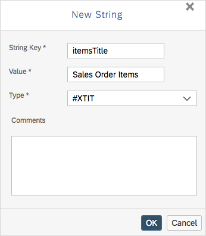

4. Delete the **Title** string from the **Expression** text area, and double-click the new `i18n` string you just added. It is added to the **Expression** text area.
Click **Bind**.

      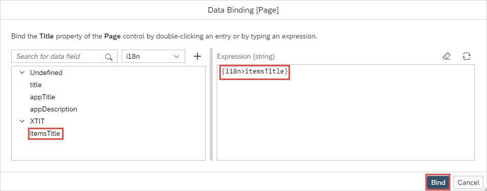

    The new view should look like this:

      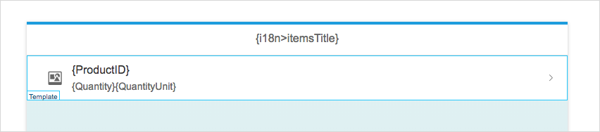

[DONE]
[ACCORDION-END]

[ACCORDION-BEGIN [Step 7: ](Configure navigation)]
Now that you finished modeling your new view, you need to "connect" it to the app; in other words, make it part of the flow.

You need to configure a navigation from the `Worklist.view.xml` file to your new view.
For this you need to return to the Storyboard.

1. On the upper-right corner, click on the **Storyboard** tab.

    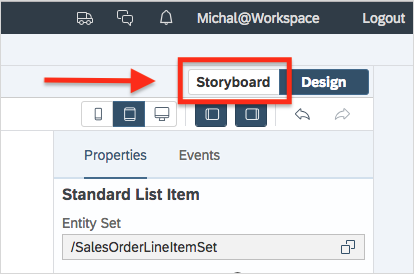

    You can see that the new view now has a new entity set:

    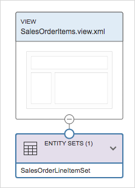

2. Now you need to configure the navigation in just a few clicks. First, hover over **`Worklist.view.xml`** and click the **Configure navigation** \(arrow\) button.

    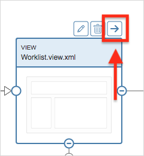

3. In the **Configure Navigation** dialog box, do the following:

    - In the **Control** field, click the **Show all controls in this view** icon  and then in the **Select Control** dialog box that opens, select **`ColumnListItem`**, where the navigation will begin.

    - In the **Event** dropdown list, select **press**.

    - In the **Navigate To** dropdown list, select the new view. Leave the **Target Control** and **Open Target At** fields as is; they are populated automatically when you select the "Navigate To" view.

    - Select the **Propagate context binding** checkbox to propagate the `SalesOrder` entity.

    - Choose **Configure Navigation** to close the dialog.

    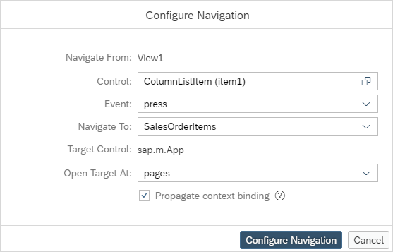

    Note that now the Storyboard displays the new navigation.

4. Since the `Object.view.xml` file is no longer needed, you can delete it. Hover over it and click the **Delete view** button, and confirm when prompted. The Storyboard adjusts itself and now the flow is clearer.

    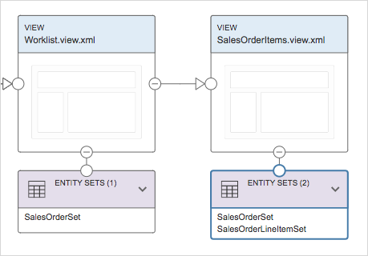

[VALIDATE_1]
[ACCORDION-END]

[ACCORDION-BEGIN [Step 8: ](Optional: Configure back navigation)]
Click the pencil icon to edit the new view again.

Make sure the **Page** control is selected.

Change the **Show Nav Button** property to `True`.

In the Storyboard, configure the navigation from the new view to the `Worklist.view.xml` file with the following values:

Field | Value
------------ | -------------
**Control** | `Page`
**Event** | `navButtonPress`
**Navigate To** | `Worklist`

[DONE]
[ACCORDION-END]

[ACCORDION-BEGIN [Step 9: ](Run the app)]

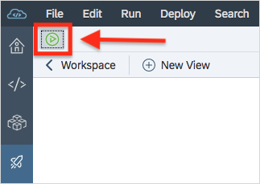

In the Storyboard, click the **Run** button \(if prompted to select the file to run, select the `index.html` file\).     

Now you can navigate through the app that you built in minutes.

[DONE]
[ACCORDION-END]

---
