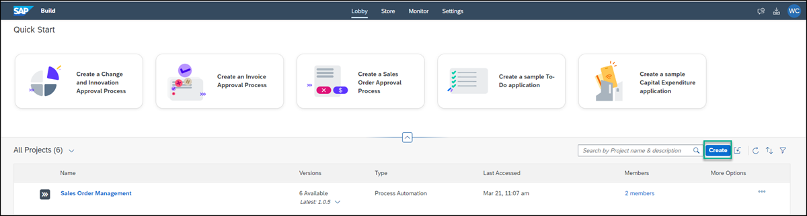
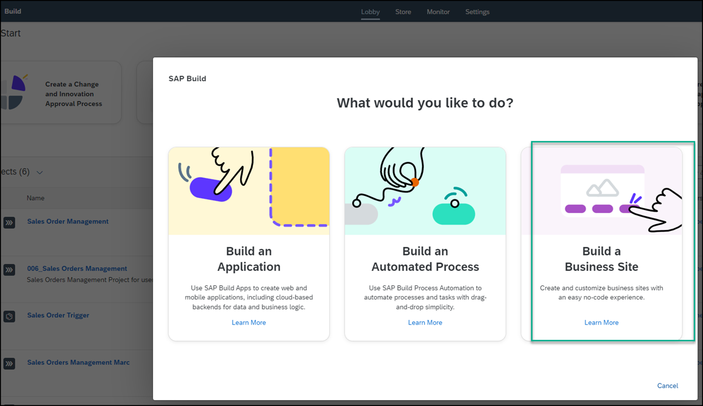
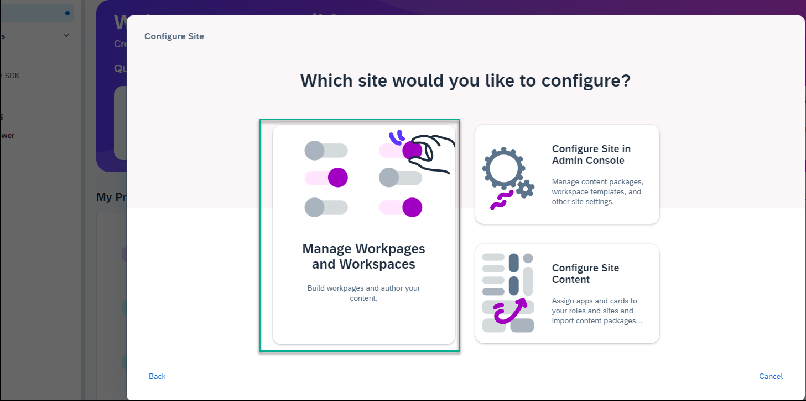

# Access SAP Build Work Zone, advanced edition from the SAP Build Lobby
<!-- description --> Access the SAP Build Work Zone, advanced edition from the SAP Build Lobby.

## Prerequisites
To follow the trainings, the instructor will give you a URL to the SAP Build Lobby used for this training
 

## You will learn
  How to access SAP Build Work Zone, advanced edition via the SAP Build Lobby

## Intro
There are 2 ways to access SAP Build Work Zone, advanced edition:

 - From SAP BTP cockpit - for more information, please reference this tutorial: [Access SAP Build Work Zone, advanced edition from the SAP BTP Training Subaccount](https://developers.sap.com/tutorials/workzone-workshop1-access.html)
 - From the SAP Build Lobby
  
  In this workshop tutorial mission, you'll be accessing the SAP Build Work Zone, advanced edition tutorial environment from the SAP Build Lobby. Once you've accessed the service, in the next tutorial, you'll create a workspace in your site and add content to it.

---

### Access SAP Build Work Zone, advanced edition

1. Navigate to the SAP Build Lobby using the URL that you received.

2. Click **Create** to see what you can build in SAP Build.

    <!-- border -->

3. Click the **Build a Business Site** tile.

    <!-- border -->

4. Click the **Manage Workpages and Workspaces** tile.

    <!-- border -->

    You've accessed SAP Build Work Zone, advanced edition and you can now create a workspace and add content to your pages.

    