# Create a Site Menu in Your SAP Build Work Zone, advanced edition Site
<!-- description --> Use the versatile SAP Build Work Zone, advanced edition menu editor to easily create a fully customized menu bar in your site.

## Prerequisites
- The onboarding steps for SAP Build Work Zone, advanced edition have been completed in your subaccount that includes a subscription to the SAP Build Work Zone, advanced edition service. Note that SAP Build Work Zone, advanced edition is not available in a trial account
- You are a company administrator 

## You will learn
  - How to add menu items to your site menu

  In this tutorial you'll create a workpage and a workspace and add both to the site menu so that you can directly link to them. You will also add an app to your site menu and access it directly from the menu.

## Intro
When you open your site for the first time, the menu bar displays a number of predefined menu items, namely **Home**, **My Workspace**, **Applications**, **Workspaces**, and **Tools**. In this tutorial, we’re going to design a completely different menu bar using some of these predefined menu items as well as adding our own custom menu items.

---

### Download image for your workspace

Before you start, download this image file so that it's on your computer ready for you to add to your workpage that you'll create later in this tutorial.  [`workspace_row2_image1.jpg`](Workspace_Images/workspace_row2_image1.jpg)

### Open the Menu Editor

1.	Hover over the top default menu bar of your site to expose the edit icon and click it to open the Menu Editor.

     <!-- border -->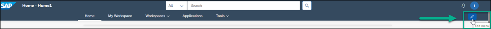

    > On the left of the screen, you'll see the **Menu Editor** panel displaying a list of menu items. These are the same menu items displayed in your top menu bar. As you add and remove menu items from the panel, the menu bar updates to reflect your changes.

    <!-- border -->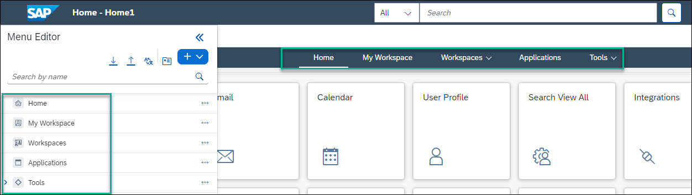

### Remove default menu items

In this step, we'll hide the default menu items that we don't need.

1. Next to **My Workspace**, click the 3 dots to open a list of actions and select **Hide**.

    <!-- border -->

2. Do the same for the **Applications** and **Tools** menu items.

When you're done, you'll see that your menu now only has 2 menu items and the others are grayed out. You can always put them back if you want. You can also delete them if you're sure you won't need them again. In the next step, you're going to add your own menu content.

### Create a workpage in the Menu Content screen

In this step, you're going to add a workpage to the site menu that users of your site can access. If the workpage doesn't already exist in your site, you can create it directly in the **Menu Content** screen of the **Menu Editor** and then reference it from the menu.

>You can create other types of content in the **Menu Content** screen too such as blog posts, wiki pages, and much more.

1. Click the **Content** icon in the top area of the **Menu Editor** panel.

    <!-- border -->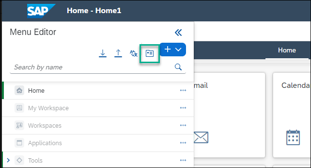

2. In the **Menu Content** screen, select **+ Create** and select **Workpage** to open a workpage editor.

    <!-- border -->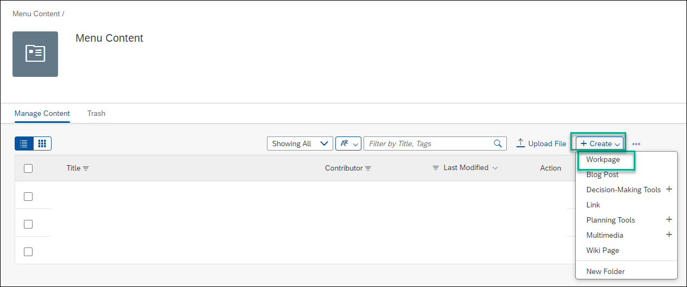

3. Enter a title for the workpage: `Our Story` and then click **+** to add a section to the workpage.

    <!-- border -->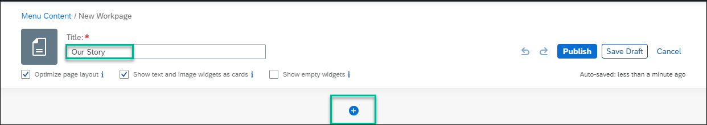

4. In the section, click **Add Widget**.

    <!-- border -->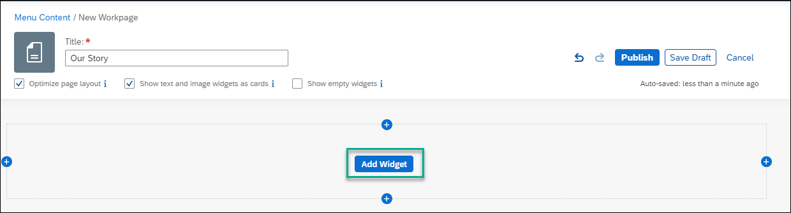

5. Select the **Image** widget.

    <!-- border -->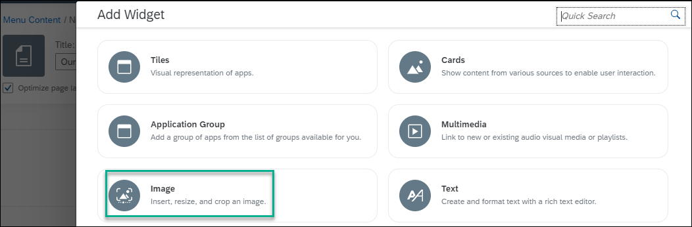

6. Click the link in the widget to browse for the image that you've saved on your computer and open it: `workspace_row2_image 1`

    <!-- border -->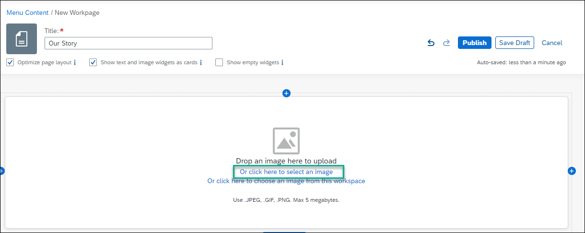

7. Hover over the image to expose the settings at the top right and click the cog icon to edit the image widget.

    <!-- border -->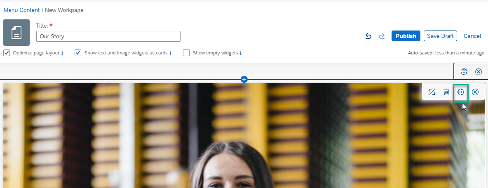

8. Add the following settings to the **Image** widget and then click **Save**:

    |  :-------------     | :-------------
    | Caption             | `Carla Grant, Sales Manager`
    | Caption Layout      | Inline
    | Caption Alignment   | Left

    <!-- border -->

9. Now in the same way, add a **Text** widget under the image widget and add this text using **14pt** text size and the **Ariel** font: 

    `I'm Carla Grant, sales manager of JobCore Enterprises. We've been selling computer accessories for the last 25 years and we have clients stationed all over the world. Our sales teams are active and are ready to show you our good quality and appealing products to help you do your work efficiently. `

    <!-- border -->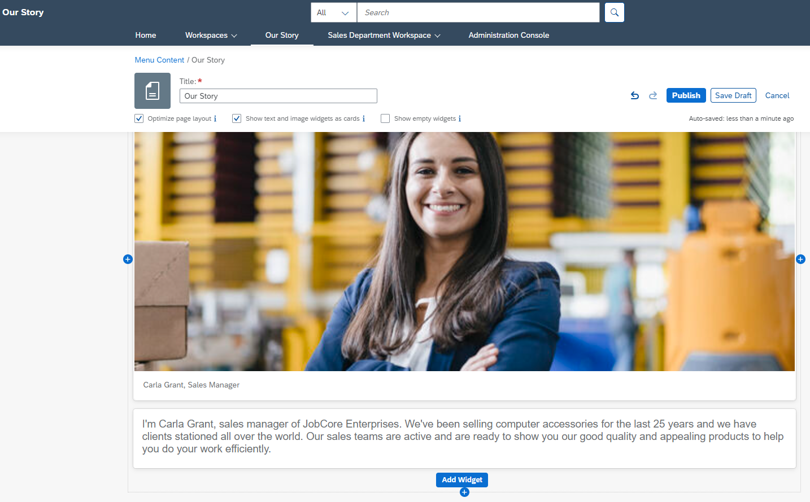

10. Click **Publish** to publish your workpage. You'll get another popup and if you want to publish to your feed, click **Publish** again - this is optional.

    <!-- border -->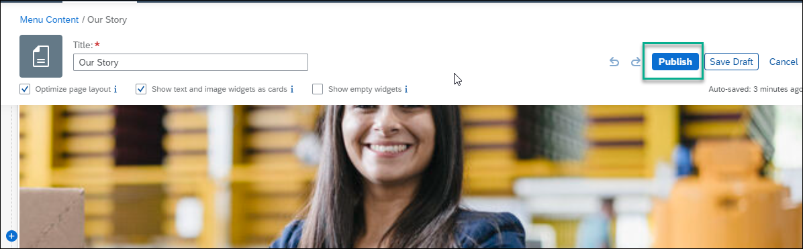

11. Use the breadcrumbs at the top of your screen to go back to the **Menu Content** screen, where you can now see the workpage you created.

    <!-- border -->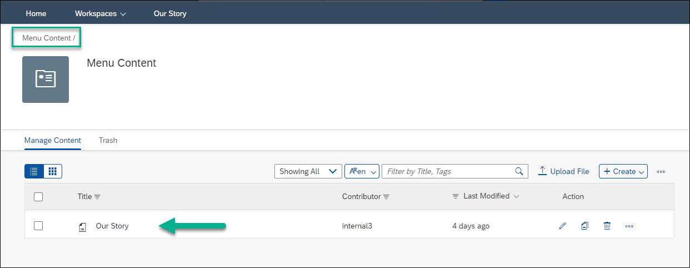

### Add the new workpage to the site menu

In this step we're going to reference the new workpage from the site menu:

1. Click the pencil icon again to open the site menu.

2. Click **+** in the top area of the **Menu Editor**. 

    <!-- border -->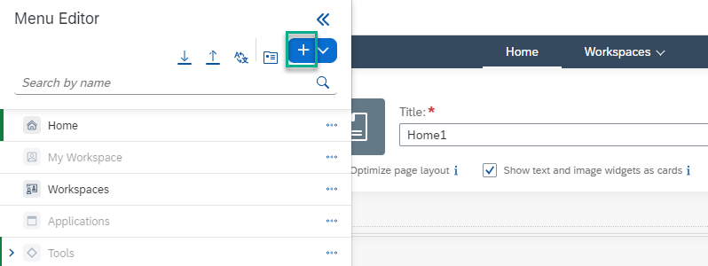

    You'll get a dropdown list of possible content that you can add. Select **Custom**. 

    <!-- border -->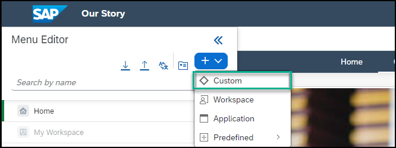

3. In the **Add Menu Item** dialog, in the **Name** field, enter `Our Story` and select **Workpage**. Select the `Our Story` workpage you just created. Then click **OK**.

     <!-- border -->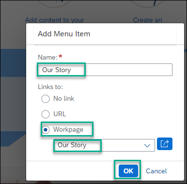

4. See that the workpage is now part of the site menu.  Click **Save Draft** and then you can continue adding other menu items.

    <!-- border -->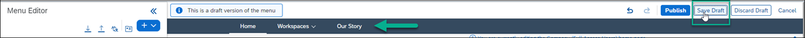

    >Note the `Our Story` workpage also displays in the left menu panel.

    

### Add workspace to the site menu

In this step, you'll create a workspace that you can reference from the site menu.  
> Note that you can add a new workspace or any existing workspace to the site menu, but for the purpose of this tutorial, you'll create one for our sales department.

1. From the **Workspaces** menu item, select **New Workspace** from the dropdown menu.

    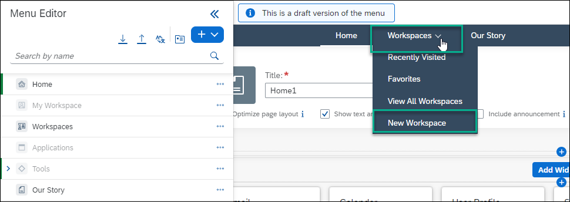

2. From the **New Workspace** dialog, enter the following values and then click **Create**:

    |  :-------------     | :-------------
    | **Template**                   |No Template
    | **Title**                      |Sales Department News.
    | **Workspace Permissions**       |Public 

    <!-- border -->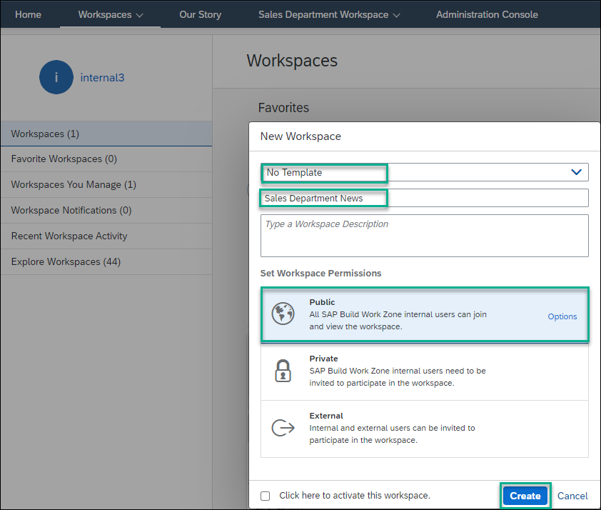

3. Now add a workpage to the workspace. Click **+** in the workspace navigation bar and select **Workpage**.  Enter `Sales Summary` as the **Title** and click **Add**.

    <!-- border -->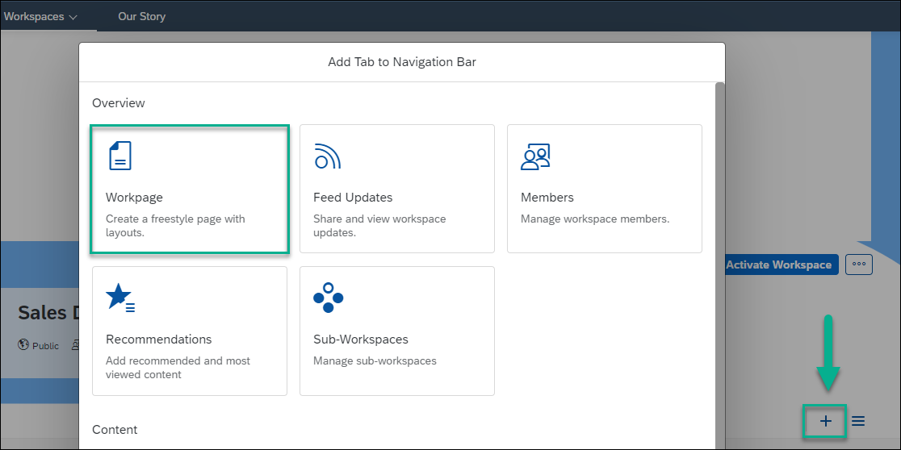

4. Publish the workspace.  

    <!-- border -->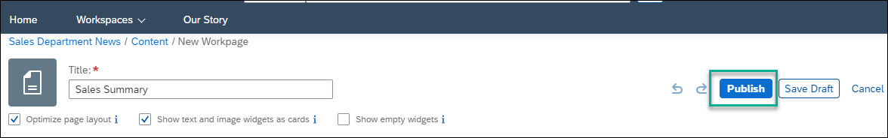

    You will now add this workspace to the site menu.

5. Open the **Menu Editor** again by hovering over the pencil ion on the right.

6. Click **+** at the top of the menu editor panel and select **Workspace**.

    <!-- border -->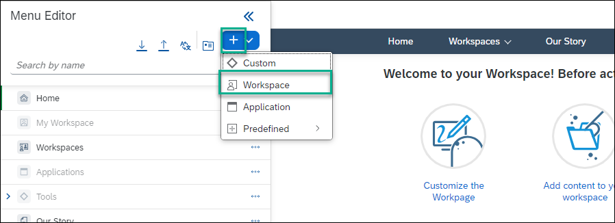

7. From the **Add Menu Item** dialog, enter a name that you want displayed in the site menu.  Let's call it `Sales Department Workspace`. Then select the `Sales Department News` workspace from the dropdown list and leave **This menu item is clickable** selected, and click **OK**.

    >If a workspace is clickable, when clicking the workspace in the menu the workspace opens. If the workspace isn't clickable, you'll only be able to navigate to its sub-pages.

    <!-- border -->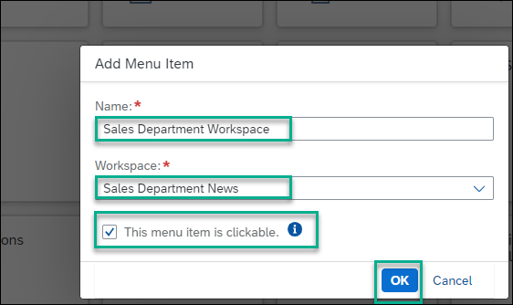

8. Click **Save Draft** and see that the workspace has been added to the site menu. Note that if you click the workspace in the menu, it opens and you can see the workpage you added in the workspace navigation bar. If you had removed the clickable option, only the workpage would be clickable.

    <!-- border -->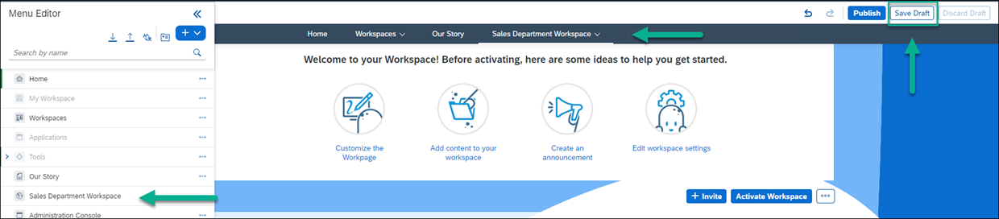

### Add an application to the site menu

>You can select any application that you have permissions to view and access and launch it directly from the site menu.

1. Open the **Menu Editor** and click **+**.

2. Select **Application**.

    <!-- border -->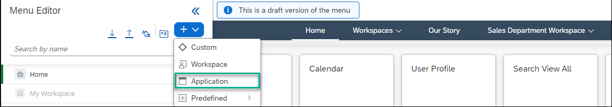

3. Select an application that you want to add to the site menu.  Choose the `Calendar` and click **OK**.

    <!-- border -->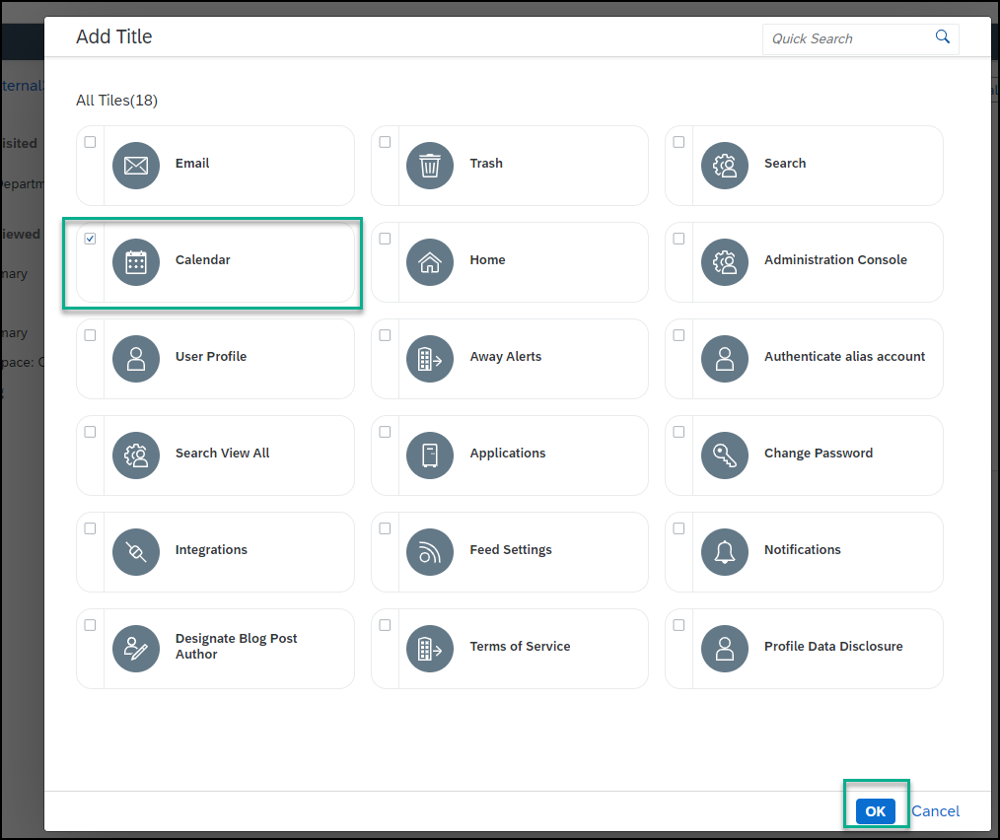

4. Publish the menu. 

    >Once you've published the menu, it will look like this. Note that you can launch the app directly from the site menu.

    <!-- border -->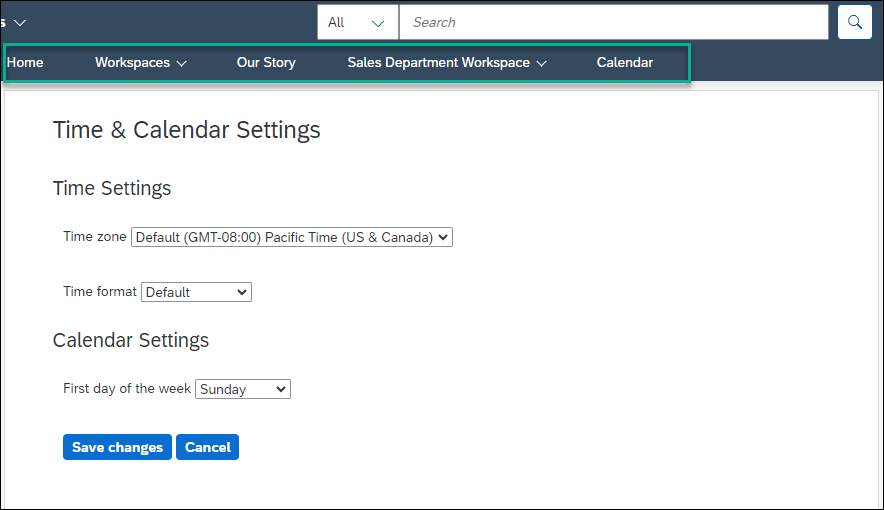

