# Design a Home page in SAP Build Work Zone, advanced edition
<!-- description --> Open the Home page, add content to it, and change the overall layout.

## Prerequisites
 - A subaccount in SAP BTP that includes a subscription to the SAP Build Work Zone, advanced edition service, has already been setup for you.
&nbsp;

>**SAP Build Work Zone, advanced edition is not available in a trial account.**

## You will learn
  - How to open SAP Build Work Zone, advanced edition
  - How to design a **Home** page

## Intro
In this group of tutorials you'll learn how to build a digital workplace solution using SAP Build Work Zone, advanced edition.

The **Home** page is the landing page when you first open your site. It is the first menu item in the top navigation bar.

In this tutorial, you'll be designing a **Home** page. You'll add sections and columns to configure its layout and also add widgets with static content to it. In later tutorials, you'll add apps to this page.

>You can design any workpage the same way.

---

### Download resources that you'll be using for this tutorial

First download these image files so that they're on your computer ready for you to add to your page:

- [`home_row1_rotating_banner1.png`](Home_Page_Images/home_row1_rotating_banner1.jpg)
- [`home_row1_rotating_banner2.png`](Home_Page_Images/home_row1_rotating_banner2.jpg)
- [`home_row3_image1.png`](Home_Page_Images/home_row3_image1.jpg)
- [`home_row3_image2.png`](Home_Page_Images/home_row3_image2.jpg)

### Access SAP Build Work Zone, advanced edition

1. Open your browser and navigate to your subaccount in SAP BTP.

2. Click **Instances & Subscriptions** in the left navigation panel.

    <!-- border -->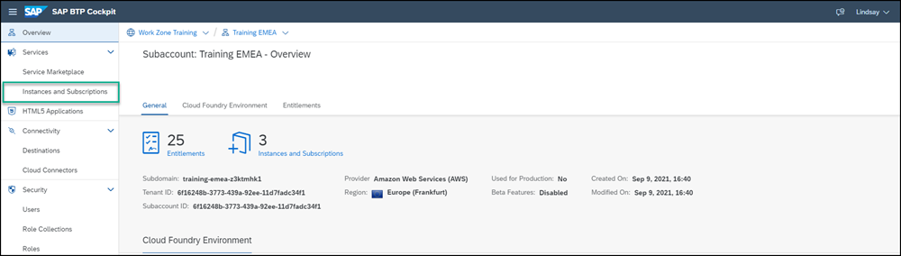

3. Under the **Subscriptions** tab, click **SAP Build Work Zone, advanced edition**.

    <!-- border -->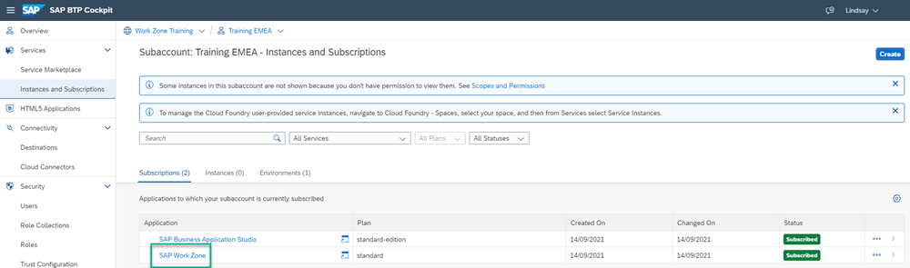

4. Enter your log on credentials.

    When you open your site, you'll see the **Home** page in focus. By default, your SAP Build Work Zone, advanced edition site is preconfigured with a shell with different content and features. You can configure your own site and add content to it.

    <!-- border -->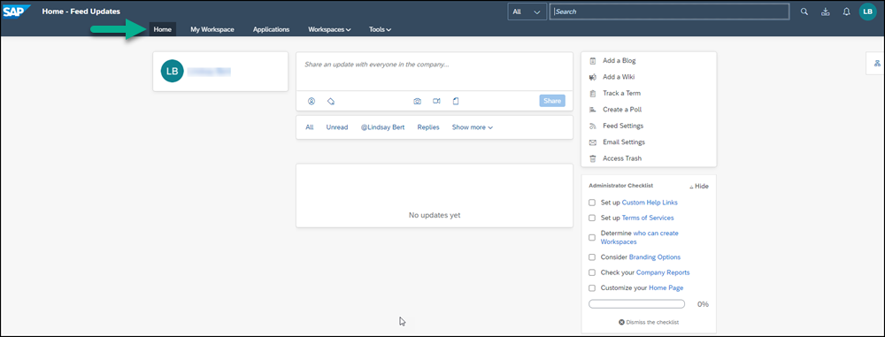

>SAP Build Work Zone, advanced edition includes the following menu items:
&nbsp;

 **Home** - displays information that is relevant to everyone in the company who has access to the site.
&nbsp;

 **My Workspace** - a personal workspace. All users can create their own workspace. This workspace can be used as a favorite page for frequently used content and applications.
&nbsp;

 **Applications** - provides access to all business apps that the logged on user can access and that are configured for display.
&nbsp;

 **Workspaces** - a central place for you to create workspaces. These workspaces can become available to any group of company users and to external users.
&nbsp;

 **Tools** - provides access to different tools like company knowledge base, calendar, and more.

>&nbsp;

In the next steps, you'll learn how to design the **Home** page of the company `Velotics`.

### Open the Page Designer of the Home page

The Page Designer tool is used to edit the **Home** page and also to edit any other workpages in your site.

You can use the Page Designer to add, move, resize, align, configure widgets, and modify the overall layout of your page. As you design a workpage, your work is automatically saved so that you don't lose your changes prior to publishing or saving as a draft.

1. With the **Home** page in focus, select the **Switch page view** icon on the left side of the screen.

    <!-- border -->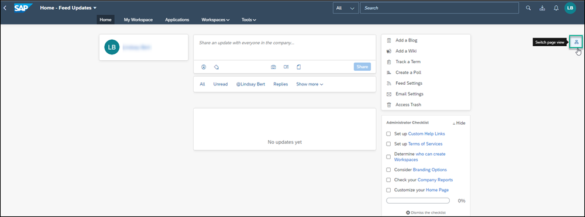

2.  In the dialog box that opens, click **Company**.

    <!-- border -->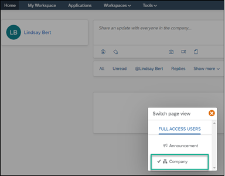

3. Click **+** to add a page tab.

    <!-- border -->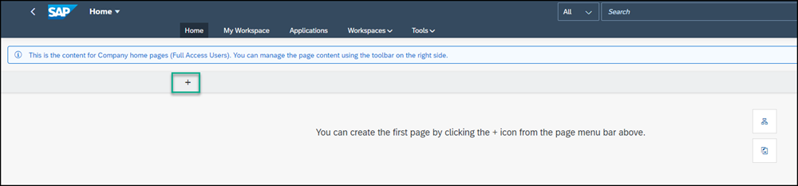

4. Name the page tab **Home** and click **Create**.

    <!-- border -->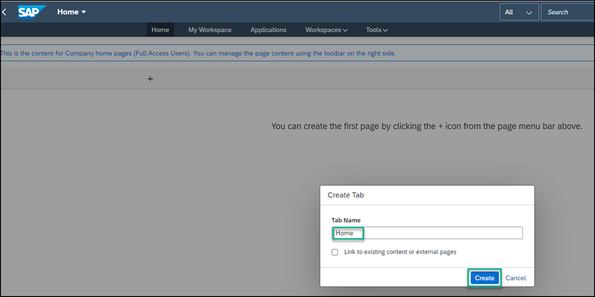

The Page Designer is now active and you can use it to design your **Home** page.

>The **Home** page can also be designed and managed from the **Administration Console** – a tool where all administration tasks are performed for SAP Build Work Zone, advanced edition. You can get to the Administration Console, by following these steps:
>
>1. Under your avatar at the top right of the screen, open the dropdown menu, and click **Administration Console**.
>2. From the **Administration Console**, expand the **Area & Workspace Configuration** menu item and click **Home Page**.
>3. Click **Manage Home Page** to open the home page.

### Add a header with a title for the Home page

Let's start designing the **Home** page.

1. Before you start, first remove the placeholder widgets. Hover over each widget to expose the settings in the top right of the widget and click the trash icon.

    <!-- border -->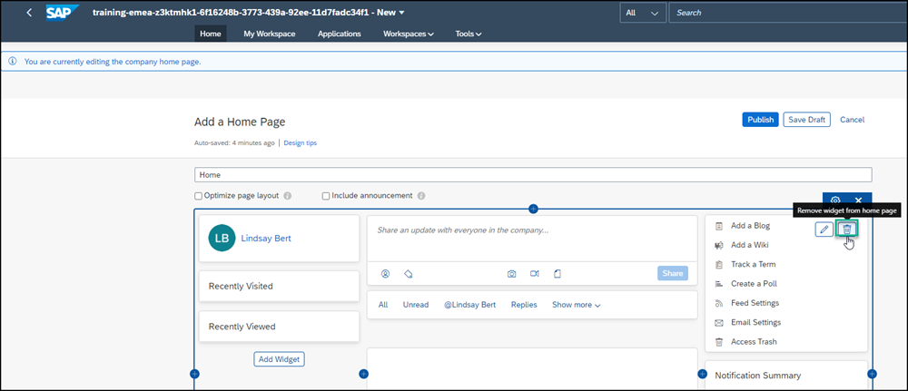

    Your screen will look like this:

    <!-- border -->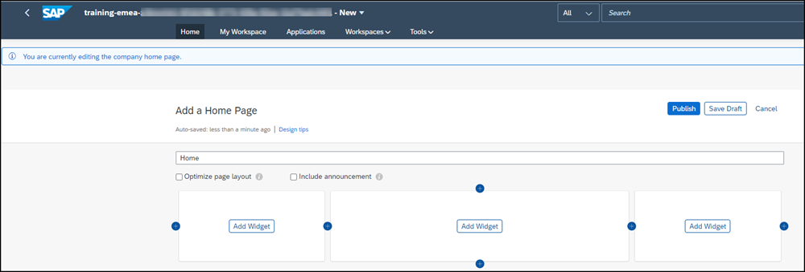

2. Now, hover over the first row and click the trash icon to remove the 2nd and 3rd columns.

    <!-- border -->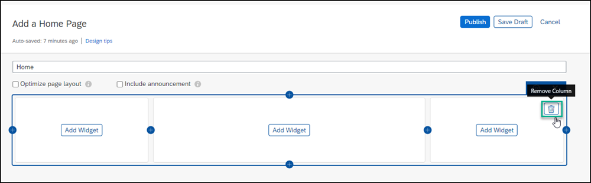

    Your screen now looks like this:

    <!-- border -->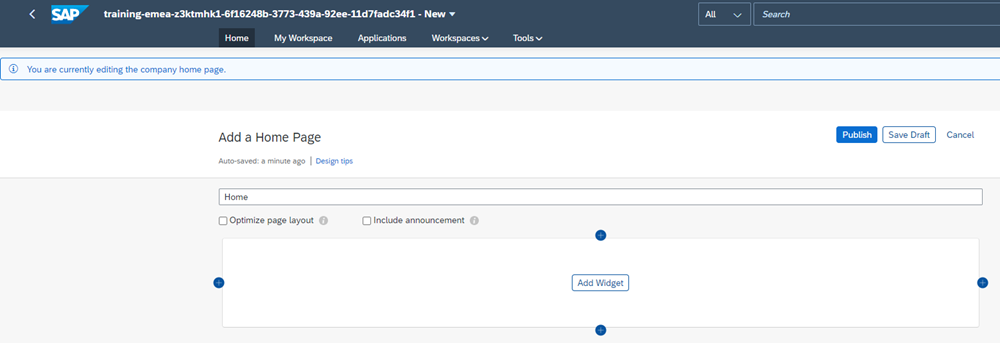

3. In the first row, click **Add Widget** to open the widget gallery.

    <!-- border -->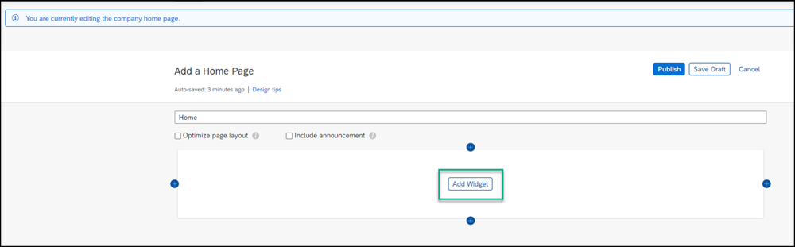

4. Under **Standard Tools**, select the **Rotating Banner** widget.

    <!-- border -->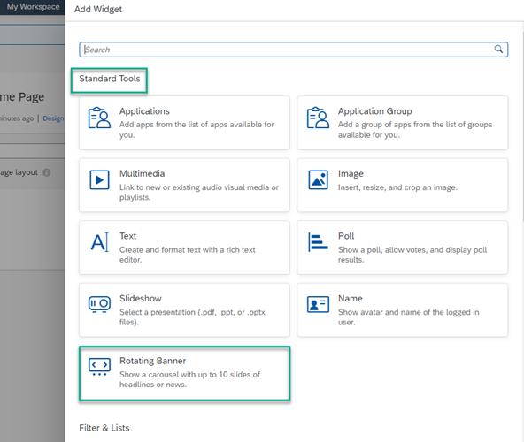

    >You can also use the search feature to find it.

5. Design the first slide of the rotating banner as follows:

    |  :------------- | :-------------
    | Image            | Click the link in the image widget to browse for and select this image that you downloaded: `home_row1_rotating_banner1`
    | Title            | `Welcome to Velotics`
    | Description      | `Access all key information and apps that you need`
    | Text Placement   | Top Left

    <!-- border -->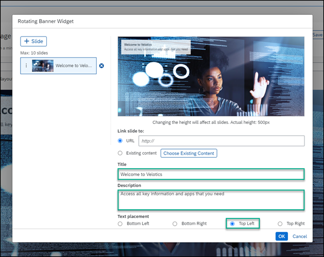

6.  Click **+ Slide** to add a second slide to your rotating banner.

    <!-- border -->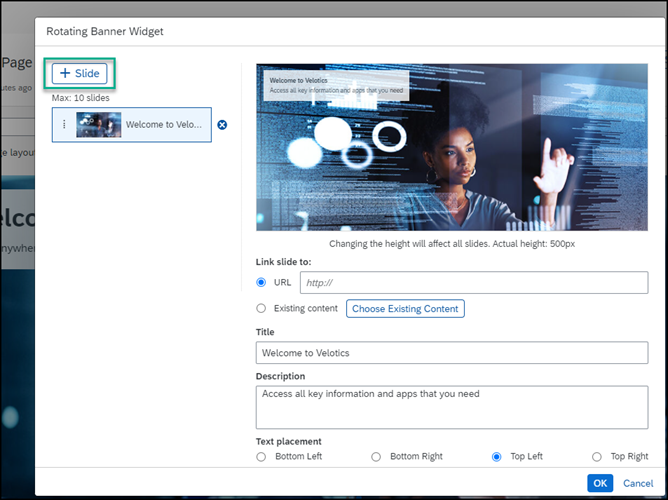

7. Design the second slide of the rotating banner as follows:

    |  :------------- | :-------------
    | Image            | Select this image: `home_row1_rotating_banner2`
    | Title            | `Welcome to Velotics`
    | Description      | `Work anywhere using your mobile device`
    | Text Placement   | Top Left

8. Click **OK**.

### Design the page's second row

1. Click **+** at the bottom of the 1st row to add a new row.

    <!-- border -->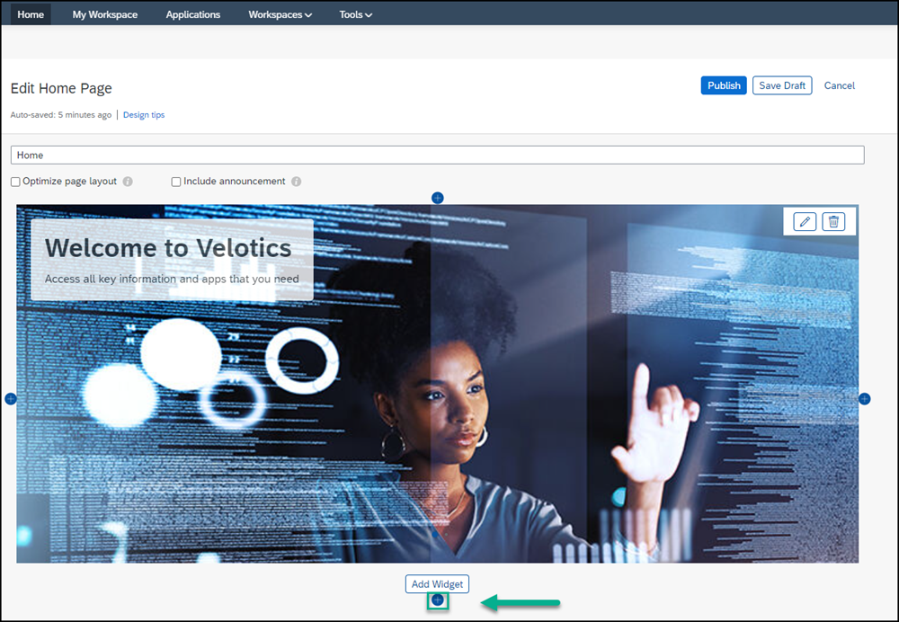

2. In the second row, click **Add Widget**.

3. Under **Standard Tools**, select the **Text** widget.

    <!-- border -->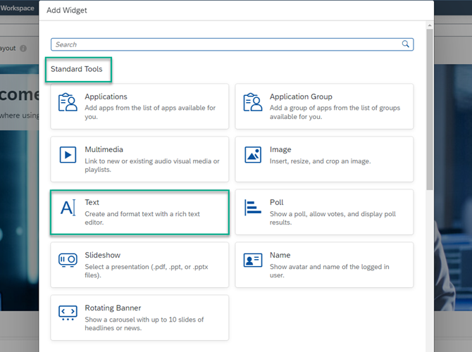

4. Design the text widget as follows:

    |  :------------- | :-------------
    | Text            | Type in the following: `Company News & Events`.
    | Font            | Select the text and change to Arial 14pt.
    | Color           | With the text still selected, choose black from the chart.

    <!-- border -->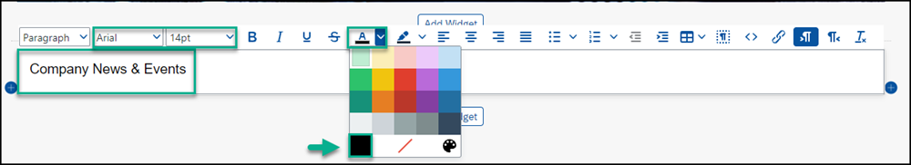

5. Click next to the row to see how your page looks so far. The second row should look like this:

    <!-- border -->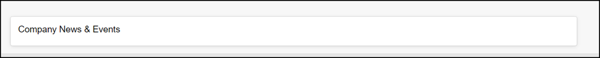

6. To increase the spacing between this row and the first row, hover over the row to expose the row settings at the top right, and click **Edit row settings**.

    <!-- border -->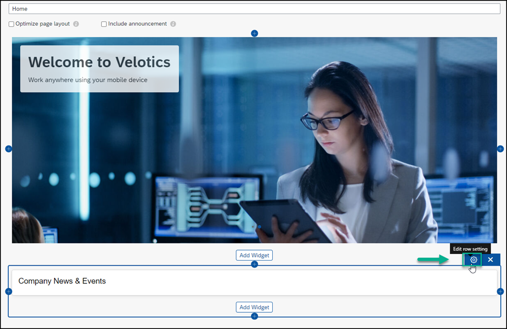

7. Enter the following values:

    * Check the box **Extend the row to full width**.

    * Under **Row Padding**, add the value `30` pixels in the **Top** value box and click **Save**.

      <!-- border -->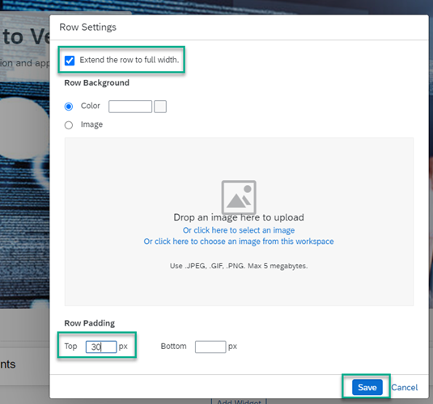

### Design the page's third row

1. Click **+** at the bottom of the 2nd row to add a new row.

    <!-- border -->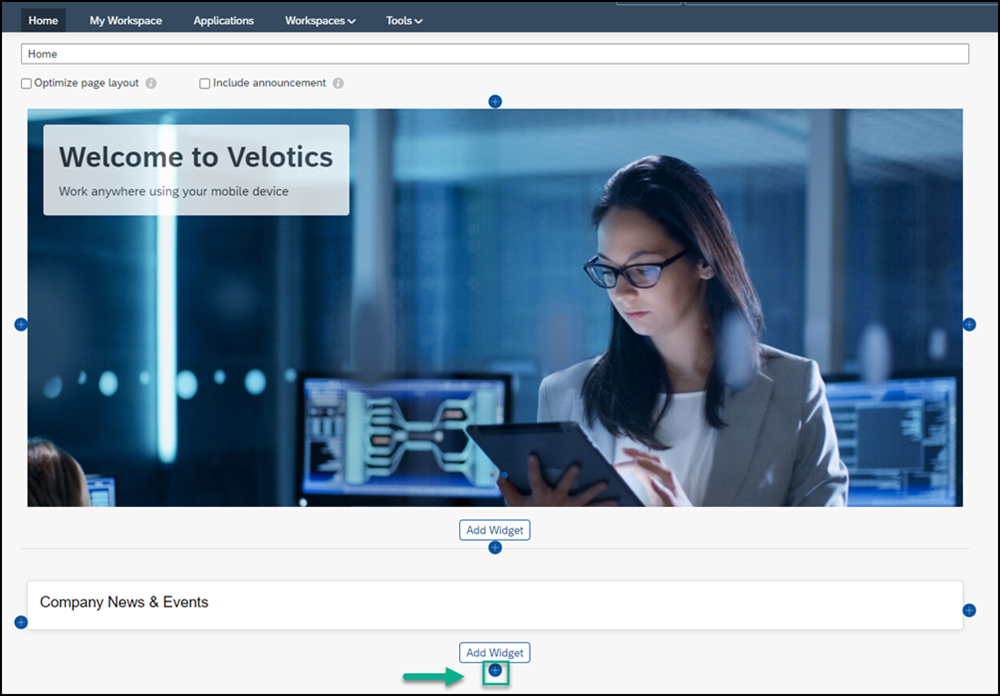

2. In the third row, click **Add Widget**.

3. Under **Standard Tools**, select the **Image** widget.

4.  Click the link in the widget and select this image: `home_row3_image1`

    <!-- border -->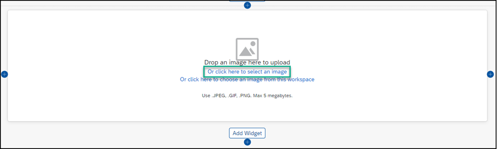

5. Click **Add Widget** directly under the image and select the **Text** widget.

    <!-- border -->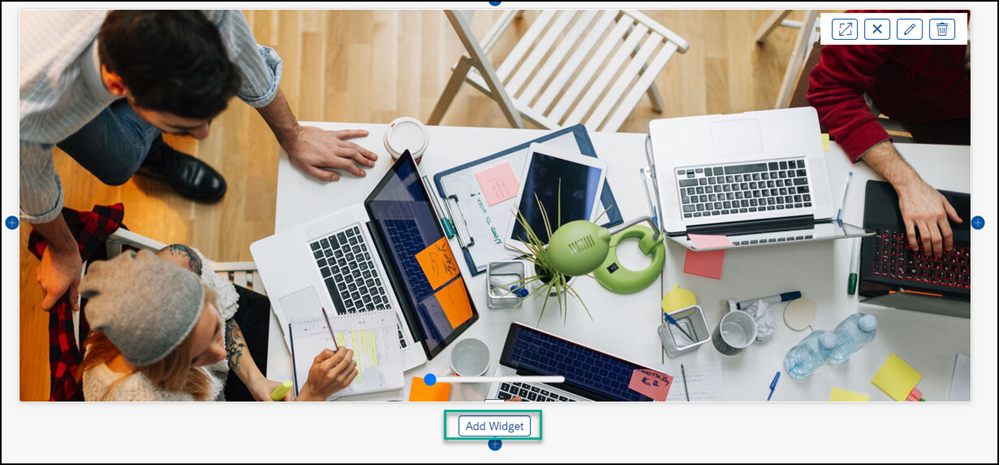

6. Design the text widget as follows:

    |  :------------- | :-------------
    | Text            | Copy and paste the following text: 
&nbsp;

Employee-Led Innovation
&nbsp;

The Velotics Venture Studio specifically focuses on fostering an environment of innovation and entrepreneurship. It identifies future opportunities and funding ideas for employee-led innovation.

&nbsp;

Once high-potential, entrepreneurial teams have been selected to join the Velotics Venture Studio, they receive "venture" funding to build new, high growth businesses inside of Velotics based on their ideas.

    | Font            | Select the text and change to Arial 10pt.
    | Color           | With the text still selected, choose black from the chart.
    | Style           | Select the title and bold it.

7. On the right side of the image widget that you've just added, click **+** to add another column.

    <!-- border -->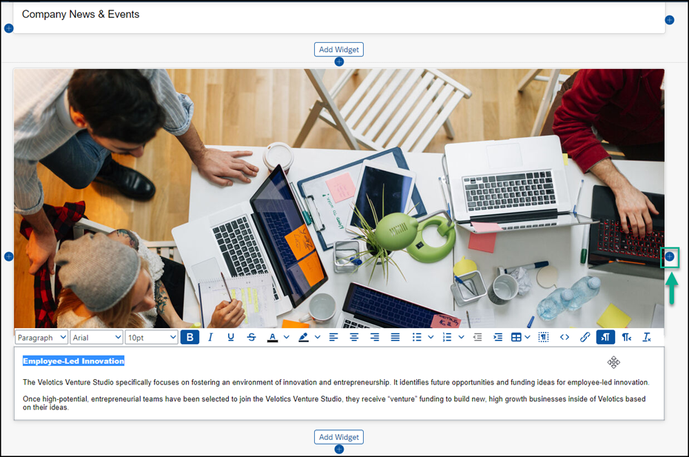

8. Click **Add Widget** and add an **Image** widget. Then add this image: `home_row3_image2`.

9. Hover between the 2 images until you see the column separator and drag it until both images are aligned.

    <!-- border -->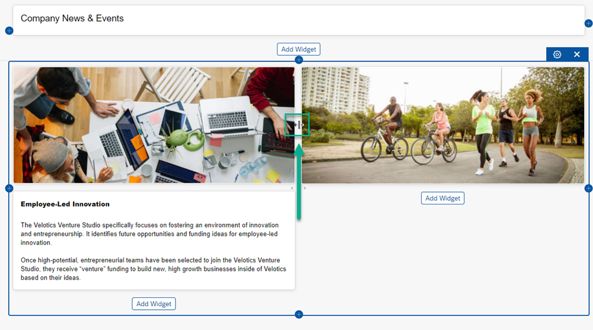

9. Directly under the second image widget, add another **Text** widget, and design it as follows:

    |  :------------- | :-------------
    | Text            | Copy and paste the following text:
&nbsp;

Twilight Marathon Challenge
&nbsp;

The Twilight Marathon through Mannheim and Ludwigshafen will take place next week. The largest mass sports event in the metropolitan region starts this year with a new route.
&nbsp;

The revised route is a combination of already known and new sections for the different disciplines, and the organizers hope to be able to attract over 10,000 participants.
    | Font            | Select the text and change to Arial 10pt.
    | Color           | With the text still selected, choose black from the chart.
    | Style           | Select the title and bold it.

10. Click next to the row to see how your page looks so far. This is how the 3rd row should look:

    <!-- border -->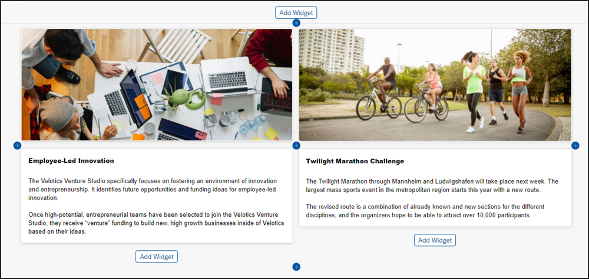

11. Hover over row 3 to expose the settings and click the **Edit row setting** icon. Set the **Row Padding** to `30` pixels in the **Top** value box and click **Save**.

### Design the page's fourth row

1. Click the **+** icon at the bottom of the 3rd row to add a new row.

2. In the fourth row, click **Add Widget**.

3. Under **Standard Tools** select the **Text** widget.

4. Design the text widget as follows:

    |  :------------- | :-------------
    | Text            | Type in the following: `STAY INVOLVED!` Capitalize all the letters.
    | Font            | Select the text and change to Arial 14pt.
    | Color           | With the text still selected, choose dark blue from the chart.

      Then in the same widget, enter a new line and design as follows:

    |  :------------- | :-------------
    | Text            | Type in the following: `Join the hackathon workspace and ask all that you need to know`
    | Font            | Select the text and change to Arial 14pt.
    | Color           | With the text still selected, choose black from the chart.

5. Click outside of the row to see how your page looks. The fourth row should look like this:

    <!-- border -->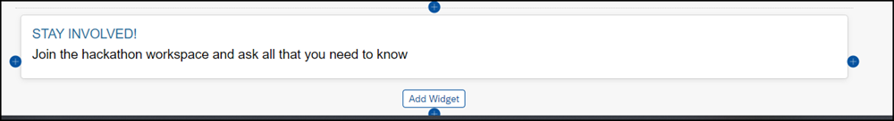

6. Hover over row 4 to expose settings in the right corner and click **Edit row settings**.

    <!-- border -->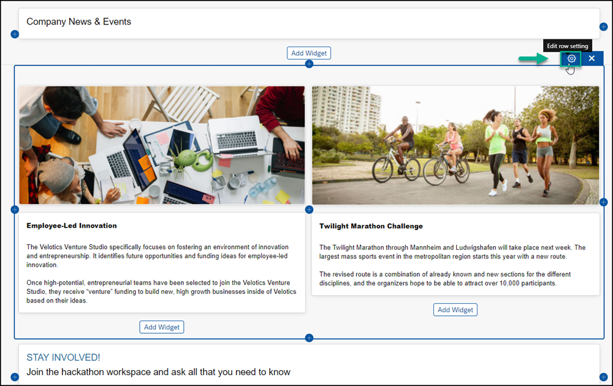

7. Enter the following settings:

    * Check the box **Extend the row to full width**.

    * Color: `#E5E5E5`

    * Under **Row Padding**, add the value `30` pixels to the **Top** value box and click **Save**.

    <!-- border -->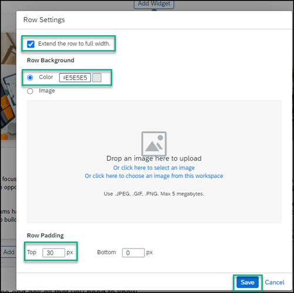

### Publish the Home page

Before you publish to all the users in your company, you may want to see a draft version of your **Home** page first.

1. Click **Save Draft** and review what you've designed.

    <!-- border -->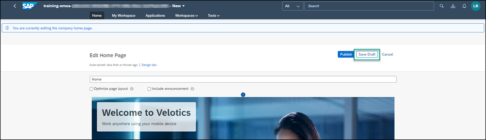

2. If everything is OK, click **Publish** to make it visible to other users.

    <!-- border -->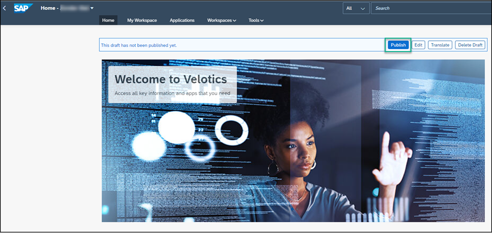

Here is your completed **Home** page:

<!-- border -->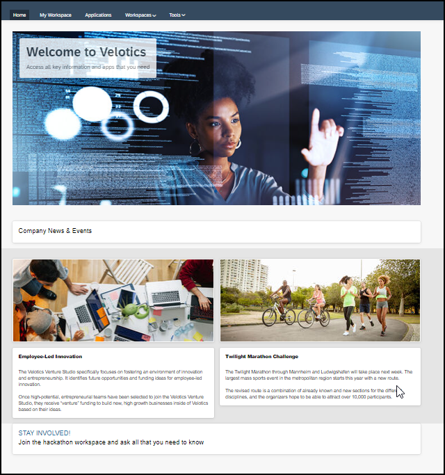

Later, we'll add apps to the **Home** page.

>If you want to edit the **Home** page later, you'll notice that next time you open your work zone, an edit (pencil) icon appears on the right of your page. Click this icon to open the Page Designer and make your changes to your **Home** page.
  <!-- border -->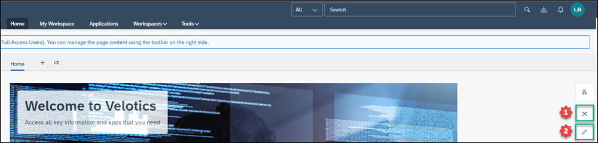

---
