In this tutorial, you're going to create a workspace where employees who joined the company hackathon challenge, can interact with other members of the workspace, ask questions, and find out all that they need to know.

## Prerequisite
 You have an environment set up and you can access your SAP Work Zone.

>Note that SAP Work Zone is not available in a trial account.

## Details
### You will learn
  - How to create a new workspace
  - How to add content to it and design the layout

---

[ACCORDION-BEGIN [Step 1: ](Download images for your workspace)]

First download these image files so that they're on your computer ready for you to add to your workspace pages:

- [`workspace_row2_image1.jpg`](Workspace_Images/workspace_row2_image1.jpg)
- [`workspace_row2_image2.jpg`](Workspace_Images/workspace_row2_image2.jpg)
- [`workspace_header_image.jpg`](Workspace_Images/workspace_header_image.jpg)
- [`workspace_image_with_icon1.png`](Workspace_Images/workspace_image_with_icon1.png)
- [`workspace_image_with_icon2.png`](Workspace_Images/workspace_image_with_icon2.png)
- [`workspace_image_with_icon3.png`](Workspace_Images/workspace_image_with_icon3.png)
- [`workspace_image_with_icon4.png`](Workspace_Images/workspace_image_with_icon4.png)

[DONE]
[ACCORDION-END]

[ACCORDION-BEGIN [Step 2: ](Create a workspace)]

A workspace is a membership of users who can upload, create, or reference material specific to a department, project, or team. Within a workspace you can communicate, interact easily, share knowledge with other members, and easily access the workspace-related information that you need from a single place.

1. In your work zone, click **Workspaces** in the top-level menu, and then click **New Workspace**.

    !

2. Select **No Template** from the dropdown list of available templates.

    !

    >You can also select one of SAP's out-of-the-box templates. In this case, you'll get a professionally designed overview page with widgets including everything you need to get started quickly. You can then customize the content to suit your needs. For this tutorial we will not use a template.

3. Enter this name for your workspace: `Employee Innovation Hackathon`.

    >Tip: Always use a name that would help users distinguish your workspace from others.

4. Copy and paste this description for your workspace: `Get together and find the answers to your questions about the hackathon!`

5. Select `Private`.

    >Selecting private makes your workspace available to a specific set of members that you've invited to the workspace. If you later want to make it public so that everyone in the company can see it, click **Edit Workspace Settings** at the top of your screen and change the setting to `Public`.

6. Click **Create**.

    !

Your workspace is created.

[DONE]
[ACCORDION-END]

[ACCORDION-BEGIN [Step 3: ](Join the workspace)]

When you create your workspace, you are prompted to define the frequency of email notifications.

1. Select **Daily** to get any updates to the workspace every day.

2. Click **Accept** to ensure that you've joined the workspace.

  !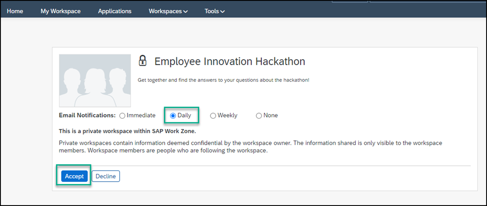

You can now start building your workspace.

!

> When you want to access your workspace later, you can look for it under the **Workspaces** menu item by selecting **View All Workspaces**. You'll see all the workspaces that you have permissions to access.
  !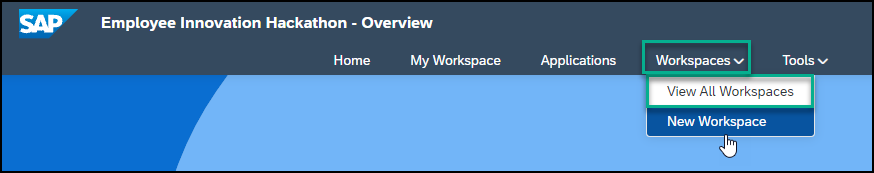

Now, let's add content to the workspace.

[DONE]
[ACCORDION-END]

[ACCORDION-BEGIN [Step 4: ](Change the image in the workspace header)]

When you create a new workspace the header has a dark and light blue background. You can replace this background with your own.

1. Hover over the background in the workspace header to expose the  **Upload cover photo** icon and click it.

    !

2. The **Edit Workspace**  screen opens with the  **Setup** tab in focus. Scroll down until you see **Cover Photo**, click **Choose File**, and add the following image: `workspace_header_image`.

4. Click **Save**.

    !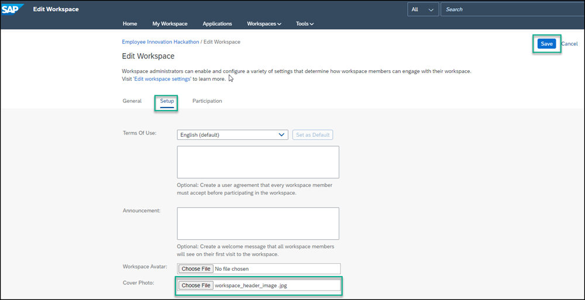

[DONE]
[ACCORDION-END]

[ACCORDION-BEGIN [Step 5: ](Create an Overview page for your workspace)]

The **Overview** page is the first thing people see when they join your workspace. You can use it to present the workspace purpose, feature workspace members, and display workspace-related content. With the built-in Page Designer, you can add widgets and create multiple pages to help organize and enable users to quickly find the workspace-related information they need.

1. Click **+** to add a page tab.

    !

2. From the **Add New Page** screen, select the **Overview** tile.

    !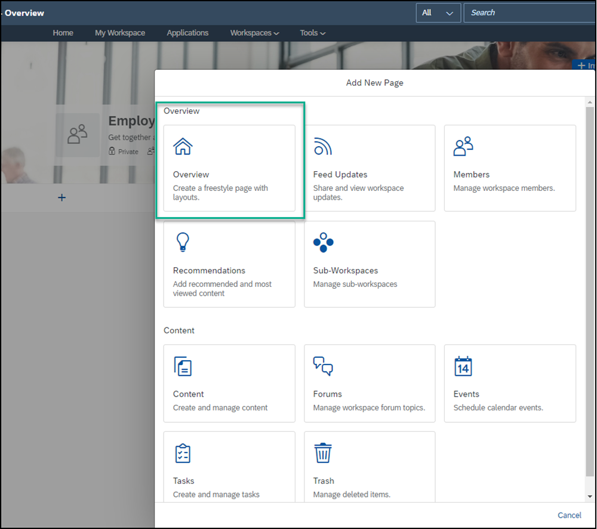

3. Select the blank layout at the bottom right of the screen and click **OK**. The Page Designer is now active.

    !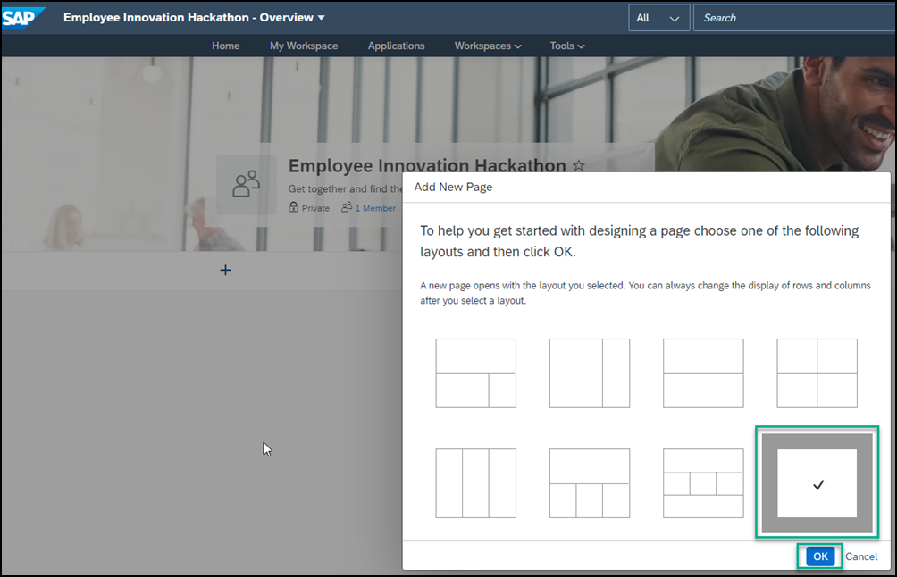

4. Close the **Page Designer Tips** page for now.

5. Enter a title for the **Overview** page: `About the Hackathon`.

    !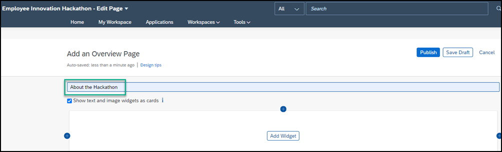

[DONE]
[ACCORDION-END]

[ACCORDION-BEGIN [Step 6: ](Design the first row of the overview page)]

In this step, you'll add two text widgets next to each other in the first row of the page.

1. Click **Add Widget** in the first row to open the widget gallery.

    !

2. Under **Standard Tools**, select the **Text** widget.

    !

3. Design the **Text** widget as follows:

    |  :------------- | :-------------
    | Text            | Type in the following: `Approach our experts with all your questions`.
    | Font            | Select the text and change to Arial 14pt.
    | Color           | With the text already selected, choose black from the chart.

    !

4. On the right side of the widget that you've just added, click the  **+** to add another column.

    !

5. Click **Add Widget** in the second column and select the **Text** widget.

6. Design the **Text** widget as follows:

    |  :------------- | :-------------
    | Text            | Type in the following: `More Information`.
    | Font            | Select the text and change to Arial 14pt.
    | Color           | With the text already selected, choose black from the chart.

7. Click outside of the widget row to see how your page looks so far. This is what your first row looks like:

    !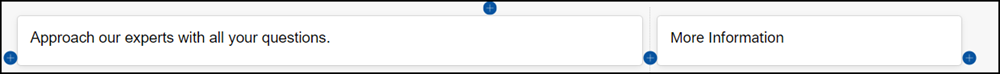

[DONE]
[ACCORDION-END]

[ACCORDION-BEGIN [Step 7: ](Design the second row of the overview page)]

In this step, you'll add images to the second row.

1. Click the **+** under the first row to add a new row.

    !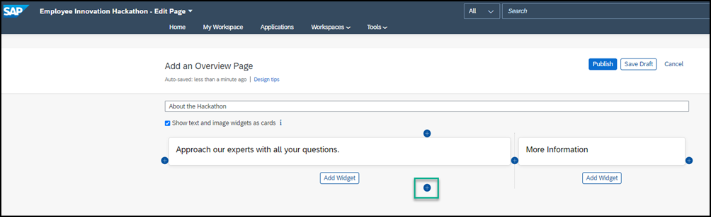

2. In the second row, click **Add Widget**.

    !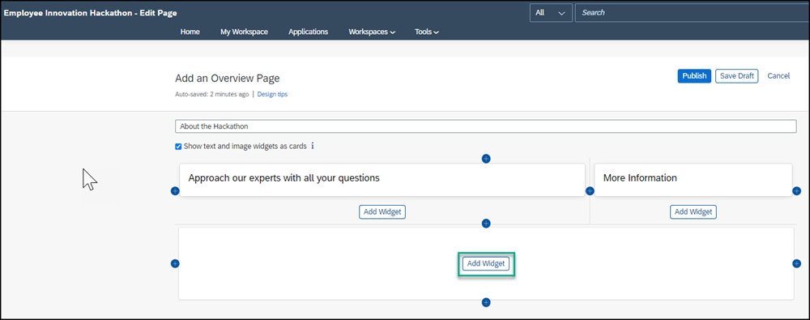

3. Under **Standard Tools**, select the **Image** widget.

    !

4. Click the link in the widget to browse for the image that you saved on your computer: `workspace_row2_image 1`

    

5. Click the pencil icon in the top right of the image to edit the image.

    !

6. Design the **Image** widget as follows:

    |  :-------------     | :-------------
    | Caption             | `Carla Grant, IT Expert`
    | Caption Layout      | Inline
    | Caption Alignment   | Left

7. Click **OK**.

    !

8. On the right side of this widget, click the **+** to add a new column.

    !

9. Click **Add Widget** in the new column, select the **Image** widget, and then click the link in the widget to add this image that you saved on your computer: `workspace_row2_image2`.

10. On the top right of the widget that you've just added, click the pencil icon.

    !

11.  Design the second **Image** widget as follows and then click **OK**:

    |  :-------------     | :-------------
    | Caption             | `Michael Hill, ML Expert`
    | Caption Layout      | Inline
    | Caption Alignment   | Left

12. Click **+** next to the second image widget to open a third column.

    !

13. Add the following 4 image widgets one under each other in the third column. Keep clicking **Add Widget** and select an image each time until you've added all these images:

    |  :-------------     | :-------------
    | First image         | `workspace_image_with_icon1`
    | Second image        | `workspace_image_with_icon2`
    | Third image         | `workspace_image_with_icon3`
    | Fourth image        |`workspace_image_with_icon4`

    !

14. Click the **Edit widget** pencil icon at the top right of each of these image widgets and design as follows. When you're done click **OK** each time:

    |  :-------------     | :-------------                
    | Caption             | First image: `Real Customer Challenges`
&nbsp;

Second image: `Product Documentation`
&nbsp;

Third image: `Submission Criteria`
&nbsp;

Fourth image: `Stay Involved`
    | Caption Layout        |All images: Overlay
    | Background Opacity    |All images: 0%
    | Caption Alignment        |All images: Left

15. Click outside of the row to see how your page looks so far:

    !

16. To increase the spacing between this row and the first row, hover over the row to expose the row settings on the right, click **Edit row settings**, and under **Row Padding**, add the value `30` pixels in the **Top** value box and click **Save**.

[DONE]
[ACCORDION-END]

[ACCORDION-BEGIN [Step 8: ](Design the third and last row of your workspace)]

In this step, you'll add an **Action** widget and a **Forum** widget.

1. Click **+** at the bottom of the second row to add another row.

    !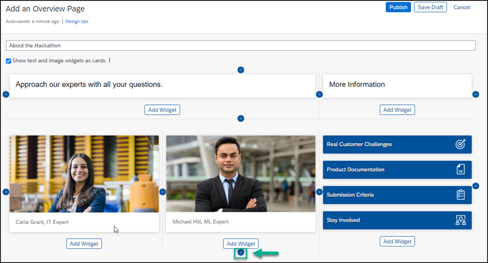

2. Click **Add Widget**.

3. Under the **Productivity** section,  select the **Action** widget.

    !

4. Enter the **Widget Title**: `Add your Hackathon Questions & Ideas`.

5. Uncheck all options except for **Ask a Question** and **Add an Idea**. Use the scroller on the right to make sure you uncheck all the other options. Click **OK**.

    !

6. Click the **+** next to the widget you just created to add another column.

    !

7. Click **Add Widget**.

    !

7. Under the **Content & Documents** section, select the **Forum** widget.

    !

8. Under **Maximum Items to Display**, move the slider to number 2, change the title to `Ask Questions About the Hackathon`, and click **OK**. .

    !

9.  To increase the spacing between this row and the first row, hover over the row to expose the row settings on the right, click **Edit row settings**, and under **Row Padding**, add the value `30`pixels in the **Top** value box and click **Save**.

This is how the **Overview** page of your workspace looks:

!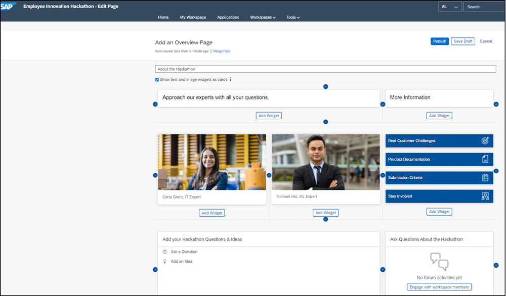    

[DONE]
[ACCORDION-END]

[ACCORDION-BEGIN [Step 8: ](Publish your workspace)]

  1. Click **Publish** to save the design of the page and to make your workspace visible to its members.

    !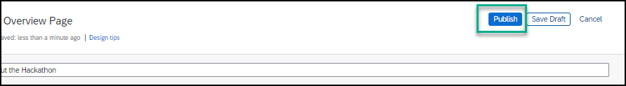

    >You can also save as a draft and check your page before you are ready to publish.

  2. In the popup, leave the option checked to **Show in Feed Updates** and then click **Publish**.

    > By leaving the **Show in Feed Updates** checked, all workspace members will be informed of your changes. In the future, if the changes you make to your workspace aren't significant, you can uncheck this option.

    !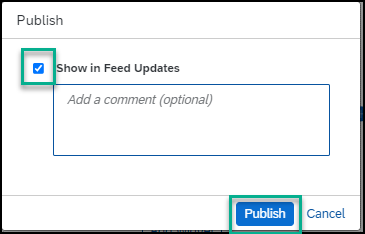

[DONE]
[ACCORDION-END]

[ACCORDION-BEGIN [Step 9: ](View your workspace at runtime and ask a question in the forum)]

At the bottom right of the screen, you'll see that there aren't any forum activities yet. Let's add a question to the forum.

  !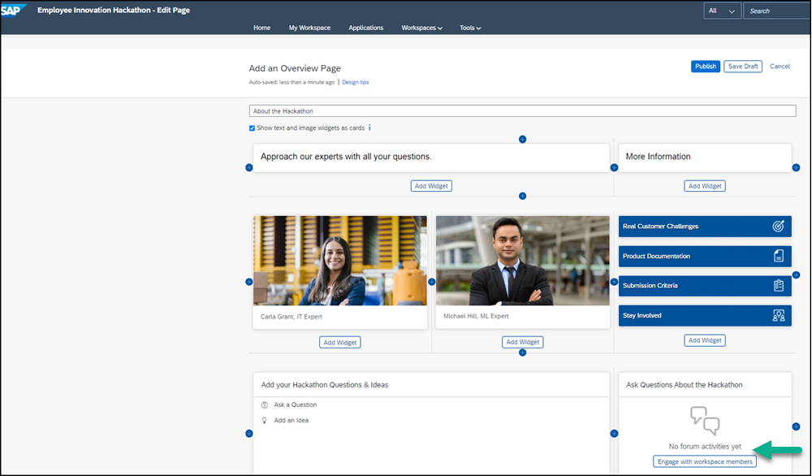

1. Click the **+** next to the **About the Hackathon** overview page.

    !

2.  In the **Add New Page** screen, under the **Content** category, select **Forums**.

    !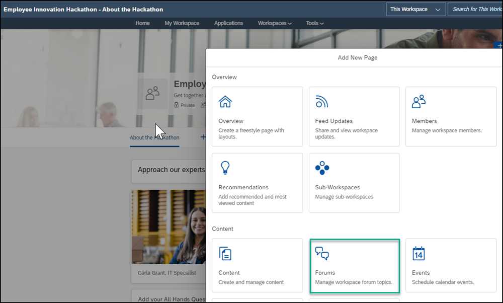

3. Click the **Forums** tab.

    !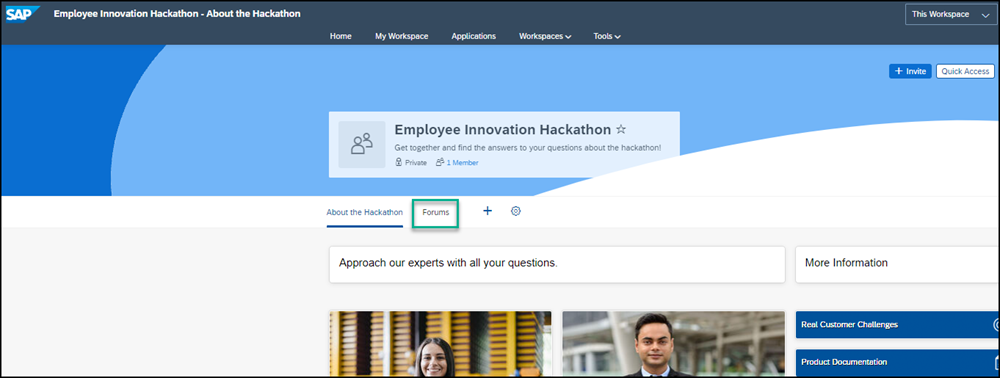

4. Click **Questions**.

    !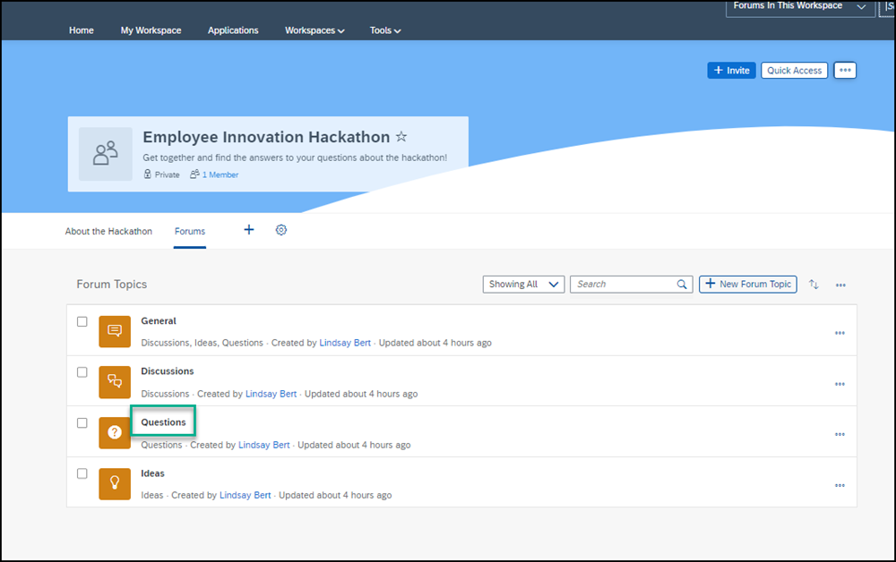

5. Click **+ New Question**.

    !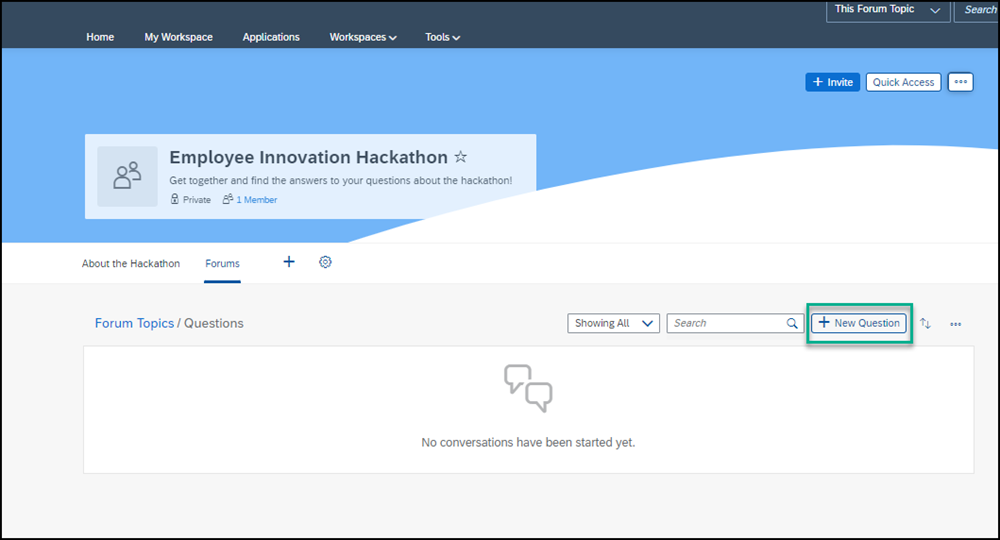

6. Add this question: `What time does the hackathon start?` Then click **Publish** so that members will be able to see your question. You'll get a confirmation message that your question was created.

    !

7. Go back to your workspace by using the breadcrumbs at the top.

    !

You can see that your question has been added to the **Forum** widget in your overview page:

!

[VALIDATE_7]

[ACCORDION-END]Closing
